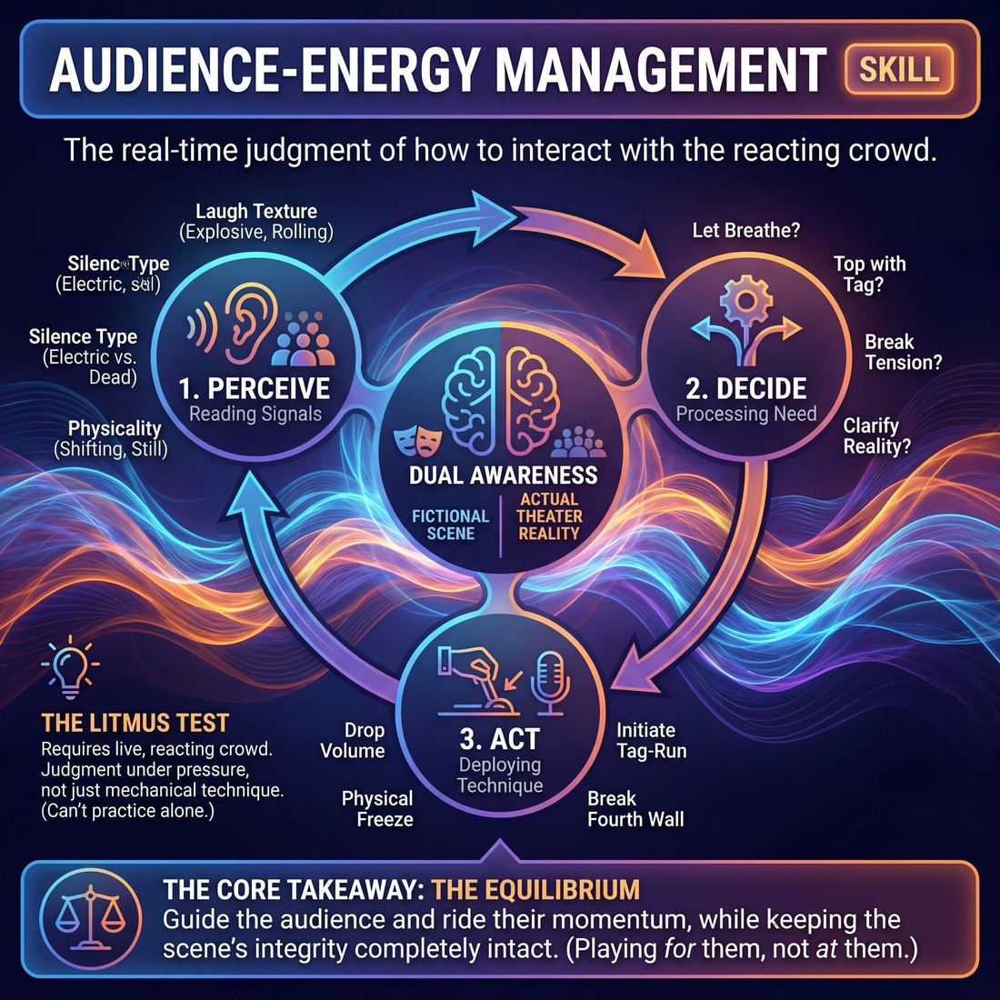

# Week 16 — Conducting Audience Energy
> *Surf the energy waves; use direct address as a deliberate lever.*

| Course | Week | Domain | Focus | Stage |
|---|---|---|---|---|
| Serve the Piece — Toward Mastery | 16/18 | D5 — The Audience | `D5.S2` — Audience-Energy Management | Proficient → Master |

## ⏱️ Session flow (60 minutes)

| Time | Block |
|---|---|
| **0:00–0:05** | 🤝 Arrival & safety check-in |
| **0:05–0:15** | 🔥 Warm-up — *Architects of the Wall* |
| **0:15–0:27** | 🧠 Theory — *Audience-Energy Management* |
| **0:27–0:52** | 🎲 Game 1 — *The Audience Resonance Conductor* |
| **0:52–1:00** | 💭 Reflection & debrief |

## 1. 🧠 Today's theory

**Focus:** `D5.S2` — Audience-Energy Management  
**Maturity goal today:** Master: conduct audience energy like an instrument.

{ .infographic }

- **The big idea:** Surf the energy waves; use direct address as a deliberate lever.
- **Where you are on the path:** Master: conduct audience energy like an instrument.
- **The one cue to coach:** *“Ride the wave. Break the wall only on purpose.”*

!!! abstract "📖 Go deeper"
    Read the full write-up: [Audience-Energy Management](../../content/05_the-audience/05_S2__audience-energy-management.md)

## 2. 🎲 Today's games

#### Warm-up — Architects of the Wall

> Master the invisible boundary by deliberately building, softening, and breaking the fourth wall with your audience.

`Players 6+` · `~25 min` · `Complexity 4/5` · `Energy medium` · `Props: none`

**Trains:** Audience-Energy Management · _skill drill_

**How to play**

1. Step 1: Establish three silent hand signals for the audience: High Engagement (leaning forward, focused), Moderate Engagement (fidgeting, quiet murmurs), and Low Engagement (looking away, whispering).
2. Step 2: Begin a standard two-person scene on stage based on a simple, low-stakes suggestion.
3. Step 3: During the scene, the facilitator silently signals the audience to shift their engagement level, forcing the performers to read the room's changing energy.
4. Step 4: Performers must adapt to these shifts without breaking character by adjusting their vocal projection, physical staging, and emotional intensity to pull the audience back.
5. Step 5: When the facilitator signals Low Engagement, the performers are permitted to strategically break the fourth wall with an in-character direct address to re-establish connection.
6. Step 6: Once the audience re-engages, the performers must smoothly transition back into the scene's established reality.
7. Step 7: Introduce 'riding the wave' by having the facilitator signal the audience to erupt in laughter, requiring performers to hold their physical positions and wait for the peak to pass before delivering the next line.
8. Step 8: Rotate players frequently so everyone experiences both the onstage performance pressure and the active audience perspective.

[Open the full game card »](../../games/D5_P1_S2_T3_G004__the-fourth-wall-architects-game.md){target=_blank rel=noopener}

#### Core game — The Audience Resonance Conductor

> Direct the room's emotional current by treating the audience as your primary scene partner.

`Players 3+` · `~30 min` · `Complexity 4/5` · `Energy medium` · `Props: required`

**Trains:** Audience-Energy Management · _skill drill_

**How to play**

1. Brief the audience to react naturally and honestly to the scene, avoiding exaggerated or forced responses to help the performers.
2. Two or three performers step onto the stage and begin a grounded, character-driven scene based on a simple suggestion.
3. The Conductor monitors the audience's actual emotional state and holds up a cue card (or uses a designated hand gesture) representing the 'current state' in the performers' peripheral vision.
4. Once the scene is established, the Conductor introduces a 'target state' card or gesture (e.g., shifting from Neutral to Tense, or Joyful to Pensive).
5. Performers must immediately adapt their performance—using vocal modulation, physical pacing, and spatial positioning—to steer the audience's energy toward the target state.
6. To achieve difficult emotional shifts, players are encouraged to break the fourth wall or use direct address, but only if the choice is fully justified by their character's internal stakes and immediate needs.
7. The Conductor continuously updates the 'current state' signal in real time as they observe genuine shifts in the audience's posture, breathing, or vocal responses.
8. The scene concludes after 3 to 5 minutes once several emotional transitions have been successfully navigated, leading directly into a structured debrief.

[Open the full game card »](../../games/D5_P1_S2_T3_G033__the-audience-resonance-conductor.md){target=_blank rel=noopener}

??? note "🎒 Backup games — if you have time, or a game falls flat"
    *Swap-ins drawn from the same maturity band; not part of the timed hour.*
    - **[The Fourth Wall Dial](../../games/D5_P1_S2_T3_G093__the-fourth-wall-fluidity-lab.md){target=_blank rel=noopener}** — `5+` · `~20m` · `Cx 4/5` · `Energy medium` · _Audience-Energy Management_
    - **[Permeable Currents](../../games/D5_P1_S2_T3_G105__contractual-currents.md){target=_blank rel=noopener}** — `2+` · `~15m` · `Cx 4/5` · `Energy medium` · _Audience-Energy Management_

## 3. 💭 Self-reflection

**Deepen your improv**
1. How did it feel to consciously monitor the audience's physical cues while staying in character?
2. What specific physical or vocal adjustments felt most effective at reclaiming a distracted room?

**Beyond the stage**
3. Managing energy is riding a wave without chasing it. Where do you talk over others' reactions — or, conversely, kill momentum by not pausing for them?

---
⬅️ *Previous:* [W15 — Unify the Room](week-15.md)  ·  *Next:* [W17 — Serve the Piece](week-17.md) ➡️
