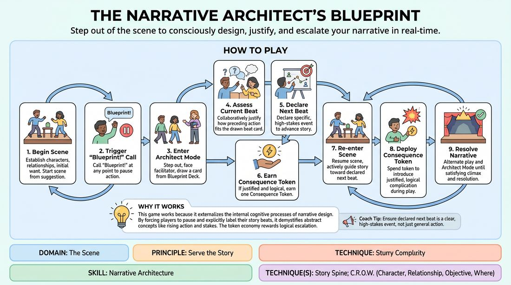
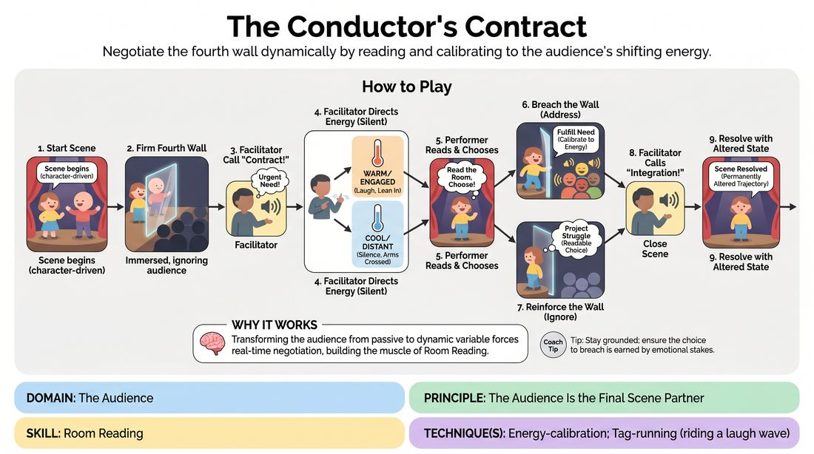

# Week 17 — Serve the Piece
> *Choose what the show needs, not what you want to do.*

| Course | Week | Domain | Focus | Stage |
|---|---|---|---|---|
| Serve the Piece — Toward Mastery | 17/18 | All domains (integration) | `D4.S2` — Support Work | Proficient → Master |

## ⏱️ Session flow (60 minutes)

| Time | Block |
|---|---|
| **0:00–0:05** | 🤝 Arrival & safety check-in |
| **0:05–0:15** | 🔥 Warm-up — *The Story Architects* |
| **0:15–0:27** | 🧠 Theory — *Support Work* |
| **0:27–0:52** | 🎲 Game 1 — *The Conductor's Contract* |
| **0:52–1:00** | 💭 Reflection & debrief |

## 1. 🧠 Today's theory

**Focus:** `D4.S2` — Support Work  
**Also touches:** `D5.S1` — Room Reading, `D3.S3` — Narrative Architecture  
**Maturity goal today:** Master: sacrifice technique to serve the whole.

{ .infographic }

- **The big idea:** Choose what the show needs, not what you want to do.
- **Where you are on the path:** Master: sacrifice technique to serve the whole.
- **The one cue to coach:** *“What does the show need right now?”*

!!! abstract "📖 Go deeper"
    Read the full write-up: [Support Work](../../theory/04_the-ensemble/04_S2__support-work.md)
    · [Room Reading](../../theory/05_the-audience/05_S1__room-reading.md)
    · [Narrative Architecture](../../theory/03_the-scene/03_S3__narrative-architecture.md)

## 2. 🎲 Today's games

#### Warm-up — The Story Architects

> Step out of the scene to consciously design, justify, and escalate your narrative in real-time.

{ .infographic }

`Players 2–4` · `~15 min` · `Complexity 4/5` · `Energy medium` · `Props: required`

**Trains:** Narrative Architecture · _narrative_

**How to play**

1. Begin the Scene: Obtain a simple suggestion and initiate a scene, focusing on establishing clear characters, relationships, and an initial character want or objective.
2. Trigger a Blueprint Call: At any point, a player or the facilitator can pause the action by calling out 'Blueprint!' and freezing the scene.
3. Enter Architect Mode: Players step out of character, turn to face the facilitator, and draw the top card from the Blueprint Deck.
4. Assess the Current Beat: The group collaboratively justifies how the action immediately preceding the pause fits the narrative beat written on the drawn card.
5. Declare the Next Beat: Based on the drawn card and the current state of the story, players declare a specific, high-stakes event they intend to play next to advance the narrative.
6. Earn a Consequence Token: If the players successfully justify the current beat and declare a logical next step, the facilitator awards them one Consequence Token.
7. Re-enter the Scene: Players step back into character and resume the scene, actively collaborating to guide the story toward the declared next beat.
8. Deploy Consequence Tokens: At any point during active play, a player can spend a Consequence Token to introduce a justified, logical complication that builds on established facts.
9. Resolve the Narrative: Continue alternating between active play and Architect Mode until the story reaches a satisfying climax and resolution.

[Open the full game card »](../../games/D3_P4_S3_T1_G217__the-narrative-architect-s-blueprint.md){target=_blank rel=noopener}

#### Core game — The Conductor's Contract

> Negotiate the fourth wall dynamically by reading and calibrating to the audience's shifting energy.

{ .infographic }

`Players 4+` · `~15 min` · `Complexity 4/5` · `Energy medium` · `Props: none`

**Trains:** Room Reading · _skill drill_

**How to play**

1. Select one or two proficient players to step onto the stage to initiate a character-driven scene based on a simple suggestion.
2. Establish a firm fourth wall at the start of the scene, with the performers fully immersed in their environment and ignoring the audience.
3. Once the scene's emotional stakes are established, the facilitator calls out 'Contract!' to signal that the characters now have an urgent internal need regarding the audience (e.g., needing a witness, seeking validation, or fearing observation).
4. The facilitator begins subtly directing the audience's energy using pre-arranged silent hand gestures, prompting them to become either highly engaged and warm, or cold and detached.
5. The onstage performer must actively read the room, choosing to either 'Breach the Wall' (directly addressing the audience to fulfill their character's need) or 'Reinforce the Wall' (deliberately shutting them out to protect the character's vulnerability).
6. If breaching, the performer must calibrate their delivery to match or shift the audience's current energy, riding waves of laughter or warming up a cold room.
7. If reinforcing, the performer must project their internal struggle clearly through the fourth wall, making their choice to ignore the audience highly readable and dramatic.
8. After several shifts in audience energy, the facilitator calls 'Integration!', prompting the performer to bring the scene to a close.
9. The performer must resolve the scene by showing how the success or failure of their audience negotiation has permanently altered their character's emotional trajectory.

[Open the full game card »](../../games/D5_P1_S1_T1_G252__the-conductor-s-contract.md){target=_blank rel=noopener}

??? star "🎒 Backup games — if you have time, or a game falls flat"
    *Swap-ins drawn from the same maturity band; not part of the timed hour.*
    - **[The Silent Weathervane](../../games/D5_P1_S1_T1_G479__the-collective-unconscious-weathervane.md){target=_blank rel=noopener}** — `3+` · `~15m` · `Cx 4/5` · `Energy medium` · _Room Reading_
    - **[The Summons](../../games/D3_P4_S3_T2_G1252__rendez-vous.md){target=_blank rel=noopener}** — `4+` · `~30m` · `Cx 4/5` · `Energy medium` · _Narrative Architecture_

## 3. 💭 Self-reflection

**Deepen your improv**
1. How did stepping into Architect Mode change how you listened to your partner's offers during the active scene?
2. Did pre-declaring a narrative beat make it easier or harder to find a satisfying ending to the story?

**Beyond the stage**
3. Serving the piece means choosing what the whole needs over what you want. Where in your work would 'what does this need?' beat 'what do I want to do?'

---
⬅️ *Previous:* [W16 — Conducting Audience Energy](week-16.md)  ·  *Next:* [W18 — Capstone Performance](week-18.md) ➡️
