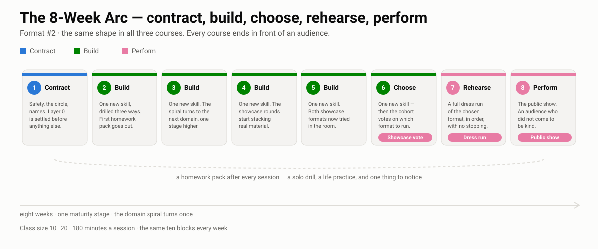

# Foundations — The Brave Beginner

> Novice → Advanced Beginner · 8 weeks · 180 minutes per session · [10, 20]

{ .diagram }

| Week | Session | Skill focus | Homework |
|---:|---|---|---|
| 01 | [The Safety Container & the Circle](week-01.md) | D2.S6 | [pack](../homework/HW-BEGW01.md) |
| 02 | [The First Thought Is a Gift](week-02.md) | D1.S1 | [pack](../homework/HW-BEGW02.md) |
| 03 | [Yes, And — Receiving the Offer](week-03.md) | D2.S4 | [pack](../homework/HW-BEGW03.md) |
| 04 | [Listening With the Whole Body](week-04.md) | D2.S1 | [pack](../homework/HW-BEGW04.md) |
| 05 | [Where, Who, What — The Body in Space](week-05.md) | D1.S3 | [pack](../homework/HW-BEGW05.md) |
| 06 | [Status — The Seesaw](week-06.md) | D2.S2 | [pack](../homework/HW-BEGW06.md) |
| 07 | [Emotion & the Voice](week-07.md) | D1.S2 | [pack](../homework/HW-BEGW07.md) |
| 08 | [The Public Showcase — Two Chairs or Games Night](week-08.md) | D5.S3 | [pack](../homework/HW-BEGW08.md) |

## Showcase options

The cohort rehearses both and votes at the end of week 6; dress run in week 7, public showcase in week 8.

- **Two-Chair Night** — prepared two-person scenes, each pair introduced by name
- **First Games Night** — 6-8 accessible short-form games with audience suggestions

⬅️ [All three courses](../index.md)
