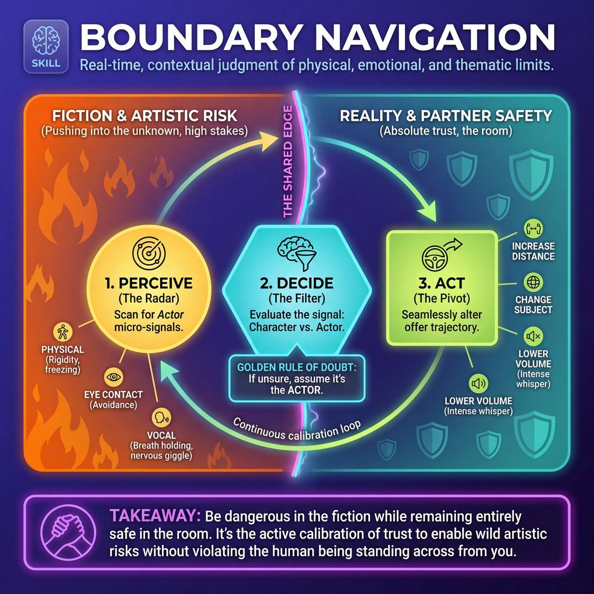

# Week 01 — The Safety Container & the Circle

> *Safety is the container Yes-And lives inside — consent overrides agreement.*

| Course | Week | Domain | Focus | Stage | Length | Class |
|---|---|---|---|---|---|---|
| Foundations — The Brave Beginner | 1/8 | D2 | `D2.S6` — Boundary Navigation | Novice → Advanced Beginner | 180 min | 10–20 |

!!! warning "Layer 0 — before anything else"
    Anyone may say **"Cut"** at any moment, for any reason, with no explanation owed.
    Everything here is opt-out-able: you can step out, sit down, or watch. The rule of
    consent overrides the rule of agreement — *Yes, And* never means *yes, you must*.

## 🎬 The arc of this session

Strangers arrive in coats, standing near the walls, checking their phones and deciding whether this was a mistake. Over three hours they laugh at nothing in particular, learn that 'Cut' stops anything instantly and costs nothing, and practise saying no to each other until it stops feeling rude. They leave knowing the names of everyone in the room and knowing that being bad here is permitted.

!!! tip "Watch for"
    The one or two people who arrived with a friend and keep turning to each other — split them early and gently, in the first partner exercise, before the pairing hardens for the whole term.

## ⏱️ Session flow (180 minutes)

| Time | Block | Activity |
|---|---|---|
| **0:00–0:05** | 🧊 Ice-breaker | *Three Quick Truths* |
| **0:05–0:10** | 😄 Laughter Blast | *Change the Laugh* |
| **0:10–0:25** | 🔥 Warm-up cluster | *The Whole Room Stops*, *Pass Is a Full Answer*, *Palms Up, Palms Down* |
| **0:25–0:45** | 🧠 Theory | — |
| **0:45–1:15** | 🎲 Drill A — isolation | *The Boundary Compass* |
| **1:15–1:25** | ☕ Break | — |
| **1:25–1:55** | 🎲 Drill B — under load | *Big Booty* |
| **1:55–2:25** | 🎯 Scene Lab | *Bridges and Boundaries* |
| **2:25–2:50** | 🏟️ Showcase round | *Boundary Blitz* |
| **2:50–3:00** | 💭 Reflection & homework | — |

## 🎒 Before you start

- Clear the floor for a full circle of chairs with a metre behind each — you will move chairs three times, so keep the stacks close.
- Print the Layer 0 contract (Cut, Pass, opt-out of contact) large enough to read from across the room and tape it where everyone can see it all session.
- Name badges and a thick marker at the door; write yours first and wear it.
- Check the door: latecomers arriving mid-exercise is the main disruption in week 1. Tape a note asking them to come in quietly and join the circle.
- Water available, and know where the toilets and the fire exit are — you will say both out loud in the first five minutes.
- Decide your own 'true thing' for Three Quick Truths in advance. It should be ordinary and slightly unflattering, not impressive.

## 1. 🧊 Ice-breaker (5 min)

*Chairs in a circle, everyone sitting. Three sentences about yourself, one at a time round the ring, and none of them need to be interesting.*

**Why here:** They need to hear their own voice in the room within the first five minutes, before nerves harden into silence.

### Three Quick Truths

> Three thirty-second pairings with three different strangers, then one lap of the circle so everyone hears every name.

`Players 10–20` · `~5 min` · `Complexity 1/5` · `Energy medium` · `Contact none` · `Props: none`

**How to play**

1. Explain the shape in one breath: three quick chats with three different people, then one lap of the circle. Everything said must be true.
2. Give the pass rule out loud. Anyone may skip a prompt and offer a different true fact instead. No reason needed, no follow-up questions.
3. Call "find someone you have not spoken to today". In pairs, both say their name and what they actually ate this morning. "Nothing" is a real answer.
4. Call "new partner". Both say their name again, then describe the last photo on their phone in words. Nobody shows a screen.
5. Call "last partner". Both say their name and one small thing that reliably irritates them. Steer them small: propped doors, queue-jumpers, mugs left in sinks.
6. Bring everyone back to the circle. Go clockwise: name, then one true word for how you arrived today. Three seconds each. No sentence, no explanation.
7. Name one thing you noticed, ask the debrief question, take two answers, and move straight into the next activity.

📄 **[Full teaching notes »](week-01/beginner_w01__b1_1.md)**

**Side-coach:** *“Ordinary is better than impressive — tell us what you ate, not what you achieved.”*

## 2. 😄 Laughter Blast (5 min)

*On your feet, loose circle. We are going to laugh on purpose, badly, and nobody has to be funny to do it.*

**Why here:** Manufactured laughter kills the first-day formality faster than anything you can say, and it costs nobody any wit.

### Change the Laugh

> Everyone laughs a fake laugh at the same time, and you keep swapping the style until it stops being fake.

`Players 10–20` · `~5 min` · `Complexity 1/5` · `Energy high` · `Contact none` · `Props: none`

**How to play**

1. Stand in the circle with them. Say the next five minutes are all fake laughing, all at once, and it is supposed to sound awful. Nobody is being watched.
2. Remind them of the cue: anyone can say 'Cut' or step out to the wall at any point, and rejoin whenever they want. No explanation needed.
3. Call 'tiny mouse laugh'. Thirty seconds of thin, high squeaking through closed teeth. You start first and keep yours running the whole time.
4. Call 'belly laugh'. Hands on your own stomach, low open HA HA HA, forty seconds. When the room dips, get louder yourself rather than commenting.
5. Call 'silent laugh'. Mouths wide, shoulders shaking, no sound, thirty seconds. Tell them to look at the ceiling instead of each other.
6. Call 'slow villain laugh'. Everyone starts low and quiet and builds to enormous across forty seconds, rubbing hands together. Build with them.
7. Call 'wobbly walk'. Fifty seconds laughing while wandering the room on floppy knees, eyes up, no touching. Then call them back to the circle.
8. Call 'your own worst laugh, full volume' for fifty seconds. Raise a hand for instant silence. Take three slow breaths together, then ask one question.

📄 **[Full teaching notes »](week-01/beginner_w01__b2_1.md)**

**Side-coach:** *“Do not wait to feel it — start the sound and let the feeling catch up.”*

## 3. 🔥 Warm-up cluster (15 min)

*Stay standing, spread out, find space where you can turn all the way round without touching anyone.*

**Why here:** These four teach the mechanics of the contract with the body: stopping on a call, refusing without apology, choosing your level of contact.

### The Whole Room Stops

> A fast shake-out in a circle where any one person can freeze the entire room with one word.

`Players 10–20` · `~5 min` · `Complexity 2/5` · `Energy high` · `Contact none` · `Props: none`

**How to play**

1. Stand everyone in one circle, arm's length apart. Say you will call out moves, everyone does them on the spot, and no one touches anyone.
2. Say the rule once, plainly: anyone can shout 'Cut' at any moment and the whole room freezes instantly. No reason needed, no permission needed.
3. Start easy. March on the spot. Add arm swings. Add shoulder rolls. Call each change clearly. Tell them a smaller version of any move is always correct.
4. Rehearse the freeze now. Call 'Cut' yourself. Everyone stills. Resume. Ask for two Cuts from the room in the next round from whoever fancies it.
5. Escalate: knee lifts, reaching high, taps to the floor, quarter-turns. On any 'Cut', everyone freezes. The caller says 'swap that one' or 'carry on'. Restart within three seconds.
6. Finish with twenty seconds of the room's favourite move, each person at their own size. Call 'Cut' yourself. Hold the freeze for five full seconds.
7. Shake hands and feet out. Take two slow breaths together. Say the cue: nothing here happens without a yes, and 'Cut' always works.

📄 **[Full teaching notes »](week-01/beginner_w01__b3_1.md)**

### Pass Is a Full Answer

> Two facing lines trade small gestures across a gap, and everyone has to say "pass" at least once so refusing stops feeling rude.

`Players 10–20` · `~5 min` · `Complexity 2/5` · `Energy medium` · `Contact none` · `Props: none`

**How to play**

1. Form two facing lines, partners opposite each other. Tell each pair to choose their own gap — arm's length, three metres, anything both agree on. Nobody stands closer than they want.
2. Demonstrate one small gesture yourself: a shrug, a wave, a stamp. Small and repeatable. Say that copying it back is the default, and saying 'pass' is equally correct.
3. Line A offers a gesture. Line B copies it back, or says 'pass' out loud — then A offers a different one. Keep going until you call time.
4. Require every person in B to say 'pass' at least once, whether or not they feel like it. Say this before the round starts, not after.
5. Swap roles. B offers, A copies or passes. Same requirement: every A says 'pass' at least once during the round.
6. Shift line A one place left; the person off the end walks to the other end. New partners. Now either side may offer at any moment, and either side may pass.
7. Add a sound to each gesture in the final round. Sound and movement together, still small.
8. Call stop. Each pair swaps one sentence about what hearing 'pass' felt like. Then loosen the lines into a circle for the next activity.

📄 **[Full teaching notes »](week-01/beginner_w01__b3_2.md)**

### Palms Up, Palms Down

> A quiet circle where every invitation gets a visible yes or a visible pass before anything happens.

`Players 10–20` · `~5 min` · `Complexity 2/5` · `Energy low` · `Contact negotiated` · `Props: none`

**How to play**

1. Stand the group in one circle, arm's length apart. Teach two signals: palms up at hip height means yes, palms down means pass. Both answers are complete. Nobody explains either one.
2. Make the first ask: close your eyes for one slow breath. Everyone shows palms. Wait three seconds. Then run it. Palms-down people keep their eyes open and watch the room.
3. Make the second ask: hold eye contact with someone across the circle for five seconds. Palms first, then find a partner. Anyone showing palms down looks at the floor in the centre.
4. Make the third ask: a hand on your right-hand neighbour's shoulder. Both people must show palms up. One palm down and both keep hands to themselves. Ten seconds, then release.
5. Offer one re-run of any ask. Say people may answer differently this time, and that changing your mind is allowed and unremarkable. Choose whichever ask the room was slowest on.
6. Hands down. Take one shared breath in silence. Say the cue: you can always say Cut, and nothing happens without a yes.

📄 **[Full teaching notes »](week-01/beginner_w01__b3_3.md)**

**Side-coach:** *“When someone passes, the group keeps moving — no pause, no reaction, straight on.”*

## 4. 🧠 Theory — Boundary Navigation (20 min)

{ .infographic }

- **The big idea:** Yes-And is an offer-handling habit. Consent is the container it sits inside. When they conflict, consent wins, every time, with no discussion and no apology owed.
- **Where you are on the path:** Novice. They have heard 'never say no in improv' from somewhere and half-believe it. Your job today is not nuance — it is one clear rule they can use tonight: you can always say 'Cut'.
- **The one cue to coach:** *“You can always say 'Cut.' Nothing happens without a yes.”*

**The three beats**

1. **Say it.** Stand in the circle with them, not in front. Say: improv runs on agreement, and agreement only means anything if refusing was genuinely available. Then give the rule flat: anyone can say 'Cut' at any moment, in any exercise. Everything stops. No reason required, no reason asked for. Then say the second half, which matters more: nothing happens after a Cut. No sigh, no 'are you okay', no checking in from six people at once. The scene resets or we move on. Add the physical clause: nobody touches anyone without asking first, and 'no thanks' is a complete answer, not the start of a negotiation.
2. **Show it.** Ask a volunteer to stand and mirror your hands for thirty seconds. Twenty seconds in, say 'Cut' yourself. Drop your hands, say 'thanks', sit down. Say nothing else. Let the flatness of it land. Then do it once more and have the volunteer call it — brief them beforehand so it is not a real refusal. Point out what did not happen: no explanation, no fuss, no atmosphere.
3. **Try it.** Everyone stands. In pairs, thirty seconds of slow mirroring. Instruct each person to call 'Cut' at least once for no reason at all. Swap partners, repeat. Two rounds, then ask for a show of hands: who found saying it harder than they expected. Most hands will go up. Name that as the actual skill being trained today.

!!! warning "The misunderstanding that always comes up"
    They think Cut is for emergencies, and using it for a small discomfort means they have overreacted or ruined something. Say plainly: Cut has no threshold. Using it because you are bored, tired, or mildly uncomfortable is correct use. A room where Cut is only ever used for emergencies is a room where it will not work when there is one.

!!! abstract "📖 Go deeper"
    Read the full write-up: [Boundary Navigation](../../../theory/02_the-partner/02_S6__boundary-navigation.md)

## 5. 🎲 Drill A — isolation (30 min)

*Pairs, and take someone whose name you did not know an hour ago.*

**Why here:** Isolates boundary-setting from performance entirely, so their first practice of 'no' carries no risk of spoiling a scene.

### The Boundary Compass

> Navigate physical and emotional boundaries through structured, honest check-ins and explicit verbal agreements.

`Players 2–99` · `~30 min` · `Complexity 2/5` · `Energy low` · `Contact none` · `Props: none`

**How to play**

1. Pair everyone off. Name one person A, the other B. Tell them A initiates this round, B receives, and they will swap after.
2. Give each A a folded prompt slip carrying an impulse that needs closeness — a hug, a hand on the arm, a whisper. They read it silently.
3. Tell A to turn the impulse into a spoken invitation. Name the intent, name the exact physical action, then ask. No mime, no reaching first.
4. Give B three replies only: 'Yes, and…', 'Yes, if…', 'No, and…'. B checks their actual comfort right now, not what they think is polite.
5. On 'Yes, and…' B accepts and may add a preference. A performs the action exactly as agreed — nothing extra, nothing longer.
6. On 'Yes, if…' B names a condition or a swap. A follows that condition to the letter. On 'No, and…' B declines and offers a non-contact alternative.
7. Tell A that 'No' ends the negotiation. A accepts it immediately, takes the alternative, and does not persuade, joke about it, or ask twice.
8. Teach 'Cut'. Either player says it at any moment to stop everything instantly. No reason given, no apology, no discussion. Both step back and reset.
9. Swap roles. Hand B a fresh prompt. Run it again with the same rules.

📄 **[Full teaching notes »](week-01/beginner_w01__b5_1.md)**

**Side-coach:** *“State the limit before you reach it, not after — that is the whole drill.”*

## ☕ Break — 10 minutes

Water, notes, informal talk. Non-negotiable at three hours — do not let it collapse into a working discussion.

## 6. 🎲 Drill B — under load (30 min)

*Big circle, shoulder to shoulder, and I will tell you now that everyone in this room is going to get it wrong within the first minute.*

**Why here:** Puts the Cut call under rhythmic pressure and mild public failure, which is the load it will actually need to survive.

### Big Booty

> A high-energy rhythm game where making mistakes is celebrated with a collective, joyful reset.

`Players 5–99` · `~30 min` · `Complexity 2/5` · `Energy high` · `Contact none` · `Props: none`

**How to play**

1. Stand everyone in a circle. Number them clockwise starting on your left: One, Two, Three, and so on. You stay unnumbered — you hold the title.
2. Agree the title word with the room before you start. Offer the standard chant or a group-chosen replacement. Take whichever gets easy agreement and move on.
3. Set the pulse: two slaps on the thighs, two claps, repeating. Keep it slower than feels natural. Wait until the whole circle is locked to one beat.
4. Lead the chant on that beat, everyone together: "Ah yeah, Big Booty, ah yeah, Big Booty, Big Booty, Big Booty."
5. Open the passing on the next beat. Call your own title, then a number: "Big Booty, Number Four." One call fills one beat gap.
6. Tell the called player to answer on the very next beat: their own number first, then a new target — "Number Four, Number Two." Passing continues unbroken.
7. Call a flub when someone hesitates, drops the rhythm, misses their own number, or names a number nobody holds. You are the judge; judge fast and lightly.
8. On a flub, stop the game, cheer loudly for the person who flubbed, then restart the chant from the top. Nobody apologises.
9. Send the flubbing player to the highest number, immediately on your right. Everyone between their old and new place shifts up one. Count off aloud before restarting.

📄 **[Full teaching notes »](week-01/beginner_w01__b7_1.md)**

**Side-coach:** *“Cheer the mistakes louder than the saves.”*

## 7. 🎯 Scene Lab (30 min)

*Pairs again, new partner, and we are going to talk for a while before anyone plays anything.*

**Why here:** First contact with two-person scene work, with the boundary tools already in hand so the exposure stays manageable.

### Bridges and Boundaries

> Master the art of conditional agreement and generative refusal to build safer, more truthful scenes.

`Players 4–99` · `~30 min` · `Complexity 2/5` · `Energy medium` · `Contact none` · `Props: none`

**How to play**

1. Stand the group in a circle. Name today's contact zones: hands, forearms, shoulders, upper back. Anyone may opt out of all contact and play every offer verbally instead.
2. Teach Cut. Any player, or you, says "Cut" and the scene stops instantly. No reason given, no discussion, no apology, no penalty.
3. Bring two players into the centre. Give them a plain open scenario — a bus stop, a shared kitchen, a lost suitcase — and run a two-minute scene.
4. Tell the initiator to declare any contact or close approach out loud, or with a clear held gesture, before making it. Declared first, every time.
5. Tell the responder to answer with one of three moves: "Yes and" — take it and build. "Yes if" — accept with a stated condition. "No and" — decline, then offer something else.
6. Teach the soft check-in: a quiet "You alright?" mid-scene when a partner reads as hesitant. The answer is honest and the scene carries on around it.
7. Rotate the pair every two minutes. Run it so everyone both initiates a declared offer and responds with a structured boundary.

📄 **[Full teaching notes »](week-01/beginner_w01__b8_1.md)**

**Side-coach:** *“Take the offer you were given, not the better one you thought of.”*

## 8. 🏟️ Showcase round (25 min)

*Circle stays as it is — nobody steps out front today, we do all of this from where you are standing.*

**Why here:** Gets everyone visible to the room once, inside the circle, so week two does not start with the same fear.

### Boundary Blitz

> Practice real-time boundary navigation and explicit consent check-ins through rapid, low-stakes scene snippets.

`Players 3–99` · `~25 min` · `Complexity 2/5` · `Energy medium` · `Contact none` · `Props: none`

**How to play**

1. Bring one pair into the centre. Everyone else watches from the edge of the space, seated or standing.
2. Give the pair a plain prompt — a relationship or a situation, nothing more. "Two people sharing an umbrella." No plot, no character notes.
3. Tell them to play with proximity, emotional intensity, or contact. Any contact needs a spoken yes first. Nothing touches anyone without one.
4. Call "Check-In!" after thirty to forty-five seconds, or the instant either player nears a physical or emotional edge. Play stops dead on the call.
5. Have both players say a colour aloud. Green: fully comfortable. Yellow: near a limit, needs a change. Red: limit crossed, stop now.
6. On yellow or red, require one plain sentence naming the specific thing. "Yellow — I felt crowded when you stepped in." No justification, no apology.
7. On yellow, have them agree one concrete adjustment out loud, then resume thirty seconds playing under the new terms.
8. On red, end the scene immediately. Thank the caller. Ask nothing further. Rotate a fresh pair in.
9. Rotate so everyone plays at least once and everyone says a colour out loud at least once.

📄 **[Full teaching notes »](week-01/beginner_w01__b9_1.md)**

**Side-coach:** *“Short is fine. Land it and hand it on.”*

## 9. 💭 Reflection & homework (10 min)

**Deepen your improv**
1. When did you nearly say 'Cut' today and didn't? What stopped you?
2. You watched other people say no this afternoon. What did it actually cost them?

**Beyond the stage**
3. Think of one place this week — work, family, a group chat — where you agree to things by default. What would a low-cost 'no thanks' sound like there?

➡️ **[This week's homework](../homework/HW-BEGW01.md)**

??? note "🎓 Facilitator notes"

    **Timing risks**
    - Three Quick Truths runs long at 18-20 people. Cap it: one sentence each, no follow-up questions, and keep the round moving by nodding rather than responding.
    - The theory block wants to become a discussion about a bad experience someone had elsewhere. Give it ninety seconds, thank them, return to the drill.
    - Bridges and Boundaries at 30 minutes leaves little room for feedback. Give notes to the whole room, never to individual pairs, on week 1.

    **Failure modes this week**
    - Nobody uses Cut all afternoon, and you read that as success. It is not. If it has not been used by the break, use it yourself in a demo and make the flatness visible again.
    - Someone treats Cut as a joke and calls it repeatedly for laughs. Do not scold. Say once, evenly, that it works because it is never questioned, and that includes when it is playful. Then move on.
    - Big Booty collapses into embarrassed silence rather than noise. Drop the tempo, restart, and take the first elimination yourself deliberately.
    - A confident participant starts coaching others. Redirect privately at the break — praise the energy, ask them to hold notes until week 4.

    **What good looks like by the end:** By the end, someone says 'Cut' without dropping their voice or adding 'sorry', and the room simply resets. Everyone has been visibly bad at something and nobody has apologised for it twice. People stay talking in the doorway for five minutes after you finish.

    **Carry into next week:** Names — learn all of them before week 2 and use them from the first minute. Note who never used Cut and who never stepped forward in the showcase circle; both will need a low-stakes route in next week. Homework: notice one moment in ordinary life where you say yes automatically, and bring it back.
