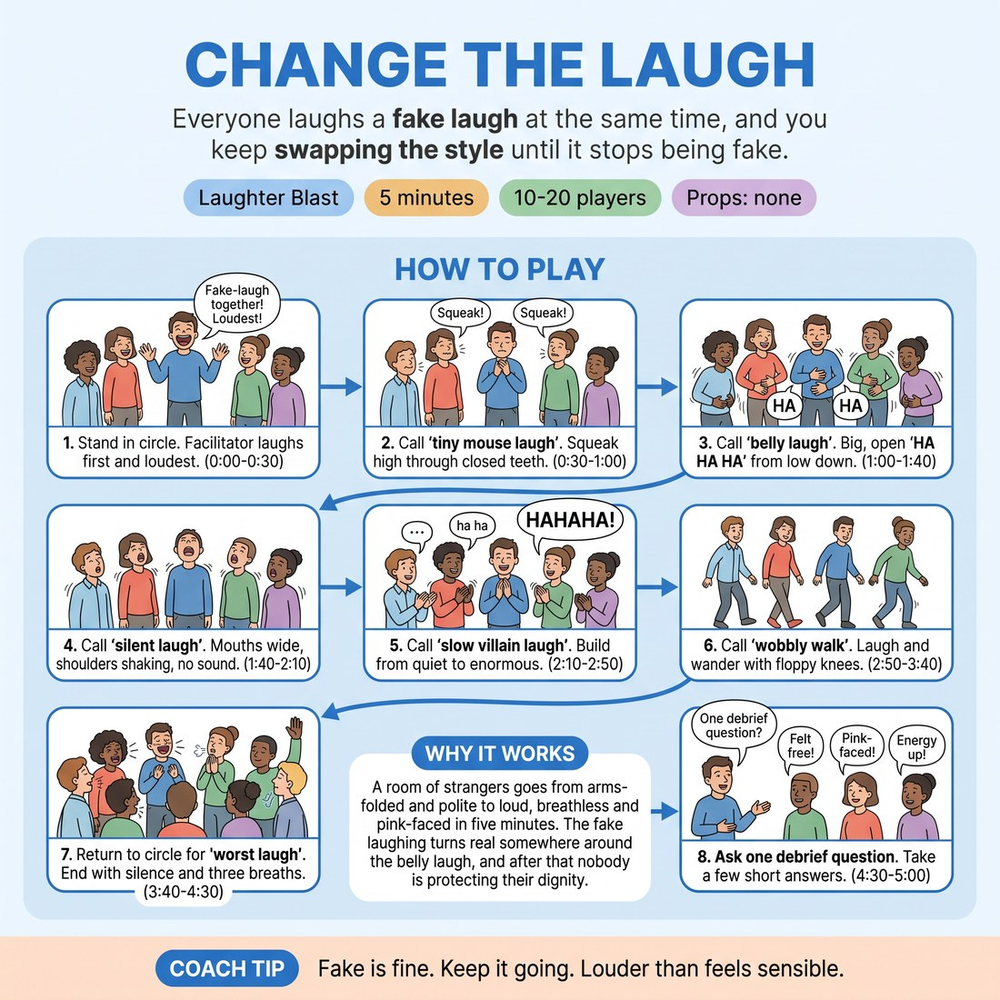

# 😄 Laughter Blast — Change the Laugh

{ .infographic }

> Everyone laughs a fake laugh at the same time, and you keep swapping the style until it stops being fake.

`Players 10–20` · `~5 min` · `Complexity 1/5` · `Energy high` · `Contact none` · `Props: none`

⬅️ [Back to the Week 01 run-sheet](../week-01.md)

## Why this activity, here

It follows the name and circle warm-ups that got voices into the room, and lands right after the first framing of the 'Cut' cue. Here the cue gets its first low-stakes rehearsal: everyone is doing something mildly embarrassing on instruction, so opting out costs nothing and can be tried out for real. It feeds the paired scene work later in the session, where a boundary call has to survive being heard mid-scene.

## What students actually learn

- That they can be loud and undignified in front of strangers and nothing bad follows.
- That stepping out and stepping back in is a normal move, not a failure.
- That the body warms faster than the confidence does — noise first, nerve after.

## Setup

Standing circle, arms' length apart, no chairs in the way. Clear a walking path inside and around the circle for the wobbly walk. Check who is next door and whether volume is a problem — if so, warn them and cap the belly laugh. Know where the wall is: that is the opt-out spot.

## How to run it — 5 minutes

| Min | What you do |
|---:|---|
| 1 | Frame it in twenty seconds: all fake, all at once, meant to sound terrible. Give the 'Cut' and wall opt-out. Then call 'tiny mouse laugh' for thirty seconds. You go first and loudest. |
| 1 | Call 'belly laugh'. Hands on stomachs, low HA HA HA, about forty seconds. Then call 'silent laugh': mouths open, shoulders shaking, no sound, eyes to the ceiling, twenty seconds. |
| 1 | Finish the silent laugh. Call 'slow villain laugh'. Everyone starts quiet and low and builds to enormous over forty seconds, hands rubbing. You lead the build so nobody has to decide when. |
| 1 | Call 'wobbly walk'. Everyone laughs and wanders on soft knees, eyes up, no contact, fifty seconds. Call them back into the circle on the last ten seconds. |
| 1 | Call 'your own worst laugh, full volume' for fifty seconds. Raise a hand for silence. Three slow breaths together. Ask one debrief question, take three short answers, move on. |

## Side-coaching script

| When | Say |
|---|---|
| Opening frame, before the first laugh | *"It's meant to sound fake. Fake is the point."* |
| Ten seconds into the mouse laugh, when the room is thin | *"Smaller. Squeakier. Teeth together."* |
| Belly laugh, when volume dips | *"From the stomach, not the throat."* |
| Silent laugh, when people start catching eyes | *"Ceiling. Nobody's watching you."* |
| Villain laugh, mid-build | *"Build together. Bigger. Bigger."* |
| Wobbly walk, if people cluster or drift near each other | *"Keep the gaps. Eyes up, knees soft."* |
| Final full-volume round | *"Your worst one. Full volume."* |
| Hand raised for silence | *"Silence. Breathe in. And out."* |

!!! success "What good looks like"
    By the villain laugh the fake laughing has gone real for at least half the room and someone is wheezing. Volume is uneven and nobody is trying to fix that. Anyone who stepped to the wall came back in without being invited. On the raised hand the room goes quiet within two seconds, and the three breaths land in a room that is warmer and noisier than the one you started with.

## When it goes wrong

| You see | What's causing it | The fix |
|---|---|---|
| Polite low chuckling that never gets above conversation volume. | You are not loud enough. The group takes its ceiling from you. | Go visibly over the top on the belly laugh. Do not ask them to be louder — just be louder and hold it for ten seconds. |
| People watching each other and grinning instead of laughing. | They have made it a performance with an audience. | Call 'ceiling' or 'eyes up'. The silent laugh and the wobbly walk both break eye contact by design — get there faster if needed. |
| Someone stands at the edge, arms folded, not joining. | Forced laughter feels exposing, and this can land badly on the first morning. | Leave them alone. Do not name them, do not check in mid-round. Nod once if they catch your eye. Most rejoin by the wobbly walk. |
| Someone gets breathless or lightheaded during the villain build. | Sustained forced laughing over-breathes some people. | Call the whole room to stop and breathe rather than singling them out. Move to the silent laugh, which is lower effort. |

## Scaling

| Class size | What changes |
|---|---|
| **10–13** | One circle. Run every round as written. With a small group the mouse laugh feels thin — extend it by ten seconds and cut ten from the wobbly walk so the room fills before people start moving. |
| **14–17** | One circle, timings exactly as written. Widen the circle so nobody is shoulder to shoulder during the wobbly walk. |
| **18–20** | One circle, but push it to the walls before you start. Trim the wobbly walk to forty seconds and add ten to the final full-volume round — with twenty people moving, the walk gets congested and the standing round is louder anyway. |

## Variations

**Sitting version** — Run the whole thing seated in the circle. Drop the wobbly walk and give that time to the belly laugh and the silent laugh.  
*Easier — removes the exposure of moving through space and suits anyone who cannot walk comfortably.*

**Pass the laugh** — After the final round, one person laughs alone for three seconds, then points at someone who copies and changes it. Around eight people, fast.  
*Harder — reintroduces being watched, one at a time, after the group has already warmed up.*

**Call your own** — After the belly laugh, invite anyone to call the next style. Take three calls from the room, thirty seconds each, then finish as written.  
*Different emphasis — shifts from following instructions to making an offer the whole room takes on.*

## Debrief

1. **When did the fake laugh stop being fake?**
   > *A good answer sounds like:* A specific moment named — the villain build, or when someone next to them cracked. Three or four of those in fifteen seconds is enough. Do not chase people who didn't feel it.

2. **Did anyone think about stepping out, and what stopped them or didn't?**
   > *A good answer sounds like:* Someone says they nearly went to the wall, or did. Take it plainly and thank them. If nobody answers, say the option stands all day and move on — do not push.

!!! warning "Safety & inclusion"
    No contact at any point; say so before the wobbly walk. Anyone can say 'Cut', step to the wall, or simply stand still and watch, at any moment, with no explanation and no check-in from you afterwards. Sustained forced laughing can make people breathless or lightheaded — the three breaths at the end are not decoration, and you can call a stop earlier. Seated participation works for every round. Warn the room if the venue is shared, and cap volume rather than cancelling the round. Forced laughter occasionally tips into real crying for someone; if that happens, let the group carry on, catch them at the break, and do not name it in the circle.

## Why it works

Boundary navigation only becomes real when there is something mildly costly to opt out of. A frame this daft supplies that at almost no risk: doing it feels exposing, and not doing it costs nothing at all. Because everyone is loud at once and nobody is being watched, the group's attention is genuinely off individuals, which means the 'Cut' offer is testable rather than theoretical. Physiology does the rest — sustained forced laughing raises breath rate and drops vocal inhibition, so the room arrives at the next block already louder than it would have chosen to be, having discovered that the exit door was unlocked and unwatched.

[Open the full activity card »](../../library/laughter/LB__change-the-laugh.md){target=_blank rel=noopener}
