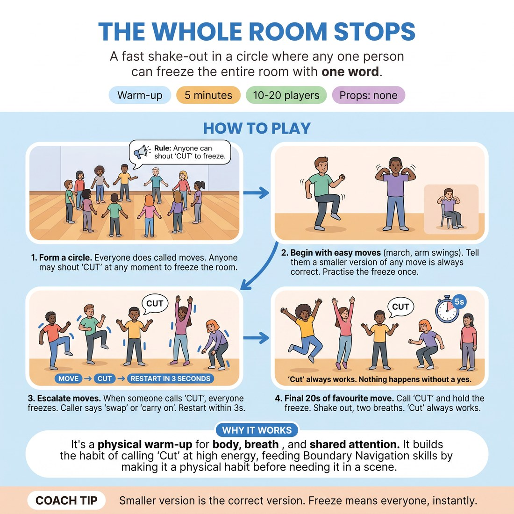

# 🔥 Warm-up cluster — The Whole Room Stops

{ .infographic }

> A fast shake-out in a circle where any one person can freeze the entire room with one word.

`Players 10–20` · `~5 min` · `Complexity 2/5` · `Energy high` · `Contact none` · `Props: none`

⬅️ [Back to the Week 01 run-sheet](../week-01.md)

## Why this activity, here

First physical thing in the room, before anyone has spoken a line. It sits after the name-and-hello opener and before the first partner work, so the stop word exists in the body before it is needed in a scene. Everything later in Week 1 leans on it.

## What students actually learn

- That stopping the room costs nothing and no one looks at them oddly for it.
- That they choose the size of their own participation, and small counts as full.
- That a boundary here is a normal instruction, not a complaint or a failure.

## Setup

Clear floor, one circle, everyone able to extend both arms without touching. No props. Chairs pushed back. Know who has flagged a physical limitation before you start and pitch the first moves low.

## How to run it — 5 minutes

| Min | What you do |
|---:|---|
| 1 | Form the circle. State the rule: you call moves, everyone does them on the spot, anyone may shout 'Cut' to freeze the whole room. Begin marching on the spot. |
| 1 | Add arm swings, then shoulder rolls. Say clearly that a smaller version of any move is always correct. Call 'Cut' yourself once, hold, then resume. |
| 1 | Ask for two Cuts from the room in this round. Escalate: knee lifts, reaching high. On each Cut, freeze; caller says 'swap that one' or 'carry on'; restart within three seconds. |
| 1 | Continue escalating: taps towards the floor, quarter-turns. Keep taking Cuts from anyone. Keep the restart fast. Praise nothing, just carry on. |
| 1 | Twenty seconds of the room's favourite move at each person's chosen size. Call 'Cut'. Hold five full seconds. Shake out hands and feet, two slow breaths, say the cue. |

## Side-coaching script

| When | Say |
|---|---|
| As the first move starts | *"Small counts. Pick your size."* |
| Before the first practice freeze | *"'Cut' is one word. Anyone. Any time."* |
| On the practice freeze | *"Freeze. Everyone. And back in."* |
| When a participant calls Cut for the first time | *"Good. Swap that one, or carry on?"* |
| If the restart is sluggish | *"Back in. Three, two, one."* |
| Mid-escalation, if people are copying the biggest mover | *"Your body, your version."* |
| On the final five-second freeze | *"Hold it. Breathe. Still holding."* |
| Shaking out | *"Hands. Feet. Two slow breaths."* |

!!! success "What good looks like"
    Someone who has not spoken yet calls 'Cut' and the room stops without anyone turning to check whether that was allowed. The restart is quick and unbothered. Sizes visibly differ round the circle — one person reaching overhead, another moving a hand six inches — and nobody corrects anybody.

## When it goes wrong

| You see | What's causing it | The fix |
|---|---|---|
| Nobody calls 'Cut' in the escalation round. | They read it as an emergency brake rather than an ordinary option, and no one wants to be first. | Nominate. Point at two people and say 'you two, one Cut each, whenever you like.' Once it has happened twice with no consequence, others join. |
| Someone calls 'Cut', then apologises or explains why. | Habit of justifying a boundary. Left alone it teaches the room that Cuts need a reason. | Cut them off warmly: 'No reason needed. Swap that one, or carry on?' Move on within two seconds. Do not thank them effusively; that also marks it as unusual. |
| Everyone matches the largest, fastest version of each move. | Circle mirroring. People calibrate to the biggest mover, not to themselves. | Call 'your body, your version' and visibly halve your own move mid-round. Point out one small version approvingly by doing it yourself, not by naming them. |
| The five-second final freeze breaks into giggles and collapse. | Stillness is uncomfortable and five seconds is longer than expected. | Let it happen once, then say 'again, and hold' and repeat it. Second attempt usually holds. Do not treat the laughter as a discipline problem. |

## Scaling

| Class size | What changes |
|---|---|
| **10–13** | One circle. Ask for two Cuts in the escalation round. Everyone has space, so allow moves with a full reach and quarter-turns. |
| **14–17** | One circle, tighter. Ask for three Cuts. Drop quarter-turns to half-turns in place if elbows are near neighbours. Same five minutes. |
| **18–20** | Two concentric circles, inner facing out, outer facing in, or one circle with the moves kept close to the body. Ask for four Cuts so the back of the room gets a turn. Cut the taps-to-the-floor move to save space. |

## Variations

**Cut and hold** — After each 'Cut', the freeze lasts three seconds before the caller speaks. Nobody restarts early.  
*easier — the longer pause makes the stop unmistakable and gives hesitant callers proof it works*

**Caller sets the next move** — When someone calls 'Cut', they name the next move instead of choosing 'swap' or 'carry on'. The room follows them.  
*harder — adds a public offer on top of the stop, so the boundary and an initiation land at once*

**Silent cut** — Replace the word with a raised flat palm. The first person to see it freezes, and the freeze spreads round the circle by sight.  
*different emphasis — moves attention from speaking up to watching for other people's signals*

## Debrief

1. **How did it feel to call 'Cut' — or to decide not to?**
   > *A good answer sounds like:* Someone names the small hesitation honestly: 'I nearly did and then thought it wasn't a big enough reason.' Move on as soon as one person says that out loud and the room recognises it.

2. **Did anyone change the size of a move? What happened?**
   > *A good answer sounds like:* 'I did the small version and nothing happened.' Or someone notices they matched the biggest mover without deciding to. Either is enough.

3. **When would you use 'Cut' later today?**
   > *A good answer sounds like:* Concrete and low-stakes: to step out of a physical bit, to stop a scene going somewhere they don't want, to take a breath. If answers stay abstract, name one yourself and move on.

!!! warning "Safety & inclusion"
    No contact at any point; keep an arm's length. Say aloud that every move can be done seated, and mean it — if anyone is seated, do part of a round seated yourself. Anyone can step to the edge and rejoin without asking. Flag before the escalation round that knee lifts and floor taps are optional and a hand movement substitutes for either. Do not push the five-second freeze on anyone who needs to keep moving.

## Why it works

Boundary Navigation fails when the stop signal is first used under pressure, because the person using it is then also managing the social cost of being first. This block spends the cost early, in a context with no scene, no partner and no content — the only thing at stake is a shoulder roll. Rehearsing the freeze before it is needed makes 'Cut' a motor habit rather than a decision. Requiring several Cuts from the room, rather than hoping for them, removes the question of whether anyone minds. By the time the word is needed in a scene, the room has already watched it work with no consequence.

[Open the full activity card »](../../library/warmups/WU__the-whole-room-stops.md){target=_blank rel=noopener}
