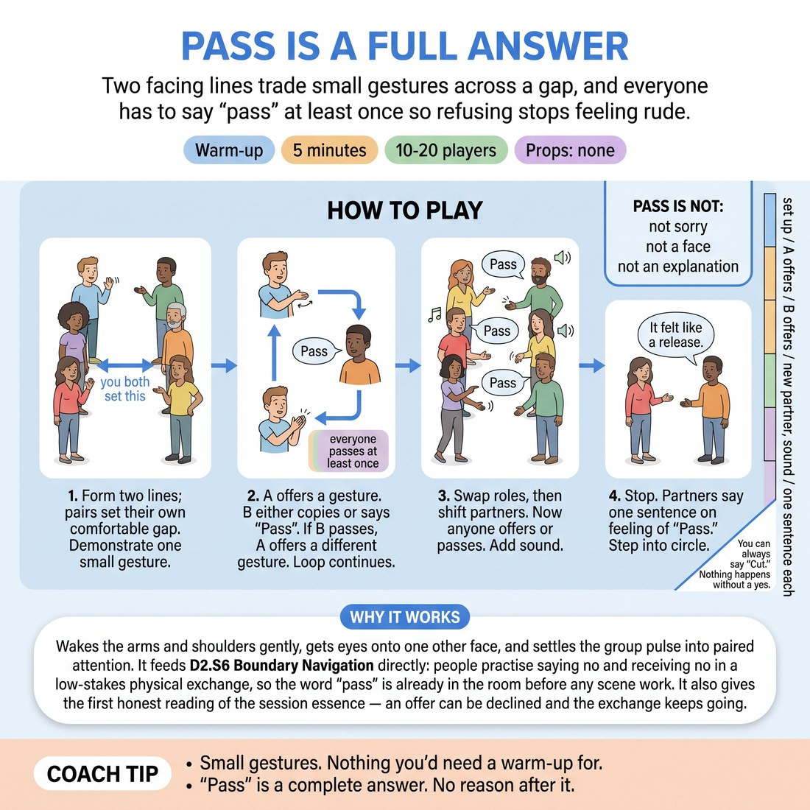

# 🔥 Warm-up cluster — Pass Is a Full Answer

{ .infographic }

> Two facing lines trade small gestures across a gap, and everyone has to say "pass" at least once so refusing stops feeling rude.

`Players 10–20` · `~5 min` · `Complexity 2/5` · `Energy medium` · `Contact none` · `Props: none`

⬅️ [Back to the Week 01 run-sheet](../week-01.md)

## Why this activity, here

This is the first week and the first hour. The circle name-and-eye-contact opener has just established that everyone is seen. This one establishes that being seen does not oblige you to comply. It gives the cue — 'you can always say Cut' — a physical rehearsal before anything harder arrives, and it feeds directly into every scene exercise later in the day, where an offer will be declined and nobody needs to apologise.

## What students actually learn

- Refusing an offer stops registering as rejection of the person making it.
- They discover their own physical comfort distance by choosing it out loud rather than tolerating whatever they are given.
- Saying no becomes a one-syllable event instead of a negotiation with an explanation attached.

## Setup

Clear floor for two lines facing each other with at least three metres between them, more if the room allows. No chairs in the middle. You need nothing else. Know in advance which end of line A will walk round during the shift, so that instruction takes four seconds rather than thirty.

## How to run it — 5 minutes

| Min | What you do |
|---:|---|
| 1 | Form the two lines. Each pair sets its own gap out loud. Demonstrate one small gesture. State the rule: copy it back, or say 'pass'. Everyone in B must pass at least once. |
| 1 | Round one. A offers, B copies or passes. When B passes, A offers something different. Keep it moving. Call out the pass requirement halfway through if you hear nobody using it. |
| 1 | Swap. B offers, A copies or passes. Same requirement — every A says 'pass' at least once. Expect this round to run faster; they know the shape now. |
| 1 | Line A shifts one place left, end person walks round. Either side may offer, either side may pass, at any moment. Add a sound to each gesture. |
| 1 | Stop. Pairs face each other. Each says one sentence about hearing 'pass'. Take one sentence from the room out loud, then break the lines into a circle. |

## Side-coaching script

| When | Say |
|---|---|
| As the lines form and people default to standing close | *"Set your gap. Say the number out loud."* |
| First thirty seconds, when gestures start big and performed | *"Smaller. A shrug is enough."* |
| When you hear no passes in the first round | *"Everyone owes me one pass. Spend it now."* |
| When someone apologises or explains after passing | *"Pass is the whole sentence. Nothing after it."* |
| When offers slow down after a pass, as if the passer broke something | *"Offer again. Different one. Straight away."* |
| Start of the free round | *"Either of you. Any moment. No turn order."* |
| When sound comes in and people hesitate | *"Any noise. It doesn't have to mean anything."* |
| Final ten seconds before the sentence swap | *"One sentence each. What it felt like to hear it."* |

!!! success "What good looks like"
    Passes come out flat and quick, with no apology attached and no pause afterwards. The offerer immediately produces something else. Gestures stay small. By the free round, some pairs are passing back and forth two or three times in a row and it reads as play rather than refusal. The room is noisier at the end than the start.

## When it goes wrong

| You see | What's causing it | The fix |
|---|---|---|
| Nobody passes in round one; everyone copies everything. | They read passing as failing the exercise, or as letting their partner down. | Stop the round for five seconds. Say the requirement again as a debt: everyone owes one pass. Restart. Do not shame anyone who missed it. |
| Passes come with 'sorry', a wince, or a hand held up in apology. | Social reflex — the habit of softening a no is stronger than the instruction. | Side-coach 'Pass is the whole sentence.' If it persists, have the whole room say 'pass' in unison three times, flat, then resume. |
| The offerer stops offering after being passed, and the pair goes quiet. | They have treated the pass as a verdict on the offer rather than a routing decision. | Call 'offer again, different one, straight away.' Name the pattern once out loud: a pass returns the turn, it does not end it. |
| Gestures inflate into mime scenes or jokes. | Someone is buying safety by being entertaining, and the room follows. | Call 'smaller' twice. If needed, restrict the whole room to gestures that use one body part only for the remainder of the round. |

## Scaling

| Class size | What changes |
|---|---|
| **10–13** | Two lines of five to seven. Run exactly as written. With an odd number, take the spare partner yourself and make sure you visibly pass at least twice. |
| **14–17** | Two lines of seven to nine. The shift round can leave one pair out of sync — walk the end person round yourself while the rest start, and let that pair join a beat late. |
| **18–20** | Split into two separate sets of facing lines at opposite ends of the room, five per line. Run both simultaneously, calling timings for the whole room. Skip the shift in the fourth round for the second set if the floor is tight; instead have them re-set their gaps and go straight to sound. |

## Variations

**Named pass** — Instead of the word 'pass', each person picks their own refusal word at the start — 'nope', 'skip', 'cut' — and uses only that.  
*easier — an owned word is less loaded than a shared one, and it previews the session cue*

**Two-pass minimum, no repeats** — Everyone must pass at least twice, and no gesture may be offered twice by the same person in a round.  
*harder — forces continued invention immediately after a refusal, which is where most people stall*

**Silent gap adjustment** — Between rounds, each pair silently re-sets their distance by walking. No talking. Whoever wants more space simply takes it.  
*different emphasis — moves the work from verbal refusal to physical boundary-setting without justification*

## Debrief

1. **What did it feel like to hear 'pass'?**
   > *A good answer sounds like:* Somebody says it stung the first time and stopped mattering by the third. Somebody else says they realised it was about the gesture, not about them. You do not need consensus — you need at least two people naming the shift.

2. **Which was harder, saying it or hearing it?**
   > *A good answer sounds like:* A genuine split in the room. If everyone says the same thing, ask the quiet ones. Move on once two or three people have said something specific rather than polite.

3. **Did anyone change their gap?**
   > *A good answer sounds like:* Someone admits they set it wider or narrower than they wanted at first and adjusted. That is the whole point landing — comfort is adjustable and adjusting is allowed.

!!! warning "Safety & inclusion"
    No contact at any point; the gap is chosen by both people and can be widened at any moment without explanation. Anyone who does not want to be in the lines can sit out and re-join at any round — say this before you start, once, without making it a thing. Gestures can be made seated or with minimal movement; a raised eyebrow counts. If someone finds the required pass genuinely difficult, let them say it to you rather than a partner. Nobody is asked to explain a refusal at any point, including in the debrief.

## Why it works

Boundary navigation fails in improv because refusal carries a social cost that no one has paid in a low-stakes setting. Mandating the pass removes that cost by removing the signal: if everyone must refuse, refusing tells you nothing about the relationship. The offerer's required immediate re-offer completes the loop — the pass is visibly absorbed and the exchange continues, so the body learns that a no does not break the connection. Doing this in the first hour, with gestures rather than words, means the pattern is installed before anything is at stake.

[Open the full activity card »](../../library/warmups/WU__pass-is-a-full-answer.md){target=_blank rel=noopener}
