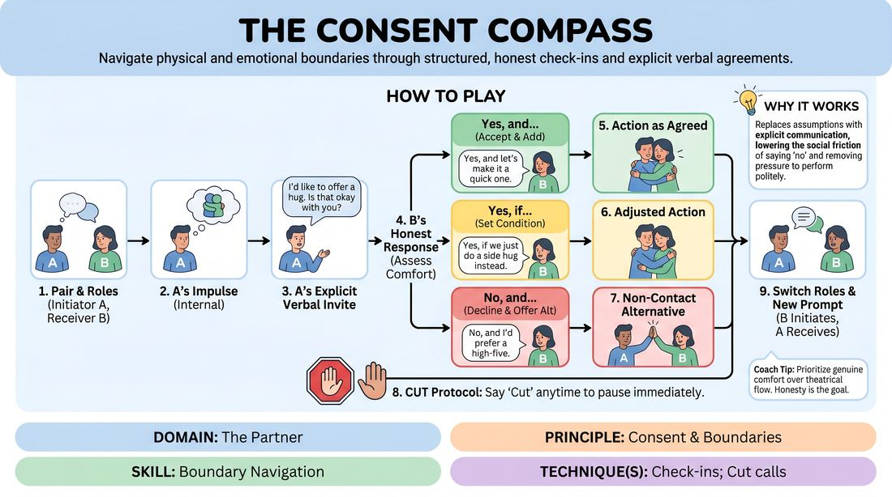

# 🎲 Drill A — isolation — The Boundary Compass

{ .infographic }

> Navigate physical and emotional boundaries through structured, honest check-ins and explicit verbal agreements.

`Players 2–99` · `~30 min` · `Complexity 2/5` · `Energy low` · `Contact none` · `Props: none`

⬅️ [Back to the Week 01 run-sheet](../week-01.md)

## Why this activity, here

Week 1 has already built the circle and the group agreements. This is the first block where those agreements get used out loud, on a partner, with a real physical stake. It isolates the asking-and-answering mechanic so that later scene work — where touch and intensity arrive unplanned — has a rehearsed vocabulary sitting underneath it. Everything after this in the session assumes 'Cut' is live.

## What students actually learn

- That saying no out loud to a friendly adult is survivable, and that nothing bad follows it.
- That an invitation is more useful than a guess — asking does not kill the moment, it makes the next moment playable.
- That 'Yes, if…' exists, so consent stops being a binary they feel trapped by.
- That their own comfort is information they can read in the moment rather than decide in advance.

## Setup

Clear floor space so pairs can stand two metres apart without overhearing each other. Prepare two sets of prompt slips, folded, one slip per person per round: set one is low intensity (offer a hug, put a hand on their shoulder, whisper something), set two is higher (hold both their hands, lean your forehead on theirs, shout a secret across the room at them). Write prompts as impulses, not instructions — 'you want to comfort them' rather than 'hug them'. Keep spares. Have a chair or two at the edge for anyone sitting out.

## How to run it — 30 minutes

| Min | What you do |
|---:|---|
| 4 | Frame it. Say the three replies and write them where everyone can see. Teach 'Cut'. Demonstrate one full exchange with a volunteer, and make sure your volunteer refuses you so the room sees a 'No' land harmlessly. |
| 3 | Pair everyone. Assign A and B. Spread the pairs out. Hand each A a low-intensity slip. Give them thirty seconds to read it and find their words before you start the round. |
| 5 | Round one. A invites, B answers with one of the three, A executes exactly as agreed. Repeat with the same prompt, phrased differently, until you call time. Circulate and listen. |
| 5 | Swap. Hand each B a low-intensity slip. Same rules, roles reversed. Watch specifically for whether the new initiators reach before they ask. |
| 4 | Raise the stakes. Hand out set two to the A players. Remind the room that 'No, and…' is still the strongest answer available. Run the round. |
| 4 | Swap for the last round with set two. Tell the receivers to use 'Yes, if…' at least once, even when they would happily say yes outright. |
| 5 | Bring everyone back to standing circle. Run the debrief questions. Close by restating the cue and confirming 'Cut' stays live for the rest of the day. |

## Side-coaching script

| When | Say |
|---|---|
| As the first round starts | *"Name the action before you make it."* |
| When a player reaches while still talking | *"Hands down until you hear the answer."* |
| When receivers are answering too fast | *"Take two seconds. Check your actual body."* |
| When every answer is a yes | *"Someone in this room wants to say no. Say it."* |
| When an initiator softens a refusal with a joke | *"Take the no clean. Move on."* |
| Mid-round two, to broaden the toolkit | *"Use 'Yes, if…' — change one thing."* |
| When the higher-intensity prompts land | *"Smaller is still a full offer."* |
| Just before calling time on the last round | *"Cut is still yours, all day."* |

!!! success "What good looks like"
    Pairs are talking more than touching. Invitations are specific — you hear the body part, the duration, the exact action. Refusals happen in most pairs at least once and the room does not go quiet around them. 'Yes, if…' produces small negotiated adjustments rather than long discussions. When someone says 'Cut', both players step back without asking why. The energy is calm and slightly formal, not giggly. Nobody is performing enthusiasm they do not feel.

## When it goes wrong

| You see | What's causing it | The fix |
|---|---|---|
| Everyone says yes to everything and the round ends in ninety seconds. | Politeness. Adults in a new room read refusal as rudeness and a drag on the exercise. | Stop the room. Set a quota: every receiver must use each of the three replies once before the round ends. Removing the choice removes the guilt. |
| Pairs giggling, hugging enthusiastically, skipping the verbal invitation entirely. | Friends paired together, or discomfort discharged as silliness. | Repair the pairing so nobody works with someone they arrived with. Then run one round where the invitation must be spoken and the action is never performed at all. |
| An initiator negotiating after a 'No' — 'are you sure?', 'just a quick one'. | They have heard consent framed as an obstacle to get past rather than an answer to receive. | Call it from the side immediately, by name of behaviour not person: 'No ends it.' Then have that pair replay the exchange with a clean acceptance. |
| One or two people frozen, not initiating, avoiding eye contact. | The prompt is genuinely past their line, or the pairing is wrong for them. | Go to them, offer the no-contact slip set, or move them to observing with a job — watching for clear invitations to report in the debrief. Do not make it a conversation in front of the room. |

## Scaling

| Class size | What changes |
|---|---|
| **10–13** | Five or six pairs, one trio if odd. In a trio, the third person observes and reports one thing they heard clearly. Run all four rounds at full length. You can listen to every pair at least once. |
| **14–17** | Seven or eight pairs. Split the floor into two halves and stay in one half per round so your attention is not spread thin. Keep all four rounds; drop round three to three minutes if the swap eats time. |
| **18–20** | placeholder. |

## Variations

**Words only** — Run the whole drill with no physical action ever performed. Invitations are made, answers are given, and both players simply say what would have happened next.  
*Easier — removes touch entirely for a nervous or mixed-comfort group while keeping the full vocabulary intact.*

**Standing offer** — The initiator makes their invitation in front of the whole group rather than privately. Same three replies, same Cut.  
*Harder — refusing in public is a bigger ask, and it shows the room that a witnessed 'No' still costs nothing.*

**Mid-scene cut** — Pairs improvise a thirty-second scene. When an impulse toward contact or intensity arrives, they break the scene, negotiate it aloud, then resume.  
*Different emphasis — moves the skill from an isolated drill into the flow of playing, which is where it has to work.*

## Debrief

1. **What was harder — asking, or answering?**
   > *A good answer sounds like:* Specific and personal. 'Asking felt like I was making it weird.' Or: 'I knew I wanted to say no and my mouth said yes.' Move on once two or three people have named the friction honestly rather than reassuring each other.

2. **What happened in your body when someone said no to you?**
   > *A good answer sounds like:* Someone reports a small drop and then nothing — that it passed in a second. That is the whole point. If everyone says 'fine, no problem' too briskly, push once for what actually happened before you accept it.

3. **Where would 'Yes, if…' have helped you in ordinary life this week?**
   > *A good answer sounds like:* A concrete example outside the room. It shows they have taken the middle option seriously rather than treating it as a game rule. Two examples is enough.

!!! warning "Safety & inclusion"
    All contact in this drill is negotiated aloud before it happens; that is the drill. State before you begin that anyone can decline all physical contact for the entire session, and offer the no-contact prompt set openly rather than making people request it. Say 'Cut' stops everything with no explanation owed, and mean it — if you hear it, stop the pair and check in privately, briefly. Do not pair people who arrived together for the first round. Be aware that prompts touching on comfort and secrecy can land close to real recent experience; keep prompts neutral in content and let anyone swap a slip without saying why. Anyone sitting out gets an observing job so they are still in the room. Note that hearing-impaired participants need pairs spaced further apart and facing each other for the whole exchange.

## Why it works

Boundary navigation fails in scene work because the negotiation is silent — one player guesses at the other's comfort and the other manages their own discomfort so as not to spoil the scene. This drill removes the guessing by making the negotiation the entire content. Because the impulse arrives on a slip rather than from the player, saying no costs nothing socially: the receiver is refusing a piece of paper, not their partner. Repetition across four rounds means every person is both initiator and receiver twice, so nobody leaves having only practised one side. The three fixed replies matter more than they look — offering 'Yes, if…' breaks the binary that traps people into unwanted yeses, and 'No, and…' requires the refuser to keep offering, which proves that a boundary is a redirection rather than a wall. By the end, 'Cut' has been spoken aloud in a low-stakes context, which is the only thing that makes it usable in a high-stakes one.

[Open the full activity card »](../../../../games/D2_P1_S6_T1_G148__the-consent-compass.md){target=_blank rel=noopener}
