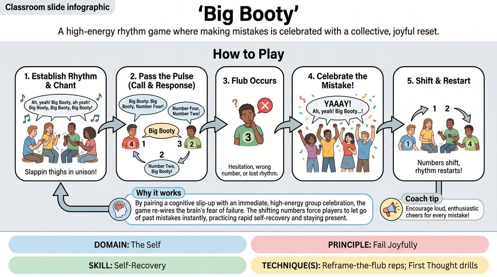

# 🎲 Drill B — under load — Big Booty

{ .infographic }

> A high-energy rhythm game where making mistakes is celebrated with a collective, joyful reset.

`Players 5–99` · `~30 min` · `Complexity 2/5` · `Energy high` · `Contact none` · `Props: none`

⬅️ [Back to the Week 01 run-sheet](../week-01.md)

## Why this activity, here

Week 1 has spent the morning on the standing agreements: the circle, the shared pulse, and the word 'Cut'. Drill A gave them the rule calmly. This block puts the same rule under load — noise, speed, everyone watching, an error rate near a hundred per cent. A boundary that only works when the room is quiet is not a boundary. This feeds the afternoon's scene work, where they will need to stop a scene mid-flow without treating it as a failure.

## What students actually learn

- That saying 'Cut' in a loud, fast, fully committed room costs nothing — because they have now done it and watched the room stop.
- That being the person who breaks the flow gets cheered, not tolerated, so the fear of being the weak link loses its grip.
- That they can hold attention on a group pulse and on their own name at the same time, which is the raw material of listening in scenes.
- That a mistake has a visible consequence (they move seats) which is still completely harmless.

## Setup

Clear floor, chairs pushed well back, room for a circle where everyone can see every face. No props, no music. Before you begin, say the game's usual title out loud and offer the room a substitute word of their choosing — some adults will not want to shout that phrase on their first morning and will not say so unprompted. Take a quick show of hands and go with whatever settles fast. Have a mental note of who is standing with difficulty; thigh slaps work seated. No contact in this game at any point.

## How to run it — 30 minutes

| Min | What you do |
|---:|---|
| 3 | Form the circle. Number off aloud clockwise from your left. Agree the chant word. State the standing rule: anyone can call 'Cut' at any moment, the game stops immediately, no explanation owed. |
| 4 | Beat only, no words. Slaps and claps until the pulse is genuinely shared. Then rehearse the flub cheer twice: you deliberately fumble, they cheer. Make the second cheer louder than the first. |
| 5 | Slow passing round, no seat changes. Half speed. Called players say their own number, then a target. Stop and reset on every flub but leave everyone where they are. |
| 6 | Full game, seat changes on. Keep the tempo modest. Count off aloud after every shift. Cheer every flub. Expect a flub roughly every four passes early on. |
| 4 | Raise the tempo one notch. Tell them the target is more flubs, not fewer. Keep the cheers going. Watch for anyone dropping their eyes to the floor. |
| 5 | Final round, fastest tempo you can hold. Ask two people quietly beforehand to call 'Cut' at a random point. Honour both instantly, thank them, restart when they nod. |
| 3 | Break the circle, stay standing, run the debrief questions. Keep it short and land on the cue before moving to the next block. |

## Side-coaching script

| When | Say |
|---|---|
| During the beat-only warm-up | *"Beat first. Words ride the beat."* |
| Tempo starts creeping up in the slow round | *"Slower than you want. Half speed."* |
| The first flub of the day | *"Cheer. Loud. Whole room."* |
| Someone apologises or winces after flubbing | *"No sorry. Just move up."* |
| A called player freezes | *"Your own number first."* |
| Eyes drift to the floor as speed rises | *"Faces, not floor."* |
| Anyone calls 'Cut' | *"Cut. Everyone stops. Thank you."* |
| Restarting after a Cut | *"Back on the beat when you're ready."* |

!!! success "What good looks like"
    The pulse holds even when the calls fall apart. Flubs come often and nobody flinches at them — the cheer arrives before the flubber has finished registering the error. People move seats quickly and without comment. When 'Cut' is called, the room stops inside a beat, without anyone looking round to check whether it was allowed, and picks up again without discussion. Laughter is loose rather than nervous.

## When it goes wrong

| You see | What's causing it | The fix |
|---|---|---|
| Within two minutes nobody knows whose turn it is, calls overlap, and the beat has vanished. | You let the tempo run. Excitement always pushes it faster than the group can track. | Stop. Beat only, no words, at half the speed for thirty seconds. Restart the chant. Say the tempo is your job, not theirs. |
| Flubs met with groans, hands over faces, or a mumbled apology while the cheer stays thin. | They are still treating error as personal failure. The cheer has not been rehearsed enough to be automatic. | Halt the game. Rehearse three cheers cold, with you as the flubber. Tell them the cheer is a rule, not a kindness. |
| After a seat change, three people call numbers that no longer belong to anyone. | You restarted before the new numbering settled. | After every shift, run a fast count-off round the circle. Costs five seconds. Prevents the collapse. |
| Someone drops out of the chant, stops making eye contact, or steps half a pace back from the circle. | The volume, the title word, or the exposure of being called on has tipped past comfortable. | Do not single them out mid-game. At the next reset, remind the whole room about 'Cut' and about the beat-keeper role at the circle's edge. Check in at the break. |

## Scaling

| Class size | What changes |
|---|---|
| **10–13** | One circle for the whole block, numbers one to twelve. Run the timings exactly as written. You lead throughout. Waits between calls stay short enough that nobody disengages. |
| **14–17** | One circle for the first two segments so everyone learns the mechanic from the same demonstration. Before the full-game segment, split into two circles of seven to nine. You lead one; hand the other to a participant who has already flubbed cheerfully. Renumber each circle from one. Both circles run the same rounds; you float and fix tempo. |
| **18–20** | Two circles of nine or ten from the start. Demonstrate once to the whole room in the first three minutes, then split. Appoint a leader in each circle and swap those leaders at the tempo change so two more people get the title. Shorten the final round to four minutes and add a minute to the debrief so both circles report. |

## Variations

**Names, no shifting** — Use first names instead of numbers and leave everyone where they stand. Flubs still get cheered; nobody moves.  
*Easier — removes the renumbering load entirely and doubles as a name-learning drill in a first session.*

**Silent seat** — Nominate one position as silent. When that number is called, the holder claps twice on the beat instead of speaking, then calls the next number.  
*Harder — adds a rule that must be tracked while the pulse continues, and creates a flub type nobody can blame on nerves.*

**Cut ladder** — Tell the room every player must call 'Cut' once before the round ends, at a moment of their choosing. Honour each one fully, then resume.  
*Different emphasis — moves the work from rhythm to boundary practice, so everyone rehearses stopping a room rather than watching someone else do it.*

## Debrief

1. **What happened in your body just before you flubbed?**
   > *A good answer sounds like:* Specific and physical — tightening chest, holding breath, eyes locking on one person. Not a theory about why they are bad at rhythm. Move on once two or three people have named a sensation.

2. **What did it cost to call 'Cut'?**
   > *A good answer sounds like:* Some version of 'less than I expected' — noticing they braced for annoyance that never came. If someone says they nearly didn't call it, that is the most useful answer in the room. Let it sit, then move on.

3. **Would you rather have been in a round where nobody flubbed?**
   > *A good answer sounds like:* A quick, unanimous no, with a reason attached — the flubs were where the laughter was, or that a perfect round would have meant everyone playing safe.

!!! warning "Safety & inclusion"
    No physical contact in this game at any point; nobody reaches for anybody. Offer the group a substitute for the title word before you begin and take the substitute if there is any hesitation — do not make anyone opt out publicly. Thigh slaps work seated; offer a chair inside the circle, not outside it. For anyone sensitive to sudden volume, offer raised hands as the cheer instead of shouting, and say so to the whole room rather than to an individual. Offer a beat-keeper role at the circle's edge for anyone who wants in without being called on. 'Cut' stops everything instantly, from anyone, with no reason required and no follow-up question from you.

## Why it works

Boundary navigation fails under arousal, not in calm. Anyone can decline something at rest; the useful skill is declining when the room is loud, fast and enjoying itself, and stopping it feels like spoiling something. This game manufactures exactly that condition cheaply — high volume, high tempo, visible collective momentum — and then asks people to interrupt it. Because the game also cheers every error and rebuilds itself in seconds, the room learns by repetition that stopping is not damage. The seat shift makes consequence concrete and harmless at the same time: something visibly happens, and it costs nothing. By the end, 'Cut' has been proved rather than promised.

[Open the full activity card »](../../../../games/D1_P2_S6_T2_G643__big-booty.md){target=_blank rel=noopener}
