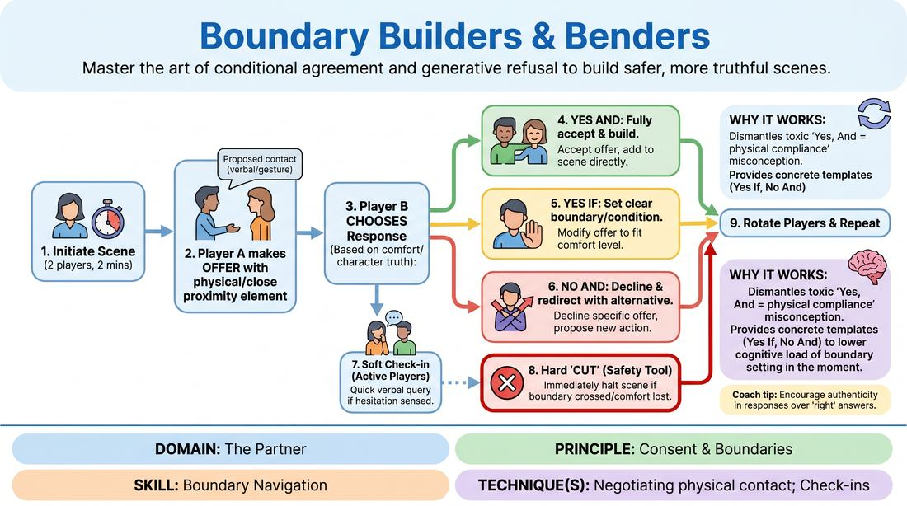

# 🎯 Scene Lab — Bridges and Boundaries

{ .infographic }

> Master the art of conditional agreement and generative refusal to build safer, more truthful scenes.

`Players 4–99` · `~30 min` · `Complexity 2/5` · `Energy medium` · `Contact none` · `Props: none`

⬅️ [Back to the Week 01 run-sheet](../week-01.md)

## Why this activity, here

The circle warm-ups have already put the room in loose contact and taught the Cut word as a phrase. This is where Cut gets used rather than heard. It sits last in Week 1 because the group now knows each other's names and faces, and because the three-response grid it installs — yes and, yes if, no and — is the vocabulary the rest of the course leans on. Week 2's two-person scene work assumes players can decline an offer without killing it.

## What students actually learn

- That saying no to an offer is a move inside the scene, not a failure of the scene.
- That they can name a condition out loud and be met, rather than silently enduring something they dislike.
- That declaring contact before making it costs about a second and removes almost all the risk.
- That the word Cut works when they say it, because they have watched it work.

## Setup

Chairs cleared to the walls. One open circle with a playing space of roughly three metres across in the middle. Two chairs available in the centre for scenes that want them. Have eight to ten one-line scenarios ready on cards or in your head — plain relationships and locations, no comic premises. Know before you start who has flagged an injury, a pregnancy, or a no-contact preference, and hold that quietly.

## How to run it — 30 minutes

| Min | What you do |
|---:|---|
| 4 | Circle up. Name the contact zones. Give the opt-out plainly: "Play contact-free today if you'd rather. Say so now or say so mid-scene. Nobody explains." Teach Cut and have the whole room say the word once, together, out loud. |
| 3 | Demonstrate with a confident volunteer. Play three short beats: declare a hand on the shoulder and get a "yes and"; declare a hug and get a "yes if — if you tell me what's happened"; declare taking their arm and get a "no and — but walk with me." Then call Cut on yourself to show it. |
| 8 | Round one. Pairs into the centre, two minutes each, you keep time and call the swap. Give each pair a scenario as they step in. The player who enters first initiates; the second responds. Side-coach only for declaration and for the three named responses. |
| 2 | Stop and reset. One sentence of note from what you saw — usually that everyone is choosing yes and. Ban yes and for round two. Tell them the offers may be small: a chair pulled closer, a hand out, standing near. |
| 9 | Round two. New pairings, roles reversed so everyone who responded now initiates. Two minutes each. Enforce the ban: any yes and, you call "try that again another way" and let them re-answer without stopping the scene. |
| 4 | Sit the circle down for the debrief. Take the three questions. Close by repeating the cue and pointing at the door: the same rules apply on the way out. |

## Side-coaching script

| When | Say |
|---|---|
| An initiator drifts towards a partner without saying anything | *"Declare it first."* |
| A responder freezes between the three options | *"Any of the three. Pick out loud."* |
| A yes if is vague — "yeah, sort of, if you like" | *"Name the condition."* |
| A no lands and the scene goes flat | *"No, and give them something."* |
| One player's face or shoulders read as uncertain | *"Check in. Quietly."* |
| The pair start discussing the rules instead of playing | *"One answer, then three lines of scene."* |
| Round two, someone reaches for yes and out of habit | *"Not that one. Try again."* |
| Anything at all looks off and nobody has spoken | *"Cut. Well done. Shake it out."* |

!!! success "What good looks like"
    Offers get spoken half a second before they happen and nobody finds that awkward after the third pair. You hear at least two genuine yes ifs with real conditions attached, and at least one no and that makes the scene more interesting than it was. Somebody calls Cut and the room does not treat it as a drama — the two players step back, breathe, and either restart or sit down. Scenes are ordinary and slightly dull, which is correct; the content is not the point this week.

## When it goes wrong

| You see | What's causing it | The fix |
|---|---|---|
| Every single responder says yes and. Ten pairs, ten acceptances. | Politeness. In a new room, refusing feels like refusing the person, not the offer. | Ban yes and outright for round two, as scripted. Do not treat it as a punishment — say plainly that the other two need reps and the easy one doesn't. |
| Contact proposals escalate into leering or gag material — "I'm going to lick your face." | Nerves converting into comedy, and the exercise reading as permission to test the room. | Cut it immediately, without a lecture. Restate the zones: hands, forearms, shoulders, upper back. Give that pair a new scenario with a formal relationship — colleagues, a dentist and a patient. |
| Nobody uses Cut all session, so it stays a word rather than a tool. | Calling Cut feels like admitting fragility in front of strangers. | Before round two, tell them you will call Cut at least twice yourself for no visible reason. Then do it. It normalises the stop and detaches it from blame. |
| Scenes become negotiation meetings — thirty seconds of terms and conditions, no story. | Players treating the three responses as the content instead of the frame. | Side-coach "one answer, then three lines of scene." Enforce it. The boundary move is a beat, not the whole exchange. |

## Scaling

| Class size | What changes |
|---|---|
| **10–13** | One circle, everyone watching. Scenes at two minutes, five or six pairs per round, both rounds in the full circle. You keep time and hand out scenarios yourself. Every person plays twice with room to spare. |
| **14–17** | One circle for round one at ninety seconds a scene. For round two, split into two circles at opposite ends of the room, seven or eight in each. Appoint a timekeeper in each circle and float between them. Everyone still plays both roles. |
| **18–20** | Two circles of nine or ten from the very start, set well apart so the noise doesn't bleed. Ninety-second scenes. Appoint a timekeeper and a Cut-warden in each circle — the warden's only job is to stop anything undeclared. You float. Cut round two to eight minutes and take the extra minute for a joint debrief. |

## Variations

**Proximity only** — No contact at all. Offers are about distance and space: sitting next to someone, standing over them, blocking a doorway. Same three responses.  
*Easier. Removes the touch question entirely and still trains the grid. Use it if the group is stiff, if several people have opted out, or as round one for a very new class.*

**Declared silently** — The initiator may not speak the offer. They hold a clear gesture — hand extended, arms open — and wait until the responder answers verbally with one of the three.  
*Harder. Forces legible physical proposals and makes the waiting visible. Exposes anyone who has been rushing through the declaration.*

**Third eye** — A third player stands outside the scene with one job: call Cut whenever they think a boundary wobbled. They cannot join in. Rotate the observer every scene.  
*Different emphasis. Shifts the skill from managing your own comfort to reading someone else's, which is what a scene partner actually has to do.*

## Debrief

1. **Which of the three was hardest to say?**
   > *A good answer sounds like:* Most name yes if, because it requires knowing what your condition actually is. Some name no and. If someone says "none of them, it was fine," ask what they'd have done if the offer had been genuinely unwelcome — then move on.

2. **What happened to the scene when someone said no?**
   > *A good answer sounds like:* Someone notices the scene got better, or at least got somewhere new. You want the word "interesting" or "it changed direction." Once one person says it, others recognise it. Move on — don't collect examples from everyone.

3. **What would make you call Cut next week?**
   > *A good answer sounds like:* Concrete and low-stakes: someone gripping too hard, a scene about something they didn't expect, feeling lost. If answers stay at the level of serious violations, say plainly that Cut is for mild discomfort too, and that using it small keeps it available big.

!!! warning "Safety & inclusion"
    Contact is opt-in and named. Before anything runs, state the four zones — hands, forearms, shoulders, upper back — and say clearly that anyone can play contact-free for the whole session or pull out mid-scene, with no explanation asked for or offered. Take that preference privately if someone comes to you, and pair them without comment. All contact must be declared before it happens; this is the rule the exercise exists to build, so enforce it hard from the first pair. Cut belongs to everyone equally, including you, including observers. Never ask someone why they called it. Watch for the participant who accepts everything with a fixed smile — pair them next with a gentle partner and use the ban on yes and to give them cover. Anyone with an injury, a pregnancy, or a mobility aid sets their own zones and tells their partner at the top of the scene.

## Why it works

Boundary Navigation fails in most rooms because refusal and scene-building are treated as opposites — say no and you have stopped the story, so people say yes to things they don't want. This exercise breaks that link by making declaration compulsory and giving refusal a grammatical form that carries an offer inside it. Yes if and no and are both continuations. Once a player has physically experienced a scene surviving their no — often improving on it — the internal cost of refusing drops, and it drops for the rest of the course. Compulsory declaration does the other half of the work: it inserts a reliable gap between intention and contact, so the responder is always answering a question rather than reacting to something already happening. Cut sits underneath both as the hard floor, and it only becomes real through use, which is why you call it yourself even when nothing is wrong.

[Open the full activity card »](../../../../games/D2_P1_S6_T3_G153__boundary-builders-benders.md){target=_blank rel=noopener}
