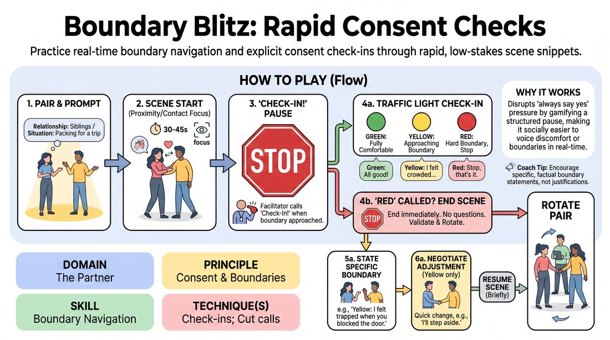

# 🏟️ Showcase round — Boundary Blitz

{ .infographic }

> Practice real-time boundary navigation and explicit consent check-ins through rapid, low-stakes scene snippets.

`Players 3–99` · `~25 min` · `Complexity 2/5` · `Energy medium` · `Contact none` · `Props: none`

⬅️ [Back to the Week 01 run-sheet](../week-01.md)

## Why this activity, here

Week 1 has spent two hours building the container: names, eye contact, group breath, the shared agreement that this room is opt-in. Those were promises. This is the first time the promise gets tested with something on the line. It closes the session as the showcase round because it converts an abstract rule — you can say Cut — into a physical habit the body has now performed. Everything in Weeks 2 onward that asks for closeness, status play, physical offers or emotional exposure draws on the credit this block builds.

## What students actually learn

- That saying "yellow" costs nothing. They watch someone do it, watch the room not flinch, and the fear of being difficult loses its grip.
- That a boundary is a piece of information, not a rejection of a scene partner. They stop hearing it as failure when it lands on them.
- That they can name what they need in one sentence, in front of people, without apologising or explaining first.
- That the scene survives the pause. Stopping is not breaking.

## Setup

Clear a playing area about three metres square in the middle. Everyone else sits or stands around the edge — close enough to hear a quiet voice. Write GREEN / YELLOW / RED on a flipchart or board where players can see it, with one line each: fine / near a limit / stop. Have a list of eight to twelve neutral two-person prompts ready on paper: sharing an umbrella, waiting for the same lift, one packing while the other watches, sorting a dead relative's records. Nothing built on conflict or romance. Know before you start who has flagged contact restrictions or injuries.

## How to run it — 25 minutes

| Min | What you do |
|---:|---|
| 3 | Frame it standing. Say the traffic lights, point at the board. Say the cue: you can always say Cut, nothing happens without a yes. Say that yellow is the target, not the failure. |
| 3 | Demo with one volunteer. Play thirty seconds, call "Check-In!" yourself, and call your own yellow out loud. Negotiate an adjustment. Resume ten seconds. Show them the shape. |
| 5 | Round one. Three pairs, roughly ninety seconds each including the check-in. You call every Check-In yourself. Keep it brisk — do not let a scene get interesting. |
| 5 | Round two. Three more pairs. Now tell players they may call "Check-In!" on themselves at any moment. Praise the first one who does it aloud, briefly. |
| 5 | Round three. Remaining pairs. Add the instruction that at least one player must find a yellow. Manufacturing one is allowed and fine. |
| 4 | Debrief seated in the circle. Two or three questions. Close by naming that the same call is live for the rest of the course. |

## Side-coaching script

| When | Say |
|---|---|
| As a pair starts and hesitates at two metres apart | *"Get close enough that it matters."* |
| The moment you see a shoulder tense, a step back, a look away | *"Check-In!"* |
| After the pause, if either player is silent | *"Colour. Just the colour."* |
| A player says yellow and starts explaining themselves | *"One sentence. The thing, not the reason."* |
| After a yellow is named and the pair looks stuck | *"Name the change. Out loud. Then go."* |
| A red is called | *"Red. Scene's done. Thank you for that."* |
| The room stays green for three pairs running | *"Find your yellow. Make one up if you have to."* |
| Rotating pairs between scenes | *"Next two. Same rules."* |

!!! success "What good looks like"
    Scenes stop cleanly on the call — no trailing dialogue, no one finishing their line. Colours come out fast and flat, without a laugh attached. At least a third of the check-ins are yellows, and the negotiation takes under ten seconds: "I'd rather you stayed on that side." "Fine." Back in. Watchers are quiet and attentive rather than amused. By round three someone calls Check-In on themselves before you do, and the room does not treat it as an event.

## When it goes wrong

| You see | What's causing it | The fix |
|---|---|---|
| Every single pair says green, every round, instantly. | They are reading yellow as complaint and green as the right answer. Nobody wants to be the one who stopped the fun. | Call your own yellow in the demo before they play. In round three, require a yellow. Once it is a task rather than a confession, it comes easily. |
| A player says "yellow" in a silly voice, or names a joke boundary to get a laugh. | Nerves. Comedy is the fastest exit from a sincere moment, and this is a sincere moment early in Week 1. | Do not scold. Say "and the real one" and wait. Take the second answer. If it stays a joke, rotate the pair out without comment and move on. |
| A scene escalates emotionally and a player looks genuinely shaken after a red. | The prompt had conflict baked in, or the pair improvised into personal territory. | End it, thank them, and put them back in the watching circle — not into another scene. Check in with them privately at the break. Tighten your prompts to mundane situations. |
| Observers whispering or laughing during the check-ins. | You have not made the pause part of the exercise in their eyes; they think the scene is the content. | Stop the round. Say the check-in is the exercise and the scene is scaffolding. Ask the circle for silence during pauses. It holds after one correction. |

## Scaling

| Class size | What changes |
|---|---|
| **10–13** | One circle. Five or six pairs total across three rounds — everyone plays once. Keep scenes at ninety seconds including check-in. You call all check-ins in round one. |
| **14–17** | One circle for the demo and round one. Split into two circles for rounds two and three, each with a facilitator or a nominated timekeeper you have briefed; you float between them. Seven or eight pairs total, so most play once. Announce upfront that a few will observe only, and take volunteers for that. |
| **18–20** | Two circles from the start of round one, in opposite corners. Run the demo once to the whole room first. Brief one confident participant per circle to make the Check-In calls; you rotate between circles every ninety seconds. Nine or ten pairs total. Drop round three to four minutes' play plus a joint debrief in the full circle. |

## Variations

**Talk-Only** — Ban all movement. Pairs sit in two chairs facing each other and play with volume, eye contact and how personal the questions get. Same check-in rules.  
*Easier. Removes the physical variable entirely for groups with visible contact anxiety, injuries, or a first-timer majority.*

**Silent Check** — Players signal the check-in with a raised flat hand instead of a word, and the colour is said quietly to the partner only, not the room.  
*Harder. Removes the facilitator as the one who notices. Players must monitor their own state while staying inside a scene, which is the actual skill.*

**Receiver's Round** — After each check-in, the player who did not call it says one sentence about what they will do differently. Then resume.  
*Different emphasis. Shifts the work from articulating a boundary to receiving one without defence — the harder half, and the one that makes the room safe.*

## Debrief

1. **Who found it harder — saying your colour, or hearing your partner's?**
   > *A good answer sounds like:* Someone admits hearing it stung slightly, and someone else says they were surprised it did not. You are looking for the recognition that a boundary is not an accusation. When two or three people have said that in their own words, move on.

2. **What stopped you from calling yellow earlier than you did?**
   > *A good answer sounds like:* Concrete, honest reasons: not wanting to spoil the scene, not being sure it counted, waiting to see if it would pass. If they name the hesitation out loud, they will notice it faster next time. Do not fix it — just collect two or three.

3. **What happened to the scene after a check-in?**
   > *A good answer sounds like:* "It carried on." "It got easier." "It was actually better because I stopped worrying." You want them to have felt that stopping did not destroy anything. If someone says the scene died, ask whether the scene mattered.

!!! warning "Safety & inclusion"
    Contact is optional throughout and requires a spoken yes in the moment — not a general willingness given earlier. State before the demo that anyone may take the watching role for the whole block with no reason given, and set out two chairs at the edge as the visible place to do that. Ask privately before you start whether anyone has an injury, a contact restriction, or a wheelchair or mobility aid that changes what proximity means for them; pair them with someone briefed. A red ends the scene with no follow-up questions, ever — do not ask what happened, even kindly, in front of the room. Keep prompts mundane and non-romantic. If someone discloses something personal during a check-in, thank them, keep it in the room, and see them at the break.

## Why it works

D2.S6 treats boundary navigation as a motor skill rather than a value. Knowing you are allowed to stop does nothing under pressure; the hesitation is not ignorance, it is the absence of a rehearsed action. This block supplies the rehearsal. The check-in is called externally at first, so the player never has to be the one who interrupts — the cost of stopping is set to zero. The traffic light gives a three-word script, removing the need to compose a sentence while uncomfortable. Repetition across pairs makes the pause ordinary, so by the time a player calls it on themselves in round two the social risk has already been priced out. The scene is deliberately trivial; low stakes are what allow the mechanics to be practised without the emotional load that would come with real ones. What transfers is not the vocabulary but the reflex: notice, stop, name, adjust.

[Open the full activity card »](../../../../games/D2_P1_S6_T1_G223__boundary-blitz-rapid-consent-checks.md){target=_blank rel=noopener}
