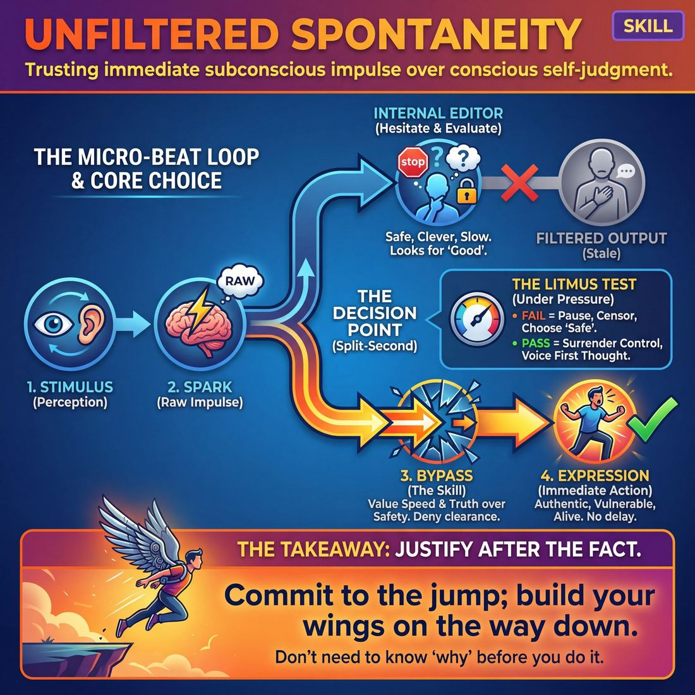

# Week 02 — The First Thought Is a Gift

> *The first thing that comes to mind is usually good enough, and the pause spent improving it costs more than it buys.*

| Course | Week | Domain | Focus | Stage | Length | Class |
|---|---|---|---|---|---|---|
| Foundations — The Brave Beginner | 2/8 | D1 | `D1.S1` — Unfiltered Spontaneity | Novice → Advanced Beginner | 180 min | 10–20 |

!!! note "Builds on"
    Last week gave them a way out; this week uses that safety as permission to speak before they have checked the answer.

## 🎬 The arc of this session

They arrive lighter than week one, because they now know they can bail out of anything and the room will catch them. Over three hours you take that safety and spend it: every drill is timed or driven fast enough that the editing brain never gets a turn, and the half-second lag between prompt and answer starts to close. They leave having said dozens of plain, obvious, unimproved things out loud, and having noticed that the plain ones landed.

!!! tip "Watch for"
    The swallowed word. Someone opens their mouth, a sound starts, they cut it and produce a tidier second answer. Name it warmly the first three times you see it — 'that first one, what was it?' — then stop naming it and just speed the drill up until it cannot happen.

## ⏱️ Session flow (180 minutes)

| Time | Block | Activity |
|---|---|---|
| **0:00–0:05** | 🧊 Ice-breaker | *Small Hill* |
| **0:05–0:10** | 😄 Laughter Blast | *The Big Sneeze* |
| **0:10–0:25** | 🔥 Warm-up cluster | *Three, Two, Shape*, *Here, Take This*, *Under Your Breath* |
| **0:25–0:45** | 🧠 Theory | — |
| **0:45–1:15** | 🎲 Drill A — isolation | *Rhythmic Impulse* |
| **1:15–1:25** | ☕ Break | — |
| **1:25–1:55** | 🎲 Drill B — under load | *Instant Backup Dancers* |
| **1:55–2:25** | 🎯 Scene Lab | *The Impulse Crucible* |
| **2:25–2:50** | 🏟️ Showcase round | *Boring Scene Celebration* |
| **2:50–3:00** | 💭 Reflection & homework | — |

## 🎒 Before you start

- Clear a circle big enough for everyone to stand with arms out, plus a marked scene area of about three by four metres at one end. Stack chairs at the walls.
- Check last week's homework in the first two minutes of the ice-breaker: ask by show of hands who used the bail-out phrase outside class. Do not collect stories yet — one line each, maximum.
- Props: a drum, shaker or anything you can strike on a beat for Rhythmic Impulse; a phone with a stopwatch; a speaker and three or four tracks with a clear pulse for Instant Backup Dancers.
- Write the cue on the whiteboard before anyone arrives: 'Be obvious. Be average. Your first thought is the gift.' Leave it up all session.
- Instant Backup Dancers involves people moving close together and copying bodies. Decide now where you will place your consent step and your opt-out role (side-clapper on the beat), and say it before the music starts, not after.
- Have a spare warm-up in your pocket in case the room arrives cold and quiet — one more round of Three, Two, Shape covers it.

## 1. 🧊 Ice-breaker (5 min)

*Everyone in, standing, shoulder to shoulder — hands up if you used your bail-out phrase this week, and one sentence each from the hands.*

**Why here:** Gets voices out and settles the week's homework in under five minutes without turning it into a discussion.

### Small Hill

> Everyone names one trivial thing they'd genuinely argue about, in five words or fewer, and the room votes with thumbs.

`Players 10–20` · `~5 min` · `Complexity 1/5` · `Energy medium` · `Contact none` · `Props: none`

**How to play**

1. Tell the room everyone has a small hill: a trivial opinion they will genuinely defend. Toast thickness. Which seat on the bus. Give yours, then two more examples of your own.
2. Rule the topics out loud: nothing about politics, faith or anybody's body. Trivial and true only.
3. Put them in pairs. Both talk at once, no turn-taking. Each tells the other their small hill and why they hold it.
4. Bring them back into one circle, shoulder to shoulder. Ask each person to cut their hill down to five words maximum.
5. Go round one at a time. Five words each. After every hill the whole room votes instantly: thumb up to agree, thumb down to disagree.
6. Name the two hills that split the room hardest. Give only those two people ten seconds each for one more sentence of defence. No reply, no debate.
7. Say one sentence about the room's flavour today. Move straight into the next block without discussion.

📄 **[Full teaching notes »](week-02/beginner_w02__b1_1.md)**

**Side-coach:** *“First answer, keep it moving, we are not collecting the good ones.”*

## 2. 😄 Laughter Blast (5 min)

*Stay in the circle, we are going to build a sneeze — nobody is required to be funny, only loud.*

**Why here:** A loud, silly, coordinated noise drops the self-monitoring before you ask anyone to speak alone.

### The Big Sneeze

> The whole room builds one enormous ridiculous sneeze together, over and over, until the sneezes turn into real laughter.

`Players 10–20` · `~5 min` · `Complexity 1/5` · `Energy high` · `Contact none` · `Props: none`

**How to play**

1. Scatter everyone across the room, arms' length apart. Demonstrate the sneeze yourself first, and make it the biggest one in the room so nobody has to go bigger than you.
2. Build 'aaah… aaah…' for three seconds, then sneeze hard into your elbow, folding your whole body forward. Tell them any sound is a correct sound.
3. Call the build together. Everyone inhales and 'aaah's. Call 'AND—' and the whole room sneezes at once. Run this three times.
4. Add movement. The sneeze now pushes them two steps backwards, feet staying under them. Four rounds, each one faster than the last.
5. Play size roulette. Call 'mouse' for a tiny squeak, 'elephant' for a vast one that drops them onto a knee. Alternate unpredictably, six or seven calls.
6. Finish with a chain: eight seconds of build while everyone circles their arms overhead, then release the largest sneeze available. Twice. Let the laughing run itself out.
7. Ask one question, take one or two answers, move straight into the next block.

📄 **[Full teaching notes »](week-02/beginner_w02__b2_1.md)**

**Side-coach:** *“Louder and worse — commit to the ugly version.”*

## 3. 🔥 Warm-up cluster (15 min)

*Six games, quick changeovers, none of them last long enough for you to get good at them.*

**Why here:** Six short games that each punish hesitation in a different way, so the lag gets attacked from several angles before theory names it.

### Three, Two, Shape

> Count the room down, call a word, and everyone throws their whole body into the first shape it suggests.

`Players 10–20` · `~5 min` · `Complexity 1/5` · `Energy high` · `Contact none` · `Props: none`

**How to play**

1. Get everyone standing in a loose scatter, arm's length apart, facing you. Ask them to jog gently on the spot.
2. Demonstrate once: jog, count "three, two", call a word, freeze into a full-body shape on the word. Hold one beat. Jog again.
3. Run six words the same way. Insist on whole-body shapes — legs, spine, face — not a hand gesture from a standing start.
4. Run six more words. On each freeze, add one sound the shape would make. Sound and shape land together, not sound after shape.
5. Speed the count up and call eight words fast. Tell them repeating a shape is fine and copying a neighbour is fine.
6. Stop. Shake out arms, legs and jaw. Say the cue: be obvious, be average, the first thought is the gift.

📄 **[Full teaching notes »](week-02/beginner_w02__b3_1.md)**

### Here, Take This

> In pairs, people mime handing over invisible objects and the receiver names whatever comes first, out loud, before they can improve it.

`Players 10–20` · `~5 min` · `Complexity 1/5` · `Energy medium` · `Contact none` · `Props: none`

**How to play**

1. Pair everyone off, facing each other, an arm's length apart plus a little. With an odd number, make one trio. Say clearly: no touching, hands stay in your own space.
2. Demo with one volunteer. Mime holding an object and offer it. They say 'Thanks for the kettle,' take it, hand you something back. You name yours. Keep the exchange going.
3. Start round one. Both partners alternate giving and receiving without stopping. The first word that arrives is the object. Once it's said out loud, it cannot be swapped.
4. Call stop. Send everyone to find a new partner from the far side of the room. Tell anyone unpartnered to wave a hand so you can place them.
5. Run round two faster. The receiver names the object before their hands close around it. Nothing from round one may be repeated.
6. Call stop. Ask for a show of hands: who named something dull? Say the cue — be obvious, be average, your first thought is the gift. Move on.

📄 **[Full teaching notes »](week-02/beginner_w02__b3_2.md)**

### Under Your Breath

> Standing still with eyes closed, the room whispers its first association to each word on a shared exhale, then holds the silence.

`Players 10–20` · `~5 min` · `Complexity 1/5` · `Energy low` · `Contact none` · `Props: none`

**How to play**

1. Bring everyone into a circle, standing, feet planted. Invite eyes closed or gaze dropped to the floor. Nobody moves their feet for the whole exercise.
2. Lead three slow breaths together — in through the nose, out through the mouth. Shoulders down. Wait until the room breathes roughly in time.
3. Demonstrate: say one word, then on the next shared out-breath everyone whispers their own first association at once. Nobody is heard alone. Whispers only.
4. Round one, eyes closed. Call six words, one every fifteen seconds. Whisper on the exhale, then hold three seconds of complete stillness before the next word.
5. Round two, eyes open with a soft gaze across the circle. Six more words, same rhythm, same whisper volume, feet still.
6. Finish with three words fast — call, whisper, call, whisper, call, whisper — no breathing gap. Then hold one long silence.
7. Say the cue: "Be obvious. Be average. Your first thought is the gift." Move straight into the next block.

📄 **[Full teaching notes »](week-02/beginner_w02__b3_3.md)**

**Side-coach:** *“You are late — go before you know.”*

## 4. 🧠 Theory — Unfiltered Spontaneity (20 min)

{ .infographic }

- **The big idea:** The first thought arrives fast and fits the moment. The second thought arrives late, aims to impress, and costs you the connection you had while you were searching for it. Being obvious is not a failure of imagination; it is the thing that lets your partner build.
- **Where you are on the path:** They can now stop safely, so they will risk starting — but they still believe the offer must be worth the group's attention. You will hear apologies, pre-qualifying ('this is stupid, but...'), and a visible half-second of shopping for something better. The goal today is not good offers. It is fast, plain, unashamed ones, reliably, in drills.
- **The one cue to coach:** *“Be obvious. Be average. Your first thought is the gift.”*

**The three beats**

1. **Say it.** Say: 'Your brain gives you an answer almost immediately. Then it gives you a second one that seems cleverer. The second one is not cleverer — it is just later, and by the time it arrives your partner has been standing there waiting. Today we take the first one every time. Obvious is fine. Average is fine. Boring is fine. The cost of the pause is higher than the cost of a plain answer.'
2. **Show it.** Stand in the circle. Ask three people in turn for a fruit. Take the first word each gives, fast. Then do it again and hold each person for a slow three-count before letting them answer. Point at what happened in the room during the pause: everyone leaned out, the energy dropped, the answer that came was longer and more effortful and no better. Sixty seconds, no discussion after.
3. **Try it.** Pairs. A says a noun, B says the first noun it makes them think of, back and forth, no repeats allowed but no quality bar either. Ninety seconds. Then swap: same game, but B must answer inside one second — you clap a slow pulse. Ninety seconds. Then thirty seconds of them telling each other which round felt worse and which round produced more words. Stop there; do not solve it.

!!! warning "The misunderstanding that always comes up"
    They hear 'be obvious' as 'switch off and say anything, including nonsense'. It is the opposite. The first thought is specific to the moment and to what your partner just said — random words are another kind of hiding. Correct it by asking for the first thought about the thing in front of them, not the first thought in general.

!!! abstract "📖 Go deeper"
    Read the full write-up: [Unfiltered Spontaneity](../../../theory/01_the-self/01_S1__unfiltered-spontaneity.md)

## 5. 🎲 Drill A — isolation (30 min)

*The drum decides when you talk, not you — your job is only to have something in your mouth when it lands.*

**Why here:** An external beat removes the choice about when to speak, so the only variable left is what they say.

### Rhythmic Impulse

> Master the rapid shift between profound stillness and explosive, unfiltered physical and vocal expression.

`Players 2–99` · `~30 min` · `Complexity 2/5` · `Energy medium` · `Contact none` · `Props: none`

**How to play**

1. Send everyone to their own patch of floor, out of arm's reach of anyone else. Standing, feet under hips, eyes open and soft. Call this the Still Point.
2. Talk them into the ground: unclench the jaw, drop the shoulders, let the breath fall in and out without managing it. Ten seconds of that, no more.
3. Tell them stillness is active. Thoughts and impulses will arrive. They watch them and act on none of them. Silent, unmoving, awake.
4. Give the trigger: one sharp clap, or the word 'Burst!'. On it, they release the very first physical or vocal impulse that is already there.
5. Cap each burst at one to two seconds. Whatever arrives goes out at full commitment — no editing it into something better mid-flight.
6. Snap them straight back to Still Point the instant the burst ends. Shake off the tension. Drop the verdict on what just came out.
7. Hold each Still Point between five and fifteen seconds, then trigger again. Keep running cycles without discussion between them.
8. Vary the rhythm deliberately. Sometimes stretch the stillness until it aches. Sometimes fire three claps in six seconds so thinking cannot keep up.

📄 **[Full teaching notes »](week-02/beginner_w02__b5_1.md)**

**Side-coach:** *“Miss the beat rather than fix the answer — we would rather hear the wrong word on time.”*

## ☕ Break — 10 minutes

Water, notes, informal talk. Non-negotiable at three hours — do not let it collapse into a working discussion.

## 6. 🎲 Drill B — under load (30 min)

*Same principle, now with your whole body and an audience of backup dancers — before we start, a consent check.*

**Why here:** Adds bodies, music and other people copying you, so the first impulse has to survive being watched.

### Instant Backup Dancers

> Perform a freshly witnessed dance routine with absolute confidence, celebrating every glorious mistake along the way.

`Players 10–99` · `~30 min` · `Complexity 2/5` · `Energy high` · `Contact none` · `Props: none`

**How to play**

1. Split the room into teams of four or five. Send each team to its own corner of the space.
2. Give them five minutes: pick a song everyone in the room knows, build a thirty-second routine of singing plus movement, rehearse it on their feet.
3. Bring everyone back to sit as audience. Announce the running order. Each team performs its own routine; the next team on the list is its shadow.
4. Send Team A up. They sing and dance full out, high energy, no hedging.
5. Tell Team B to watch as professionals who absorb choreography on one viewing. No notes, no whispering, no rehearsing in their seats.
6. The second Team A stops, Team B goes straight up and performs Team A's routine — same song, same moves, best guess, no huddle.
7. Tell shadows: when a move disappears, invent one at full size and commit. Teammates copy it instantly. No freezing, no apology, no 'sorry'.
8. Rotate until every team has performed its own routine once and shadowed another team once.

📄 **[Full teaching notes »](week-02/beginner_w02__b7_1.md)**

**Side-coach:** *“Whatever your body did first is the move — repeat it, do not upgrade it.”*

## 7. 🎯 Scene Lab (30 min)

*Into the scene area now — the rule is the same, the only difference is that a person is standing opposite you.*

**Why here:** Puts the fast impulse inside a scene, where the temptation to plan is strongest and the payoff for not planning is visible.

### The Impulse Crucible

> Instantly adapt your voice, body, and emotion to rapid-fire, shifting commands from a supportive circle.

`Players 3–99` · `~30 min` · `Complexity 2/5` · `Energy high` · `Contact none` · `Props: none`

**How to play**

1. Stand the group in a circle. Explain that one player at a time steps into the middle as the Catalyst; everyone else are Conductors who call commands.
2. Send the first Catalyst in. Tell them to start instantly with a seed impulse — a posture, a sound, or an emotional state. First thought, no editing.
3. Tell Conductors to call single words or short phrases that change the Catalyst's state. One voice at a time. Keep them coming, roughly every three seconds.
4. Give Conductors four categories: volume, tempo, emotion, physicality. Say 'whisper', 'double-time', 'grief', 'heavy'. Rotate categories so the Catalyst is never on one track.
5. Tell the Catalyst to drop the old state completely and take the new one. No transition, no justification, no explaining. Conflicting commands are pivots, not problems.
6. Call 'Freeze' after sixty to ninety seconds. Catalyst rejoins the circle as a Conductor. Next player steps in immediately.
7. Keep rotating until everyone who wants a turn has had one. Do not let a Catalyst refuse a command — if they can't do it, they approximate it and move on.

📄 **[Full teaching notes »](week-02/beginner_w02__b8_1.md)**

**Side-coach:** *“Answer them, do not answer the room.”*

## 8. 🏟️ Showcase round (25 min)

*On your feet in the circle, two sentences each, and when you finish you stay looking at the person opposite for one full beat before you sit.*

**Why here:** Standing, two sentences, held eye contact — the smallest public form of the skill, with nowhere to hide and nothing required beyond plainness.

### Boring Scene Celebration

> Embrace the ordinary and celebrate the mundane to unlock effortless, pressure-free spontaneity.

`Players 4–99` · `~25 min` · `Complexity 2/5` · `Energy medium` · `Contact none` · `Props: none`

**How to play**

1. Stand everyone in a circle, facing in. Say the aim plainly: make the dullest scene you can. No jokes, no twists, no crisis, no cleverness.
2. Name two neighbours. Ask them to step half a pace inward and turn to face each other.
3. Lead the circle in three chants of "Boring, boring, boring" before each scene. Keep it warm and encouraging, never sarcastic.
4. Let the pair trade four to six lines about something ordinary — a bus queue, sorting post, refilling the kettle, waiting for a kitchen timer.
5. Call "Scene" at the first natural pause. Do not wait for a punchline or a resolution.
6. Cue the whole circle into loud applause, cheering and whooping for a full eight seconds. Every scene gets the same ovation, regardless of content.
7. Move clockwise to the next adjacent pair and repeat until everyone has played. With an odd number, take the last slot yourself.
8. Tell them that if a laugh happens by accident, fine — but nobody chases it. Chasing funny is the only way to get this wrong.

📄 **[Full teaching notes »](week-02/beginner_w02__b9_1.md)**

**Side-coach:** *“Boring is the assignment — hold the look and let it be enough.”*

## 9. 💭 Reflection & homework (10 min)

**Deepen your improv**
1. Where in the session did you notice yourself reaching for a second answer, and what was the first one you threw away?
2. When someone gave you a completely plain offer today, what did it actually feel like to receive? Compare it to receiving a clever one.

**Beyond the stage**
3. Name one conversation this week where you will say the first honest thing instead of the polished version — who is it with, and what makes the pause tempting there?

➡️ **[This week's homework](../homework/HW-BEGW02.md)**

??? note "🎓 Facilitator notes"

    **Timing risks**
    - The warm-up cluster is six games in fifteen minutes. That is two and a half minutes each including changeover. Cut Under Your Breath first if you are behind; cut Take This second.
    - Instant Backup Dancers overruns because people want extra turns. At 18-20 run two groups simultaneously in opposite corners with one track each — you cannot get through everyone sequentially in thirty minutes.
    - Boring Scene Celebration slows down because people want to talk after each pair. Bank the talking for reflection; keep the circle moving.

    **Failure modes this week**
    - Apologising after offers. It will happen all afternoon and it is the main thing to kill. Do not lecture — just say 'no apology needed' flatly and move on. By the last hour it should be gone.
    - 'Be obvious' collapsing into random nonsense words, which is hiding in a different costume. Redirect to the person or object in front of them.
    - A quick group racing to be first and turning the drills into a competition. Slow your voice, not the drill; praise plainness rather than speed alone.
    - One or two people who genuinely cannot answer under time pressure and freeze. Give them the bail-out from last week explicitly, in front of everyone, so using it reads as competence rather than failure.

    **What good looks like by the end:** By the final circle the gaps between prompt and answer are visibly shorter than they were at 10am, offers are short and unornamented, and nobody has said 'sorry, that was rubbish' in the last hour. People are still making eye contact after they finish speaking rather than looking at the floor.

    **Carry into next week:** They can emit; they cannot yet build. Next week takes these fast plain offers and makes them join up — the skill becomes accepting what your partner just gave you, which only works because there is now something arriving fast enough to accept. Note which two or three people are still editing and pair them deliberately.  For scaling: at 10-13 run everything as one circle and one scene area; at 14-17 split Drill A into two circles with a beat-keeper each and run Scene Lab in two areas with you moving between them; at 18-20 run three circles for Drill A, two simultaneous groups for Drill B, and cap Boring Scene Celebration at one round of pairs with the rest as the standing audience.
