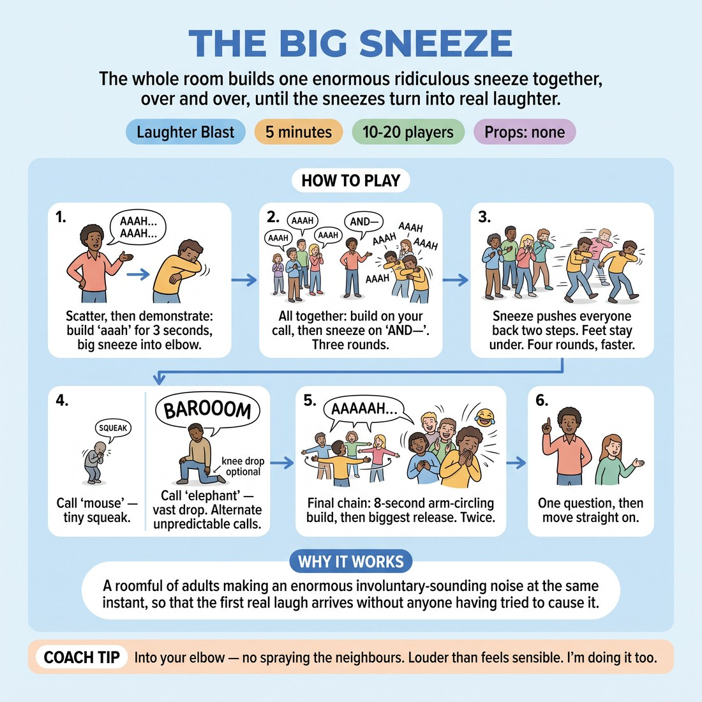

# 😄 Laughter Blast — The Big Sneeze

{ .infographic }

> The whole room builds one enormous ridiculous sneeze together, over and over, until the sneezes turn into real laughter.

`Players 10–20` · `~5 min` · `Complexity 1/5` · `Energy high` · `Contact none` · `Props: none`

⬅️ [Back to the Week 02 run-sheet](../week-02.md)

## Why this activity, here

Week 2 asks people to hand over their first thought without inspecting it. That is hard from a standing start with an audience watching. This comes first in the session, before anyone has to speak a line, and it gets breath moving, voices loud and bodies committed while everyone is doing the identical thing at the identical moment. It feeds directly into the offer-making work that follows: a room that has already been loud together does not have to break the silence a second time.

## What students actually learn

- That the room can be loud and ridiculous without anyone being judged for it — the volume ceiling gets raised in the first two minutes.
- That full physical commitment is available to them, including the people who arrived intending to stand at the back with their arms folded.
- That laughter here is a by-product of doing the thing, not a reward for being clever.

## Setup

Clear floor, everyone standing, roughly arm's length apart in a loose scatter — not a circle. No chairs in the playing space. Nothing to hand out. Know your own biggest sneeze before the class arrives; if you under-commit on the demonstration the whole block stays small. Warn the room next door if the walls are thin.

## How to run it — 5 minutes

| Min | What you do |
|---:|---|
| 1 | Scatter them. Demonstrate one full sneeze at maximum size — three-second build, huge release into your elbow, body folding. Then run the group sneeze three times: you call the build, you call 'AND—', everyone releases together. |
| 1 | Add the backwards travel. The sneeze pushes them two steps back with feet staying underneath. Four rounds, increasing the speed of your call each time so the last one is almost immediate. |
| 1 | Size roulette. Alternate 'mouse' and 'elephant' unpredictably — tiny squeak versus a vast one that drops them to one knee. Six or seven calls. Vary the gap between calls. |
| 1 | Final chain. Eight seconds of build with arms circling overhead, then the biggest release of the block. Do it twice. After the second, stop calling and let the laughing run without steering it. |
| 1 | Bring them into a loose standing cluster. Ask one question. Take two answers, no more. Name the cue — first thought, obvious, average — and go straight into the next block. |

## Side-coaching script

| When | Say |
|---|---|
| Before your first demonstration | *"Any sound is the right sound."* |
| During the first group build | *"Fill the lungs. Take your time on the build."* |
| After round two, if the room is polite | *"Louder than feels sensible."* |
| Adding the backwards travel | *"Let it move you. Feet stay under you."* |
| During size roulette | *"Mouse. Tiny. Now — elephant."* |
| On the eight-second build | *"Arms circling. Keep building. Don't go yet."* |
| Immediately after the final release | *"Let it land."* |
| Anyone hanging back at half-volume | *"No one is watching you. Everyone's sneezing."* |

!!! success "What good looks like"
    By the third group sneeze the room is louder than you expected and someone has already laughed at their own noise. During size roulette people are physically committing — actually dropping to a knee, not miming it. After the final chain the laughter carries on for a few seconds without you doing anything. Faces are flushed, breathing is up, and nobody is standing with folded arms.

## When it goes wrong

| You see | What's causing it | The fix |
|---|---|---|
| A thin, polite 'achoo' from most of the room while three people go big. | Your demonstration was too small, or you called 'AND—' before they had built enough breath. | Stop. Do one more demonstration yourself at obviously absurd size. Lengthen the build to four seconds so the release has somewhere to come from. |
| People watching each other sideways to check what size is acceptable. | The scatter is too tight or too circle-shaped, so it reads as performance to a ring of onlookers. | Spread them wider and tell them to face different directions. Nobody plays to anyone. |
| The energy peaks in round two and sags through size roulette. | Your calls have fallen into a predictable rhythm. | Break the pattern. Two elephants in a row. A long pause before a mouse. Unpredictability restores attention. |
| Someone standing still, not joining in. | Self-consciousness, or a physical or vocal reason they haven't mentioned. | Don't single them out. Keep running it. Most join by round three. If they don't, leave it — the next block will bring them in. |

## Scaling

| Class size | What changes |
|---|---|
| **10–13** | Run exactly as written. With fewer voices the room can sound thin, so push the demonstration harder and add a fourth round to the backwards-travel section, taking it from the size-roulette time. |
| **14–17** | As written. Stand at one edge of the room rather than the centre so every call carries and everyone can see your body on the demonstration. |
| **18–20** | Space is the constraint, not energy. Cut the backwards travel to two steps into a half-turn instead of straight back, so nobody collides. Reduce size roulette to five calls and keep the final chain at two. |

## Variations

**Seated sneeze** — Everyone stays in chairs. Build and release with upper body only — fold forward at the waist on the sneeze, no travel, no knee drop.  
*Easier. Use it when the space is tight, when there are mobility considerations in the room, or with a group that is very reluctant on the first weekend.*

**Sneeze conductor** — After the size roulette, hand the calls to a participant. They call build, release and size. Swap conductor every three calls.  
*Harder. Calling in front of the group is exposure, and it moves the block from following to leading.*

**Contagious chain** — One person sneezes. Whoever it lands on catches it and sneezes bigger, passing it on. No calls from you. Runs until it reaches everyone.  
*Different emphasis. Shifts from unison to individual initiation and accepting what arrives — a direct rehearsal for taking an offer.*

## Debrief

1. **What happened to your body when you stopped worrying about the size of the sneeze?**
   > *A good answer sounds like:* Something about loosening, or about not deciding in advance — 'I just did it and it was fine.' You want a description of the physical state, not an analysis. Two answers, then stop.

2. **Did anyone plan their sneeze?**
   > *A good answer sounds like:* Laughter, and someone admitting they did at first and then gave up. That's the whole point landing. Name the cue — first thought, obvious, average — and move on.

!!! warning "Safety & inclusion"
    No contact in this activity. Check the floor for bags and cables before the scatter. Announce at the start that the knee drop on 'elephant' is optional — a deep bend or a fold at the waist is fully equivalent, and say so before the first roulette call, not after. Anyone with back, knee, neck or breathing concerns plays it seated or at half-size with no explanation required. Loud unison noise can be difficult for some; tell people they may stand at the edge or step outside for the two minutes and rejoin. Nobody is asked why.

## Why it works

D1.S1 asks for the unfiltered first thought, and the obstacle is the pause where people appraise their idea before releasing it. This block removes the appraisal by removing the choice: you supply the timing, the shape and the size, so the only thing left for the participant to do is commit. Unison protects them — with fifteen people sneezing simultaneously, no individual output is legible, so there is nothing to be judged on. The raised breath and volume then persist into the next block, which means when someone is asked for a real first thought ten minutes later, their body is already in the state that produces one quickly. The laughter at the end is not the aim; it is evidence that the appraising part has switched off.

[Open the full activity card »](../../library/laughter/LB__the-big-sneeze.md){target=_blank rel=noopener}
