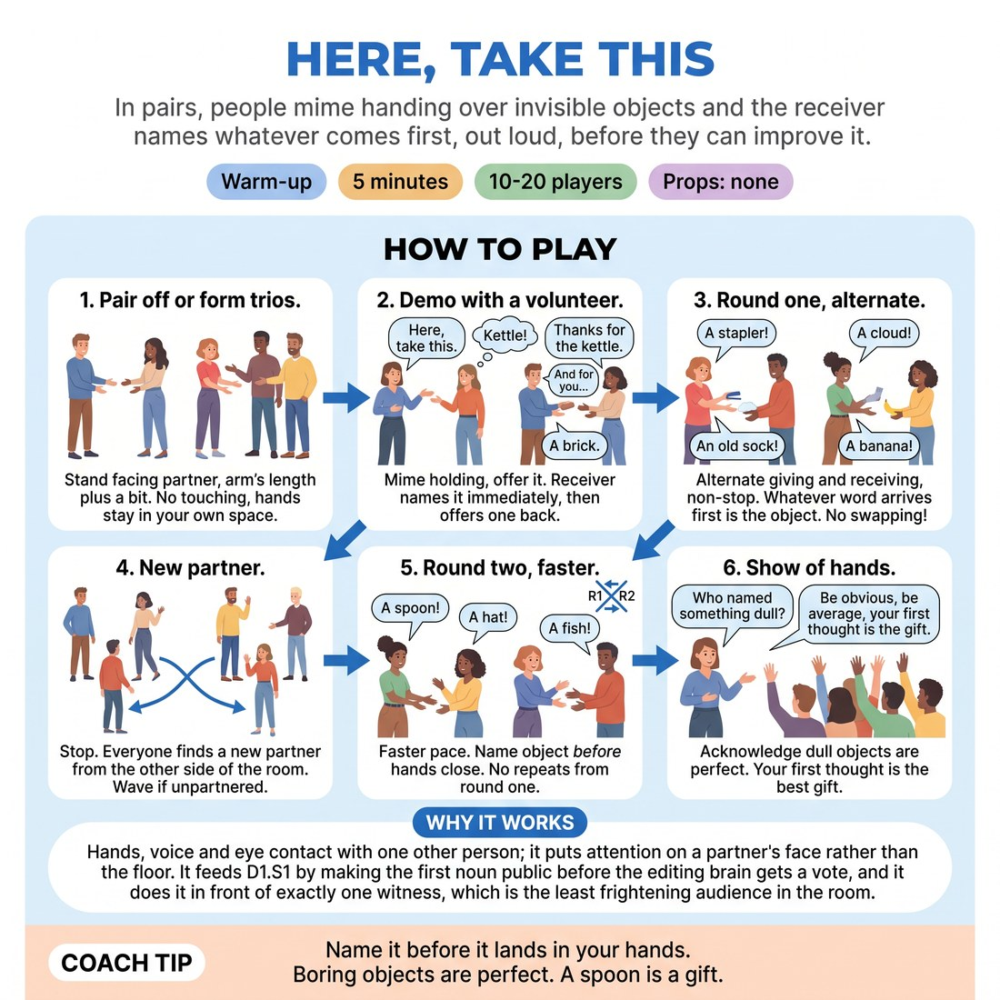

# 🔥 Warm-up cluster — Here, Take This

{ .infographic }

> In pairs, people mime handing over invisible objects and the receiver names whatever comes first, out loud, before they can improve it.

`Players 10–20` · `~5 min` · `Complexity 1/5` · `Energy medium` · `Contact none` · `Props: none`

⬅️ [Back to the Week 02 run-sheet](../week-02.md)

## Why this activity, here

Second week, first block. Week 1 got people talking in the room; this is the first exercise that puts a timer on the gap between impulse and speech. It feeds everything after it in the session — offers, acceptance, and the longer scene work where hesitation shows up as blocking.

## What students actually learn

- That the word already in their mouth is usable, and the pause spent hunting for a better one costs more than it buys.
- That naming something plain out loud does not produce the embarrassment they were bracing for.
- That a partner can build on 'a shoe' just as readily as on anything clever.

## Setup

Clear floor space so pairs can stand facing each other without bumping. No chairs, no props, nothing in hands — ask people to put drinks and phones down at the edge. You need a voice loud enough to cut through twenty people talking at once, or a hand clap. Know in advance where the odd person goes if numbers are uneven.

## How to run it — 5 minutes

| Min | What you do |
|---:|---|
| 1 | Pair the room off, facing partners, arm's length plus a bit. State the no-touching rule. Demo once with a volunteer: offer an invisible object, they name it and hand one back. |
| 1 | Round one. Both partners alternate giving and receiving, continuous, no gaps. First word out is the object. Side-coach for speed, not quality. |
| 1 | Stop. Everyone crosses the room and finds a new partner. Hands up if unpartnered. Place stragglers, make a trio if needed. Set round two: name it before your hands close, nothing repeated from round one. |
| 1 | Round two runs. Push the pace hard. Call out anyone visibly composing before they speak. Let it get sloppy. |
| 1 | Stop. Show of hands: who named something dull? Note it, don't discuss it. Say the cue. Move straight into the next block. |

## Side-coaching script

| When | Say |
|---|---|
| As round one starts | *"Don't wait for a good one. Say the first one."* |
| When pairs slow down mid-round | *"Keep the hands moving. Hands first, word follows."* |
| When you see someone smirking before speaking | *"That pause is you editing. Drop it."* |
| Halfway through round one | *"Boring is allowed. Boring is the exercise."* |
| As round two begins | *"Name it before you're holding it."* |
| When a pair gets tangled arguing about a repeat | *"Let it go. Next object."* |
| Last fifteen seconds of round two | *"Faster. Stop making sense."* |
| On the final stop | *"Hands up — who named something dull? Good. That was the gift."* |

!!! success "What good looks like"
    The room is noisy and overlapping. Objects come out fast and unremarkably — a mug, a brick, a sandwich. Nobody is holding a pose while they think. You hear the occasional absurd item, but it arrives at the same speed as the boring ones rather than being fished for. When you call stop, several people carry on for a beat because they've lost track of themselves.

## When it goes wrong

| You see | What's causing it | The fix |
|---|---|---|
| Pairs pausing, eyes up and to the side, before each hand-off. | They're auditioning options for the funniest one. | Cut in with 'first word, not best word' and speed the tempo by clapping a rhythm for ten seconds. |
| Elaborate mime — carefully shaping the object, showing its weight, adding sound effects. | They've turned it into a guessing game or a performance of skill. | Say 'the mime doesn't matter, the naming does.' Tell receivers to name it before the giver has finished offering. |
| Both partners giggling, hands dropped, nothing being exchanged. | Nervous release; the exercise has stalled into chat. | Stand near them, hold your own hand out, take an object from one of them yourself, then step away. |
| One person in the pair doing almost all the giving. | The quieter partner is waiting to be handed something rather than alternating. | Call 'strict alternation — give, receive, give, receive' across the room so it isn't aimed at anyone. |

## Scaling

| Class size | What changes |
|---|---|
| **10–13** | Straightforward pairs. One trio if odd — in a trio they pass round the circle in one direction. Run both rounds at the timings given; you'll have spare seconds to walk the room and side-coach individuals. |
| **14–17** | Pairs as written. Expect the partner swap to take longer — start calling 'find someone new, keep moving' before the round has fully stopped. Trim five seconds off round one if the swap runs over. |
| **18–20** | Use a clap rather than your voice to stop rounds; twenty people talking will drown you. Pre-decide two trios so the swap doesn't stall on odd numbers. Shorten the swap by naming a side of the room to cross to. Skip the show of hands if you're over time — just say the cue. |

## Variations

**Named and repeated** — The receiver says the object out loud, then the giver repeats it back before offering their own. Slower pace, no time pressure.  
*Easier — the repetition confirms the offer landed, which settles people who freeze under speed.*

**No nouns twice, whole room** — Announce that no object may be named twice by anyone in the room across both rounds. Pairs shout out a challenge if they hear a repeat.  
*Harder — removes the safe fallbacks and forces genuinely first-thought material.*

**Take it and use it** — After naming the object, the receiver does one physical action with it before handing something back.  
*Different emphasis — shifts from naming speed to accepting an offer with the body, and previews scene work.*

## Debrief

1. **Hands up if you named something dull. What happened after you said it?**
   > *A good answer sounds like:* Someone says nothing happened — their partner just took it and carried on. That's the whole point; acknowledge it and move.

2. **Did anyone catch themselves rejecting a word before it got out?**
   > *A good answer sounds like:* A couple of people admit they swapped 'chair' for something they thought was better and it slowed them down. Don't explore it. Name it as the habit the session is working on.

!!! warning "Safety & inclusion"
    No physical contact at any point — say this before the demo, not after. Hands stay in each person's own space, and objects are handed into the air between them. Anyone who prefers not to stand can do this seated, facing a partner who also sits. If someone is uncomfortable with an assigned partner, let people self-select on the swap and quietly place anyone left over. Volume gets high; tell the room they can step to the edge for a moment if that's too much, and mean it.

## Why it works

Unfiltered spontaneity fails on a gap — the half-second where the brain reviews a word and finds it insufficient. This exercise makes that gap physically visible: the hands are already moving, the object is already coming, and stopping to edit leaves the giver holding nothing. The speed constraint in round two closes the gap below the length of a self-critical thought. Because the receiver is committed by the rule that a spoken word cannot be swapped, they get repeated, low-stakes evidence that a plain answer is accepted without comment. The dullness question at the end converts that evidence into something they can say back to themselves.

[Open the full activity card »](../../library/warmups/WU__here-take-this.md){target=_blank rel=noopener}
