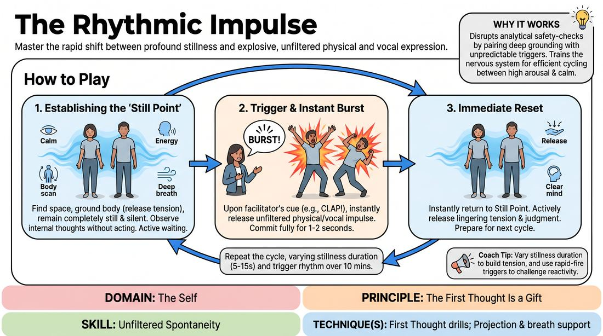

# 🎲 Drill A — isolation — Rhythmic Impulse

{ .infographic }

> Master the rapid shift between profound stillness and explosive, unfiltered physical and vocal expression.

`Players 2–99` · `~30 min` · `Complexity 2/5` · `Energy medium` · `Contact none` · `Props: none`

⬅️ [Back to the Week 02 run-sheet](../week-02.md)

## Why this activity, here

Week 2 opens the door on the first thought. This is the isolation drill: no scene, no partner, no content to manage — just the gap between impulse and action, shortened on purpose. It feeds every partner exercise later in the session, where students will need something to offer before they have decided whether it is good.

## What students actually learn

- That a first impulse already exists in the body before they have chosen one — they are not generating it, they are letting it out.
- That the pause between having an impulse and acting on it is where the editing happens, and that pause can be shortened.
- That an obvious, unremarkable burst is a complete offer, and nothing bad follows it.
- That they can return to neutral quickly instead of carrying the last thing they did into the next one.

## Setup

Clear floor, everyone able to stand with an arm's span around them. No chairs in the playing space. You need nothing but your hands and your voice. Check for anyone who needs a chair or who cannot stand for twenty minutes and place them at the edge with the same brief — bursts can be seated. Warn the room, and the class next door, that there will be sudden loud noise.

## How to run it — 30 minutes

| Min | What you do |
|---:|---|
| 3 | Spread the room out. Set the Still Point: feet, breath, jaw, shoulders. Explain the trigger and the two-second cap. Demonstrate one burst yourself — make it dull on purpose. |
| 4 | Six slow cycles. Ten to fifteen seconds of stillness, one clap, burst, snap back. Say nothing between cycles except the reset call. |
| 5 | Vary the rhythm. Mix long holds with short ones. Occasionally trigger after three seconds. Around fifteen cycles. Keep your own pace unpredictable. |
| 4 | Rapid fire. Claps four to six seconds apart, roughly thirty bursts. Tell them not to reset mentally, only physically — there is no time to review. |
| 4 | Constrain it. Sound only, no movement, for eight cycles. Then movement only, silent, for eight cycles. Note aloud how much harder one channel is. |
| 4 | Final run, mixed rhythm, no constraint. End on a long stillness — twenty seconds — then no trigger at all. Let them stand in it, then release. |
| 6 | Debrief standing in a loose circle. Two or three questions. Do not let it become a discussion of who was interesting. |

## Side-coaching script

| When | Say |
|---|---|
| During the first Still Points | *"Awake, not frozen. Let the breath move."* |
| Just before the first few triggers | *"It's already there. You're only letting it out."* |
| When bursts look designed or comic | *"Too late. That one was chosen. Take the earlier one."* |
| On the snap back | *"Drop it. No verdict."* |
| Entering rapid fire | *"No time to shop. Take what's on top."* |
| When someone shrinks or half-commits | *"Small is fine. Half is not. All the way, two seconds."* |
| During the sound-only round | *"Any noise counts. Groan, hum, syllable — it doesn't need a meaning."* |
| On the final long stillness | *"Nothing's coming. Stay anyway."* |

!!! success "What good looks like"
    Bursts land on the clap, not a half-second after it. Most are unremarkable — a grunt, a shrug, a lurch sideways — and nobody apologises for them. The room gets quieter between bursts rather than gigglier. By the rapid-fire round the delay has visibly shrunk and people stop looking at each other for permission. A few will surprise themselves with volume; that is the drill working.

## When it goes wrong

| You see | What's causing it | The fix |
|---|---|---|
| A visible beat of delay between your clap and the movement, and the movement is a bit clever. | They are auditioning the impulse before releasing it — choosing rather than letting. | Go to rapid fire early. Four-second gaps for a minute. Call: 'Take what's on top.' Cognitive load kills the editor faster than instruction does. |
| Bursts are tiny and identical — a small hand flick, every time, from half the room. | Self-consciousness. They have found one safe move and are hiding in it. | Run the sound-only round. Removing the body forces a new channel. Then call 'Small is fine, half is not' and accept small-but-committed. |
| Laughter after every burst, and people watching each other rather than being still. | The room has turned it into a performance with an audience. Common, and it dilutes the drill. | Stop. Have everyone face a wall or close their eyes at Still Point. Restate: nobody is watching, nothing is being judged. Resume. |
| One or two people barely moving at all across the whole drill, faces tight. | Genuine exposure. Standing alone doing something involuntary in front of others is a real ask for a new student. | Do not single them out. Side-coach the whole room: 'A breath out counts as a burst.' Lower the floor rather than raise the pressure. |

## Scaling

| Class size | What changes |
|---|---|
| **10–13** | One large scattered group. Everyone plays all thirty minutes. Roughly sixty-five cycles total. You can see every face, so pitch side-coaching to individuals without naming them. |
| **14–17** | Still one group, but tighten the spacing to a rough grid so you can walk between them. Keep the cycle count the same; move to a different corner each round so your clap comes from a new direction. |
| **18–20** | Split into two groups. Group A plays, Group B stands at the wall with eyes closed — not watching, resting. Swap every four minutes. Trim the constraint round to three minutes and the debrief to five. Sixteen cycles per group per turn. |

## Variations

**Seated Still Point** — Everyone sits in chairs in a scattered arrangement. Bursts are voice, face, arms and torso only.  
*Easier — removes the balance and stamina demand, and lowers the sense of being on display. Good for a nervy or mixed-mobility room.*

**No Repeats** — From the second half onward, tell them the burst must not be one they have already used in this drill.  
*Harder — strips the safe default move and pushes them past their first two or three habits into genuinely unfiltered territory.*

**Burst and Name** — After each burst, before returning to stillness, they say one word out loud that names nothing in particular. Any word.  
*Different emphasis — bridges pure impulse toward verbal offers, which is where the next block goes.*

## Debrief

1. **What happened in the half-second between the clap and your burst?**
   > *A good answer sounds like:* They describe a specific mechanism — 'I had something, then swapped it', 'by the fast round there was no gap' — rather than judging their performance. Move on once two or three people name the gap concretely.

2. **Were your fast bursts worse than your slow ones?**
   > *A good answer sounds like:* Reluctant agreement that they were about the same, or that the fast ones felt freer. If someone says the fast ones were better, let that sit — it makes the point for you.

3. **What did you throw away?**
   > *A good answer sounds like:* Honest admission of a rejected first impulse and why — too rude, too boring, too obvious. The word 'boring' arriving here is the point of the whole week.

!!! warning "Safety & inclusion"
    No contact in this drill. Spacing keeps that true — check the room before the first clap. Warn about sudden loud noise before you start; offer earplugs or a place near the door to anyone sound-sensitive, and let them use a raised hand as their trigger instead. Anyone who cannot stand plays seated with the same instructions. Tell the room that stepping out for a cycle is fine and needs no explanation. Bursts can be a single breath — there is no minimum size. Do not comment on any individual's burst, funny or otherwise, during the drill.

## Why it works

Unfiltered spontaneity is limited by the interval between impulse arriving and action starting. That interval is where the filter runs. The drill attacks it directly: stillness makes the impulse detectable, and the sudden trigger gives it nowhere to be reviewed. Varying the interval stops the body from pre-loading a planned response, and the rapid-fire section loads working memory until the editor has no capacity left to run. The immediate snap back to stillness prevents rehearsal of the last burst, so each trigger meets a genuinely fresh state. What students end up with is a felt sense that the first thought was already present and required no invention — which is exactly what the cue asserts.

[Open the full activity card »](../../../../games/D1_P4_S1_T2_G207__the-rhythmic-impulse.md){target=_blank rel=noopener}
