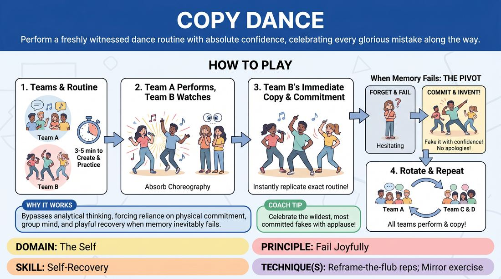

# 🎲 Drill B — under load — Instant Backup Dancers

{ .infographic }

> Perform a freshly witnessed dance routine with absolute confidence, celebrating every glorious mistake along the way.

`Players 10–99` · `~30 min` · `Complexity 2/5` · `Energy high` · `Contact none` · `Props: none`

⬅️ [Back to the Week 02 run-sheet](../week-02.md)

## Why this activity, here

Drill A this week worked one player at a time with time to breathe. This is the same instruction under load: no thinking time, a watching room, and a body that has to move before the brain has caught up. Being obvious is easy alone; it is hard in front of fifteen people while singing. This block feeds the scene work later in the session, where the cost of pausing to find a better idea is a dead scene.

## What students actually learn

- That an offer delivered with commitment reads as correct, even when it is wrong.
- That the gap between remembering and inventing is invisible to an audience — and to their own teammates, who just copy.
- That apologising for a mistake is a bigger interruption than the mistake.
- That they can generate movement without a plan, because their body is faster than their editor.

## Setup

Clear floor, enough room for four or five people to move side by side with arms out. Chairs in a loose arc facing the playing area, or the audience simply sits on the floor. No props. No music playback — teams sing their own song, so no speaker or phone is needed. Have a spare corner for anyone who wants to play seated. Know the running order before you start so no time is lost negotiating it.

## How to run it — 30 minutes

| Min | What you do |
|---:|---|
| 3 | Frame it. Say the cue: obvious, average, first thought. Explain the shadow rule and the invention rule. Demonstrate the invention rule yourself — do four seconds of nonsense, forget, invent a bigger move, keep grinning. Split into teams. |
| 5 | Teams build. Five minutes, on their feet, thirty seconds long. Circulate. Push anyone still debating song choice at minute two into a decision. Repeat: simple moves, big moves, everyone does the same thing. |
| 5 | Round one. Team A performs. Team B shadows immediately, no huddle. Applaud both. Do not give notes yet — just call the next pair up. |
| 5 | Round two. Next team performs its own routine; the following team shadows. Same rules. Side-coach the shadows while they are on their feet. |
| 5 | Round three. Continue the rotation. By now expect shadows to be inventing openly. Name it out loud when you see a clean invention that the team mirrors. |
| 3 | Final rotation, sped up. Cut the gap between performance and shadow to zero — call 'go' the instant the first team lands. If every team has already shadowed once, run one team's routine shadowed by the whole room. |
| 4 | Everyone stays standing in a loose circle. Debrief with the questions below. Keep it short and land on the cue before moving to the next block. |

## Side-coaching script

| When | Say |
|---|---|
| During the five-minute build, to any team still talking | *"On your feet. Try it, don't discuss it."* |
| As a shadow team hesitates at the edge before going up | *"Straight up. Now."* |
| First time a shadow visibly loses the move | *"Invent it. Bigger."* |
| When a shadow team fragments into four different guesses | *"Copy your neighbour. Anyone. Now."* |
| When someone mouths an apology or breaks character to laugh | *"No sorry. Keep singing."* |
| When energy drops in the second half of a shadow run | *"Full size. Finish it."* |
| Just before the sped-up final round | *"No gap. Land and go."* |
| On the last beat of the last routine | *"Hold the pose. Take the applause."* |

!!! success "What good looks like"
    Shadow teams get up fast and start moving before they are sure. Around ten seconds in, someone invents a move that was never in the original and three others copy it inside a beat — and the room laughs at the join, not at the person. Nobody says sorry. Performing teams watch their own routine come back mangled and enjoy it. The volume in the room goes up over the four rounds rather than down.

## When it goes wrong

| You see | What's causing it | The fix |
|---|---|---|
| Shadow teams huddle for ten seconds before going up, whispering the moves to each other. | They are treating it as a memory test they can pass with preparation. | Stop the huddle out loud: 'straight up, now.' Announce that from this round the shadow team must be moving within three seconds of the previous team stopping. |
| Teams spend four of their five build minutes arguing about which song. | Everyone is protecting the group from a bad choice — the exact editing this drill is meant to break. | Walk the room at minute two and take the decision for any team still stuck. Name the first song anyone said. Next session, hand out song titles on slips. |
| A shadow team freezes mid-routine and stops, looking at the audience. | They hit a blank and defaulted to honesty rather than invention. Usually one person stops and the rest follow. | Call 'invent it, bigger' immediately, before the freeze sets. If they have already stopped, restart them: 'from wherever you are, keep going, new move.' |
| Routines that are all singing and almost no movement. | Nervousness about being watched moving. Common in a Week 2 room. | During the build, give a floor: at least four distinct physical moves, each one repeated. Say the moves should be big enough to see from the back row. |

## Scaling

| Class size | What changes |
|---|---|
| **10–13** | Three teams. Rotation is A performs / B shadows, B performs / C shadows, C performs / A shadows — three rounds, five minutes each, then use the spare three minutes for one whole-room shadow of the best routine. |
| **14–17** | Four teams of four. Four rounds in a closed loop, roughly four minutes each. Trim the build to four minutes so all four rotations fit. Everyone is audience when not performing. |
| **18–20** | Four teams of five, or five teams of four. Run four rounds only and accept that with five teams one team shadows twice rather than performing twice. Cut the build to four minutes and keep applause short — call the next pair over it. |

## Variations

**Two moves and a chorus** — Cap the original routine at two repeated physical moves plus one sung line. Shadows copy that.  
*Easier — reduces the memory load so the drill is purely about commitment, useful in a nervous or very new room.*

**Chain shadow** — Team B shadows Team A, then Team C shadows Team B's version, then Team D shadows Team C. Nobody watches the original twice.  
*Harder — errors compound, so by the third pass almost everything is invention and the team has to own material nobody wrote.*

**Silent shadow** — The performing team sings; the shadow team performs the same choreography with no sound at all, just breath and movement.  
*Different emphasis — strips the crutch of the familiar lyric and puts the whole weight on physical commitment and group mirroring.*

## Debrief

1. **When you were shadowing, could you tell the moment you switched from remembering to inventing?**
   > *A good answer sounds like:* Someone says they could not tell, or that it happened earlier than they thought, or that the invented bit felt the same from the inside. Move on as soon as two people recognise this.

2. **Watching your own routine come back wrong — what did that feel like?**
   > *A good answer sounds like:* The performing teams say the wrong version was more fun to watch, or that they stopped caring about accuracy after ten seconds. If someone says they wanted to correct it, name that impulse and move on.

3. **What did it cost when somebody apologised or stopped?**
   > *A good answer sounds like:* They describe the energy dropping for the whole team, not just the person — that the apology was more visible than the error. That is the point of the block; land it and go.

!!! warning "Safety & inclusion"
    No contact is required at any point. Mirroring is done at a distance — say so explicitly before the build so nobody assumes hand-holding or lifts. If a team invents something involving touch, stop it and reset the move. Offer a seated option from the start, framed as a normal choice: sit at the front of the playing area and do the routine from the waist up. Anyone who does not want to sing can mouth or hum. Tell teams to keep moves low-impact — no jumping, no spinning, no floor work — both for joints and because it keeps the copying easy. Watch for a team pushing one reluctant member to the front; break that up quietly.

## Why it works

Unfiltered spontaneity fails under two pressures: time and observation. This drill applies both at once and then removes the thing the filter is protecting — accuracy. The shadow team cannot be correct, because a thirty-second routine seen once does not survive intact, so the only available move is to produce something and mean it. The teammates' obligation to copy instantly closes the loop: an invented move becomes the group's truth within a beat, which is direct physical evidence that a first thought delivered with commitment is treated as the gift rather than the mistake. The ban on apologising removes the last exit. What is left is the body moving ahead of the editor, repeated four times in half an hour.

[Open the full activity card »](../../../../games/D1_P2_S6_T2_G677__copy-dance.md){target=_blank rel=noopener}
