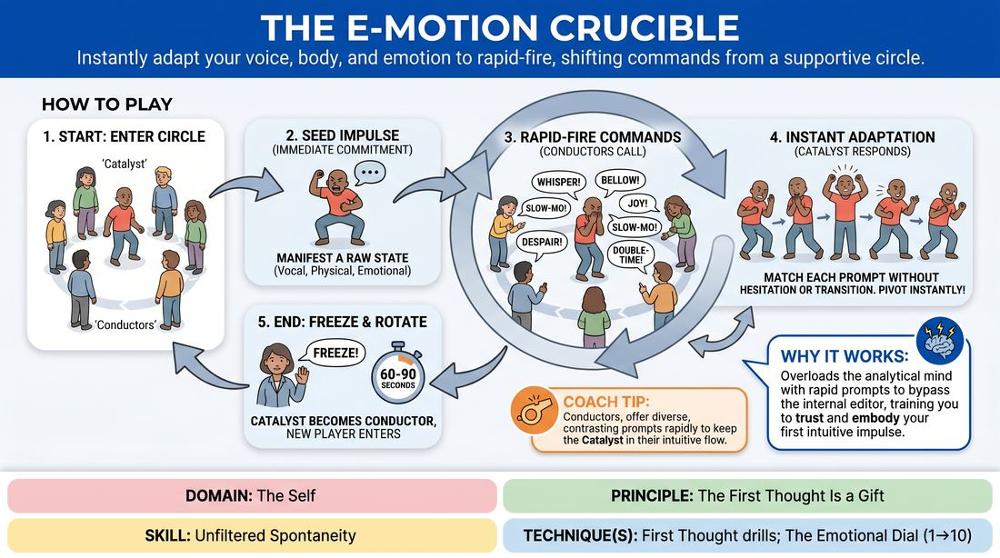

# 🎯 Scene Lab — The Impulse Crucible

{ .infographic }

> Instantly adapt your voice, body, and emotion to rapid-fire, shifting commands from a supportive circle.

`Players 3–99` · `~30 min` · `Complexity 2/5` · `Energy high` · `Contact none` · `Props: none`

⬅️ [Back to the Week 02 run-sheet](../week-02.md)

## Why this activity, here

Week 2 has already loosened the group with word games and first-thought naming. This is the first block where a single person stands alone in the middle and the first thought has to arrive in their body, not their mouth. It feeds the two-person scene work later in the session: by the time they play a scene, they have already discovered that a committed wrong choice reads better than a considered right one.

## What students actually learn

- That their body produces an offer faster than their brain can approve one, and the fast one is usually more watchable.
- That being looked at by fifteen people is survivable, and gets less frightening at about the forty-second mark.
- That dropping a choice completely is easier than blending out of it, and blending is what makes improv look hesitant.
- That the circle wants them to succeed — the commands are gifts, not tests.

## Setup

Clear a circle roughly four metres across, chairs pushed back. No props. You need a clear voice for 'Freeze' — or a hand clap if the room is loud. Have your own list of ten commands ready in case the circle goes quiet on the first Catalyst. Warn the group that this involves standing alone in the middle for about a minute, and that anyone can pass and stay a Conductor for the whole block.

## How to run it — 30 minutes

| Min | What you do |
|---:|---|
| 3 | Set the circle. Explain the two roles and the four command categories. Say the cue: be obvious, be average, first thought is the gift. Name the opt-out — pass is fine, no reason needed. |
| 3 | Demonstrate. You go in the middle as Catalyst. Take a seed impulse instantly, then invite the circle to fire commands at you for forty seconds. Be visibly unpolished. Freeze yourself. |
| 4 | Round one, slow. Three Catalysts, roughly seventy seconds each. Coach the Conductors more than the Catalyst — insist on single words, one voice at a time, no jokes-as-commands. |
| 8 | Round two, full speed. Rotate Catalysts every sixty to seventy-five seconds. Push command frequency up. Stop coaching Conductors on form; just keep the rhythm moving. |
| 7 | Round three. Continue rotating until everyone who wants a turn has had one. Add the rule that the Catalyst must keep speaking gibberish or nonsense throughout, so voice changes with the body. |
| 3 | Final round: two Catalysts in the middle together, sharing the same commands, sixty seconds each pair. Run two or three pairs depending on time left. |
| 2 | Debrief standing in the circle. Two questions only. Keep it short and get them into the next block warm. |

## Side-coaching script

| When | Say |
|---|---|
| The moment a Catalyst steps in and hesitates | *"Something now. Anything. Go."* |
| Conductors are calling over each other | *"One voice. Wait for the change, then call."* |
| Catalyst is easing between states | *"Drop it. Snap to the new one."* |
| Catalyst starts explaining or commenting on what they are doing | *"No words about it. Just be it."* |
| Commands have gone abstract or clever | *"Give them a plain one. Loud. Slow. Sad."* |
| Catalyst is playing small, shoulders in | *"Bigger than feels right. We can take it."* |
| Energy sags mid-block | *"Faster commands. Don't let them settle."* |
| Just before you call time on each turn | *"Ten seconds. Full commitment."* |

!!! success "What good looks like"
    The Catalyst changes before they have decided to. Their state flips within a beat of the word landing, and it looks slightly ugly — not a smooth actor's transition. Conductors call in a steady rhythm without piling on. The circle is laughing at the speed, not at the person. Nobody in the middle is apologising, and people are volunteering for the next turn rather than being pushed.

## When it goes wrong

| You see | What's causing it | The fix |
|---|---|---|
| The Catalyst pauses for a second after each command, then produces a neat version of it. | They are checking whether their choice is good before showing it. Standard week-two self-editing. | Speed the commands up until there is no room to check. Call 'drop it, snap' every time you see the pause. Praise the ugly changes out loud. |
| Conductors go silent and the Catalyst is left standing in one state. | The circle is worried about being wrong or about being unkind. Common with a group that hasn't warmed up much. | Feed three commands yourself in quick succession to reset the rhythm, then step back. Remind them a boring command is a good command. |
| Commands become punchlines — 'be a walrus', 'do a Scottish accent'. | The Conductors have started performing for each other instead of serving the middle. | Stop the round. Restate the four categories. Run thirty seconds where only volume and tempo words are allowed. |
| One or two people never volunteer to go in. | Genuine exposure fear, not resistance. Being watched alone is the hardest thing in the room. | Do not name them. Offer the paired variation for the last round so they can go in with someone. If they still pass, leave it — Conducting is real participation. |

## Scaling

| Class size | What changes |
|---|---|
| **10–13** | One circle. Everyone gets a turn as Catalyst with time to spare — run turns at eighty seconds. Add a second turn for anyone who wants one in the final block. |
| **14–17** | One circle still works, but tighten Catalyst turns to sixty seconds and keep rotation brisk. Expect two or three people to pass; that is fine and leaves time. Skip the paired round if you are behind. |
| **18–20** | Split into two circles of nine or ten in separate corners after your demonstration. Run them simultaneously, sixty-second turns. Move between circles and call 'Freeze' for both at the same time so the rhythm stays shared. Drop the paired round. |

## Variations

**Two categories only** — Restrict Conductors to volume and tempo. No emotion, no physicality. Commands become loud, quiet, fast, slow and nothing else.  
*Easier. Removes the interpretation step entirely — the Catalyst has nothing to decide, only to obey.*

**Sustained line** — The Catalyst repeats one plain sentence — 'I left the keys on the table' — for their whole turn, and the commands change how it is said and embodied.  
*Harder. Fixed text means every change has to live in body and voice, with no escape into new material.*

**Paired Catalysts** — Two people in the middle, same commands, both must comply while staying aware of each other. No dialogue, just shared state.  
*Different emphasis. Shifts from solo commitment to matching a partner's energy — the bridge to scene work.*

## Debrief

1. **What happened in your body when a command arrived faster than you could think?**
   > *A good answer sounds like:* Someone describes doing it before understanding it, and noticing the result was fine or better than their planned version. Move on as soon as one person says this plainly.

2. **Was there a command you refused or softened, and what were you protecting?**
   > *A good answer sounds like:* An honest naming — looking stupid, being loud, being sad in front of strangers. You want recognition, not resolution. Don't chase it further.

3. **As a Conductor, what made a good command?**
   > *A good answer sounds like:* Short, plain, unclever. Someone notices the boring words got the strongest work, and the funny ones got the weakest.

!!! warning "Safety & inclusion"
    No physical contact in this activity. Nobody touches the Catalyst; commands are verbal only. Say this out loud before the first round. Passing is available at every rotation and needs no explanation — offer it once at the start and once mid-block, without singling anyone out. Anyone who prefers to Conduct for the whole thirty minutes is taking part fully. Watch for knees and backs: tell the group that 'heavy', 'collapse' or 'weightless' can be played standing, and that nobody needs to go to the floor. Keep the volume commands within reason if you have a shared wall. If someone finds an emotion command genuinely upsetting rather than playful, call 'Freeze' early, rotate, and check in with them at the break rather than in front of the circle.

## Why it works

D1.S1 is about removing the gap between impulse and expression. The gap is where self-editing lives, and self-editing is what makes new improvisers look tentative. This activity attacks the gap directly with time pressure: a command every three seconds is faster than the deliberative loop can run, so the body answers instead of the judgement. The circle format matters too — the commands come from peers rather than from you, which means the Catalyst experiences the group as a source of material rather than an audience of assessors. And because commands conflict and overlap, there is no coherent thing to get right, which removes the standard of correctness that the anxious brain is measuring against. What is left is obedience to the immediate. That is the cue in physical form: obvious, average, first.

[Open the full activity card »](../../../../games/D1_P4_S1_T2_G210__the-e-motion-crucible.md){target=_blank rel=noopener}
