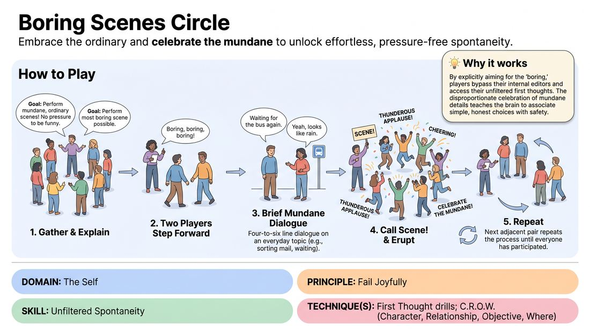

# 🏟️ Showcase round — Boring Scene Celebration

{ .infographic }

> Embrace the ordinary and celebrate the mundane to unlock effortless, pressure-free spontaneity.

`Players 4–99` · `~25 min` · `Complexity 2/5` · `Energy medium` · `Contact none` · `Props: none`

⬅️ [Back to the Week 02 run-sheet](../week-02.md)

## Why this activity, here

Week 2 has spent the session prising students off their editing habit — first-word games, association drills, anything that punishes the pause before speaking. This is the showcase: the first time they stand out and are watched. It removes the last excuse by removing quality from the equation entirely. It feeds the following weeks, where scenes get longer and the same permission has to hold under more pressure.

## What students actually learn

- That being watched is survivable when nothing clever is required of them.
- That the ordinary thing they thought of first is playable, and other people are happy to receive it.
- That applause can be a fact of the room rather than a verdict on their performance.
- That a scene can end without a punchline and still be complete.

## Setup

Chairs pushed to the walls. Clear floor for a circle of up to twenty. No props, no music, no slips of paper. Have five or six mundane topics ready in your head to hand out if a pair stalls: the bus is late, the printer, queueing at the pharmacy, defrosting something, a slow lift. Know how you will make the applause loud — you will need to model it yourself the first two or three times.

## How to run it — 25 minutes

| Min | What you do |
|---:|---|
| 3 | Circle up. Frame the rule: dullest scene wins, four to six lines, then everyone cheers like it was a triumph. Play one yourself with a volunteer about waiting for a kettle. |
| 5 | First pass. Take three or four pairs. Chant before each, call "Scene" early, drive the applause hard yourself. Correct any attempt at a joke on the spot, lightly. |
| 6 | Continue round the circle. Stop coaching content. Only manage the chant, the cut and the ovation. Let the scenes get flatter and the cheering get sillier. |
| 6 | Finish the circle so everyone has played once. If you reach the end early, start a second lap with new neighbour pairings. |
| 2 | Speed lap. Two lines only per pair, cut fast, three seconds of applause. Go all the way round without stopping. |
| 3 | Sit or stay standing. Run the debrief questions. Close on the cue line. |

## Side-coaching script

| When | Say |
|---|---|
| As a pair steps in | *"Boring, boring, boring!"* |
| First line is delayed | *"Say the flat thing. Anything flat."* |
| A player reaches for a gag | *"Duller. Go duller."* |
| A pair starts inventing drama or a twist | *"No crisis. Just the queue."* |
| At the first natural pause | *"Scene!"* |
| Applause starts weak | *"Bigger. They earned it."* |
| Mid-way through the circle | *"First thought. Don't shop around."* |
| During the speed lap | *"Two lines. Cut. Cheer. Next."* |

!!! success "What good looks like"
    Scenes are genuinely dull and land in under twenty seconds. Nobody pauses to think before their first line. The applause is disproportionate and everybody joins in without being asked. Players step back into the circle grinning rather than apologising. By the second half the room is cheering the flattest lines the loudest.

## When it goes wrong

| You see | What's causing it | The fix |
|---|---|---|
| Every pair produces a witty scene with a clear joke ending. | They have heard "boring" as an ironic instruction and are competing to be funniest at being dull. | Stop the game for ten seconds. Say the rule again literally: no punchline, no ending, I cut you mid-thought. Cut the next three pairs deliberately early. |
| Thin, polite clapping that dies after two seconds. | You are not leading it, and the group treats applause as an assessment they have to mean. | Whoop first, loudly, every single time, and hold it. Tell them the ovation is a rule, not an opinion. It usually takes three pairs before they commit. |
| A pair freezes and the silence stretches past ten seconds. | Nerves at being the pair on show, plus no topic to hold onto. | Feed a topic out loud immediately — "the bus is late" — and if it is still stuck, call "Scene" and cheer anyway. Never let a frozen pair stand there. |
| Energy sags in the last third; people check their phones. | Twenty pairs of the same shape with no escalation. | Move to the speed lap sooner. Halving the scene length and keeping the applause resets the room. |

## Scaling

| Class size | What changes |
|---|---|
| **10–13** | One circle. Everyone plays once in about six pairs, then run a full second lap with shifted pairings — step one person round so neighbours change. Add a minute to the final lap. |
| **14–17** | One circle. One full lap only, seven to eight pairs. Cut scenes at four lines rather than six to protect the timing. Keep the speed lap. |
| **18–20** | Split into two circles of nine or ten in opposite corners. Run the first lap yourself in circle A while a confident student runs circle B on the same rules; swap and watch the other after five minutes. Bring both circles into one ring for the speed lap so everyone hears the whole room cheer. |

## Variations

**Sitting narration** — Pairs stay seated in the circle and simply describe the boring thing to each other rather than acting it out.  
*Easier — removes the physical exposure of stepping forward for a very nervous group.*

**Handed topic** — You call a topic aloud a half-second before the pair starts, and it must be their first line.  
*Harder — no time to prepare an opener, so the first thought is the only thought available.*

**Boring chorus** — After the ovation, the whole circle repeats the pair's dullest line back in unison, then cheers again.  
*Different emphasis — shifts attention onto listening and onto valuing someone else's offer out loud.*

## Debrief

1. **What happened to the pause before you spoke?**
   > *A good answer sounds like:* Someone notices it shrank, or vanished, and links that to having nothing to be judged on. Not a general "it was fun" — a specific report about the moment before the first line.

2. **Which scene do you actually remember?**
   > *A good answer sounds like:* People name a very flat one — the printer, the kettle — and someone says it was more watchable than they expected. That is the point landing; move on.

3. **What did the applause do to you?**
   > *A good answer sounds like:* Honest split. Some say it felt undeserved at first and then stopped mattering. Some say it made stepping in easier. Either is fine; avoid letting it become a discussion about whether praise is earned.

!!! warning "Safety & inclusion"
    No contact of any kind. Anyone can pass on playing and stay in the circle as an applauder — say this at the start, once, without ceremony, and take passes without comment. Standing the whole 25 minutes is optional; put two chairs in the ring for anyone who wants them and let seated players perform seated. The cheering gets loud; tell the room in advance and let anyone sensitive to noise stand near the door or step out for a lap. Keep topics domestic and neutral — steer away from anything to do with illness, money worries or work stress, which stop being boring fast for the person living them.

## Why it works

[Open the full activity card »](../../../../games/D1_P2_S1_T2_G647__boring-scenes-circle.md){target=_blank rel=noopener}
