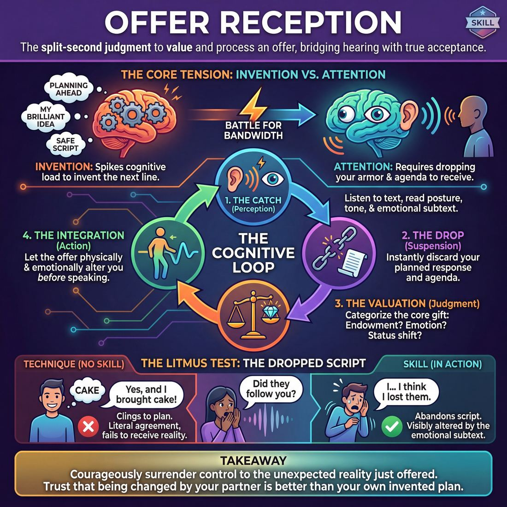

# Week 03 — Yes, And — Receiving the Offer

> *Improvising is mostly receiving — you take what you are handed as true, then add one thing of your own.*

| Course | Week | Domain | Focus | Stage | Length | Class |
|---|---|---|---|---|---|---|
| Foundations — The Brave Beginner | 3/8 | D2 | `D2.S4` — Offer Reception | Novice → Advanced Beginner | 180 min | 10–20 |

!!! note "Builds on"
    Week 2 got them offering without hesitation; this week turns that supply around so the offer lands on someone.

## 🎬 The arc of this session

They arrive able to generate material — Week 2 made them fast at producing offers, and most of them are still in love with their own ideas. The session turns the supply around: every drill forces attention off their own next line and onto what has just been handed to them, with a strict cap of one addition. They leave able to accept a partner's reality and build on it in low-pressure drills, and able to hear the difference between a scene and two monologues sharing a stage.

!!! tip "Watch for"
    The correction reflex. In Week 3 the most confident people in the room start their line with "no, actually" or "well, sort of" and dress it up as building. Name it the first time you hear it, then keep counting.

## ⏱️ Session flow (180 minutes)

| Time | Block | Activity |
|---|---|---|
| **0:00–0:05** | 🧊 Ice-breaker | *Small Hills to Die On* |
| **0:05–0:10** | 😄 Laughter Blast | *Boil Over* |
| **0:10–0:25** | 🔥 Warm-up cluster | *Catch, Copy, Plus One*, *One Thing Back*, *Three Beats, Then One Thing* |
| **0:25–0:45** | 🧠 Theory | — |
| **0:45–1:15** | 🎲 Drill A — isolation | *The Resonance Object* |
| **1:15–1:25** | ☕ Break | — |
| **1:25–1:55** | 🎲 Drill B — under load | *Resonant Echo* |
| **1:55–2:25** | 🎯 Scene Lab | *The Brilliant Solution Loop* |
| **2:25–2:50** | 🏟️ Showcase round | *Co-Architects of the Unseen* |
| **2:50–3:00** | 💭 Reflection & homework | — |

## 🎒 Before you start

- Clear the floor for one full circle of chairs plus space for pairs to stand and move. Stack spare chairs at the wall.
- Props: one soft ball or beanbag for the warm-up cluster, one neutral object for The Resonance Object (a scarf, a mug, a wooden block — nothing with an obvious single use), a timer with an audible bell, and a whiteboard or flip pad.
- Write the cue on the board before anyone arrives: "Accept the reality, then add exactly one thing." Leave it up all session.
- Scaling plan, decided now so you are not counting heads mid-block. 10-13: one circle throughout, pairs for all drills, 5 showcase pairs. 14-17: split into two circles for the warm-up cluster and Drill A, rejoin for Scene Lab, 7 showcase pairs with the rest seated. 18-20: three circles for the warm-up cluster, two rooms-within-the-room for Drill A and B (you rotate, appoint a timekeeper in the group you are not with), and run Showcase as two concurrent circles of 9-10 for the first 12 minutes, then one merged circle for a final three pairs.
- Review Week 2 homework for two minutes at the top of the ice-breaker: ask who caught themselves hesitating and what they did. Do not let it run long.
- Consent step for the warm-up cluster: some copying work brings people close and hands may meet on the ball hand-off. Say aloud that touch is optional, that anyone can mirror at a distance instead, and that no reason is needed. Offer a visible opt-out — step to the outside of the circle and clap the rhythm instead.

## 1. 🧊 Ice-breaker (5 min)

*"Circle up standing. I'll name a thing, you say overrated or underrated and one reason. No debating anyone. Go with your first instinct."*

**Why here:** Overrated, Underrated gets opinions in the air with no obligation to be right, which is exactly the low-stakes offering they need before anyone has to receive one.

### Small Hills to Die On

> Everyone declares one trivial strong opinion and the room votes with thumbs, so personalities land before anyone has to perform.

`Players 10–20` · `~5 min` · `Complexity 1/5` · `Energy medium` · `Contact none` · `Props: none`

**How to play**

1. Stand the room in a circle. Say a small hill is a trivial opinion you genuinely hold. Give two of your own, fast: cold toast is fine; bananas are breakfast, not snacks.
2. Tell everyone to turn to the person on their left. If the number is odd, make one group of three.
3. Say go. Both partners talk at the same time, swapping small hills. Call the swap at thirty seconds. Expect the volume to climb; leave it alone.
4. Bring them back to the circle. Go clockwise. Each person states one small hill in one sentence, about seven seconds. No explaining, no defending, no backing down.
5. After each hill, the room votes instantly: thumb up for agree, thumb down for disagree. Keep the ring moving. Do not stop for laughs.
6. Close by naming three opinions you heard and who said them. Then move straight into the next block without comment.

📄 **[Full teaching notes »](week-03/beginner_w03__b1_1.md)**

**Side-coach:** *“"First answer. Don't audition it."”*

## 2. 😄 Laughter Blast (5 min)

*"Stay in the circle. We're going to make some noise now so we don't spend the next hour whispering."*

**Why here:** Boil Over puts breath and volume in the body and breaks the polite Saturday-morning voice before the drills need commitment.

### Boil Over

> The whole room becomes a kettle: low hum, rising whistle, then a full-body laugh that spills everywhere at once.

`Players 10–20` · `~5 min` · `Complexity 1/5` · `Energy high` · `Contact none` · `Props: none`

**How to play**

1. Circle everyone up, arms' length apart. Tell them the whole room is one kettle and nobody watches from outside.
2. Demonstrate a full kettle alone at full volume: crouch, low hum, rise slowly, whistle high, then laugh out loud. Go bigger than feels comfortable.
3. Run round one together. Crouch, low hum, rise over ten slow counts as the pitch climbs. Call 'BOIL' — arms up, everyone laughs for ten seconds.
4. Run round two at double speed. Five counts up, boil, laugh ten seconds. Keep your own laugh loudest so nobody stops early.
5. Run round three faster. Three counts, boil, laugh, then drop straight back into the crouch with no pause.
6. Call a chaos round. Everyone boils at their own speed, as often as they like, no counting, kettles firing around the room.
7. Call one last crouch and silence. Rise over ten slow counts, then one synchronised boil and laugh together.
8. Hands down. Breathe. Ask one debrief question, take two answers, move straight on.

📄 **[Full teaching notes »](week-03/beginner_w03__b2_1.md)**

**Side-coach:** *“"Let it go past where it's comfortable — nobody's listening for quality."”*

## 3. 🔥 Warm-up cluster (15 min)

*"Same circle. Four short things, back to back. Each one adds a rule. Copying comes first — get it exactly right before you add anything."*

**Why here:** The four warm-ups run a ladder from pure copying to copy-plus-one, which is the physical version of today's cue before anyone has to do it with words.

### Catch, Copy, Plus One

> A shape and sound flies across the circle; the catcher copies it exactly, adds one thing, and throws it on.

`Players 10–20` · `~5 min` · `Complexity 2/5` · `Energy high` · `Contact none` · `Props: none`

**How to play**

1. Stand everyone in one circle, arms' length apart. Say the shape travels with a sound attached, and the catcher's first job is to copy it, not to invent.
2. Demo one throw with a volunteer: make a big shape and sound, send it across the circle, have them copy it back to you whole.
3. Run a copy-only round. Throw one shape and sound to someone opposite. They copy it exactly and throw the same thing on. Keep the pace fast.
4. Add the rule: copy exactly, then add exactly one thing — a stamp, a lean, a second sound. Nothing more than one.
5. Call 'fresh' after roughly four additions and start a brand new shape from wherever you like.
6. Introduce a second shape so two travel at once. Each catcher copies and adds on their own beat, not in sync with the other.
7. Call 'fresh' every twenty seconds during the two-shape round so nothing grows too heavy to carry.
8. Freeze the last shape. Have the whole circle perform it in unison three times, bigger each time. Drop arms, breathe out, move on.

📄 **[Full teaching notes »](week-03/beginner_w03__b3_1.md)**

### One Thing Back

> Two facing lines hand each other a small fiction and get back exactly one added detail, then shuffle along for a new partner.

`Players 10–20` · `~5 min` · `Complexity 2/5` · `Energy medium` · `Contact none` · `Props: none`

**How to play**

1. Split the room into two equal lines facing each other, arm's length apart. Everyone has one partner directly opposite. Odd number: you take the spare spot yourself.
2. Tell them the rule: you hand your partner a small fiction about them, they take it as true and add exactly one detail. Then stop.
3. Ban endowments about real bodies, real jobs, real relationships and anything anyone has actually told the room. Invent circumstance, not commentary.
4. Demo with whoever is opposite you. Say "You've just come in soaking wet." They reply "Yes, and I left my shoes in your car." Cut it there.
5. Run round one: Line A endows, Line B accepts and adds one thing. Call "swap" halfway so Line B endows and Line A adds.
6. Shuffle: Line B steps one place right; the person off the end runs to the far end. New partner, new fiction, both directions again.
7. Run two more shuffles the same way. One exchange each direction, then move. Keep it brisk — do not let pairs start a scene.
8. Stop the lines on a clap and move straight into the next activity without discussion.

📄 **[Full teaching notes »](week-03/beginner_w03__b3_2.md)**

### Three Beats, Then One Thing

> Seated and quiet, the room builds one place together — each speaker repeats the line they were handed word for word, waits three beats, then adds exactly one detail.

`Players 10–20` · `~5 min` · `Complexity 2/5` · `Energy low` · `Contact none` · `Props: none`

**How to play**

1. Sit the room in a circle, chairs facing in. Say the place out loud: a bus station at 5am. Tell them anyone may speak, one at a time, no set order.
2. Demo with one volunteer. Say a short line about the place. Have them repeat your line word for word, sit through three silent beats, then add one sentence of their own.
3. Name the shape plainly: repeat exactly, wait three beats, add exactly one detail. Not two details. Not a correction.
4. Run the first round at indoor volume. Stop after roughly ten offers, or sooner if the place already feels solid.
5. Reset. Ask the room for a new place in three words or fewer. Take the first one offered.
6. Restate the rule before the second round: repeat exactly, wait, add one thing only.
7. Run the second round with one change — nobody speaks twice until everyone who wants a turn has had one.
8. Keep the whole thing seated and quiet. No standing, no acting it out, no jokes required.

📄 **[Full teaching notes »](week-03/beginner_w03__b3_3.md)**

**Side-coach:** *“"Copy it faithfully first. The addition is the last thing you do, not the first."”*

## 4. 🧠 Theory — Offer Reception (20 min)

{ .infographic }

- **The big idea:** Improvising is mostly receiving. The offer is already on the table; your job is to treat it as true and add one thing, not to improve it, correct it, or explain it.
- **Where you are on the path:** Advanced Beginner. In the room this looks like people who can accept when reminded, and who add far too much when they do. Expect accepted offers followed by three sentences of backstory. That is progress, not failure — cap the size, do not scold the enthusiasm.
- **The one cue to coach:** *“Accept the reality, then add exactly one thing.”*

**The three beats**

1. **Say it.** Two minutes. "Last week you learned to produce. Producing is not scening. If we both produce, we get two people talking near each other. This week you take what you are handed as true — no correcting, no topping, no explaining — and you add exactly one thing. One fact, one feeling, one detail. Then you stop and let them have it back."
2. **Show it.** Sixty seconds, with a volunteer. Ask them to say any line. Respond three ways out loud and label each: the correction ("it's not a lake, it's a reservoir"), the paragraph (accept, then bury them in six new facts), the one thing (accept, add a single detail, stop). Ask the room which one left the volunteer something to do. Do not discuss — move.
3. **Try it.** Five minutes, standing pairs, no scene. A says a plain statement of fact. B says "yes, and" plus one addition, then stops with hands down. Swap. Three exchanges each, then a rule change: drop the words "yes, and" and keep the behaviour. Call "one thing" every time you hear a second sentence.

!!! warning "The misunderstanding that always comes up"
    They hear "yes, and" as "never say no", and go compliant — agreeing to everything with no point of view. Correct it directly: your character can refuse, argue, or be furious. What you cannot do is deny the reality your partner built. Refusing to get in the car is fine; pretending there is no car is not.

!!! abstract "📖 Go deeper"
    Read the full write-up: [Offer Reception](../../../theory/02_the-partner/02_S4__offer-reception.md)

## 5. 🎲 Drill A — isolation (30 min)

*"Sit or stand around this object. One at a time you'll give it a truth. Whatever the person before you established stays true. Add one thing."*

**Why here:** The Resonance Object isolates reception with a single fixed thing in the middle, so the only variable is whether they build on the last person's reality or start their own.

### The Resonance Object

> Build a rich, physical reality by silently embodying your partner's sensory gifts before adding your own.

`Players 2–99` · `~30 min` · `Complexity 2/5` · `Energy medium` · `Contact none` · `Props: none`

**How to play**

1. Put the room in pairs, standing, facing each other with a metre of empty space between them. Label one person A, the other B.
2. Name a plain object into the gap between them — a mug, a stone, a key. Everyone works with the same object.
3. Tell A to speak one specific sensory or emotional detail about it: temperature, weight, texture, sound, or the feeling it gives off. One detail only.
4. Tell B not to speak yet. B takes the detail into the body first — breath, face, posture, hands — until the change is visible from across the room.
5. Once B's physical reaction has landed, B speaks one new detail that sits alongside A's, not one that cancels it.
6. Now A receives in silence and in the body, then gifts the next detail. Keep the loop alternating: receive physically, then add exactly one thing.
7. Let the object accumulate. Nothing already given can be contradicted, erased or explained away.
8. Call freeze after three to five minutes, while the object still feels solid. Have pairs stand still for five seconds before you release them.

📄 **[Full teaching notes »](week-03/beginner_w03__b5_1.md)**

**Side-coach:** *“"Say back what they gave you, then add. If you can't say it back, you weren't listening."”*

## ☕ Break — 10 minutes

Water, notes, informal talk. Non-negotiable at three hours — do not let it collapse into a working discussion.

## 6. 🎲 Drill B — under load (30 min)

*"Same skill, faster, and now you have to prove you heard it. Pairs. I'll call the swaps."*

**Why here:** Resonant Echo raises the load by making the echo explicit and timed, so accepting has to happen at speed rather than after a thoughtful pause.

### Resonant Echo

> Build deep partner connection and emotional subtext through precise verbal mirroring and micro-gifting.

`Players 2–99` · `~30 min` · `Complexity 2/5` · `Energy low` · `Contact none` · `Props: none`

**How to play**

1. Pair everyone up. A and B stand facing each other, feet grounded, shoulders loose, eye contact steady but soft. No touching at any point in this drill.
2. Brief the observation rule: A names one plain, visible fact about B. Clothing, posture, stance. Nothing about body shape, age, race, or attractiveness.
3. Tell A to make the observation flatly. "You are holding your left hand still." No tone, no joke, no story.
4. Tell B to repeat A's whole sentence word for word, copying A's volume, pace, inflection and posture. Mirror it, do not comment on it.
5. Tell B to add one to three words that gift A a feeling, a status or a quality. "...and you feel certain."
6. Tell A to repeat B's full expanded sentence verbatim, taking on the vocal and physical colour of the gift, then add their own one to three words.
7. Keep the cycle going. Every turn is the whole sentence back, then a tiny addition. No new topics, no plot, no jokes, no questions.
8. Call "freeze" when the round ends. Pairs drop hands to sides, break eye contact, shake out before the next round.

📄 **[Full teaching notes »](week-03/beginner_w03__b7_1.md)**

**Side-coach:** *“"Don't improve it. Take it as given and add one."”*

## 7. 🎯 Scene Lab (30 min)

*"Two chairs out. Short scenes now. Same rule as the drills — the first reality wins, and you add one thing at a time."*

**Why here:** The Brilliant Solution Loop is where the correction reflex shows up under scene pressure, because both players have an idea about how to fix the problem and only one of those ideas is on the table.

### The Brilliant Solution Loop

> Make your partner look like an absolute genius by enthusiastically justifying their wildest solutions.

`Players 2–99` · `~30 min` · `Complexity 2/5` · `Energy high` · `Contact none` · `Props: none`

**How to play**

1. Put everyone in pairs, standing, facing each other. Name one A and one B. Tell them nobody has to be funny — only quick and willing.
2. Have A state a plain, concrete problem in one sentence. A leaky boat, a lost passport, a fried navigation system. Keep it small and clear.
3. Have B answer instantly with an absurd solution and no explanation of how it works. Speed beats quality. B never justifies their own idea.
4. Tell A to accept out loud first — "Yes! Brilliant!" — then supply the reasoning that makes B's idea make sense. A does the justifying, always.
5. Have A immediately name a new problem caused by that solution. Not a random problem — a direct side effect of the thing that just worked.
6. Flip the roles on the spot. B now solves nothing; B accepts, justifies and spins off. The loop continues without anyone stopping to think.
7. Run each loop two to three minutes without breaks. If a pair stalls, tell them to say anything and keep going rather than fix the last line.

📄 **[Full teaching notes »](week-03/beginner_w03__b8_1.md)**

**Side-coach:** *“"Their solution is the good one. Build on it."”*

## 8. 🏟️ Showcase round (25 min)

*"Chairs into a circle, pairs into the middle. Everyone else watches and says nothing afterwards — no notes, no fixing. Just watch."*

**Why here:** Co-Architects of the Unseen puts a pair inside a watching circle so acceptance has to hold with eyes on it, and the watchers get to hear the difference between building and monologuing.

### Co-Architects of the Unseen

> Build intricate, invisible worlds together, one precise verbal brick at a time, sitting back-to-back.

`Players 2–99` · `~25 min` · `Complexity 2/5` · `Energy low` · `Contact none` · `Props: none`

**How to play**

1. Pair everyone off. Sit each pair back-to-back on the floor or on chairs, shoulders roughly touching, so neither can read the other's face.
2. Give the whole room one specific build prompt. A machine, a building, a small society. Say it twice so nobody has to ask.
3. Tell A to open with one concrete detail: a texture, a smell, a sound, a moving part. One fact, one sentence.
4. Tell B to accept that fact as true and add exactly one new detail that connects to what A just said. Then alternate.
5. Rule the room: no negating, no rewriting what's been said, no taking three turns in a row. Every line hooks onto the last line.
6. Ban vague words. No 'interesting', 'weird', 'amazing'. Ask for scale, material, temperature, mechanism, price, smell.
7. Let it run several minutes so the thing grows a history and an internal logic. Side-coach rather than stopping.
8. Call freeze. Each pair gives the room one sentence describing what they built. No explaining, no apologising.

📄 **[Full teaching notes »](week-03/beginner_w03__b9_1.md)**

**Side-coach:** *“"Slow down. Let their thing land before you put yours on top."”*

## 9. 💭 Reflection & homework (10 min)

**Deepen your improv**
1. When did you know you had stopped listening and started waiting for your turn — what was the tell?
2. Which was harder today: accepting something you thought was wrong, or keeping your addition down to one thing?

**Beyond the stage**
3. Think of one conversation this week where you corrected someone instead of building on what they said. What would one thing added instead have opened up?

➡️ **[This week's homework](../homework/HW-BEGW03.md)**

??? note "🎓 Facilitator notes"

    **Timing risks**
    - The warm-up cluster is four activities in 15 minutes. That is roughly three and a half minutes each with no discussion. Cut Three Beats, Then One Thing before you cut Copy — the copying rung is the one the whole session rests on.
    - Showcase at 18-20 will not fit as one circle. Run two circles concurrently for 12 minutes, merge for a final three pairs, and accept that not everyone performs in front of everyone.

    **Failure modes this week**
    - Compliant mush. Everyone agrees pleasantly and nothing happens. Fix by insisting the addition be specific — a name, a number, a smell — rather than an emotion word.
    - The paragraph. They accept, then deliver a full backstory. Count their sentences out loud until they hear it.
    - The polite "no" in disguise: "yes, and actually...", "kind of, but...". Catch the first one, name it, and stop catching them after that or you become the only voice in the room.
    - Scene Lab collapsing into problem-solving talk, with two people standing still discussing a plan. Push them to do the solution physically rather than describe it.

    **What good looks like by the end:** By the end, scenes have one shared reality instead of two competing ones. Players can say back what their partner just gave them. Additions are short and concrete, and most people stop talking after one. Watchers in the showcase circle can point to the exact moment a scene started building.

    **Carry into next week:** They can receive in low-pressure drills. Next week the pressure goes up: what to do when the offer they receive is vague, contradictory, or frightening — and how to add one thing when the one thing costs something.
