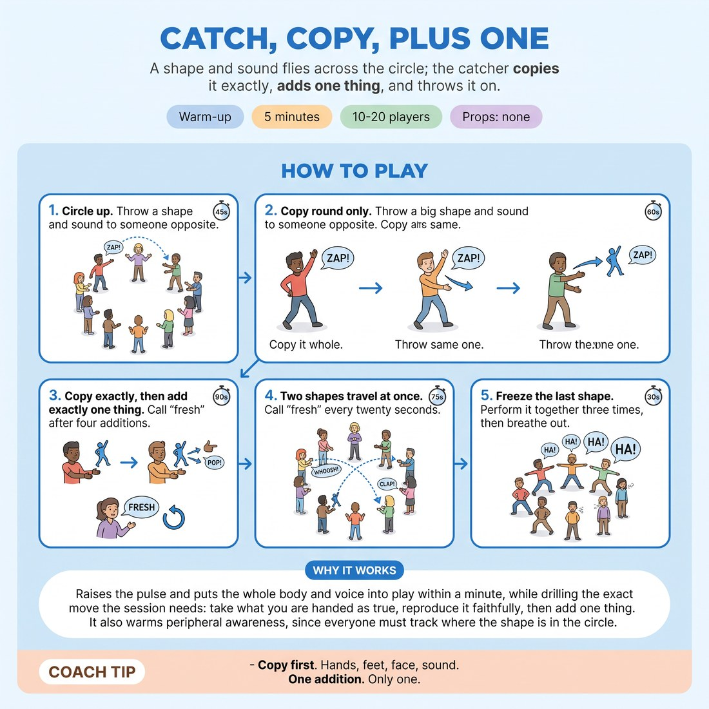

# 🔥 Warm-up cluster — Catch, Copy, Plus One

{ .infographic }

> A shape and sound flies across the circle; the catcher copies it exactly, adds one thing, and throws it on.

`Players 10–20` · `~5 min` · `Complexity 2/5` · `Energy high` · `Contact none` · `Props: none`

⬅️ [Back to the Week 03 run-sheet](../week-03.md)

## Why this activity, here

First thing in the room on Yes, And week. It comes after arrival chat and before any scene work. It puts the week's cue into the body before anyone has to speak in a scene: receive first, then contribute. Everything later in the session — the verbal Yes And ladders, the two-person scenes — leans on the physical habit built here.

## What students actually learn

- That copying someone accurately feels like generosity, not like having no ideas of your own.
- That one addition is enough, and that they can stop after it.
- That they can receive something before they know what to do with it.
- That the group's material builds without anyone steering it.

## Setup

Clear floor space for a circle of 10-20 with room to move arms fully. No chairs in the ring. Nothing to hold. Check the ceiling height if anyone is likely to throw a shape upward. Know how you will call 'fresh' — voice carries better than a clap here.

## How to run it — 5 minutes

| Min | What you do |
|---:|---|
| 1 | Circle up. Explain in two sentences: a shape plus a sound crosses the circle, and the catcher copies it before doing anything else. Demo one throw with a volunteer, then have them throw it back to you. |
| 1 | Copy round only, no additions. Send a big shape and sound to someone opposite. They copy it whole and pass the identical thing on. Keep it moving — if it slows, call 'faster' and send a second one in. |
| 2 | Add the rule: copy exactly, then add exactly one thing — a stamp, a lean, a second sound. After around four additions call 'fresh' and start a new shape yourself. Run several fresh cycles. |
| 1 | Two shapes travel at once, each catcher copying and adding on their own beat. Call 'fresh' every twenty seconds. In the last fifteen seconds, freeze the final shape, perform it together three times growing bigger, then drop arms and breathe out. |

## Side-coaching script

| When | Say |
|---|---|
| First copy round, when copies are shrinking | *"Copy the whole size, not the idea of it."* |
| Copy round, when the pace drops | *"Don't decide. Just send it."* |
| First minute of plus-one | *"Copy first. Add second. In that order."* |
| When someone adds three things at once | *"One thing only. Bank the rest."* |
| When a shape has grown unwieldy | *"Fresh. New shape, from me."* |
| Two-shape round, when people freeze up watching the other shape | *"Your shape. Your beat. Ignore the other one."* |
| When sounds have gone quiet | *"Let the sound out. It's carrying the shape."* |
| Final unison | *"Bigger. Bigger. And out."* |

!!! success "What good looks like"
    Shapes arrive across the circle with their size intact. Catchers commit to the copy before their face shows they are thinking about the addition. Additions are single and small — a foot stamp, a head tilt, a grunt. The circle is loud and slightly untidy. Nobody is trying to be funny, and a few things are funny anyway.

## When it goes wrong

| You see | What's causing it | The fix |
|---|---|---|
| Catchers do a vague half-gesture instead of the shape they were sent. | They are already planning their addition and treating the copy as an obstacle. | Stop. Run thirty seconds of copy-only again. Say the copy is the whole job until you say otherwise. |
| Shapes balloon into elaborate routines within two passes. | People are adding two or three things and reading the growth as success. | Call 'fresh' sooner. Name it: one thing. Point at the last person and ask them to show only what they added. |
| Long pauses before each throw, eye contact avoided. | People are waiting to be interesting enough to send something. | Speed up the pass. Say the shape only needs to be big, not good. Send two shapes in to force the tempo. |
| The two-shape round collapses into a single confused shape. | Catchers are watching the other shape rather than their own sender. | Reset with the two starters standing at opposite points. Tell everyone to track only what is thrown at them. |

## Scaling

| Class size | What changes |
|---|---|
| **10–13** | One circle. Everything as written. In the plus-one round call 'fresh' after four additions; you will get through five or six fresh cycles. Skip the two-shape round if the circle is under eleven — it crowds. |
| **14–17** | One circle. Run the two-shape round as written. Call 'fresh' after four additions in the plus-one round so more people get a throw. Expect two or three people not to catch anything; that is fine at this length. |
| **18–20** | Split into two circles of nine or ten, each with a nominated starter you brief in the first minute. Run identical rounds side by side. You call 'fresh' for both rooms at once. Do the final unison as one big circle. |

## Variations

**Copy only** — Drop the addition entirely and run the full five minutes as pure copying, increasing the speed each minute.  
*Easier — for a nervous first-week group, or a room that keeps overloading the shape.*

**Name the add** — After copying, the catcher says what they are adding out loud — 'plus a stamp' — before doing it, then throws it on.  
*Harder — forces conscious single-item choice and removes the option of adding vaguely.*

**Sound leads** — Throw a sound with no shape. The catcher copies the sound, then adds one physical thing to it.  
*Different emphasis — shifts attention to vocal listening and to building the body from the voice rather than the other way round.*

## Debrief

1. **What happened in your body when you had to copy before you could add?**
   > *A good answer sounds like:* Something like 'I stopped planning' or 'it was a relief not to have to think of anything'. If they only report awkwardness, that is still useful — name that the awkwardness fades with the second round.

2. **Did anyone want to add more than one thing?**
   > *A good answer sounds like:* Several hands. Then someone noticing that the shapes with one addition were easier to receive than the crowded ones. Move on once that link is made out loud.

!!! warning "Safety & inclusion"
    No contact between participants; shapes travel through the air only. Say at the start that anyone can throw and catch seated or with small movement, and that a shape made with the hands and face counts as fully as one made with the whole body. Anyone who does not want to make sound can throw a shape with a breath. If someone would rather watch the first round, let them join at the plus-one round without comment. Watch for shoulder-height throws near anyone with a shoulder injury and keep the circle wide.

## Why it works

Offer reception fails when the receiver's attention jumps ahead to their own contribution before the offer has landed. This activity makes that jump physically visible: an incomplete copy is obvious to the whole circle in a way that a half-heard line in a scene is not. By forcing the copy first and capping the contribution at exactly one thing, it separates receiving from adding into two distinct beats, which is precisely the cue — accept the reality, then add exactly one thing. The cap also removes the pressure to be clever, so people can practise the sequence without also auditioning.

[Open the full activity card »](../../library/warmups/WU__catch-copy-plus-one.md){target=_blank rel=noopener}
