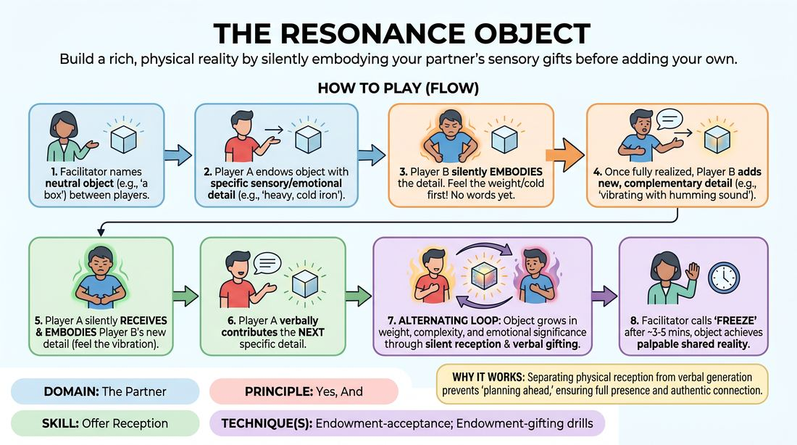

# 🎲 Drill A — isolation — The Resonance Object

{ .infographic }

> Build a rich, physical reality by silently embodying your partner's sensory gifts before adding your own.

`Players 2–99` · `~30 min` · `Complexity 2/5` · `Energy medium` · `Contact none` · `Props: none`

⬅️ [Back to the Week 03 run-sheet](../week-03.md)

## Why this activity, here

Week 3 has already taught them to say yes in words. This is the first block that makes them prove reception before they are allowed to speak. It isolates the half of Yes, And that beginners skip. Everything later in the day — the two-line scenes, the environment work — assumes a partner's offer changes your body, not just your dialogue.

## What students actually learn

- They feel the difference between hearing an offer and being altered by one.
- They stop stockpiling their next line while their partner is still talking.
- They discover that one specific detail is more useful to a partner than three vague ones.
- They learn that a shared imaginary thing becomes real through agreement, not through description.

## Setup

Clear floor. Pairs standing a metre apart, spread evenly so nobody is backed into a wall or shouting over a neighbour. No chairs, no props, no notes. You need a list of neutral objects ready — mug, stone, key, envelope, umbrella, shoebox — and a timer. Volume in the room will be low; that is correct.

## How to run it — 30 minutes

| Min | What you do |
|---:|---|
| 3 | Frame it and demo. Take a volunteer. You give a detail, they receive it in the body while everyone watches, then they give one back. Show a receive that takes three seconds, not none. |
| 2 | Pairs form. Assign A and B. Name the first object — a mug. Remind them: A starts, B receives in silence and in the body, then adds one thing. |
| 4 | Round one runs. Side-coach for pace only. Call freeze, then five seconds of stillness. |
| 2 | Short reset. Ask two pairs to say what their mug ended up being. Do not analyse. Name the object for round two. |
| 5 | Round two. B initiates this time. Coach for specificity and for physical reception that is visible from where you stand. |
| 2 | Swap partners across the room. New pairs, new A and B. Name the third object. |
| 6 | Round three. Longer, so the object can accumulate. Coach less. Let silences run. Call freeze while it is still alive. |
| 6 | Debrief standing, in the pairs, then two or three answers to the whole room. |

## Side-coaching script

| When | Say |
|---|---|
| First thirty seconds of round one | *"Body first. Nothing out of the mouth until something has changed in you."* |
| When details are generic | *"Smaller and stranger. Not heavy — heavy on one side."* |
| When someone speaks over the reception | *"Take the beat. Let it land before you answer."* |
| Mid-round, when the object starts drifting | *"Same object. Everything already given is still true."* |
| When a pair starts negotiating or explaining | *"One detail. Then hand it back."* |
| When receptions are a nod and nothing else | *"Show me in the breath."* |
| Last thirty seconds | *"Hold what you've built. Two more gifts, no more."* |
| On the freeze | *"Stop. Stay in it. Feel the weight of the thing you made."* |

!!! success "What good looks like"
    The room is quiet and slow. You see visible physical changes — a shoulder dropping, a held breath, hands adjusting their grip — before anyone speaks. Details are odd and precise rather than impressive. Pairs are looking at the space between them, not at each other's faces for approval. When you call freeze, several people are reluctant to let go of the object.

## When it goes wrong

| You see | What's causing it | The fix |
|---|---|---|
| Both players talking quickly, taking turns listing adjectives, no pause between lines. | They are treating it as a description game and preparing their next word while the partner speaks. | Stop the room. Impose a three-second silence rule: count it out loud for one exchange, then let them run again. |
| Nods and small facial flickers, but nothing you can read from four metres away. | Adults default to minimising physical expression in front of strangers in week three. | Ask for a deliberately oversized version for one exchange. Tell them you will dial it back later. Big first, honest second. |
| Objects that contradict themselves, or one player joking the thing into absurdity. | Discomfort with sincerity, or a player using invention to avoid receiving. | Reset that pair with a plain object and a one-word instruction: agree. Remind them nothing already given can be cancelled. |
| A pair falling silent and looking stuck. | They think the next detail has to be interesting. | Cross to them and feed one detail yourself — a smell, a temperature. Tell them boring and specific beats clever and vague. |

## Scaling

| Class size | What changes |
|---|---|
| **10–13** | Five or six pairs. Run three rounds as written. You can watch every pair in each round, so coach individually rather than to the room. If odd, join in yourself as a partner. |
| **14–17** | Seven or eight pairs. If odd, make one trio: A gifts, B receives and gifts, C receives and gifts, cycling. Trio rounds run the same length. Coach to the whole room more, individuals less. |
| **18–20** | Ten pairs, spread into two clusters at opposite ends so the sound does not merge. Cut round two to four minutes and round three to five, and add the minute to the debrief. Watch one cluster per round rather than trying to see everyone. |

## Variations

**Prompted senses** — Before each round, name the sense in play — this round is temperature and texture only. Rotate the sense between rounds.  
*Easier. Removes the blank-page problem and stops players reaching for emotional content before they are ready.*

**No adjectives** — Details must be given as a small action or a fact about the object's history, not as description. Nobody may use a describing word.  
*Harder. Forces invention into behaviour and story, and makes the physical reception carry more of the load.*

**Silent build** — Drop speech for the first two minutes. Pairs pass the object physically, each handling revealing one new property. Speech returns only for the last minute.  
*Different emphasis. Shifts the work from listening to watching, and shows how much offer information lives in the body alone.*

## Debrief

1. **What changed in your body when your partner gave you something?**
   > *A good answer sounds like:* Something concrete and involuntary — my shoulders came up, I stopped breathing for a second, I found myself holding it differently. Not an evaluation of whether they did it well.

2. **Which detail was hardest to accept, and did you accept it?**
   > *A good answer sounds like:* An honest admission — they named something they wanted to soften, argue with or ignore, and can say what they did instead. Naming the impulse matters more than having beaten it.

3. **What happened to your own ideas while you were receiving?**
   > *A good answer sounds like:* They noticed a plan dissolving, or that the detail they had ready no longer fitted and a better one arrived. If they say they held onto their plan the whole way, that is useful too — say so and move on.

!!! warning "Safety & inclusion"
    No physical contact is required at any point; the object is imaginary and passing it needs no touch. If a pair chooses to mime a handover with contact, both must agree out loud first, and either may decline with no explanation. Say this before round one. Emotional details can land harder than expected — tell the room they may pass on any detail that touches something real by saying "different one" and their partner will simply offer another. Anyone who prefers not to stand can run the whole drill seated. Volume is low throughout, which helps anyone uneasy about being overheard.

## Why it works

D2.S4 treats reception as a separate action from response, and this drill enforces the separation with a rule: you may not speak until the offer has changed your body. Beginners fail Yes, And by processing an offer as information to be answered rather than a change to be undergone. Inserting a mandatory physical beat blocks the verbal reflex and gives the offer somewhere to land. The one-detail cap does the second half of the work — it stops players from burying the partner's gift under their own material, which is the most common way an accepted offer still gets lost. Repetition across three rounds builds the pause into the reflex, so it survives into scene work where nobody is calling it out.

[Open the full activity card »](../../../../games/D2_P2_S4_T2_G165__the-resonance-object.md){target=_blank rel=noopener}
