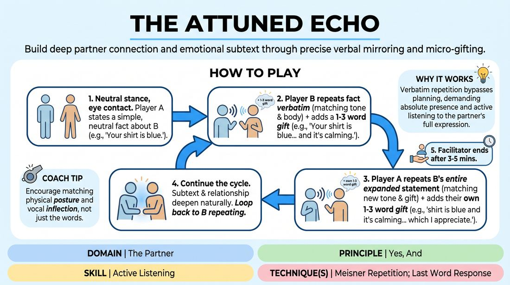

# 🎲 Drill B — under load — Resonant Echo

{ .infographic }

> Build deep partner connection and emotional subtext through precise verbal mirroring and micro-gifting.

`Players 2–99` · `~30 min` · `Complexity 2/5` · `Energy low` · `Contact none` · `Props: none`

⬅️ [Back to the Week 03 run-sheet](../week-03.md)

## Why this activity, here

Drill A gave them the shape of yes-and in low stakes. This puts it under load: they cannot paraphrase, cannot swerve, cannot bail into a new subject. The verbatim repeat forces genuine reception before addition. It feeds the week's scene work, where the same discipline runs without the crutch of literal repetition.

## What students actually learn

- They notice how much they normally change an offer while claiming to accept it.
- They find that repeating someone's exact words and tone gives them information they would have missed.
- They stop needing a new idea every turn. One or two words is enough to move a scene.
- They get comfortable holding eye contact and silence without filling it.

## Setup

Clear floor space so pairs can stand a metre apart without overhearing each other easily. No chairs needed except for anyone who prefers to sit. Write the cue on the board: "Accept the reality, then add exactly one thing." Under it write "Whole sentence back. One to three words on." Have a timer. No props, no slips of paper.

## How to run it — 30 minutes

| Min | What you do |
|---:|---|
| 4 | Frame it and demo. Take a volunteer. Run six or seven exchanges in front of the room, deliberately slowly. Point out the two rules as they happen: whole sentence back, one to three words on. Show one deliberate error — paraphrasing — and correct it aloud. |
| 3 | Mirror only, no gifts. Pairs stand, A makes a neutral observation, B repeats it verbatim with matched tone and posture, then A repeats it back. Just the loop. Get the copying accurate before adding anything. |
| 5 | First full round. Add the one-to-three-word gift. Let them run. Side-coach for accuracy, not content. Call freeze at five minutes. |
| 2 | Break, shake out, swap partners. Twenty seconds of instruction: this time, keep the sentence going even when it gets long. No abandoning and restarting. |
| 6 | Second round, under load. Same rules, but you call "faster" twice and "slower" twice during the round. They must keep verbatim accuracy through the tempo changes. Freeze at six. |
| 5 | Third round, new partner. Tell them to let the emotional content go somewhere uncomfortable if it wants to — jealous, tender, superior. Still no new topics. This is the longest sustained build. |
| 5 | Debrief standing in a loose circle. Two questions, short answers, no war stories. |

## Side-coaching script

| When | Say |
|---|---|
| First thirty seconds of any round | *"Whole sentence back. All of it."* |
| When you hear paraphrasing | *"Those aren't their words. Again."* |
| When additions balloon into sentences | *"Three words maximum. Cut it."* |
| When someone introduces a new subject | *"No new topic. Stay in what's already there."* |
| Mid-round, when pairs go flat and mechanical | *"Copy the voice, not just the words."* |
| During the tempo-change round | *"Faster. Accuracy holds."* |
| When a pair rushes past a strong gift | *"Let that one land before you answer."* |
| Last thirty seconds of the final round | *"Finish the sentence you're in. Then freeze."* |

!!! success "What good looks like"
    The room gets quieter than you expect. Sentences grow long and pairs still get them right, sometimes laughing at the effort. You hear tone travelling — one person says "and you feel small" softly, and the other says it back just as softly and means it. Nobody is trying to be funny. A few pairs land somewhere genuinely charged and look slightly startled when you call freeze.

## When it goes wrong

| You see | What's causing it | The fix |
|---|---|---|
| Pairs paraphrasing — "you've got a green jumper on" instead of the exact words. | They are listening for meaning, not for words. The default habit. | Stop the room. Run the mirror-only loop again for sixty seconds. Tell them accuracy is the whole drill and meaning will follow. |
| Additions turn into jokes or plot. "...and you feel powerful because you robbed a bank." | Nerves. Someone decided the exercise was boring and reached for a laugh. | Name it neutrally: three words, no because. Give them the constraint again as a number, not a note about attitude. |
| A pair grinds to a halt mid-sentence, both laughing and giving up. | The sentence got long and they lost it. Normal, and it happens most rounds. | Call across: go back to the last version you both remember and carry on. Losing the thread is not a scene ending. |
| Observations drift towards bodies or looks and someone stiffens. | The brief on what counts as neutral was too thin. | Reset with three examples out loud: clothing, position in the room, what the hands are doing. Move pairs on if needed. |

## Scaling

| Class size | What changes |
|---|---|
| **10–13** | Straight pairs, three rounds as written. One trio if numbers are odd — they pass round the circle, each person repeating the previous full sentence and adding. Trio rounds run slightly slower; that is fine. |
| **14–17** | Straight pairs, three rounds as written. Split the floor into two halves so you can side-coach one half while the other runs. Your tempo calls carry to both halves — do not split the timing. |
| **18–20** | Straight pairs, but cut the tempo-change round to five minutes and the third round to four, adding the two minutes to the final debrief so more people can speak. Walk a fixed circuit so every pair is heard once. |

## Variations

**Two words only** — Cap every addition at exactly two words, chosen before the round from a shared list you write up: proud, afraid, kind, older, watched, safe.  
*Easier — removes the search for a phrase, so all attention goes to the verbatim repeat.*

**Silent mirror first** — Before speaking, the receiver must first copy the partner's posture and hold it for two seconds. Then repeat the sentence, then add.  
*Harder — the physical copy has to be accurate too, and the enforced pause exposes anyone rushing.*

**Object echo** — Replace the observation about the partner with an observation about a real object in the room. Same repeat-and-add cycle.  
*Different emphasis — takes the heat off personal exposure while keeping the reception mechanics, useful with a shy or new group.*

## Debrief

1. **What did you notice when you had to say someone's exact words back?**
   > *A good answer sounds like:* Something specific about hearing what was actually said versus what they assumed was said. "I thought she'd said it kindly and when I copied it, it wasn't kind at all." Move on once two people have said something concrete.

2. **Where did you want to add more than three words, and what happened when you couldn't?**
   > *A good answer sounds like:* An admission that the limit forced a choice, and that the choice was clearer than a longer offer would have been. If answers are all "it was frustrating", ask what they cut.

3. **How is this different from just agreeing with your partner?**
   > *A good answer sounds like:* They distinguish taking something on from waving it through. "I had to actually feel powerful before I could say the next bit" is the answer you want. Then stop.

!!! warning "Safety & inclusion"
    No physical contact in this drill at all — say so at the top so nobody is bracing for it. Rule the observations tightly: clothing, posture, position, what the hands are doing. Explicitly off limits are body size, age, skin, hair texture, attractiveness and anything read as identity. Sustained eye contact is hard for some people; offer looking at the bridge of the nose or the collarbone, and say it as an equal option, not an accommodation. Anyone who prefers to sit can sit, with their partner sitting too. Give a private opt-out: anyone may say "new observation" at any point and their partner restarts without comment. Gifts of emotional state can land close to the bone in round three — remind them they can keep it light and that keeping it light is not a failure.

## Why it works

Offer reception fails because listening and inventing compete for the same attention. Most people are building their reply while the offer is still arriving, so they accept a rough summary of it rather than the thing itself. Verbatim repetition removes the option of summarising — you cannot say the words back unless you took them in whole, including tone and tempo, which is where most of the offer's real content sits. Once the words are in, the three-word cap makes addition cheap and small, so the drill trains the exact ratio the cue names: take all of it, add one thing. Under the tempo load in round two, whichever half of that ratio is weaker breaks first, and they feel which one it is.

[Open the full activity card »](../../../../games/D2_P2_S1_T1_G314__the-attuned-echo.md){target=_blank rel=noopener}
