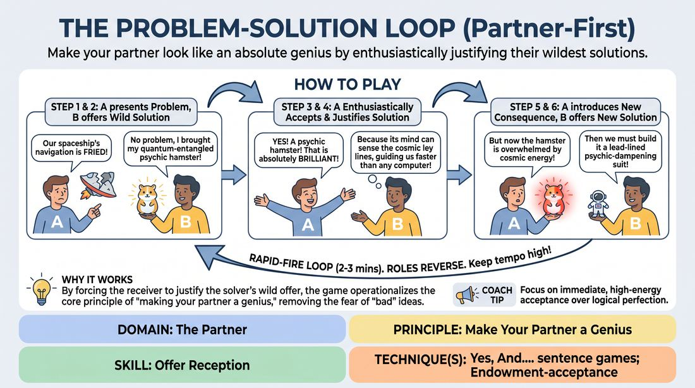

# 🎯 Scene Lab — The Brilliant Solution Loop

{ .infographic }

> Make your partner look like an absolute genius by enthusiastically justifying their wildest solutions.

`Players 2–99` · `~30 min` · `Complexity 2/5` · `Energy high` · `Contact none` · `Props: none`

⬅️ [Back to the Week 03 run-sheet](../week-03.md)

## Why this activity, here

Week 3 has already drilled naming and accepting what a partner puts in the air. This block is the pressure test: the offer arrives half-built and absurd, and the only way through is to accept it and add the one thing that makes it stand up. It feeds directly into the week's closing scene work, where students need to receive a partner's premise without renegotiating it.

## What students actually learn

- That justifying someone else's idea is easier and faster than inventing your own — and it makes the scene move.
- That an offer does not need to be sensible to be accepted; it needs to be treated as true.
- That the second half of Yes, And is a single addition, not a whole new direction.
- That their partner's success and their own are the same event.

## Setup

Clear floor space so pairs can stand a metre apart without shouting over neighbours. No chairs, no props, no paper. Have one or two example problems in your pocket for the demo. Note the room's acoustics — this activity gets loud, and in a hard-walled studio you may need pairs spread to the corners.

## How to run it — 30 minutes

| Min | What you do |
|---:|---|
| 3 | Frame it in two sentences: one person hands over a broken thing, the other hands back nonsense, and the first person makes the nonsense true. Demo with a willing volunteer for four exchanges. Stop the demo mid-loop rather than resolving it. |
| 4 | Pairs, standing, spread out. A starts with a problem. Run the full loop for three minutes. Call thirty seconds. Then have pairs stand still and say nothing for the final thirty. |
| 3 | Pull the room in. Name the two beats out loud: accept enthusiastically, then justify. Point out that most pairs skipped the enthusiasm and went straight to reasoning. Take two questions maximum, then move. |
| 5 | New partners. Same game, four-minute loop, with one addition: the acceptance must be audible from across the room. Circulate and side-coach. Call time and let pairs breathe for one minute. |
| 4 | Keep partners. Add the constraint that every new problem must be a physical consequence of the last solution — something in the room, on the body, in the machine. Run three minutes, then stop hard. |
| 6 | Fishbowl. Three pairs volunteer. Each plays ninety seconds at the front while the rest watch. Between pairs, ask the watchers one question only: what did the accepter add? Keep the turnaround fast. |
| 5 | Sit or stand in a loose circle. Run the debrief questions. Close by repeating the cue and connecting it to the scene work that follows. |

## Side-coaching script

| When | Say |
|---|---|
| First thirty seconds of round one, when people are thinking | *"Answer before you know the answer."* |
| A pair explains their own absurd solution | *"Don't sell it. Let them sell it."* |
| The accepter goes straight into reasoning with no reaction | *"Celebrate first. Then explain."* |
| A new problem arrives unconnected to the last solution | *"The problem comes out of the fix."* |
| Pairs slow down and start negotiating | *"Any answer. Now."* |
| Solutions get long and elaborate | *"One sentence. Hand it over."* |
| Midway through the third round, energy dips | *"Make them look like a genius."* |
| Last thirty seconds of any round | *"Faster. Stop being careful."* |

!!! success "What good looks like"
    The room is loud and slightly ragged. You hear overlapping "Yes!" and laughter that isn't about jokes — it's about relief. Loops run eight or ten exchanges without a stall. Solutions stay short; justifications are longer than the solutions that prompted them. Nobody is standing with a hand on their chin. When you call time, several pairs keep going for a beat because they didn't hear you.

## When it goes wrong

| You see | What's causing it | The fix |
|---|---|---|
| A pair goes quiet, both looking at the floor, mid-loop. | One of them is trying to invent something good rather than something immediate. The absurd solution has become a performance test. | Walk over and say "any two words" out loud. Give them a nonsense solution yourself if needed. Restart their loop from a fresh problem rather than repairing the stall. |
| The accepter says "yes, but actually" or fixes the partner's idea before justifying it. | Habitual editing. They think the idea is too weak to defend, so they improve it first. | Stop the pair. Have them replay the last exchange with the accepter forbidden from changing a single word of the solution. Usually one replay is enough. |
| New problems arrive that have nothing to do with the previous solution — a fresh disaster each time. | They are treating this as a list of unrelated gags rather than a chain. | Impose the physical-consequence constraint early rather than in round three. Ask them out loud: what did the psychic hamster break? |
| One person in a pair dominates, doing both the solving and the justifying. | Uneven confidence, and the loop's role-swap has collapsed. | Call the swap yourself. Stand near them and alternate pointing at each speaker for thirty seconds until the rhythm is external and obvious. |

## Scaling

| Class size | What changes |
|---|---|
| **10–13** | Five or six pairs. Everyone plays every round. In the fishbowl, run four pairs at ninety seconds each and cut the between-pair question to a single word from one watcher. |
| **14–17** | Seven or eight pairs. If numbers are odd, make one trio: the third person plays a silent bystander who must be dragged into the next problem by name. Fishbowl stays at three pairs. |
| **18–20** | Nine or ten pairs. Split the room into two halves at opposite ends for rounds one to three so the noise doesn't swamp anyone. Run the fishbowl as two simultaneous fishbowls, one per half, with a nominated timekeeper in each, then bring both back together for the debrief. |

## Variations

**Solution Bank** — Before round one, have the group call out fifteen absurd objects or beings and write them on the wall. Solvers must pick from the wall rather than invent.  
*Easier. Removes the invention pressure entirely and puts all the work on accepting and justifying.*

**No Repeats, No Pause** — Add a three-second rule: any silence longer than three seconds ends the loop and the pair restarts with a new problem. Also ban reusing any solution already heard in the room.  
*Harder. Forces genuinely unfiltered response and kills the habit of banking a good idea for later.*

**Straight-Faced Justify** — Same loop, but the acceptance and justification must be delivered flatly and seriously, as though briefing a committee. No laughing at your own line.  
*Different emphasis. Shifts the work from energy to commitment, and shows that conviction, not volume, is what makes an offer land.*

## Debrief

1. **Which was harder — inventing the solution or justifying your partner's?**
   > *A good answer sounds like:* Most say inventing, and they're surprised by that. A good answer notices that once you're required to defend something, your brain supplies the reasons fast. Move on once two or three people have said a version of this.

2. **What happened in your body when someone said "that's brilliant" and meant it?**
   > *A good answer sounds like:* Something concrete and physical — shoulders dropped, wanted to give more, stopped checking whether the idea was good. If you only get "it was nice", push once for the physical detail, then move on.

3. **Where did you feel the urge to change your partner's idea before accepting it?**
   > *A good answer sounds like:* A specific moment, named. "They said the hamster and I wanted to make it a robot hamster because that felt more useful." Naming the impulse is the whole point; you don't need agreement about what to do with it.

4. **What does "add exactly one thing" protect you from?**
   > *A good answer sounds like:* From taking over. Someone should connect it to the loop: adding one reason kept the scene theirs and mine at once, whereas adding three would have been me writing the scene alone.

!!! warning "Safety & inclusion"
    No physical contact is required or expected at any point; pairs work at conversational distance and stay there. Anyone who prefers not to stand can play seated with their partner seated too — the game loses nothing. The fishbowl is opt-in by volunteering only; never nominate. If a pair's content drifts somewhere uncomfortable, either of them can say "new problem" and the loop restarts with no explanation owed. Say this out loud before round one. Volume rises quickly in this activity; tell the room at the start that they can step to the corridor or the edge of the space at any time without asking.

## Why it works

Offer reception fails when the receiver evaluates before accepting. This activity removes the evaluation window by structure: the solution arrives unjustified, so there is nothing to evaluate — only something to make true. Because the justifying is handed to the other person, the solver never has to defend their own idea and the accepter never has to invent one. Each half of the pair is doing the easier job, and between them they produce something neither could have built alone. The forced role-swap means both experience both sides within seconds, so the lesson lands as a felt rhythm rather than an instruction. The one-consequence rule enforces the second half of the cue: add exactly one thing, and let the addition come from what is already there.

[Open the full activity card »](../../../../games/D2_P3_S4_T1_G402__the-problem-solution-loop-partner-first.md){target=_blank rel=noopener}
