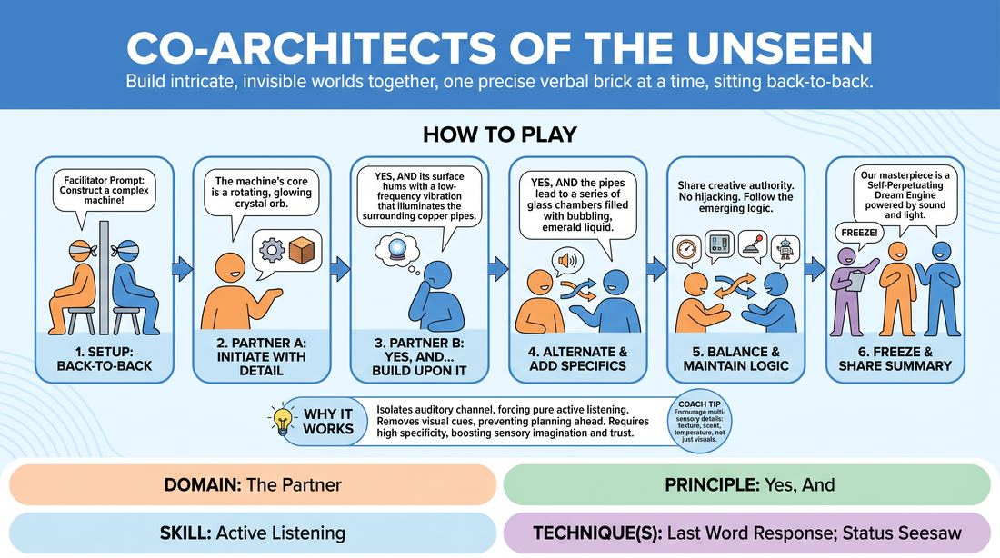

# 🏟️ Showcase round — Co-Architects of the Unseen

{ .infographic }

> Build intricate, invisible worlds together, one precise verbal brick at a time, sitting back-to-back.

`Players 2–99` · `~25 min` · `Complexity 2/5` · `Energy low` · `Contact none` · `Props: none`

⬅️ [Back to the Week 03 run-sheet](../week-03.md)

## Why this activity, here

Week 3 has been drilling acceptance in short bursts — two-line exchanges, quick agreement games. This is the showcase: the same skill held for four unbroken minutes with the face taken away. Back-to-back removes the nod, the smile, the raised eyebrow, so agreement has to be carried entirely in words. It feeds directly into Week 4's scene work, where the same 'accept then add one' move happens with bodies and stakes attached.

## What students actually learn

- They notice how much they normally lean on a partner's face to check whether an offer landed — and that words alone can do the job.
- They stop adding three things at once. Adding one thing, precisely, becomes a habit rather than a restriction.
- They discover that specificity is generous: a brass sphere smelling of ozone gives a partner more to work with than 'a cool machine'.
- They feel the difference between building on the last line and building beside it.

## Setup

Clear floor space, or pair up chairs back-to-back. You need room for 5-10 pairs without them overhearing each other too closely — spread them to the walls. No props, no paper. Have three or four build prompts written on a card in your pocket so you are not inventing them under pressure. Sample prompts: a machine that sorts lost objects by how much they were missed; a public bathhouse in a city with no water; a vending machine that dispenses weather.

## How to run it — 25 minutes

| Min | What you do |
|---:|---|
| 3 | Set up. Pair people, get them back-to-back, explain the rule: accept the last thing said, add exactly one new concrete thing. Demonstrate four lines with a volunteer, sitting back-to-back yourself. |
| 2 | Warm build. Give a throwaway prompt — 'a kitchen drawer' — and let pairs run 90 seconds. Stop them. Name one detail you overheard that was properly specific. |
| 6 | Build one. Give the real prompt. Let pairs run. Side-coach for specificity and for the one-thing rule. Do not stop the room to correct individuals. |
| 2 | Swap partners. New pairs, back-to-back again. Quick note: this time, listen for the last three words your partner says and hook onto those. |
| 6 | Build two. New prompt. Let it run longer without interruption. Side-coach only twice — once for history, once for the smallest detail yet. |
| 3 | Freeze. Go round the room. Each pair gives one sentence describing their world. Keep it moving — no follow-up questions yet. |
| 3 | Debrief seated in a circle. Two questions, no more. Land the cue before moving on. |

## Side-coaching script

| When | Say |
|---|---|
| First thirty seconds of any build | *"One thing each. Add one thing."* |
| When you hear abstract or evaluative language | *"What's it made of? What does it weigh?"* |
| When someone starts monologuing | *"Hand it back."* |
| Two minutes in, when the world is established | *"Now tell me something old about it."* |
| When a pair hesitates or stalls | *"Repeat their last three words, then add."* |
| When someone quietly contradicts an earlier fact | *"Everything said is true. Build on it, don't fix it."* |
| Final minute of a build | *"Smallest detail yet. Something you could hold."* |
| Just before freeze | *"One more each, then stop."* |

!!! success "What good looks like"
    The room gets quiet and low. Voices drop because nobody is performing to a face. You hear pairs saying 'yes, and the sphere...' or just picking up the last noun and running. Details get smaller and more physical as the minutes pass rather than bigger and wilder. Turns are roughly even in length. When you call freeze, at least two pairs groan because they were mid-build. The one-sentence summaries are oddly confident — people describe their world as if it exists.

## When it goes wrong

| You see | What's causing it | The fix |
|---|---|---|
| A pair talking over each other, both laughing, world going nowhere. | Nerves from not seeing a face. They fill the gap with noise instead of listening. | Kneel beside them. Say: 'A speaks, B counts to two, then B speaks.' The forced gap does the work. |
| One person contributing four sentences to their partner's one. | The confident partner treats it as their pitch and the quieter one lets them. | Call to the whole room, not the pair: 'One sentence each. Hand it back.' Repeat it twice during the build. |
| Vague, jokey escalation — 'and then it explodes', 'and then there's a dragon'. | They are reaching for laughs because the exercise feels exposed without an audience reaction. | Side-coach: 'Nothing new arrives. Describe what's already there.' Ask for a smell or a temperature. |
| Long silences and visible relief when you call time. | Prompt was too abstract, or they think they need a good idea before speaking. | Swap to a concrete domestic prompt. Tell them the first thing they notice about it is enough — no idea required. |

## Scaling

| Class size | What changes |
|---|---|
| **10–13** | 5-6 pairs. Run exactly as written. You can circulate to every pair twice during each build, which makes side-coaching individual rather than broadcast. Summaries at the end take under two minutes. |
| **14–17** | 7-8 pairs. Spread them to the perimeter so overhearing doesn't blur the builds. Side-coach mostly to the whole room from the centre. Trim the round of summaries by asking for five words rather than a sentence. |
| **18–20** | 9-10 pairs. Same two builds, but make one trio if numbers are odd — trio sits back-to-back-to-back in a triangle and rotates in fixed order. Cut summaries to half the pairs, chosen at random, to protect the debrief time. |

## Variations

**Named objects** — Give each pair a concrete everyday thing — a lift, a bus shelter, a corner shop — instead of an imaginative prompt.  
*Easier. Nobody has to invent a genre, so all the effort goes into specificity and turn-taking.*

**Inhabited** — After three minutes, tell them a person now lives or works in the thing they built. Every subsequent detail must involve that person.  
*Harder. Adds a second constraint and pushes toward character, which is where Week 4 goes.*

**Face to face** — Run the second build seated facing each other, everything else identical.  
*Different emphasis. They feel directly how much the face was doing, and how differently they listen when they can see.*

## Debrief

1. **What was different about agreeing when you couldn't see their face?**
   > *A good answer sounds like:* Someone says they had to say the agreement out loud rather than nod it, or that they listened to the actual words instead of the tone. Move on once two people name the same thing.

2. **When did your world feel most real to you?**
   > *A good answer sounds like:* They point at a specific detail — the ozone, the chipped tile, the price of a ticket — not at a moment of cleverness. If they name a small physical thing, the cue has landed.

3. **Did either of you take more than your share? How did you notice?**
   > *A good answer sounds like:* Honest and unbothered. 'I did, and I felt it around minute three.' Not apology. If the pair can name it without embarrassment, stop there.

!!! warning "Safety & inclusion"
    Back-to-back means shoulders and backs touching. Say before pairing: sitting back-to-back involves light contact along the spine — if you'd rather not, sit side by side facing opposite directions, which works just as well. Offer chairs to anyone who doesn't want the floor; a pair of chairs back-to-back is fine. Nobody is asked to be funny or to have an idea first — a texture or a smell is a complete contribution. If anyone is hard of hearing, place their pair away from the noisiest corner and let them sit side by side so they can catch their partner's voice.

## Why it works

Offer reception fails when the receiver is busy planning. Back-to-back seating removes the visual channel, so there is nothing to plan against — no expression to read, no reaction to steer toward. The only available input is the partner's last sentence, which forces genuine listening rather than performed listening. The 'exactly one thing' rule then caps the response, so the receiver cannot bury the offer under their own idea. Together these two constraints reduce a scene to its smallest honest unit: hear it, hold it, add once. That is the cue in its bare form, and running it for six unbroken minutes turns it from an instruction into a reflex.

[Open the full activity card »](../../../../games/D2_P2_S1_T2_G475__co-architects-of-the-unseen.md){target=_blank rel=noopener}
