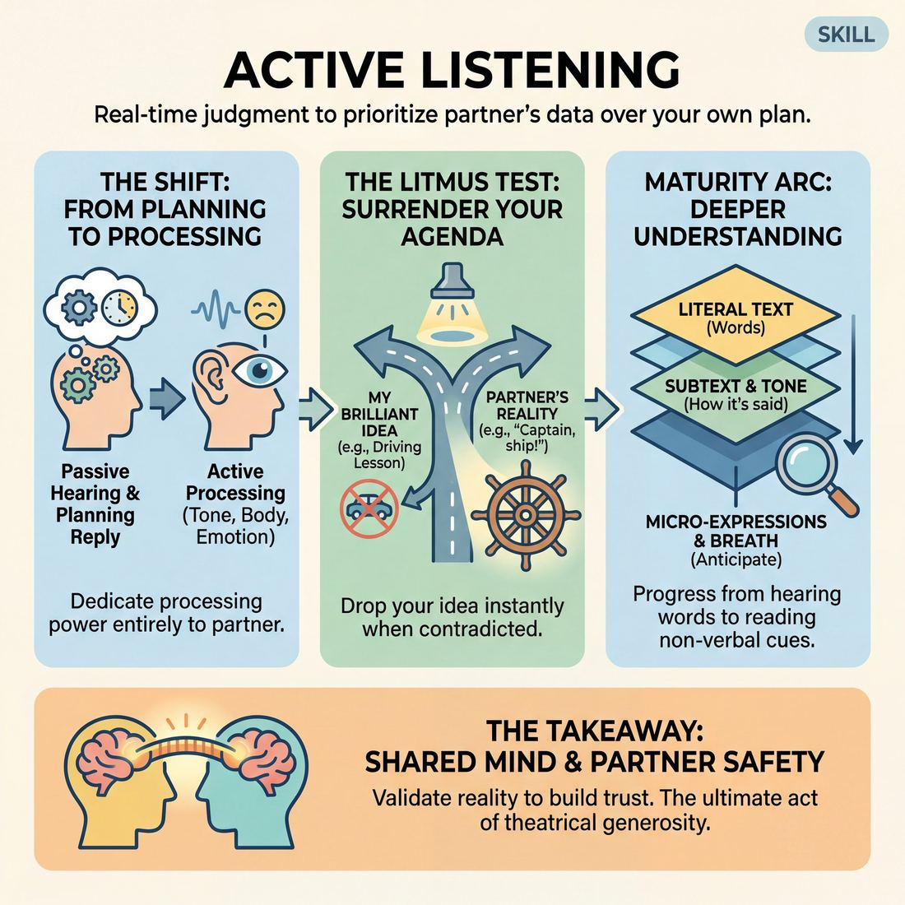

# Week 04 — Listening With the Whole Body

> *You cannot rehearse your next line and hear the current one; listening is a physical act, not a courtesy.*

| Course | Week | Domain | Focus | Stage | Length | Class |
|---|---|---|---|---|---|---|
| Foundations — The Brave Beginner | 4/8 | D2 | `D2.S1` — Active Listening | Novice → Advanced Beginner | 180 min | 10–20 |

!!! note "Builds on"
    Week 3 taught them to accept the offer; this week checks whether they actually heard it in the first place.

## 🎬 The arc of this session

They arrive loose, chatty and pleased with how inventive they got last week, ready to top it. You take the invention away and leave them with only what their partner just said, which feels like nothing for about forty minutes and then starts to feel like a floor. They leave quieter, able to repeat a partner's last line word for word, and with a first taste of two chairs in front of the room.

!!! tip "Watch for"
    The clever ones getting bored. When listening feels like doing nothing, the quick players start decorating — adding jokes, adding characters, adding volume — and call it energy. Name it early, once, kindly, then keep taking the decoration away.

## ⏱️ Session flow (180 minutes)

| Time | Block | Activity |
|---|---|---|
| **0:00–0:05** | 🧊 Ice-breaker | *Worth It* |
| **0:05–0:10** | 😄 Laughter Blast | *Popcorn Feet* |
| **0:10–0:25** | 🔥 Warm-up cluster | *Rebound*, *Closing the Gap*, *Sound Compass* |
| **0:25–0:45** | 🧠 Theory | — |
| **0:45–1:15** | 🎲 Drill A — isolation | *The Echo and Elevate Exchange* |
| **1:15–1:25** | ☕ Break | — |
| **1:25–1:55** | 🎲 Drill B — under load | *The Emotional Current Walk* |
| **1:55–2:25** | 🎯 Scene Lab | *The Echo Chamber* |
| **2:25–2:50** | 🏟️ Showcase round | *Two Chairs, One Night* |
| **2:50–3:00** | 💭 Reflection & homework | — |

## 🎒 Before you start

- Clear the floor for a full walking circle. Two chairs set side-on for Block 9, stage-left of your teaching spot, left out from the start so nobody watches you fetch them.
- Props: none needed. Bring a timer with an audible end, a marker, and index cards to write pair names for the showcase order.
- Board or flipchart: write the cue "You cannot plan and listen at the same time" before anyone arrives. Leave it up all session.
- Review Week 3: note two people who accepted offers well and two who accepted by talking over the top. You will use both in the theory demo.
- Consent step for Blocks 3 and 7: before Closing the Gap and before the Emotional Current Walk, say aloud that these involve standing close and, in Block 7, optional light hand-to-shoulder contact. Offer the no-contact variant (mirror at arm's length, no touch) and say plainly that taking it costs nothing. Check the room for hands, then move on without comment.
- Size splits: 10-13 run one circle throughout, Drill A in pairs with one trio; 14-17 split into two circles for Blocks 3 and 5, rejoin for Block 7; 18-20 run three circles for warm-ups, two rooms-within-the-room for Drill A with you rotating every four minutes, and cap Block 9 at six pairs with names drawn from cards.

## 1. 🧊 Ice-breaker (5 min)

*Big circle, close enough to hear a normal speaking voice. No need to warm up your wit for this one.*

**Why here:** Gets them talking about something small and specific before you ask them to hold someone else's words.

### Worth It

> Everyone names one thing they paid for this week and gives it a one-word verdict.

`Players 10–20` · `~5 min` · `Complexity 2/5` · `Energy medium` · `Contact none` · `Props: none`

**How to play**

1. Form one circle for ten to thirteen people, two circles above that. Stand, not sit. Keep the ring tight enough that a quiet voice carries.
2. Give the rule: name one thing you paid for in the last seven days, then say 'worth it' or 'not worth it'. No reasons, no story.
3. Demo it yourself in six seconds. Something small and dull is better than something funny. Model the flat delivery you want back.
4. Run round one clockwise with no gaps. Six seconds each. Cut anyone who starts justifying with a friendly 'verdict only' and move on.
5. Ask each circle to point at the one purchase they would have made themselves. Count fingers out loud. Nothing is won.
6. Run round two in the same order, new prompt: one thing you refuse to spend money on, ever. One breath each. Leave flat answers flat.
7. Bring the circles together. Name two contrasts you heard — one deadpan verdict, one that ran long. Move straight into the warm-up.

📄 **[Full teaching notes »](week-04/beginner_w04__b1_1.md)**

**Side-coach:** *“Answer for the person who just spoke, not the person you wish had spoken.”*

## 2. 😄 Laughter Blast (5 min)

*Shake out. This is five minutes of noise and then we go quiet for a long time — spend it.*

**Why here:** Burns off the social fizz they walk in with so the slow drills later do not have to compete with it.

### Popcorn Feet

> The whole room bounces on the spot making popping sounds until the popping turns into real laughter.

`Players 10–20` · `~5 min` · `Complexity 1/5` · `Energy high` · `Contact none` · `Props: none`

**How to play**

1. Scatter everyone across the floor, arm's length apart, facing no particular direction. Tell them they are kernels in a hot pan. You are a kernel too.
2. Demonstrate: tiny bounces on the balls of the feet, arms loose, knees soft. Bounce harder than anyone else in the room and keep bouncing throughout.
3. Start the room bouncing small and silent. Call it warming up. No sound yet. Keep the bounce constant and tiny for the full warming stretch.
4. Call POP. Anyone may now jump slightly higher and bark a loud POP whenever the impulse hits. Popping is random and overlapping, never in turn.
5. Speed it up. Call for faster and louder. Invite any pop noise — squeaks, honks, nonsense. Let arms fly. Aim for continuous overlapping noise.
6. Call BURNT. Everyone sags the sound into one long groan, sinks towards the floor and flops loose. Expect laughter here; let it run a few seconds.
7. Shake out arms and legs. Ask one question, take thirty seconds of answers, and move straight into the next block without discussion.

📄 **[Full teaching notes »](week-04/beginner_w04__b2_1.md)**

**Side-coach:** *“Let it build off the person next to you rather than starting your own.”*

## 3. 🔥 Warm-up cluster (15 min)

*Three warm-ups back to back, five minutes each. Before Closing the Gap I need thirty seconds on space and consent.*

**Why here:** Three angles on the same skill: reacting fast, reacting close, reacting to sound alone — all before anyone has to be clever.

### Rebound

> In pairs, fire a sharp move-and-sound at your partner and get it thrown straight back at full size, with no gap to think in.

`Players 10–20` · `~5 min` · `Complexity 2/5` · `Energy high` · `Contact none` · `Props: none`

**How to play**

1. Pair everyone up. Odd number, make one trio. Ask pairs to stand about two arms' length apart, facing each other, feet under hips.
2. Demo once with a volunteer. Throw a sharp gesture with a sound. They copy it straight back, same shape, same volume, same speed.
3. Start round one. A throws, B rebounds it exactly, A throws a new one. Keep it continuous. No talking, no pausing, no negotiating between throws.
4. Call swap. B now leads the throws and A rebounds. Same rules, same continuous flow.
5. Drop the leader. Whoever just rebounded owns the next throw. It should ping back and forth with nobody deciding whose turn it is.
6. Run a speed round. Halve the gap between throws. Call 'faster' twice. Tell them accuracy beats invention — copy what actually happened, not what they wish had.
7. Add whole body. Every throw and every rebound uses legs and breath, not just hands and face.
8. Call stop. Shake the arms out. Three deep breaths together. Say the cue: you cannot plan and listen at the same time.

📄 **[Full teaching notes »](week-04/beginner_w04__b3_1.md)**

### Closing the Gap

> Two facing lines: you only step towards your partner when you can hand their exact words back.

`Players 10–20` · `~5 min` · `Complexity 2/5` · `Energy medium` · `Contact none` · `Props: none`

**How to play**

1. Form two lines facing each other, roughly four metres apart. Pair everyone across the gap. Odd number: make one trio, with two listeners echoing together.
2. Set the rule aloud. Speaker gives one short true sentence about their week. Listener hands back the last four words, exactly as spoken.
3. Correct echo, both partners take one step towards each other. Wrong or approximate, both hold position. No arguing about it — the speaker decides.
4. Run Line A speaking, Line B echoing. Keep sentences short and rolling. Then swap roles. Keep the ground already gained; do not reset the gap.
5. Add the body. Listeners copy the speaker's posture and lean while listening, then echo the tail. Alternate speaker each sentence and keep stepping.
6. Stop every pair at arm's length. No closer. Say this is the limit for everyone.
7. Call the last exchange: one sentence each, no echo, just receive it. Then thank your partner and turn out to face the room.

📄 **[Full teaching notes »](week-04/beginner_w04__b3_2.md)**

### Sound Compass

> With eyes closed, the room tracks moving sounds by pointing at them, so listening becomes a whole-body act rather than a polite one.

`Players 10–20` · `~5 min` · `Complexity 2/5` · `Energy low` · `Contact none` · `Props: none`

**How to play**

1. Tell the room: listeners close their eyes and stay planted; sources move and make sound. Anyone who dislikes closed eyes drops their gaze to the floor instead. Ask for quiet.
2. Name three people aloud as sources. Everyone else closes their eyes now. Sources keep their eyes open, walk slowly, and never touch anyone.
3. Round one: sources make one small repeating sound — a click, a tap, a low hum — every few seconds, taking two slow steps between sounds.
4. Tell listeners to point their whole torso at each sound as they hear it. Not a finger. The chest turns.
5. Call 'open'. Listeners keep pointing and look at where they landed. Note the misses out loud only as observation, no comment. Reset everyone.
6. Round two: sources say a single ordinary word instead of a sound. Listeners point and repeat the word back aloud at the volume they heard it.
7. Call 'open' and stop. Say the cue: you cannot plan and listen at the same time. Move straight into the next block.

📄 **[Full teaching notes »](week-04/beginner_w04__b3_3.md)**

**Side-coach:** *“Your face first. Words are optional in all three of these.”*

## 4. 🧠 Theory — Active Listening (20 min)

{ .infographic }

- **The big idea:** Listening is something you do with your body, not something you grant your partner as a courtesy. If you are holding a line in your head, you are not receiving theirs — the two cannot run at once.
- **Where you are on the path:** Advanced Beginner looks like this in the room: they can play back the last line accurately when asked, and their face moves before their mouth does. It does not yet look like subtle reactions or emotional depth. Accuracy first.
- **The one cue to coach:** *“You cannot plan and listen at the same time.”*

**The three beats**

1. **Say it.** Say: last week you learned to accept the offer. This week we check whether you heard it. Point at the board. Say the cue twice. Then say: for the next three hours, your first job is to be able to repeat what your partner just said. Not the gist. The words. Say that you will interrupt scenes to ask, and that not knowing is information, not failure.
2. **Show it.** Take a volunteer. Do sixty seconds of scene where you visibly plan — eyes up, waiting for your turn, landing a prepared line. Stop. Ask the room what your partner's last line was; you will not know. Redo the same opening, this time repeating your partner's last three words out loud before you respond, and letting your face react first. Ask the room which one they wanted to keep watching.
3. **Try it.** Everyone stands, finds a partner, five minutes. A says one sentence about their week. B repeats it back as exactly as they can, then adds one sentence. A repeats B's sentence back, adds one. Keep going. No jokes, no characters. Call time and ask for a show of hands: who lost the words when they started thinking about what to say next.

!!! warning "The misunderstanding that always comes up"
    They hear "listen more" as "go slower and be earnest". It is not about pace or sincerity — it is about where attention sits. You can listen at speed. Correct it by pointing out someone who is fast and accurate, not someone who is slow and solemn.

!!! abstract "📖 Go deeper"
    Read the full write-up: [Active Listening](../../../theory/02_the-partner/02_S1__active-listening.md)

## 5. 🎲 Drill A — isolation (30 min)

*Pairs. Nothing to think up, nothing to prepare — you only need what your partner just handed you.*

**Why here:** The isolation: strip everything out except accurate repetition, then one small addition on top, so they feel the difference between echoing and inventing.

### The Echo and Elevate Exchange

> Mirror your partner's unspoken feelings, name their state, and gift them a brilliant narrative justification.

`Players 2–99` · `~30 min` · `Complexity 2/5` · `Energy medium` · `Contact none` · `Props: none`

**How to play**

1. Put everyone in pairs, standing, facing each other with about a metre between them. Name one person A and one B. A goes first.
2. Tell A to make one clear physical gesture with a wordless sound — a sigh, a grunt, a gasp — carrying an emotion and a status.
3. Tell B to copy it silently and exactly: posture, gesture, face, breath. No talking yet. Hold the copy long enough to feel it.
4. Tell B to say out loud what they now feel, using the words: 'You seem [emotion], and you feel [status].' Plain language, no cleverness.
5. Tell B to immediately add a reason — a generous one. 'Because you just found a lost painting in your attic.' Give, don't take away.
6. Tell A to accept the reason completely and let it change them. Posture shifts. Breath shifts. No arguing, no adjusting the gift.
7. Tell A, from that changed state, to make a new gesture and sound. Roles swap: B mirrors, names and endows. Keep the loop running.
8. Run the loop continuously without stopping to discuss. Call swaps of partner from the side rather than letting pairs negotiate.

📄 **[Full teaching notes »](week-04/beginner_w04__b5_1.md)**

**Side-coach:** *“Stop. Repeat their exact last line. Now go.”*

## ☕ Break — 10 minutes

Water, notes, informal talk. Non-negotiable at three hours — do not let it collapse into a working discussion.

## 6. 🎲 Drill B — under load (30 min)

*On your feet, whole room. Same job as the last half hour, but now you are walking and the temperature keeps changing. Contact is optional and the no-contact version is fully in the game.*

**Why here:** Same skill with pressure on: moving bodies, shifting emotional tone, and no time to compose anything in advance.

### The Emotional Current Walk

> A silent, physical dialogue of mirroring, amplifying, and shifting emotional and status states in pairs.

`Players 2–99` · `~30 min` · `Complexity 2/5` · `Energy medium` · `Contact none` · `Props: none`

**How to play**

1. Put everyone in pairs. Name one person A, one person B. Tell them the roles will swap constantly once the loop starts.
2. Declare silence for the whole drill. No words, no sighs, no laughs pushed out loud. Breathing happens; commentary does not.
3. Tell A to walk the room slowly in one clear emotion and one clear status — pride, dread, boredom, high, low, middling — built only from posture, gait and face.
4. Tell B to follow close and copy exactly: same tempo, same spine, same face. Match before doing anything else.
5. Once B has the match, B amplifies it. Deeper posture, stronger face, bigger gait. Same emotion, more of it. No new idea yet.
6. Then B makes one small shift to a nearby state — anxiety to wary curiosity, high status to smug — and offers it by playing it plainly.
7. Tell A to mirror B's new state, amplify it, then shift it again. Keep passing the current back and forth without stopping.
8. Stop the room on a clap. Partners stand still and hold their last state for three seconds before they speak.

📄 **[Full teaching notes »](week-04/beginner_w04__b7_1.md)**

**Side-coach:** *“Take the temperature from the room, not from your plan.”*

## 7. 🎯 Scene Lab (30 min)

*Now it is a scene. Same rule: you cannot say anything that ignores the last thing you heard.*

**Why here:** First time the drill becomes a scene — the test is whether accuracy survives when a story starts pulling at them.

### The Echo Chamber

> Pass a physical and vocal offer around the circle, mimicking your neighbor to discover organic mutation.

`Players 4–99` · `~30 min` · `Complexity 2/5` · `Energy medium` · `Contact none` · `Props: none`

**How to play**

1. Stand the group in a circle, facing in. Everyone should be able to see the two people either side of them clearly.
2. Pick a starter. Tell them to turn to the person on their right and deliver one short phrase — a line, a lyric, a plain statement.
3. Tell the starter to attach a gesture, a posture and a specific vocal colour to the phrase. One clear package, not a monologue.
4. Tell the receiver to watch and listen with full attention: pitch, volume, stance, hands, the feeling underneath. No preparing a response.
5. Tell the receiver to turn right and reproduce what they just received as exactly as they can, for the next person only.
6. Repeat around the circle. Say clearly: copy the person who just played to you, never the original. Nobody corrects back to the starter's version.
7. Tell them not to add jokes or exaggerate on purpose. Let drift happen on its own. Do not fight the drift either.
8. When it returns to the starter, have them perform the version they received to the whole circle. Then have them perform their original.
9. Compare the two out loud with the group before moving on.

📄 **[Full teaching notes »](week-04/beginner_w04__b8_1.md)**

**Side-coach:** *“Quieter. Say less and hear more of it.”*

## 8. 🏟️ Showcase round (25 min)

*Two chairs. One pair at a time, three minutes each, I introduce you by name and then I leave you alone. No rescue and no notes until everyone has gone.*

**Why here:** First taste of playing for the room: two chairs, named introductions, three minutes, and nobody comes to save them — which is exactly when listening stops being optional.

### Two Chairs, One Night

> Every pair gets two chairs, a named introduction and one honest scene in front of a real audience.

`Players 10–20` · `~25 min` · `Complexity 2/5` · `Energy medium` · `Contact negotiated` · `Props: required`

**How to play**

1. Set two chairs centre, angled slightly outward. Seat everyone else facing them. You host: name the performers, read their card, take the suggestion, call the cut.
2. Keep the standing pairs from week one — same partner every week. With an odd number, make one trio, add a third chair, same single slot.
3. Run consent before any scene. Each pair names aloud what contact is fine: handshake, hand on shoulder, none. Either may say "switch" to drop contact instantly, no explanation owed.
4. Give each pair a card. They write one relationship and one location. Nothing else. No plot, no opening line, no agreed ending.
5. Read the card aloud. Then take one suggestion from the audience: a single word or a small everyday object. The pair use it inside the relationship they already own.
6. Cut every scene on time with a bell or a light. Say out loud, before the first scene, that nobody has to end cleverly. Both performers bow.
7. Run the slots in a fixed order. Today you set that order; from week seven it is locked and published.
8. Close with every pair on stage for one company bow. Bring the house lights up. Thank the room, naming people.

📄 **[Full teaching notes »](week-04/beginner_w04__b9_1.md)**

**Side-coach:** *“When it goes quiet, listen instead of filling it.”*

## 9. 💭 Reflection & homework (10 min)

**Deepen your improv**
1. When did you catch yourself planning? What was happening in the scene at that exact moment — were you bored, or scared, or trying to be good?
2. Playing back your partner's line word for word: did that feel like a delay, or did it give you something? Be honest if it felt like a delay.

**Beyond the stage**
3. Pick one conversation this week where you notice yourself loading a reply while the other person is still speaking. Do not fix it. Just notice how often it happens and what you miss.

➡️ **[This week's homework](../homework/HW-BEGW04.md)**

??? note "🎓 Facilitator notes"

    **Timing risks**
    - Block 3 has three warm-ups plus a consent step in fifteen minutes. Give each five minutes, hard stop on the timer, no demonstrations beyond one sentence.
    - Block 9 is the tight one. At 14+ you cannot fit everyone: draw six pairs from cards, say so up front, and promise the rest first slot next week. Do not shorten anyone below three minutes.
    - Drill A tends to overrun because it finally starts working around minute twenty. Let it run to thirty and cut your own talking at the break instead.

    **Failure modes this week**
    - Boredom dressed as critique — "this feels artificial". Agree that it is artificial, say it is a drill and not a scene, and keep going. Do not defend it at length.
    - Repetition delivered as parody: exaggerated echoing for a laugh. Stop it the first time. Ask for it flat.
    - Emotional Current Walk collapsing into everyone playing the same tone. Call individual adjustments to three or four people rather than to the room.
    - In the showcase, pairs going loud and fast to escape the silence. Let it happen; note it, and give the note after all pairs are done, to the group, not to the pair.

    **What good looks like by the end:** You can stop any scene and either player can give the partner's last line accurately. Volume across the room has dropped noticeably from Block 1 to Block 9. At least one showcase pair sits in a pause and lets it work instead of filling it. Nobody has been funny on purpose and the room has still laughed.

    **Carry into next week:** Note the two or three who still cannot play back a line — they are planning, and it will surface again as blocking. Note anyone who went quiet and got interesting; give them an early slot next week. Carry the cue forward verbatim: they will need it the moment scenes get more complicated.
