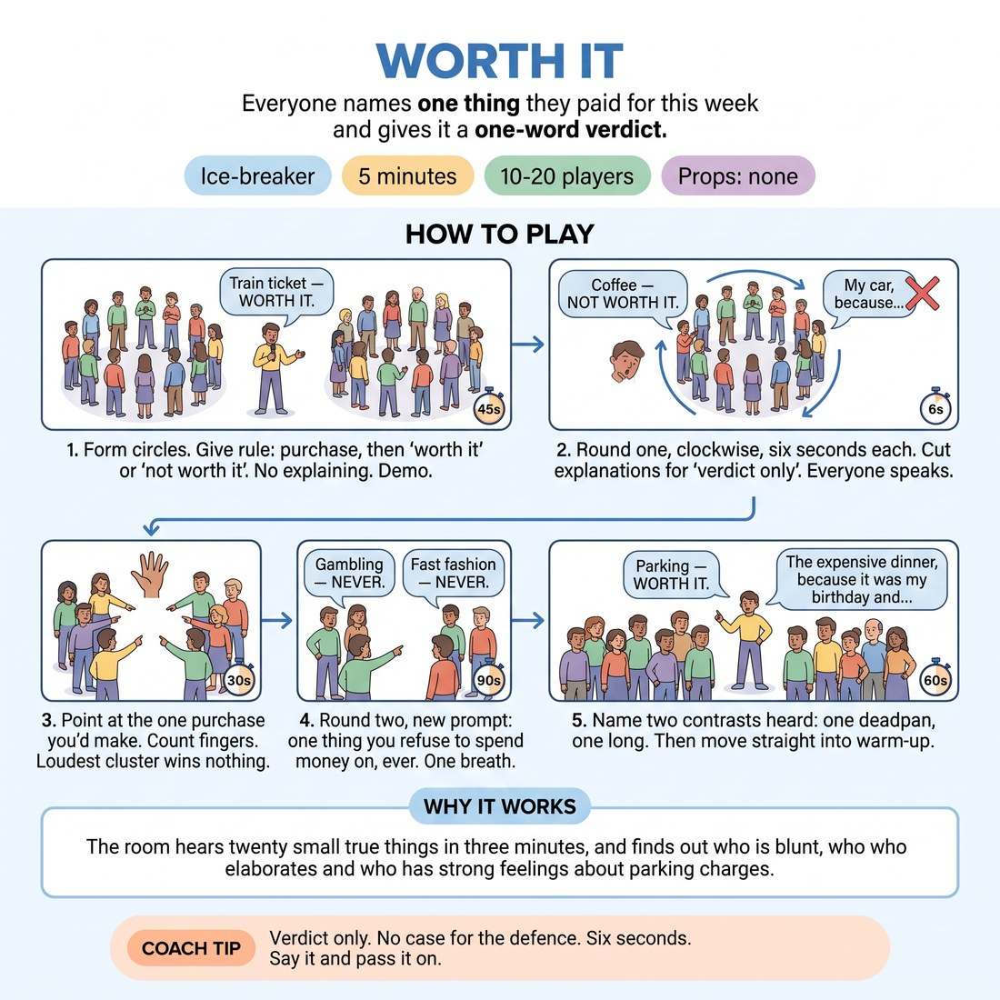

# 🧊 Ice-breaker — Worth It

{ .infographic }

> Everyone names one thing they paid for this week and gives it a one-word verdict.

`Players 10–20` · `~5 min` · `Complexity 2/5` · `Energy medium` · `Contact none` · `Props: none`

⬅️ [Back to the Week 04 run-sheet](../week-04.md)

## Why this activity, here

First thing in the room on the week about listening. It comes before any partner work and before the body-based listening exercises that fill the middle of the session. It gets every voice into the air inside two minutes, and it plants the week's problem in miniature: the moment you start composing your purchase, you stop hearing the person before you. The contrasts you name at the end are the reference points you call back to all morning.

## What students actually learn

- They notice the moment they stopped listening — usually three people before their turn, while rehearsing what to say.
- They find out a plain answer lands fine. Nobody needs a story attached to it.
- They hear the room's actual voices, including the quiet ones, before anyone has to perform anything.

## Setup

No props. Clear floor space for one or two standing circles. Have your own example ready before the door opens — something mundane, a train fare or a coffee — so the demo takes six seconds and not twenty. Know which direction is clockwise before you start so you are not deciding in front of them. If the room is echoey, tighten the circles.

## How to run it — 5 minutes

| Min | What you do |
|---:|---|
| 1 | Form circles. State the rule: one purchase from the last seven days, then 'worth it' or 'not worth it', no explaining. Demo yourself in six seconds. Point at who starts and which way it goes. |
| 1 | Round one, clockwise, no gaps. Six seconds each. Call 'verdict only' at anyone who starts explaining. Keep the pace unbroken so nobody has room to draft. |
| 1 | Finish round one if it is still running, then ask each circle: point at the one purchase you would have made yourself. Count the fingers aloud. Move on quickly. |
| 1 | Round two, same order, same speed. New prompt: one thing you refuse to spend money on, ever. One breath each. Do not chase the flat answers for more. |
| 1 | Bring the circles together. Name two contrasts you heard out loud — one deadpan, one that ran long. Say the cue: you cannot plan and listen at the same time. Go straight to the warm-up. |

## Side-coaching script

| When | Say |
|---|---|
| As you set the rule | *"Verdict only. No reasons."* |
| First person who starts explaining | *"Two words. Next."* |
| When the pace starts sagging mid-round | *"No gaps. Straight on."* |
| When someone is visibly drafting rather than listening | *"You will have something. Listen now."* |
| During the pointing count | *"Point fast. First instinct."* |
| Opening round two | *"Same speed. One breath."* |
| After a very flat answer gets a laugh | *"That worked because it was plain."* |
| Closing | *"You cannot plan and listen at the same time."* |

!!! success "What good looks like"
    The round moves like a metronome. Answers are short, mostly unfunny, and land anyway. Two or three people laugh at a purchase nobody expected — a parking fine, a second kettle. Nobody has told a story. When you name the contrasts at the end, people nod because they heard both. The whole thing is over before anyone has decided they are nervous.

## When it goes wrong

| You see | What's causing it | The fix |
|---|---|---|
| Answers keep growing — by person six they are thirty seconds long with a punchline. | The first two speakers set a length and everyone matched it. Your demo was probably too long. | Cut the next long one at three words with 'verdict only', cheerfully. Length resets within two people. Re-demo in six seconds if it drifts again. |
| Long pauses before each person speaks; heads down. | They are searching for an interesting purchase rather than a true one. | Call 'boring is fine — the last thing you tapped your card for'. Name a dull one of your own. Speed matters more than content here. |
| Round two produces awkward silence or something confessional about money worries. | 'Refuse to spend money on' can tip into real financial strain for some people. | Frame it before you start: 'a thing you think is a waste, not a thing you cannot afford'. Accept any answer and move straight on. |
| You overrun and the block eats the warm-up. | Circle of twenty run as one, or the pointing step turned into discussion. | Split at fourteen and up. Count fingers in one pass and stop. If you are behind after round one, drop the pointing step entirely. |

## Scaling

| Class size | What changes |
|---|---|
| **10–13** | One circle. Both rounds fit comfortably at six seconds each. Keep the pointing count — there is time for it. |
| **14–17** | Two circles of seven to nine. Run them simultaneously; you stand between them and side-coach across both. Pointing count happens in each circle at once, no reporting back. |
| **18–20** | Two circles of nine or ten, and drop to five seconds per person. If round one runs past ninety seconds, cut the pointing step and go straight to round two. Take your two closing contrasts from whichever circle you heard better. |

## Variations

**Worth It, Yesterday Only** — Restrict the prompt to purchases made yesterday or today. Fewer options, faster answers.  
*Easier — removes the search. Good for a nervous room or a group that arrived late and cold.*

**Verdict First** — Speaker says 'worth it' or 'not worth it' before naming the purchase. The circle guesses the item in one word before it is revealed.  
*Harder — adds a listening load and a small risk of being wrong in public. Only use with a group already at ease.*

**Echo Round** — Before giving your own answer, repeat the previous person's purchase and verdict exactly. Then add yours.  
*Different emphasis — forces retention over composition. Slower per person, so cut to one round and expect the whole block to run four minutes.*

## Debrief

1. **Who stopped listening, and how many people before their turn did it happen?**
   > *A good answer sounds like:* Someone names a number — three back, four back — and someone else recognises it. Not analysis, just the admission. Move on as soon as two people have said it.

2. **Did the short answers work less well than the long ones?**
   > *A good answer sounds like:* Someone says the flat ones were the ones they remember, or that the long one lost them. If the room says the long ones were better, let it stand and point out they still remember the flat ones.

!!! warning "Safety & inclusion"
    No contact. Standing is default; offer chairs and say so out loud before you begin — a circle of chairs works identically. Money is not neutral. Some people in the room are stretched. Frame round two as 'a waste of money' rather than 'cannot afford', and never ask for amounts or prices. Any pass is taken at face value: say 'pass' and the circle moves on with no comment from you. Anyone who arrives late joins the circle at the nearest gap and speaks when it reaches them.

## Why it works

Active listening fails for a predictable reason: the brain cannot compose and receive at once. This activity makes the answer so small — one object, two words — that there is nothing to compose. With drafting removed, attention has nowhere to go except the person speaking. Students then feel the difference directly rather than being told about it. The fixed clockwise order removes the second distraction, deciding when to go. The pointing count in the middle is a check: you can only point at a purchase you actually heard.

[Open the full activity card »](../../library/icebreakers/IB__worth-it.md){target=_blank rel=noopener}
