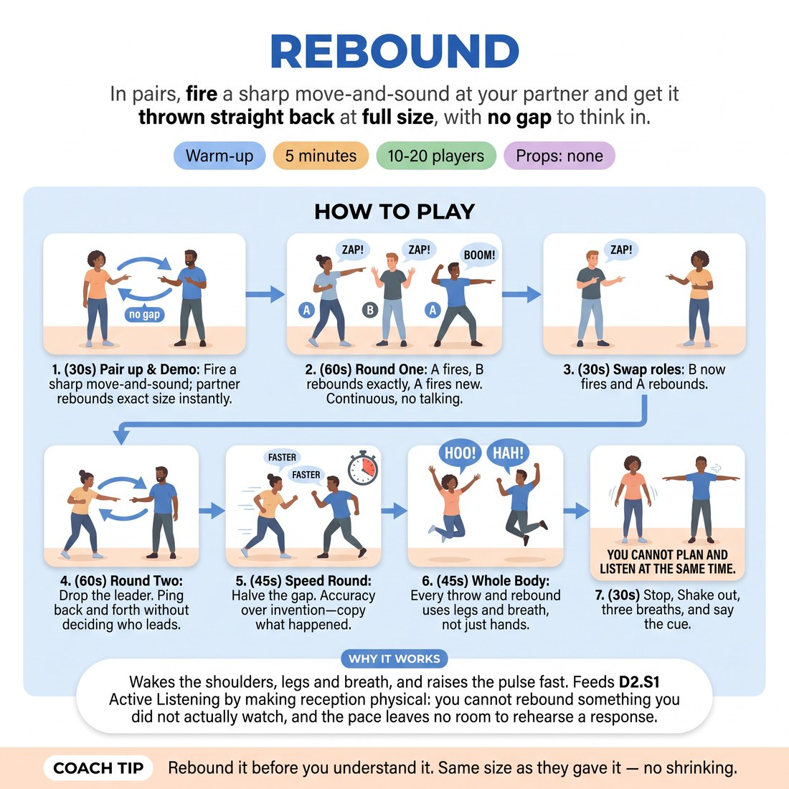

# 🔥 Warm-up cluster — Rebound

{ .infographic }

> In pairs, fire a sharp move-and-sound at your partner and get it thrown straight back at full size, with no gap to think in.

`Players 10–20` · `~5 min` · `Complexity 2/5` · `Energy high` · `Contact none` · `Props: none`

⬅️ [Back to the Week 04 run-sheet](../week-04.md)

## Why this activity, here

Opens Week 4. The room has arrived from the street with plans in their heads. This burns the planning gap out of them physically before any scene work, and gives you a shared bodily reference for 'received it' that you can point back to all session — especially in the listening exercises that follow, where the same gap shows up as a half-second of thinking before a reply.

## What students actually learn

- They feel the difference between copying what their partner did and copying what they assumed their partner would do.
- They notice the small pause where they plan, and find they can act before it closes.
- They stop treating listening as an ear job and start using legs, spine and breath to take something in.

## Setup

Clear floor, room to stand in pairs two arms' length apart with a metre between pairs. No props, no chairs in the way. You need a voice that carries over noise and a way to call time. Warn them at the door that the first five minutes are loud.

## How to run it — 5 minutes

| Min | What you do |
|---:|---|
| 1 | Pair everyone up, odd one out makes a trio. Demo once with a volunteer: sharp gesture plus sound, thrown back at full size. Set pairs facing each other and go. |
| 1 | Round one. A throws, B rebounds exactly, A throws something new. Continuous, no talking. At the halfway point call 'swap' — B now leads, A rebounds. |
| 1 | Drop the leader. Whoever just rebounded owns the next throw. Nobody decides. If it stalls, call 'anyone, now' and let it restart itself. |
| 1 | Speed round. Halve the gap. Call 'faster' twice. Remind them accuracy beats invention — they copy what actually happened, not a better version of it. |
| 1 | Whole body round: legs and breath in every throw and every rebound. Call stop at forty-five seconds. Shake arms out, three deep breaths, deliver the cue. |

## Side-coaching script

| When | Say |
|---|---|
| First ten seconds of round one | *"Full size. No apologising with your shoulders."* |
| When pairs start pausing between throws | *"No gap. Rebound before you understand it."* |
| When copies start drifting into new inventions | *"Copy what happened, not what you'd have done."* |
| Entering the leaderless round | *"Nobody's turn. Just go."* |
| Speed round, twice | *"Faster."* |
| Whole body round | *"Legs. Breath. Not just hands."* |
| If a pair goes quiet or polite | *"Louder than feels sensible."* |
| Final ten seconds | *"Last one each. Make it big, then stop."* |

!!! success "What good looks like"
    The room is loud and slightly ragged. Throws come back within a beat, at roughly the same size they were sent. People are off-balance, breathing hard, laughing at their own copies. In the leaderless round you cannot tell who is leading any pair. Nobody is standing still working out what to do next.

## When it goes wrong

| You see | What's causing it | The fix |
|---|---|---|
| Pairs politely trading tiny hand wiggles and small hums. | Self-consciousness. They are managing how they look rather than throwing. | Call 'twice the size' and demo one enormous throw yourself. Volume from you gives permission faster than instruction does. |
| A visible pause before each rebound, sometimes with a small nod or laugh. | They are decoding the gesture before reproducing it, which is planning. | Call 'rebound before you understand it'. Then run the speed round early — the gap cannot survive the pace. |
| Rebounds that are clearly new ideas rather than copies. | They have heard 'improv' and think they must contribute something original. | Say plainly: this round has no invention in it. Copying is the whole job. Point at one accurate pair as the model. |
| The leaderless round stalls and pairs stand looking at each other. | Both are waiting to be given permission. | Call 'anyone, now' and keep calling it. Do not explain the rule again mid-round; the stall resolves in two seconds if you keep the pressure on. |

## Scaling

| Class size | What changes |
|---|---|
| **10–13** | Straight pairs, one trio if odd. Run exactly as written. You can watch every pair from one spot, so side-coach individuals by name. |
| **14–17** | Straight pairs. Stand in the middle rather than at the front so your calls reach both halves. Cut the leaderless round to forty seconds if the noise makes calls inaudible, and give the time back to the speed round. |
| **18–20** | Straight pairs, two blocks of five or six pairs on either side of the room so you can move between them. Give all calls twice, once to each side. Skip the individual demo partner — demo with the whole room copying you at once, which saves twenty seconds and warms everyone. |

## Variations

**Sound only** — Remove gestures. Throws are pure vocal shapes — a bark, a sigh, a rising whine — rebounded exactly.  
*Easier. Removes the body self-consciousness that stops beginners committing, and isolates listening.*

**Rebound plus one** — After the copy, the rebounder adds a small extension before throwing back — same gesture, one degree bigger or one beat longer.  
*Harder. They must receive accurately and offer, in the same breath, with no planning gap.*

**Across the circle** — Whole group in one circle. Throw to any individual by eye contact. They rebound to you, then throw on to someone else.  
*Different emphasis. Shifts from partner listening to group attention and reading who is about to go.*

## Debrief

1. **Where in the exercise did you notice yourself planning?**
   > *A good answer sounds like:* Something specific and small — 'in the gap right before I copied', 'when I liked their gesture and wanted to top it'. Not a general statement about being nervous. Once two people name the gap, move on.

2. **What happened to your copies when we went faster?**
   > *A good answer sounds like:* They got more accurate, or looser but closer. Someone says they stopped thinking and just did it. If everyone says 'worse', ask whether worse meant less tidy or less like their partner — the distinction is the point.

!!! warning "Safety & inclusion"
    No contact at any stage, and no touching your partner's body to correct a gesture. Say at the start that anyone with a shoulder, back, knee or voice issue works at their own range — a small accurate copy is a correct copy, and volume is optional. Anyone who prefers not to make sound can rebound the gesture with breath only. Keep pairs a metre apart so big throws do not collide. If someone would rather sit this one out, give them the job of watching one pair and reporting back in the debrief.

## Why it works

D2.S1 treats listening as a whole-body act, not an ear act. Rebound removes the interval in which planning happens: at full pace, the only reply available is the one your partner just gave you, so accuracy becomes the path of least resistance. Copying is a physical measurement of how much you actually received — you cannot fake a gesture you did not take in. The speed and whole-body rounds then push attention out of the head and into legs and breath, so 'listening' registers as something the body did rather than something the mind processed. The cue lands because they have just failed to do both at once, repeatedly, and felt it.

[Open the full activity card »](../../library/warmups/WU__rebound.md){target=_blank rel=noopener}
