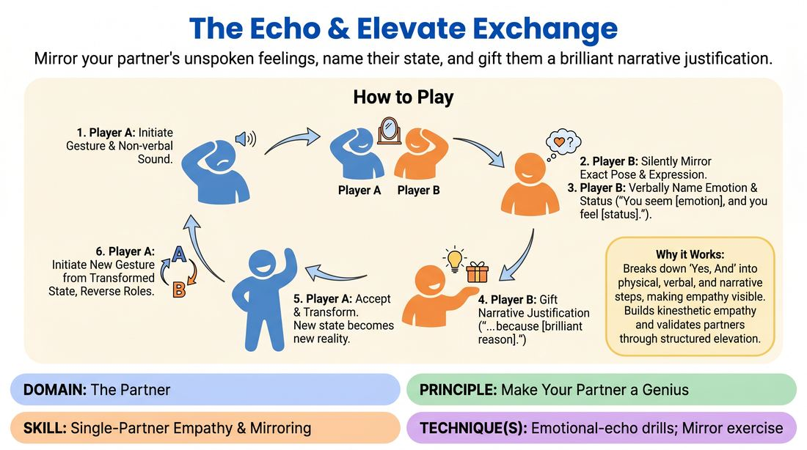

# 🎲 Drill A — isolation — The Echo and Elevate Exchange

{ .infographic }

> Mirror your partner's unspoken feelings, name their state, and gift them a brilliant narrative justification.

`Players 2–99` · `~30 min` · `Complexity 2/5` · `Energy medium` · `Contact none` · `Props: none`

⬅️ [Back to the Week 04 run-sheet](../week-04.md)

## Why this activity, here

Week 4 is the listening week, and this is the first drill of the day. It isolates one thing: receiving a partner before responding. Everything after it — the scene work later in the session — assumes players can take in an offer physically, not just note it intellectually. This drill installs the physical intake step. It feeds directly into the endowment and status work in later weeks, and it gives you a shared phrase — 'copy first, talk second' — to call back to all term.

## What students actually learn

- They notice that copying someone's body tells them things watching it doesn't.
- They stop preparing a response while their partner is still offering, because their body is busy.
- They find that naming an emotion out loud, even wrongly, moves a scene forward faster than hedging.
- They start treating a partner's state as raw material to build on rather than something to react to.

## Setup

Clear floor space so pairs can stand a metre apart without touching neighbours. No chairs, no props, no writing. You need nothing but room. If the space is echoey, spread pairs to the walls before starting — this drill gets loud and pairs need to hear each other. Have a spot at the front where two people can be seen by everyone for the demo. If numbers are odd, plan a trio in advance: in a trio the loop passes round the circle, A to B to C to A.

## How to run it — 30 minutes

| Min | What you do |
|---:|---|
| 3 | Demo with one volunteer at the front. You make a gesture and sound. They mirror it silently. Then you talk them through the naming line and the reason. Show one full exchange, then swap and show one more. |
| 4 | Mirroring only. In pairs, A offers a gesture and sound, B copies it silently and holds for three seconds. No words at all. Swap every offer. Ten or twelve exchanges each. |
| 5 | Add the naming line. Same loop, but after mirroring, B says 'You seem [emotion], and you feel [status].' Stop there — no reason yet. Keep swapping. Push for plain words, not poetry. |
| 6 | Add the endowment. Full formula now: mirror, name, give a reason. A accepts and lets it land, but does not yet start a new offer. Reset after each exchange. Swap roles each time. |
| 8 | Run the full loop continuously. A's new gesture comes out of the state the endowment created. No resets. Call a partner swap at four minutes so everyone plays with a second person. |
| 4 | Stop and take the debrief questions with the whole room standing. Keep it short and specific. Finish with the cue sentence said aloud. |

## Side-coaching script

| When | Say |
|---|---|
| First mirroring round, when people copy from the neck up only | *"Whole body. Feet too."* |
| When B starts talking before finishing the copy | *"Copy first, talk second."* |
| When naming turns into hedging or long sentences | *"Six words. Say the obvious one."* |
| When someone visibly hesitates over being wrong | *"Wrong is fine. Wrong is still an offer."* |
| When endowments get small, jokey or insulting | *"Make it bigger. Make it good for them."* |
| When A receives the endowment without changing | *"Let it land in your body."* |
| Full loop round, when pairs slow to think | *"Don't plan the next one. It's already there."* |
| Four minutes into the full loop | *"Find a new partner. Straight in, no chat."* |

!!! success "What good looks like"
    The room is noisy with sighs, grunts and short declarative sentences, and nobody is laughing at their own line. Bodies visibly change shape when an endowment lands — someone who was hunched straightens, someone tall shrinks. The naming lines are boring and accurate rather than clever. Pairs are not stopping between exchanges to discuss or apologise. When you call a swap, people move fast and start again within a few seconds.

## When it goes wrong

| You see | What's causing it | The fix |
|---|---|---|
| B glances at A, then delivers a fully formed line while barely changing posture. | They are diagnosing from the outside instead of copying. It is faster and feels safer, and it produces generic emotions. | Stop the room. Go back to silent mirroring only for one minute. Tell them the naming line must come out of the copied body, not the observing eye. |
| Endowments that make the partner ridiculous — 'because you wet yourself', 'because nobody likes you'. | Nerves converted into gags. It gets a laugh and shuts the loop down, because A has nowhere generous to go. | Name it neutrally: 'That's a joke, not a gift.' Ask for one round where every reason makes the partner more interesting or more competent. |
| A hears the endowment, says 'yes' or nods, and offers the same gesture as before. | They are accepting verbally but not physically. The transformation step is being skipped because it feels like acting. | Call 'let it land' and add two seconds of silence after each endowment before the new offer. Coach one pair out loud so the room sees the change. |
| Long pauses; people looking at you rather than their partner. | They are trying to construct a good reason. Planning has crept back in. | Say the cue: you cannot plan and listen at the same time. Tell them the first reason that arrives is the one they use, however ordinary. |

## Scaling

| Class size | What changes |
|---|---|
| **10–13** | Five or six pairs, one trio if odd. Run exactly as written. You can hear every pair, so side-coach individuals by name. One partner swap in the final round is enough. |
| **14–17** | Seven or eight pairs. Spread them to the edges of the room before the first round or the naming lines get drowned. Two partner swaps in the final round: call them at three minutes and six minutes. Shorten the demo to one full exchange to protect the time. |
| **18–20** | Ten pairs. Split the room into two halves working simultaneously at opposite ends, and walk between them. Do the demo once for the whole room before splitting. Keep two partner swaps but call them with a clap rather than your voice. If it is too loud to coach, drop the final round to seven minutes and give the extra minute to the debrief. |

## Variations

**Named menu** — Before starting, write six emotions and three status words on the board. Players choose their naming line from the board only.  
*Easier. Removes the vocabulary hunt, which is what stalls beginners in the naming step.*

**No formula** — Drop the sentence template in the final round. B mirrors, then says whatever the copied body tells them, then gives the reason. Same loop, no scaffolding.  
*Harder. Players must generate structure themselves, and the naming gets more specific once the formula stops carrying it.*

**Endow the room** — Same loop, but the reason must be about where they are, not what happened to them. 'Because this is the last dry room in the building.'  
*Different emphasis. Shifts from emotional endowment to environment, and gives players an early taste of building a shared place.*

## Debrief

1. **What did copying your partner's body tell you that watching it didn't?**
   > *A good answer sounds like:* Something physical and specific — they noticed a held breath, a locked jaw, weight on one leg, and the emotion arrived from that rather than from a guess. If answers stay abstract, ask one person to demonstrate the posture they copied.

2. **When your partner named your state wrongly, what happened?**
   > *A good answer sounds like:* They report that it did not matter, or that the wrong name was more interesting than the one they intended. Move on as soon as two people say this — it is the point of the drill.

3. **What did it feel like to receive a reason you didn't choose?**
   > *A good answer sounds like:* Relief, or surprise at how little work it was. Someone may admit they wanted to modify it. Acknowledge that urge by name — it is the same urge as planning — then close on the cue.

!!! warning "Safety & inclusion"
    No contact is required at any point; mirroring happens at a distance. Say this before the first round. Anyone uncomfortable copying faces can mirror posture and breath only, and should be told so publicly rather than having to ask. Endowments are about the fictional situation, never about the real person — no comments on bodies, accents or anything a player has told the room about their life. Say that out loud during the demo. Anyone who wants to sit a round out can, and rejoins at the next swap without explanation. Watch for pairs where one player consistently gets low-status endowments; break that pair at the swap. If a named emotion lands too close to something real, players may say 'different one' and their partner offers again — no discussion.

## Why it works

The session skill is active listening and the cue is that you cannot plan and listen at the same time. This drill enforces the cue mechanically rather than asking for it. Mirroring occupies the body and the attention completely for several seconds, so there is no spare capacity to draft a response — the response has to be built after the intake finishes. The naming formula then forces a commitment to something actually perceived, because there is no time to invent an alternative. The endowment step gives the listening somewhere to go: what you took in becomes material you hand back. And because A must physically accept the reason, the loop only continues if each player has genuinely received the previous offer. A pair that stops listening visibly stalls, which makes the failure legible to them without you saying anything.

[Open the full activity card »](../../../../games/D2_P3_S3_T2_G099__the-echo-elevate-exchange.md){target=_blank rel=noopener}
