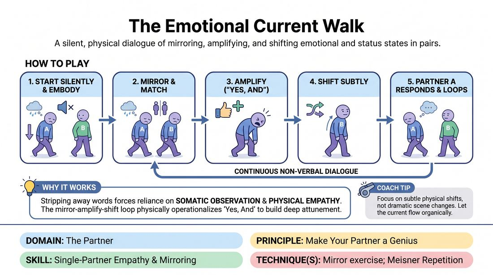

# 🎲 Drill B — under load — The Emotional Current Walk

{ .infographic }

> A silent, physical dialogue of mirroring, amplifying, and shifting emotional and status states in pairs.

`Players 2–99` · `~30 min` · `Complexity 2/5` · `Energy medium` · `Contact none` · `Props: none`

⬅️ [Back to the Week 04 run-sheet](../week-04.md)

## Why this activity, here

Week 4 has already run a low-load listening drill where students watch and copy at rest. This is the same skill under movement, silence and continuous handover — no words to hide behind, no pause to prepare in. It feeds the scene work later in the session, where students must accept a partner's emotional offer physically before they answer it verbally.

## What students actually learn

- That they can read a partner's state from the body alone, and that they are more accurate at it than they assumed.
- That amplifying someone else's offer before changing it feels different from overriding it — and that partners notice the difference.
- That planning the next move makes them stop seeing the current one. The loop breaks the moment they get ahead of it.
- That silence is workable. Most of them arrive believing they need words to keep something alive.

## Setup

Clear the floor of chairs and bags — you need walking room for the whole group at once. No props, no music. Pair people off; a trio is fine if the number is odd. Ask anyone with a knee, hip or balance issue to tell you now so you can offer the seated version. Have a clap or a drum ready for stops.

## How to run it — 30 minutes

| Min | What you do |
|---:|---|
| 4 | Frame the drill and demonstrate with one volunteer. Show all three beats slowly: you walk a state, they match it, they amplify it, they shift it. Name each beat aloud as it happens, then declare silence. |
| 4 | Match only. A walks a state, B follows and copies. No amplifying, no shifting. Call a swap at two minutes so B leads and A copies. Watch for people copying an idea instead of a body. |
| 5 | Match then amplify. Same leader-follower structure, but the follower now deepens what they see and holds the bigger version for a few steps. Swap at two and a half minutes. Still no shifting. |
| 8 | Full loop. Mirror, amplify, shift, hand over, repeat. No fixed leader. Let it run without interruption for the first three minutes, then side-coach sparingly. Clap to freeze at the end. |
| 4 | Change partners. Run the full loop again with new pairs, straight in, no re-explaining. Tell them to start from wherever their body already is rather than choosing a state cleverly. |
| 5 | Sit the group down where they are. Run the debrief questions. Keep it to observations of what happened, not appraisals of who was good. |

## Side-coaching script

| When | Say |
|---|---|
| Early in the match-only round, when people are copying vaguely | *"Copy the feet. Copy the shoulders. Get it exact."* |
| When followers rush past the match to their own idea | *"Match first. You have not matched yet."* |
| During the amplify round, when changes are timid | *"More of the same thing. Not a different thing."* |
| Entering the full loop | *"Small shifts. Next door, not across town."* |
| When a pair drifts apart across the room | *"Stay within arm's reach. Keep them in your eyes."* |
| When someone visibly plans their next state while their partner is still leading | *"You cannot plan and listen at the same time. Drop the plan."* |
| Mid-loop, when the room goes hectic and comic | *"Slow the walk down. Let it be dull for a moment."* |
| Ten seconds before the final freeze | *"Wherever you are now, hold it. Hold it. Stop."* |

!!! success "What good looks like"
    The room goes quiet and slightly odd. Pairs are moving at similar tempos, close together, faces genuinely engaged rather than mugging. Handovers are hard to spot from outside — you cannot tell who led that change. States drift gradually across a few minutes: pride becomes swagger becomes brittleness becomes worry. Nobody is standing still waiting for an instruction, and nobody is racing.

## When it goes wrong

| You see | What's causing it | The fix |
|---|---|---|
| Pairs performing a comic double act — big cartoon walks, silent laughing, playing to the room. | Silence makes people uncomfortable and comedy relieves it. They are avoiding the exercise, not sabotaging it. | Freeze the room. Tell them the drill is small and boring on purpose, and that anything visible from ten metres away is too big. Restart at half speed. |
| The follower changes the state instantly, without ever looking like the leader. | They have prepared a state and are waiting for a gap to insert it. Classic planning under load. | Send them back to match-only for thirty seconds. Say: 'Do nothing new until I can see two of you.' Rejoin the loop after. |
| Shifts jump wildly — grief to euphoria to rage — and the current feels random. | They read 'shift' as 'invent'. Nobody has told them how far is too far. | Give a numeric handle: one notch on the dial. Say 'if your partner cannot tell what your shift came from, it was too big.' |
| One or two people stop moving and watch, arms folded. | Either self-consciousness or a partner who is not offering anything readable. | Join them yourself as a third body for a minute. Lead a very simple state — tired, heavy, slow — and let them copy something easy before you step out. |

## Scaling

| Class size | What changes |
|---|---|
| **10–13** | One group, everyone moving at once. Five or six pairs fits comfortably in a standard studio. Run the timings as written; you have space to walk between pairs and coach individually. |
| **14–17** |  |
| **18–20** | Split into two halves and alternate: half walks, half sits at the edge and watches for two-minute stretches during the eight-minute loop round. Watchers get one instruction — spot the handover. Cut the partner-change round to three minutes and add a minute to the debrief.ppairs on the floor at once is too many for the space and for your eye..pairs is the ceiling.and and amplify rounds full-group as written.  full-group, then split for the loop.pit into two halves for the loop round only..match and aming full-group..the amount and the debrief..a single wave.pairairs is the ceiling.the second is fine.,.  from the edge in pairs.  ate pairairs on the floor.  the whole time..at once.the amount of.the whole way..together.  the room.  the pairs.  the loop.  the space.  the group.  the drill.  the timings hold.  ..ppairs on the floor at once is too many; halve the room and alternate two-minute stretches during the loop, with watchers spotting handovers. Cut the partner change to three minutes and add one to the debrief., peight...., but keep the timings as written.  ,,  .   . .. Keep the timings.and amplify rounds full-group, then alternate halves for the loop.,  keeping the timings otherwise unchanged.  ...ppairairs is the ceiling, so alternate.  .  .. . . .... . ..ppairs.. .. |

## Variations

**Two-notch dial** — Drop the shift entirely. Partners only match and amplify, holding each state for a long count of ten before the leader chooses a new one and the follower catches up.  
*Easier — removes the hardest beat and lets nervous groups get comfortable with sustained copying and silence first.*

**Blind handover** — Run the full loop but ban any deliberate signal of the handover. Neither partner may indicate they are about to shift; the other must simply notice and follow.  
*Harder — forces continuous attention rather than waiting for a cue, and exposes anyone tracking the clock instead of the person.*

**Status only** — Same loop, but the only thing passed is status — height in the spine, eye contact, how much space taken. Emotion is left out entirely.  
*Different emphasis — isolates status as a readable physical variable, which sets up status work in later weeks without the noise of emotional content.*

## Debrief

1. **When did you stop being able to tell who was leading?**
   > *A good answer sounds like:* Someone describes a stretch of a minute or two where the handovers blurred, and says it happened when they stopped deciding and just kept copying — not when they were trying hardest.

2. **What happened in your body when you started planning your next shift?**
   > *A good answer sounds like:* A concrete report of going blank on the partner: 'I looked at her but I wasn't seeing her', 'I missed two of his changes', 'I was rehearsing a face.' They connect planning to a specific missed offer.

3. **Which was harder — matching, amplifying, or shifting?**
   > *A good answer sounds like:* Split answers, with reasons attached. Often amplifying, because it feels like showing off, or matching, because it feels like doing nothing. Move on once two or three different answers are on the floor.

4. **Where does this show up in a scene with words?**
   > *A good answer sounds like:* Someone names taking their partner's tone or physicality before replying, rather than waiting with a line loaded. They should be describing behaviour, not stating the principle back at you.

!!! warning "Safety & inclusion"
    No contact is required and none should happen — say this before you start, and say that following closely means within arm's reach, not touching. Anyone who prefers more distance sets it and their partner respects it. Offer a seated version from the first minute: the same loop played in the chair with torso, arms, head and face only, and pair a seated player with a seated or standing partner as they prefer. Say that grief, fear and shame will come up as physical states and that anyone can shift to something lighter at any moment without explaining. Someone who wants to step out sits at the edge and watches for handovers; they rejoin at the partner change.

## Why it works

Active listening fails because attention is finite and preparation eats it. This drill removes speech, which is where most adults store their planning, and replaces it with an obligation that cannot be met in advance: you must reproduce a body you have not yet seen. Matching forces intake. Amplifying forces the student to keep looking after the first read, because the exaggeration has to be of this specific thing, not a generic version. The shift only becomes available once the match is done, so the sequence physically enforces the order — receive, confirm, then contribute. When a student does plan ahead, the loop breaks visibly within seconds and both partners feel it. That is the lesson in the cue arriving as sensation rather than instruction.

[Open the full activity card »](../../../../games/D2_P3_S3_T1_G483__the-emotional-current-walk.md){target=_blank rel=noopener}
