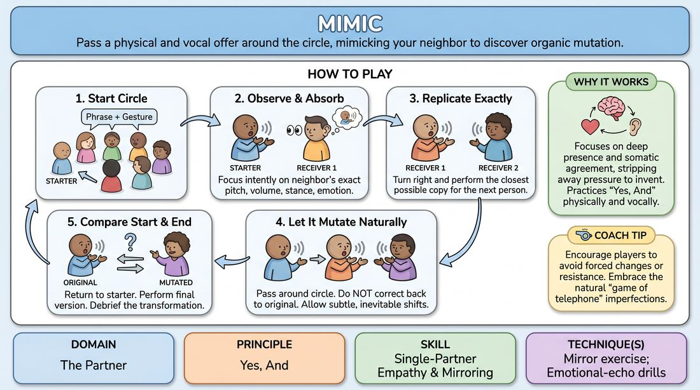

# 🎯 Scene Lab — The Echo Chamber

{ .infographic }

> Pass a physical and vocal offer around the circle, mimicking your neighbor to discover organic mutation.

`Players 4–99` · `~30 min` · `Complexity 2/5` · `Energy medium` · `Contact none` · `Props: none`

⬅️ [Back to the Week 04 run-sheet](../week-04.md)

## Why this activity, here

Week 4 has been building attention outward — noticing partners rather than managing yourself. Warm-ups gave them noticing in short bursts. This block makes noticing the entire job for a sustained pass around a circle, with an audible result at the end. It feeds directly into scene work later in the course, where the offer you receive is the only material you get. It also sets up the cue: the moment anyone starts planning their version, their copy degrades, and the circle hears it.

## What students actually learn

- They feel the exact moment attention slips into preparation, because their copy immediately goes vague.
- They stop treating detail as optional. Pitch, weight and tempo become things they actually register, not adjectives.
- They discover that variation arrives on its own and does not need to be manufactured.
- They get comfortable performing something that is not their own idea, in front of others, without it being judged as clever.

## Setup

Clear floor space for a standing circle with an arm's length between people. No chairs in the ring. Have three or four short phrases in your pocket in case a starter freezes — plain ones like "I left it on the table" or "That is not what we agreed". No props, no music. If anyone cannot stand for thirty minutes, seat them in the circle at the same spacing; the exercise works seated.

## How to run it — 30 minutes

| Min | What you do |
|---:|---|
| 4 | Circle up. Explain the rule in two sentences: copy the person to your left, pass to your right, copy only what you just got. Demonstrate one pass yourself with a volunteer, deliberately plain. |
| 6 | Round one, slow. Choose a starter. Let each pass take its time. Do not rush anyone. When it returns, have the starter show what arrived, then the original. Note the difference out loud in one sentence. |
| 5 | Round two, new starter, other direction. Ask for a phrase with a clear emotional colour. Same pace. Side-coach for physical detail — feet, spine, hands — not just voice. |
| 7 | Round three. Send two offers at once from opposite sides of the circle, both travelling the same way. They will collide and pass through. Tell people to take whichever arrives and let the other go. |
| 4 | Round four, fast. One offer, no pause between passes. Tell them speed is fine, accuracy is the job. This round usually mutates hardest. Let it. |
| 4 | Debrief standing in the circle. Two or three questions, short answers, no long stories. Land the cue and move on. |

## Side-coaching script

| When | Say |
|---|---|
| As the first offer starts travelling | *"Watch the whole body, not just the face."* |
| When copies become vague or generic | *"Copy the feet. Copy the hands."* |
| When someone hesitates before their turn | *"Take it as it comes. Do not prepare."* |
| When someone plays for a laugh | *"No jokes. Just accurate."* |
| Mid-round, when the version has clearly drifted | *"Copy who is in front of you, not who started."* |
| During the fast round | *"Speed is fine. Detail is the job."* |
| When people start commenting or reacting between passes | *"Silence between passes. Only the offer speaks."* |
| Just before the offer returns to the starter | *"Take what arrives. Do not fix it."* |

!!! success "What good looks like"
    The circle goes quiet between passes. Heads turn as a unit toward whoever is performing. Copies land within a second or two of the original being finished, without a visible think. The version that returns is recognisably descended from the original but genuinely different — usually bigger, slower, or with the emotional weight shifted. Nobody has tried to be funny, and people laugh anyway when the two versions are placed side by side.

## When it goes wrong

| You see | What's causing it | The fix |
|---|---|---|
| People add a deliberate twist each time — a funnier voice, a bigger gesture. | They think mutation is their job to supply, and they are performing for the circle rather than the neighbour. | Stop the round. Say: your only job is accuracy, the change happens without you. Restart with an instruction to copy exactly and boringly. |
| Copies flatten fast — the phrase survives but the body and voice go neutral within four passes. | People are listening to words only. The physical and vocal information is not being registered at all. | Run a pass where nobody speaks — gesture and posture only. Then reintroduce the phrase. Side-coach feet and hands specifically. |
| Long pauses before each person's turn, eyes going up and to the side. | They are rehearsing internally instead of receiving. Classic planning-over-listening. | Call the cue: you cannot plan and listen at the same time. Speed the round up so there is no room to prepare. |
| The circle goes fully silent and tense; people apologise for their copies. | It has become an accuracy test with a right answer, and people fear failing publicly. | Say out loud that a bad copy is useful data and the drift is the point. Take a deliberately poor copy yourself in the next round. |

## Scaling

| Class size | What changes |
|---|---|
| **10–13** | One circle, four rounds as written. The offer returns quickly, so drift is subtle — spend more of the debrief on what specifically changed. You can add a fifth short round if time allows. |
| **14–17** | One circle, four rounds. Trim round one to five minutes and give round three the extra minute; the double-offer collision needs longer with more bodies. Drift is more pronounced, which helps. |
| **18–20** | Two circles of nine or ten, side by side, running simultaneously. You side-coach both from between them. Cut to three rounds per circle. For the last two minutes, have each circle's starter show their before-and-after to the other circle. |

## Variations

**Sound and shape only** — Remove the phrase. Pass a single non-verbal sound plus one gesture. No words at all.  
*Easier — strips out semantic content, so people cannot cheat by remembering words and skipping the body.*

**Two lines, two directions** — Send one offer clockwise and one anticlockwise from the same starter, at the same time. Each person handles both when they arrive.  
*Harder — the attention load doubles and there is no space at all for internal rehearsal.*

**Name the change** — After each pass, the receiver states in three words what they noticed most before performing. "Heavy shoulders." "Rising pitch."  
*Different emphasis — moves the skill from reproducing to articulating, which sharpens what people notice in later scene work.*

## Debrief

1. **What changed between the first version and the last?**
   > *A good answer sounds like:* Specific observations rather than judgements — "it got slower and the hands dropped", "the question turned into a threat" — rather than "it got weird" or "we ruined it".

2. **When did you stop listening?**
   > *A good answer sounds like:* Honest naming of the planning moment: "I started working out my version halfway through hers", or "I panicked about the gesture and missed the voice entirely".

3. **Did anyone deliberately change something? What happened to the copy after you?**
   > *A good answer sounds like:* Someone admits adding a twist, and the person after them recognises they received something inflated. The group sees that manufactured change swamps the natural drift.

4. **What was easiest to copy, and what disappeared first?**
   > *A good answer sounds like:* Words survive, tempo survives a while, subtext and posture go first. Recognition that the hardest thing to receive is the part that carries meaning.

!!! warning "Safety & inclusion"
    No contact in this activity — people stay an arm's length apart. Say so at the start, since standing circles can feel crowded. Anyone who prefers to sit does so in the circle at the same spacing and passes normally. Anyone who wants to pass their turn says "pass" and turns to the next person, who takes the offer from the last performer instead; make this option explicit before round one, not after someone struggles. Copying a person's voice or body can feel exposing — say plainly that you are copying the offer, not the person, and rule out copying accents, disabilities or anything tied to someone's identity. Keep volume moderate for anyone sensitive to noise.

## Why it works

Active listening fails because attention is a single channel and rehearsal occupies it. This activity makes that failure audible. Reproduction is the only task, so any second spent planning shows up immediately as a degraded copy that the next person then inherits and degrades further. The group hears the cost of not listening, several passes downstream, without anyone being told off. The mutation at the end is evidence: nobody tried to change it, and it changed anyway — which teaches that originality is a by-product of attention, not something you have to supply from your own head. That undercuts the beginner's instinct to arrive with material.

[Open the full activity card »](../../../../games/D2_P2_S3_T1_G768__mimic.md){target=_blank rel=noopener}
