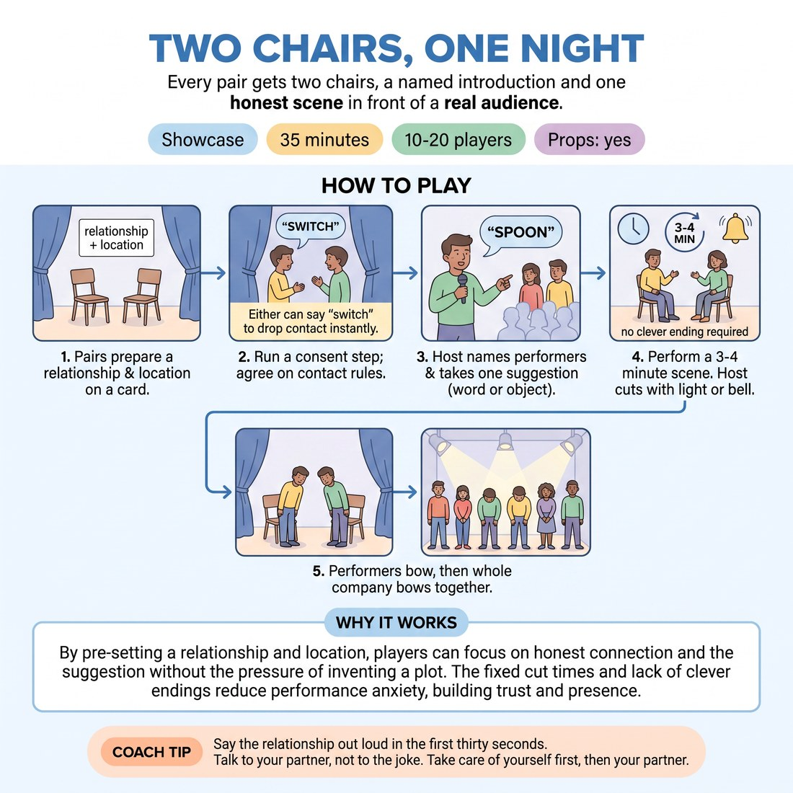

# 🏟️ Showcase round — Two Chairs, One Night

{ .infographic }

> Every pair gets two chairs, a named introduction and one honest scene in front of a real audience.

`Players 10–20` · `~25 min` · `Complexity 2/5` · `Energy medium` · `Contact negotiated` · `Props: required`

⬅️ [Back to the Week 04 run-sheet](../week-04.md)

## Why this activity, here

Week four is the halfway mark and the first time the class plays for an audience rather than for each other in scattered pairs. The warm-ups and listening drills earlier in the session strip out plotting; this block asks whether that holds when people are watched. It also rehearses the exact shape of the week-eight showcase — chairs, host, card, suggestion, bow — so the final night contains no new mechanics, only better scenes. What it feeds: week five's work on physical listening has a shared reference point, because everyone has now felt what happens to their attention when twelve people are looking at them.

## What students actually learn

- That the plan they made in their head was never as good as the thing their partner just said.
- That an audience is a room of allies, not examiners — a fact you cannot argue someone into, only let them experience.
- That a scene ending badly is survivable, and the bow happens anyway.
- That owning a relationship in advance frees you to listen, because you no longer have to invent who you are.

## Setup

Two chairs centre, matched, angled about fifteen degrees out so both performers are visible. Everything else pushed to the walls. Audience seating in a shallow arc, close — three metres, not ten. Index cards and pens, one per pair. A bell, a chime app or a light switch you can reach without crossing the playing area. A clock you can see. If the room has separate lights, set a simple state for scenes and a brighter one for the bow. Know how many pairs you have before you start and write your per-scene length on your hand.

## How to run it — 25 minutes

| Min | What you do |
|---:|---|
| 3 | Pairs to the edges of the room. Run the consent step: each names aloud what contact is fine and both confirm "switch" drops it instantly. Then they write relationship and location on a card. Collect the cards. |
| 2 | Bring everyone to the audience arc. Show the two chairs. State the scene length, that the bell ends it, and that nobody has to end cleverly. Set the running order and read it out. |
| 8 | Run the first half of the slots. Name both performers, read the card, take one word or object from the audience, go. Cut on the bell. Both bow. Applaud. Next pair straight up. |
| 7 | Run the second half the same way. No notes between scenes. If energy dips, take the suggestion faster and cut the gap between pairs, not the scenes. |
| 3 | Call every pair onto the stage area. One line, one company bow on your count. House lights up. Thank the room out loud, using as many names as you can. |
| 2 | Everyone stays standing in a loose circle. One question only, popcorn answers, no going round. Then release them to the break. |

## Side-coaching script

| When | Say |
|---|---|
| As pairs fill in their cards | *"Relationship and place only. Nothing about what happens."* |
| A pair huddles and starts whispering a plan before their slot | *"Put it down. You already know who you are."* |
| Just before you take the suggestion | *"Take it and forget it. It's a door, not a script."* |
| Early in a scene where both are talking over each other | *"Slower. Answer the last thing."* |
| A performer's eyes go to the floor or the ceiling mid-scene | *"Eyes up. Take it off their face."* |
| The audience has gone silent and stiff | *"Watch like you want them to win."* |
| Performers apologise or grimace after the bell | *"Bow. Don't explain."* |
| Calling the company bow | *"All in, one line, on three."* |

!!! success "What good looks like"
    Scenes start slowly and stay small. Two people sitting down, talking about something ordinary, with the suggestion showing up naturally rather than being announced. You hear one person change direction mid-sentence because of what the other said. The bell lands somewhere unresolved and nobody minds. Bows are quick and clean. The audience laughs in the middle of scenes rather than at the end. Between slots the room resets in under fifteen seconds. At the company bow people are looking at each other, not at you.

## When it goes wrong

| You see | What's causing it | The fix |
|---|---|---|
| A pair huddled in the corner during the previous scene, heads together, whispering. | They are writing a script because the audience frightens them. They will then perform the script and hear nothing. | Physically separate waiting pairs — one on each side of the arc. Say once, publicly: the card is the whole plan. Repeat before the second half. |
| Scenes collapse into a scramble for a punchline in the last twenty seconds. | They believe a scene must be resolved to be acceptable, so they are watching the clock instead of each other. | Cut mid-sentence deliberately on the next two scenes. Applaud loudly. Point out afterwards that the unfinished ones were the ones people leaned into. |
| One performer drives everything, the other says yes and nothing else. | Unequal nerves, not unequal ability. The quieter one is waiting to be given something safe. | Before their next slot, tell the quieter one privately: make the first statement, before your partner speaks. Tell the driver to leave four seconds of silence at the top. |
| Suggestions come out as jokes — increasingly silly words shouted from the arc. | The audience is nervous and deflecting with humour, and it raises the pressure on the pair. | Ask for an object someone can see in the room. Take the first one offered, every time. Do not shop for a better suggestion. |

## Scaling

| Class size | What changes |
|---|---|
| **10–13** | Five to seven pairs. Give each scene two and a half minutes and keep the full run in one unbroken block of fifteen minutes. You have room for a genuine pause and a proper laugh between slots. |
| **14–17** | Seven to nine pairs. Drop scenes to two minutes and take suggestions before the previous pair has fully cleared. Split the run at the halfway point exactly as timed, with no talking in the gap — just a reset. |
| **18–20** | Nine to ten pairs. Ninety seconds per scene, bell hard on time, no exceptions. Read the card while the pair is walking to the chairs. Say up front that short scenes are the format tonight, not a punishment — it protects the last pairs from a rushed, apologetic slot. |

## Variations

**Card only** — Skip the audience suggestion entirely. Read the relationship and location, and go.  
*Easier. Removes one thing to integrate, so the whole of their attention goes to the other person. Use this if the group is visibly rattled at the top.*

**Thirty seconds of nothing** — The first thirty seconds are silent. They may move, sit, use the chairs, look at each other. Speech is allowed only after you ring the bell once.  
*Harder. Nobody can deliver a prepared opening line, and the first spoken line has to come from something already established between them.*

**One line back** — After each bow, ask one audience member for a single line they heard the performers say. No praise, no analysis — just the line, repeated.  
*Different emphasis. Moves the listening work into the audience and shows performers, concretely, what was actually received rather than what they thought they did.*

## Debrief

1. **What did your partner give you that you had not thought of?**
   > *A good answer sounds like:* A specific line or gesture, named. "She called me Dad and I hadn't known I was the father." If they answer in generalities about feeling nervous, ask for the exact moment.

2. **When did you notice you had stopped listening?**
   > *A good answer sounds like:* They locate a moment rather than deny it. "I was working out how to be funny about the bicycle and I missed a whole thing she said." Honest, not self-punishing. Move on once two people have named a moment.

3. **What was the audience actually doing while you were up there?**
   > *A good answer sounds like:* Surprise. "They were with us." "I thought they'd be bored and they weren't." That recognition is the point of the block; once it is said out loud by someone other than you, stop.

!!! warning "Safety & inclusion"
    The consent step is not optional and runs before every showcase block, even with pairs who have played together for weeks. Contact preferences can change; ask again. "Switch" ends contact instantly and needs no reason, and you back it publicly if it is used. Default is no contact — a pair who says "none" has done the exercise correctly. Anyone who does not want to perform tonight takes a real job: bell, lights, running order, or reading the cards. That is a stated option before you set the order, not a concession negotiated afterwards. Both chairs mean scenes can be played entirely seated. Keep the audience arc close so nobody has to project. If someone needs to step out mid-block, they go without explaining and you keep running.

## Why it works

The session cue is that planning and listening cannot happen simultaneously. This block removes the raw material for planning: the card holds only relationship and location, so there is no plot to rehearse and no line to wait for. What is left is the other person. Then it adds an audience, which normally sends people straight back into planning — so the format defends against that with a fixed short length, a mechanical cut, and an explicit release from having to end well. Take away the requirement to land an ending and the reason to plan disappears. The pre-owned relationship does the same job from the other side: because they already know who they are to each other, attention that would go into inventing an identity goes into hearing an offer. Active listening is not taught here by instruction; it is what remains once the alternatives are made unavailable.

[Open the full activity card »](../../library/showcase-formats/SF__two-chairs-one-night.md){target=_blank rel=noopener}
