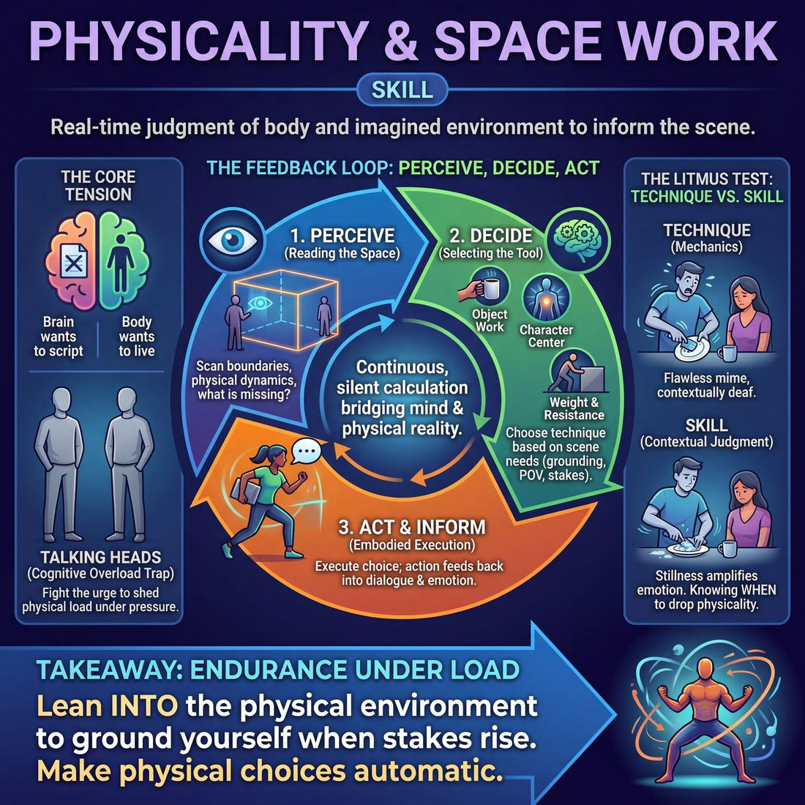

# Week 05 — Where, Who, What — The Body in Space

> *A place exists on stage only if bodies treat it as real — weight, distance and doors are the evidence.*

| Course | Week | Domain | Focus | Stage | Length | Class |
|---|---|---|---|---|---|---|
| Foundations — The Brave Beginner | 5/8 | D1 | `D1.S3` — Physicality & Space Work | Novice → Advanced Beginner | 180 min | 10–20 |

!!! note "Builds on"
    Last week trained the ears; this week trains the hands and the feet so the scene has somewhere to happen.

## 🎬 The arc of this session

They arrive competent at talking and blank from the neck down, playing every scene in an empty grey box with their hands in their pockets. The first hour takes words away entirely so weight, distance and doors become the only things they can offer each other, and the theory block gives them a way to name what they were already doing. They leave able to hold one location and one object steady through a whole scene, and able to see the moment a wall moves.

!!! tip "Watch for"
    The clever ones will narrate their way out of the physical work — 'I'm just going to grab a coffee from the machine over there.' Note it plainly the first time, then stop rewarding it. Week five is when talkers discover they have been hiding, and they will resist for about forty minutes before they enjoy it.

## ⏱️ Session flow (180 minutes)

| Time | Block | Activity |
|---|---|---|
| **0:00–0:05** | 🧊 Ice-breaker | *Petty Grievances* |
| **0:05–0:10** | 😄 Laughter Blast | *Sneeze Storm* |
| **0:10–0:25** | 🔥 Warm-up cluster | *The Room Won't Hold Still*, *Heavy Little Gift*, *The Same Door Twice* |
| **0:25–0:45** | 🧠 Theory | — |
| **0:45–1:15** | 🎲 Drill A — isolation | *Embodied Portrait* |
| **1:15–1:25** | ☕ Break | — |
| **1:25–1:55** | 🎲 Drill B — under load | *The Gifted Persona* |
| **1:55–2:25** | 🎯 Scene Lab | *Mimed Object Relay* |
| **2:25–2:50** | 🏟️ Showcase round | *The Request Board* |
| **2:50–3:00** | 💭 Reflection & homework | — |

## 🎒 Before you start

- Clear the floor completely. Chairs stacked at one wall, bags out of the playing space. You need one uninterrupted rectangle big enough for twenty people to walk in without touching.
- Mark a rough performance area with tape or four chairs at the corners. They will need a consistent edge to place doors and walls against.
- Tape one door-sized outline on the floor near the middle of the space. You will use it in warm-ups and again in theory.
- Have three real objects to hand for the theory demo: a full mug, an empty mug, and something heavy and awkward like a bag of books or a stacked chair.
- Review last week's homework on listening in twos. Ask for one sentence from two people only, then move on — do not let it eat the ice-breaker.
- Write the cue on the board before anyone arrives: Show me where you are. Don't tell me.

## 1. 🧊 Ice-breaker (5 min)

*Stand in a circle. One petty grievance each — something genuinely small that annoyed you this week. No big stuff, no tragedy, keep it trivial.*

**Why here:** Gets voices out and the room social before you take language away for an hour.

### Petty Grievances

> Pairs swap one tiny thing that annoyed them this week, then report each other's back to the circle.

`Players 10–20` · `~5 min` · `Complexity 1/5` · `Energy medium` · `Contact none` · `Props: none`

**How to play**

1. Give one real, trivial annoyance of your own — boring and specific. Ask everyone to find one from this week. State the rule: petty only, nothing that actually hurts.
2. Put people in pairs. Both speak. Tell listeners to hold onto the detail, not the gist — the object, the place, the exact moment.
3. Call "swap" at forty seconds so the second speaker gets equal time. Keep the clock yourself; do not leave it to them.
4. Bring everyone back to the circle. Each person reports their partner's grievance in one sentence, using their partner's name.
5. Model the shape: "Priya's neighbour parks across her bin." The partner nods, or corrects with one word only. No stories, no follow-ups.
6. Ask for a show of hands: who else has been annoyed by the same thing this week? Count the biggest overlap out loud.
7. Thank the group and move straight into the warm-up. Do not open a discussion.

📄 **[Full teaching notes »](week-05/beginner_w05__b1_1.md)**

**Side-coach:** *“Smaller. Make it more petty than that.”*

## 2. 😄 Laughter Blast (5 min)

*Same circle, spread out to arm's length. We're going to build a sneeze. Follow me and commit to the full body, not just the face.*

**Why here:** Breaks the polite standing-still posture and gets whole bodies moving involuntarily before you ask for controlled physical work.

### Sneeze Storm

> The whole room builds and releases enormous fake sneezes together until the room is one big contagious mess of noise.

`Players 10–20` · `~5 min` · `Complexity 1/5` · `Energy high` · `Contact none` · `Props: none`

**How to play**

1. Stand everyone in a circle. Say nothing. Perform the biggest, ugliest fake sneeze you can. Do a second, worse one. Then say: 'Right. Everybody.'
2. Teach the build: two rising 'ah… ah…' breaths, then the sneeze on your nod. Run it three times with the whole room. Be the loudest every time.
3. Run slow motion twice. Inhale over a slow count of eight, face screwing up, then release the sneeze across five seconds, folding at the waist.
4. Run the contagion round. Sneeze at someone. Anyone it 'hits' sneezes and passes it on. Keep going until the whole circle sneezes at once. Let it run messy.
5. Run rapid fire. Ten tiny mouse sneezes, then ten enormous ones. Everybody at once. No counting, no order, no waiting for a cue.
6. Call freeze. Take one shared slow inhale together. Shake out arms and legs.
7. Ask one question. Take two quick answers. Move straight on to the next block.

📄 **[Full teaching notes »](week-05/beginner_w05__b2_1.md)**

**Side-coach:** *“Let it take your knees. A real sneeze doesn't stay in the head.”*

## 3. 🔥 Warm-up cluster (15 min)

*Five minutes each, three pieces, and from here until the break nobody talks. The Room Won't Hold Still first — spread out, find your own space.*

**Why here:** Three short pieces that install the three evidence points in order — distance, weight, then doors — so theory has something to refer back to.

### The Room Won't Hold Still

> Call changes to the space and the whole room adjusts its body on the spot — low ceilings, deep mud, narrow ledges — so the floor gets warm and space work starts before anyone speaks.

`Players 10–20` · `~5 min` · `Complexity 2/5` · `Energy high` · `Contact incidental` · `Props: none`

**How to play**

1. Clear the floor. Get everyone walking in random directions, filling the space, no clumps.
2. Tell them you will call what the space is doing. Their body answers. No sound effects, no commentary, no talking.
3. Call a change every fifteen seconds and keep them moving: shoulder-height ceiling, thick mud, ice, sideways wind, a two-foot corridor, ceiling back to normal.
4. Call 'freeze'. Everyone holds. Name what two or three bodies are telling you about the space. Restart the same call and let them borrow from each other.
5. Move to harder calls: a door they open and close behind them, stairs going down, a low beam every four steps, something heavy in both hands.
6. Call 'freeze' a final time. Have them set the weight down, shake out the hands, and stand still for three breaths.

📄 **[Full teaching notes »](week-05/beginner_w05__b3_1.md)**

### Heavy Little Gift

> Pairs hand invisible objects back and forth, and the receiver's body has to prove the weight before they take it.

`Players 10–20` · `~5 min` · `Complexity 2/5` · `Energy medium` · `Contact none` · `Props: none`

**How to play**

1. Put everyone in pairs, facing each other about two metres apart. Odd number, make one three and tell them to pass around the triangle.
2. Demo once yourself: lift something heavy off the floor, carry it across, hold it out, and wait until hands arrive before letting go.
3. Start round one. A hands B an object. B holds the weight for two full seconds, then hands back something different. Silent throughout. Keep swapping.
4. Round two: the receiver's hands must arrive at the same size and height the giver offered. If the object slips or changes shape, freeze and re-take it.
5. Round three: givers make the weight extreme — feather-light or barely liftable. Receivers show it through the whole body, not just the hands.
6. Call one last object each way. Whoever is holding at the call, freeze holding it. Have everyone look around the room, then shake out.

📄 **[Full teaching notes »](week-05/beginner_w05__b3_2.md)**

### The Same Door Twice

> The circle agrees on one invisible door, then everyone has to use it at exactly the same height and weight.

`Players 10–20` · `~5 min` · `Complexity 2/5` · `Energy low` · `Contact none` · `Props: none`

**How to play**

1. Stand the group in a circle with one clear gap. Point at the gap. Tell them an invisible door lives there for the whole exercise.
2. Say the rule out loud: the whole room keeps it the same door. Same handle, same height, same swing, every single time.
3. Take the first pass yourself. Reach, find the handle, turn it, feel the weight, step through, close it behind you.
4. Name what you did as you do it: handle height, which way the door swings. Say it plainly, not as a performance.
5. Send them clockwise, one at a time. Each person walks to the door, uses it, rejoins the circle. Everyone else watches in silence.
6. Tell watchers their job: track the handle. Notice if it drifts up, down, or changes side. Do not call it out mid-pass.
7. Reverse the direction for the last stretch. Announce the door is now stiff and needs a shoulder to open.
8. Ask the final few to hold still for three seconds on the other side before they close the door behind them.

📄 **[Full teaching notes »](week-05/beginner_w05__b3_3.md)**

**Side-coach:** *“You just walked through the table. Go back and go round it.”*

## 4. 🧠 Theory — Physicality & Space Work (20 min)

{ .infographic }

- **The big idea:** A place exists because bodies behave as though it does. Weight, distance and doors are the evidence. Announcing the location is a promise; handling an object is proof.
- **Where you are on the path:** Advanced beginner looks like this: they can mime a cup accurately for eight seconds, then forget it exists. The skill is not accuracy, it is persistence. You are teaching them to keep one object and one location alive for the length of a scene.
- **The one cue to coach:** *“Show me where you are. Don't tell me.”*

**The three beats**

1. **Say it.** Say: 'Three things make a place real. Weight — the object has mass and your body shows it. Distance — the room has a size and you keep it. Doors — the walls have edges and you honour them. If you break any of the three, the audience stops believing the place, and then they stop believing you.' Then: 'Nobody here is going to mime a perfect telephone. That's not the job. The job is that the telephone is still on the table in four minutes.'
2. **Show it.** Pick up the full mug. Drink. Put it down. Now do the same with the empty mug and let them see the difference in your wrist and shoulder. Then lift the bag of books and let it change your walk. Sixty seconds, no commentary until the end. Then say: 'You already know all of this. Your body does it two hundred times a day. On stage you stop doing it because you're thinking about what to say.'
3. **Try it.** Everyone stands. Give them an imaginary object of a stated weight — a feather, a house brick, a bucket of water filled to the brim. Thirty seconds each, walking with it, no talking. Then the test: put it down somewhere in the room, walk a lap, come back and pick it up from the same spot at the same height. Most of them will miss. Say so, cheerfully, and move on to Drill A.

!!! warning "The misunderstanding that always comes up"
    They think this is mime, and that the standard is precision — invisible-wall-and-white-gloves. Correct it early: precision is not the point and over-detailed miming actually slows scenes down. Consistency is the point. A vaguely-shaped door that stays in the same place beats a beautiful door that relocates.

!!! abstract "📖 Go deeper"
    Read the full write-up: [Physicality & Space Work](../../../theory/01_the-self/01_S3__physicality-and-space-work.md)

## 5. 🎲 Drill A — isolation (30 min)

*Still no talking. This one is slow and it will feel exposing for about two minutes. That's normal — everybody in the room is in the same position.*

**Why here:** Isolates physicality with no scene, no partner pressure and no dialogue, so there is nowhere to escape into words.

### Embodied Portrait

> Step into the physical and emotional reality of a real-world stranger to build deep characters.

`Players 2–99` · `~30 min` · `Complexity 2/5` · `Energy low` · `Contact none` · `Props: none`

**How to play**

1. Ask everyone to stand, close their eyes, and picture one stranger they actually saw in public this week — someone whose body moves differently from theirs.
2. Tell them to pick one physical fact only: the posture, the part of the body that leads, where the weight sits. One fact, not a whole person.
3. Start everyone walking the room in that body. No comment, no comedy. Say you want the gait, the speed, the level of tension held.
4. Add a muttered voice while they walk. Private volume. Let pitch, tempo and placement come out of the posture rather than being chosen.
5. Call two silent questions while they keep walking: what does this person want in the next hour, and what are they worried about right now.
6. Bring the group into a horseshoe of chairs, with one chair facing them. Take volunteers only — no going round the circle in order.
7. Sit the volunteer in the chair, still fully in the body and voice. Take open questions from the group about work, home, habits, hopes.
8. Tell the hot-seat player to answer immediately in character and never break to explain. Cut each interview after two minutes and reset the room.

📄 **[Full teaching notes »](week-05/beginner_w05__b5_1.md)**

**Side-coach:** *“Hold the shape three seconds longer than is comfortable.”*

## ☕ Break — 10 minutes

Water, notes, informal talk. Non-negotiable at three hours — do not let it collapse into a working discussion.

## 6. 🎲 Drill B — under load (30 min)

*Pairs. Speech comes back now, but the body work stays running underneath it — if the object dies, the scene has failed even if the talk is good.*

**Why here:** Adds load: they now sustain the body work while a partner is giving them something to respond to, which is where object permanence usually collapses.

### The Gifted Persona

> Embody a highly specific, physically committed character gifted to you by a peer.

`Players 4–99` · `~30 min` · `Complexity 2/5` · `Energy medium` · `Contact none` · `Props: none`

**How to play**

1. Set two lines facing each other, A opposite B, a metre apart. Tell every A to invent a secret prompt: one emotional adjective plus one animal or one profession.
2. Rule the prompts: no impersonating real people, no disabilities, no accents or ethnicities. Emotional adjective plus creature or job only. Weird is fine, cruel is not.
3. Have each A whisper their prompt once to the B directly opposite. B may not ask questions or negotiate. B keeps it secret.
4. Call one B into the space. Before any words, they find a physical centre, a posture and a pace that come from the prompt.
5. Send in an A who did not hear that prompt. That A plays an ordinary person somewhere ordinary, and shows the location with their body first.
6. Run the scene ninety seconds. B expresses the prompt through weight, rhythm and reaction only, and never says the adjective, the animal or the job.
7. Tell the grounded partner to accept everything as normal, expected and important to the relationship. No commenting on how odd the other one is being.
8. Cut on a clear beat. Take two guesses from the watchers, reveal the prompt, then rotate so both lines get a turn in each role.

📄 **[Full teaching notes »](week-05/beginner_w05__b7_1.md)**

**Side-coach:** *“Where did it go? It was in your left hand.”*

## 7. 🎯 Scene Lab (30 min)

*Groups now. The rule for the next half hour: nobody says the name of the place. If I can tell where you are from the doorway, you've done it.*

**Why here:** Tests the week's actual goal — one location, one object, surviving a full scene without anyone announcing what it is.

### Mimed Object Relay

> Pass invisible objects around a circle while preserving their exact physical properties through committed mime.

`Players 5–99` · `~30 min` · `Complexity 2/5` · `Energy low` · `Contact none` · `Props: none`

**How to play**

1. Sit everyone in one circle, knees close enough to hand something across. Tell them the whole exercise is silent — no words, no sound effects, no mouthing.
2. Pick three or four players spaced evenly round the circle. Tap each on the shoulder so everyone knows who they are. These are your object creators.
3. On your cue, each creator makes an invisible object appear and uses it. Tell them to show weight, size, shape and texture by handling it, not by miming a label.
4. Have each creator pass their object to the person on their left. The pass must be a real hand-off: both pairs of hands present, eyes meeting.
5. Tell receivers to watch the hand-off, take the object at the same size and weight, use it briefly in their own way, then pass left.
6. Keep all objects travelling left at once. Warn players that a second object may reach them while they still hold the first, so they must stay alert.
7. End the round when every object returns to its creator. The creator takes it back, sets it down silently, and drops hands to their lap.

📄 **[Full teaching notes »](week-05/beginner_w05__b8_1.md)**

**Side-coach:** *“The wall was there. Now it's two feet left. Reset and find it again.”*

## 8. 🏟️ Showcase round (25 min)

*Chairs out, audience side and stage side. Three short games, your suggestions, performance pace — I'm not stopping you mid-scene, so keep your own walls up.*

**Why here:** Puts the whole thing under performance pace with an audience, which is the only real test of whether the object work is habit or effort.

### The Request Board

> Eight short games chalked on a board, chosen by the audience, run to a bell, with a rota so nobody has to volunteer.

`Players 10–20` · `~25 min` · `Complexity 2/5` · `Energy high` · `Contact incidental` · `Props: required`

**How to play**

1. Chalk eight game names on a board the audience can read. Set out a bell, a host chair and a rota sheet naming who plays each round. Cast waits in a line upstage.
2. Each round, invite one audience member to pick a game from the board. Take one suggestion, repeat it loudly, call the rota names. Ring the bell to end. Everyone applauds; players sit.
3. Photo Album — four players freeze into a pose on your clap; a fifth narrates the holiday photo. Sound Booth — two play a scene, two at the edge voice every sound.
4. Emotional Dial — a pair does a household chore. Call an emotion and a number from one to ten. They play it at that strength until the bell.
5. Freeze and Swap — a pair moves through a scene. Anyone calls freeze, replaces one player in their exact shape, and starts a new scene from that position.
6. Baton Story — five stand in a line telling one story. Point to hand over; the current teller stops mid-word. Fumbles get a bow and applause, then play continues.
7. Double Talk — one plays an expert speaking invented language on the audience's topic; a partner translates. Prop Parade — the cast queues and mimes new uses for one household object, never naming them.
8. Genre Rewind — a pair plays ninety seconds, then replays the same scene in a genre the audience names.
9. Close with the whole cast on stage, a bow, and your thanks to the room.

📄 **[Full teaching notes »](week-05/beginner_w05__b9_1.md)**

**Side-coach:** *“Faster feet, same weight in the hands.”*

## 9. 💭 Reflection & homework (10 min)

**Deepen your improv**
1. Name the moment your object died. What were you thinking about in the second before it went?
2. When did a partner's body tell you something their words hadn't? What did you do with it?

**Beyond the stage**
3. Where do you go blank from the neck down in ordinary life — a meeting, a phone call, a difficult conversation? Notice this week what your hands do when you stop paying attention to them.

➡️ **[This week's homework](../homework/HW-BEGW05.md)**

??? note "🎓 Facilitator notes"

    **Timing risks**
    - The warm-up cluster runs long every time. Three pieces, five minutes each, and you must cut each one while it is still working. Set a timer.
    - Drill B swallows the break if pairs are enjoying themselves. Call the break at the thirty-minute mark even mid-scene.
    - The Suggestion Box in Block 9 will overrun if you take suggestions democratically. Take the first three shouted, no discussion.

    **Failure modes this week**
    - Silent work makes some adults acutely self-conscious and they go rigid or start clowning. Do not single them out. Keep the whole room moving and let them join at their own pace.
    - They narrate instead of showing — 'I'm opening the fridge.' Name it once as a group note, not as a personal correction, then hold the line.
    - Object drift goes unmentioned because you don't want to interrupt a scene that's going well. Interrupt it. That is this week's job. Stop, reset the object, restart from the same line.
    - Over-miming: someone gives four minutes of loving detail to a kettle and the scene stops dead. Say plainly that consistency beats detail and speed things up.

    **What good looks like by the end:** By Block 9 a scene runs three minutes, nobody says where they are, and the audience knows anyway. Someone picks up an object a partner put down two minutes earlier, from the right place, without commenting on it. That is the whole week.

    **Carry into next week:** Note which two or three people are still hiding in dialogue — next week's character work will need pushing on them specifically. Also note any location that the group invented and enjoyed; bring it back as a callback in week six.
