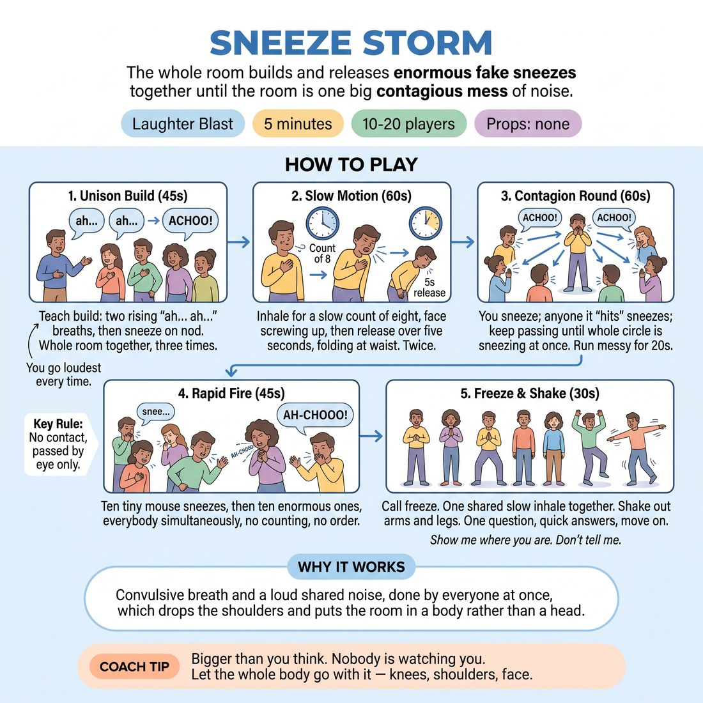

# 😄 Laughter Blast — Sneeze Storm

{ .infographic }

> The whole room builds and releases enormous fake sneezes together until the room is one big contagious mess of noise.

`Players 10–20` · `~5 min` · `Complexity 1/5` · `Energy high` · `Contact none` · `Props: none`

⬅️ [Back to the Week 05 run-sheet](../week-05.md)

## Why this activity, here

Week 5 is about the body carrying information the mouth doesn't. This is the warm-up spike that opens the session's physical work: it gets breath low, faces loud and inhibition down before students are asked to build a room out of nothing. It feeds directly into the environment work that follows, where the same full-body commitment has to serve a scene instead of a laugh.

## What students actually learn

- Their body can be the whole event — a sneeze is a build, a peak and a release with no words in it at all.
- Committing at full size in unison is easier than committing alone, and the size felt fine once everyone did it.
- Slow motion makes physical choices legible; the same action stretched out reads to a watcher.

## Setup

Circle, standing, arms' length apart. Push chairs and bags back so nobody folds at the waist into furniture. Nothing to hand out. Have tissues near the door and mention them if anyone's genuinely streaming. Know your own biggest sneeze before the class starts — this dies if you demonstrate at half power.

## How to run it — 5 minutes

| Min | What you do |
|---:|---|
| 1 | Demonstrate two enormous fake sneezes without preamble. Say 'Right. Everybody.' Teach the build — two rising 'ah… ah…' breaths, sneeze on your nod — and run it three times in unison. |
| 1 | Slow motion, twice. Inhale over eight counts, face screwing up the whole way. Release across five seconds, folding at the waist. Call the counts out loud so nobody rushes it. |
| 1 | Contagion. You sneeze at one person; they sneeze and pass it on. Keep it spreading until everyone is going at once. Let the mess run about twenty seconds. |
| 1 | Rapid fire. Ten tiny mouse sneezes together, then ten enormous ones. No counting aloud, no order, no cue between them. Let it overlap and collapse. |
| 1 | Freeze. One shared slow inhale. Shake out arms and legs. Ask one question, take two answers, move on. |

## Side-coaching script

| When | Say |
|---|---|
| After your demo, before the first unison build | *"Uglier than that. Nobody's filming."* |
| During the build, if the room is polite | *"Let the face go first."* |
| In slow motion, on the inhale | *"Stretch it. Eight. All the way up."* |
| In slow motion, on the release | *"Fold. Let the spine go."* |
| When contagion stalls with one or two people | *"Pass it on. Hit somebody."* |
| At the peak of contagion | *"Everyone. Now. All at once."* |
| Switching from mouse sneezes to enormous ones | *"Tiny, tiny, tiny — and BIG."* |
| On the freeze | *"Stop. Breathe in together. Shake it out."* |

!!! success "What good looks like"
    Loud, ragged and slightly out of control by the contagion round. Faces are doing as much work as voices. Two or three people are laughing so hard they can't complete the sneeze — that's fine, the round keeps going. The slow-motion pass looks genuinely grotesque rather than mimed politely. When you call freeze, the room lands quickly and everyone is breathing harder than they were five minutes ago.

## When it goes wrong

| You see | What's causing it | The fix |
|---|---|---|
| Small, apologetic sneezes; people glancing round to check the size before committing. | You demonstrated at seventy per cent, so seventy per cent became the ceiling. | Stop the round. Do one more demo, absurdly bigger, with no comment. Restart. Your volume sets theirs — there is no way round this. |
| The contagion round becomes an orderly circle, each person waiting politely for their turn. | They've read it as a passing game with a sequence. | Call 'no order — hit anybody.' Sneeze at three people at once yourself. If it's still tidy, cut to 'everyone, now' and let it go simultaneous. |
| People rushing the slow-motion inhale and getting to the sneeze in three seconds. | The stretch is uncomfortable and they're escaping it. | Count the eight out loud, slowly, and add 'face first, sound later.' Run it a second time even if you're tight on time — this is the part that carries into the session. |
| One or two people standing still, arms folded, not joining. | Public loudness is the exact thing they're nervous about in week five. | Don't single them out. Let them do it at a whisper. Most join by the rapid-fire round because nobody can hear any individual in it. |

## Scaling

| Class size | What changes |
|---|---|
| **10–13** | One circle. Everyone visible to everyone. Contagion needs a nudge at this size — sneeze at two people to start it rather than one, or it stays too sparse to catch. Keep all six phases and the timings as written. |
| **14–17** | One circle, still workable. Contagion catches on its own; start it with one person. You may need to raise your own volume to be heard over the rapid-fire round — get your freeze call in early and loud. |
| **18–20** | One circle, widened, or a horseshoe so you can be seen from the open end. Cut the slow-motion pass to one repetition and give the extra fifteen seconds to contagion, which is more chaotic and more useful at this size. Freeze with a raised hand as well as a voice call — you will be drowned out. |

## Variations

**Sit-down version** — Run the whole thing seated in the circle. Keep the build, contagion and rapid fire. Drop the fold at the waist; the slow-motion release becomes a slump forward from the ribs.  
*Easier — takes the physical demand and the standing-in-a-circle exposure out, and still gets the breath and face working.*

**Sneeze with a where** — After rapid fire, call a location — library, funeral, cinema. Everyone sneezes in a way that fits the place. Two locations, ten seconds each.  
*Harder — adds status and given circumstances to a purely physical impulse, and previews the session's environment work directly.*

**Silent sneeze** — Run one contagion round with no sound at all. Full commitment in the body and face, nothing audible. Call freeze, then repeat the round with sound.  
*Different emphasis — pushes the information into the body, which is the cue for the session. Also useful in venues with thin walls.*

## Debrief

1. **What was your face doing in slow motion that it doesn't normally do?**
   > *A good answer sounds like:* Something concrete and physical — 'everything screwed up', 'my whole head went into it', 'I could feel it in my shoulders'. Two answers and move on. If they start analysing why it was funny, cut it off.

2. **Which was easier — going big alone or going big with everyone?**
   > *A good answer sounds like:* 'With everyone, obviously.' Take it, name that the room's permission is what made the size available, and go straight to the next block. Don't extend this.

!!! warning "Safety & inclusion"
    No contact at any point — contagion is passed by eye and direction, not by touching. Say that before the round so nobody braces for a tap. Fake sneezes shouldn't spray: tell the room to aim into an elbow or across their own shoulder, not at a face. Anyone unwell should sit this out entirely, and say so without needing a reason. Folding at the waist is optional — offer a bend from the ribs instead, and say so before the slow-motion pass rather than after. This is loud and abrupt; flag it at the start for anyone sensitive to noise, and make it explicit that a whisper-sized version counts as full participation. Anyone with a hernia, recent abdominal or chest surgery, reflux, asthma or a history of fainting should take it small — mention these as a list, not as a question to individuals.

## Why it works

The cue for the week is 'show me where you are, don't tell me', and the obstacle to that is not imagination but scale — beginners make physical choices too small to read. A sneeze bypasses the negotiation. It is a body event with a built-in three-part shape: build, peak, release. Nobody has to invent it, judge it or be clever about it, so the only variable left is commitment. Running it in unison removes the exposure that normally caps size, and the contagion round removes turn-taking, so nobody has time to plan. By the time they're asked to build a room out of nothing, the ceiling on how big they'll go physically has already been raised, and they raised it themselves rather than being told to.

[Open the full activity card »](../../library/laughter/LB__sneeze-storm.md){target=_blank rel=noopener}
