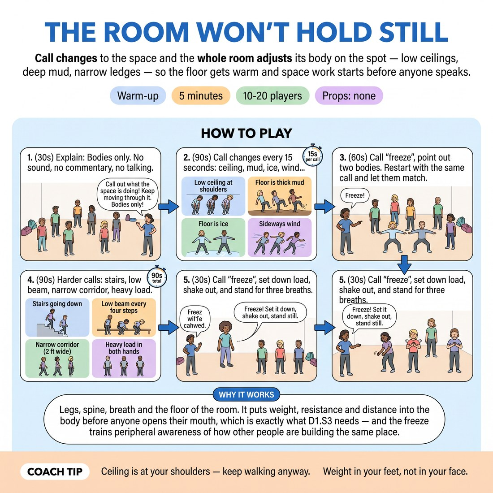

# 🔥 Warm-up cluster — The Room Won't Hold Still

{ .infographic }

> Call changes to the space and the whole room adjusts its body on the spot — low ceilings, deep mud, narrow ledges — so the floor gets warm and space work starts before anyone speaks.

`Players 10–20` · `~5 min` · `Complexity 2/5` · `Energy high` · `Contact incidental` · `Props: none`

⬅️ [Back to the Week 05 run-sheet](../week-05.md)

## Why this activity, here

Opens Week 5. The room arrives cold and verbal. This gets the floor warm and puts space into the body before anyone has to speak, so the scene work later in the session has something physical to stand on. Feeds directly into the Where-based two-person scenes.

## What students actually learn

- That their body already knows how to answer a description of space without being told what to do with it.
- That a low ceiling changes the whole spine, not just the head — space work is whole-body or it reads as mime.
- That they can be watched mid-adjustment and survive it.

## Setup

Clear floor, chairs pushed to the walls. No props. You need a clear voice and a way to track fifteen-second intervals — a watch face or a phone on the floor is fine. Stand at the edge, not the centre, so you can see shapes against each other.

## How to run it — 5 minutes

| Min | What you do |
|---:|---|
| 1 | Get them walking, filling gaps. Explain the rule: you call, their body answers, nobody talks. Start with the shoulder-height ceiling and hold it for fifteen seconds. |
| 1 | Run thick mud, ice, sideways wind, a two-foot corridor. Change every fifteen seconds. Keep them travelling — nobody stands and demonstrates. |
| 1 | Call 'freeze'. Name what two or three bodies are showing you. Restart the same call. Let them see each other's version and steal from it. |
| 1 | Harder calls, fifteen seconds each: a door they must open and shut behind them, stairs going down, a low beam every four steps. |
| 1 | Add something heavy in both hands and keep it there through one more change. Freeze. Set it down, shake out the hands, three breaths standing. |

## Side-coaching script

| When | Say |
|---|---|
| First thirty seconds, as they start walking | *"Keep travelling. Don't perform it standing still."* |
| When someone gestures at the ceiling instead of ducking | *"Your spine, not your hand."* |
| Mid mud or ice | *"Let it reach your face."* |
| When the room speeds up and gets loose | *"Slower. Take the resistance seriously."* |
| At the freeze | *"Hold exactly where you are. Don't fix it."* |
| On the door and stairs calls | *"Same door handle each time. Same height."* |
| With the heavy object | *"It's still heavy. It doesn't get lighter."* |
| Final freeze | *"Set it down. Hands loose. Three breaths, standing."* |

!!! success "What good looks like"
    Bodies at different heights across the room. Shoulders and knees doing the work, not just faces. When you call the corridor, people turn sideways without checking whether anyone else did. Nobody is talking, nobody is being funny about it, and by the heavy-object call the room is slightly out of breath.

## When it goes wrong

| You see | What's causing it | The fix |
|---|---|---|
| People stop walking and mime in place, facing you. | They've read it as a demonstration to be marked, not a space to be in. | Call 'keep travelling' and step further back to the wall so there's no front to play to. |
| Only hands and faces respond. The mud call produces waving arms and a grimace. | Default to gesture — the beginner's shortcut for physicality. | Side-coach 'your spine, not your hand'. At the freeze, point at whoever's using their legs and name it. |
| Giggling, exaggerated cartoon slipping, sound effects sneaking in. | Nervousness converting to comedy. Common in Week 5 and not a disaster. | Say 'take the resistance seriously' and slow the pace of calls. Don't scold. It settles within a call or two. |
| The heavy object vanishes within five seconds — hands open, arms swing free. | No commitment to sustained load; they treated it as a one-off gesture. | Call 'it's still heavy' by name to two people. Reset the object rather than moving on. |

## Scaling

| Class size | What changes |
|---|---|
| **10–13** | One space, full floor. Run all calls as written. At the freeze, name three bodies — you have time. |
| **14–17** | One space, but tell them to keep a metre of clear floor around themselves so nobody stalls. Name two bodies at the freeze. Same call list. |
| **18–20** | Split into two halves working the same floor in alternation is too slow for five minutes — instead keep everyone moving but cut the freeze to naming one body only, and drop the sideways-wind call to protect the timing. |

## Variations

**Named leader** — Instead of you calling, a volunteer stands at the edge and calls the changes while everyone else moves.  
*easier for the mover — harder for one person, and useful if the room needs a break from your voice*

**Two spaces at once** — Call two conditions together: low ceiling and thick mud. Then ice and sideways wind.  
*harder — forces whole-body integration instead of one adjustment at a time*

**Object hand-off** — During the heavy-object call, tell them to pass it to whoever they pass, matching the weight and shape they're given.  
*different emphasis — shifts from solo space work to shared reality, and previews Where agreement in scenes*

## Debrief

1. **Which call was easiest to put in your body?**
   > *A good answer sounds like:* Someone names a specific physical adjustment — 'the corridor, because I just turned' — rather than 'the fun one'. You're listening for them noticing the body did it, not their imagination.

2. **What did you notice at the freeze, looking at other people?**
   > *A good answer sounds like:* 'I was doing it with my face and they were doing it with their knees.' Any comparison of where in the body the space landed. Move on once one person says that.

!!! warning "Safety & inclusion"
    No contact in the base version. If you run the object hand-off, ask first: 'anyone who'd rather not hand off to a partner, keep your own object.' Say ice and stairs are imaginary — nobody actually slides or drops their weight. Anyone with mobility, balance or joint limits does the calls at whatever scale suits: low ceiling can be a small change in the neck. Chairs stay available. Say this once at the start, plainly, without singling anyone out.

## Why it works

D1.S3 asks students to show the Where rather than describe it. Speech is the default escape route for a nervous beginner, so this closes it — no talking, no sound effects. What remains is the body, and the body responds to physical constraint faster than it responds to instruction. Fifteen-second calls prevent editing: there's no time to decide how to look, only time to adjust. The freeze then makes the adjustment visible to the room, so students learn what reads from outside without being corrected individually.

[Open the full activity card »](../../library/warmups/WU__room-wont-hold-still.md){target=_blank rel=noopener}
