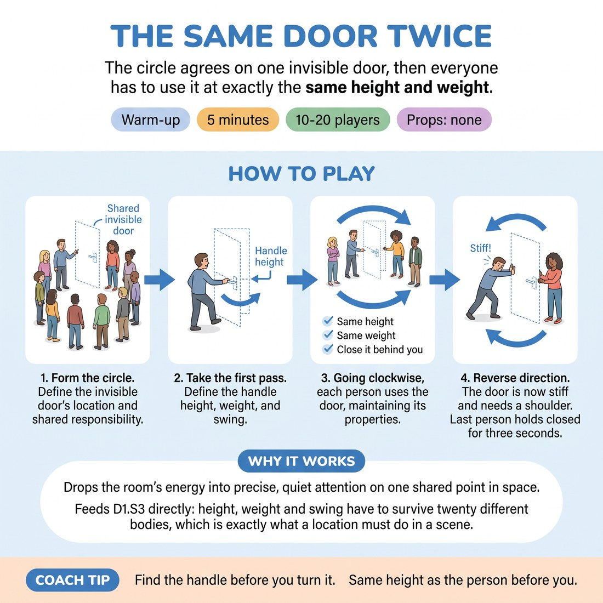

# 🔥 Warm-up cluster — The Same Door Twice

{ .infographic }

> The circle agrees on one invisible door, then everyone has to use it at exactly the same height and weight.

`Players 10–20` · `~5 min` · `Complexity 2/5` · `Energy low` · `Contact none` · `Props: none`

⬅️ [Back to the Week 05 run-sheet](../week-05.md)

## Why this activity, here

Week 5 turns the class from talking about a place to building one. This is the first thing they do in the room that morning. It sets a shared object before anyone has to invent a scene, so the later scene work inherits a habit of agreeing on physical facts. It feeds directly into the cue and into the longer where-building blocks after the break.

## What students actually learn

- They notice that an invisible object has a fixed height and they can feel when someone else has moved it.
- They stop narrating the space and start handling it.
- They discover that watching someone else's object is a way of being in the scene without speaking.

## Setup

Clear floor, circle of chairs pushed back. You need one obvious gap in the circle wide enough to walk through. No props, no music. Know in advance which handle height you will set — around waist to lower-rib — and which way the door swings, because you demonstrate first and the room copies you.

## How to run it — 5 minutes

| Min | What you do |
|---:|---|
| 1 | Form the circle, point at the gap, state the rule: one door, same door, everyone responsible. Then take the first pass yourself and name the handle height and swing aloud. |
| 1 | Start clockwise. First four or five people go through, one at a time. Keep the pace brisk — reach, turn, step, close. Silence from the rest. |
| 2 | Continue clockwise until everyone but the last few have gone. Side-coach handle drift as it happens. Do not stop the flow to correct. |
| 1 | Reverse direction. Announce the door is stiff and needs a shoulder. Last few go through, hold three seconds on the far side, then close. Move straight on. |

## Side-coaching script

| When | Say |
|---|---|
| As the first person after your demo steps up | *"Same handle. Find it before you turn it."* |
| When someone's hand floats above or below the set height | *"Handle's lower. Reach again."* |
| When people rush the pass | *"Take the weight. Doors have weight."* |
| When the door starts being mimed vaguely, hand flapping | *"Grip it. Close your fingers."* |
| When someone forgets to close behind them | *"Shut it. Somebody's got to."* |
| On the reverse pass | *"Shoulder into it. It's stuck."* |
| On the final three-second holds | *"Hold. Let us see you on the other side."* |
| Last person through, before you move on | *"Leave it closed. That's the door for the rest of the morning."* |

!!! success "What good looks like"
    Hands arrive at roughly the same height without anyone counting. People slow down slightly at the moment of turning the handle. Watchers lean in. Somebody instinctively reaches to catch the door for the person behind them. The room goes quiet in a way that is attention rather than nerves.

## When it goes wrong

| You see | What's causing it | The fix |
|---|---|---|
| Handle height climbs steadily until the last person is reaching over their head. | Nobody re-checks against the original; each person copies the person before them. | Call the height back to your demo once, mid-round: 'Handle's at your belt.' Then let it run. Do not correct every person. |
| People walk through the gap without touching anything. | They are treating it as a queue exercise, not an object exercise. | Stop the round for five seconds. Do one exaggerated pass yourself — grip, turn, pull, weight — then restart from the same person. |
| Laughter and comic doors: revolving, saloon, tiny. | Anxiety looking for a joke, plus no consequence for breaking the agreement. | Name it lightly: 'Same door. Boring door. That's the game.' Do not scold. The rule itself is the correction. |
| The pass takes so long you run out of time before the reverse round. | Individuals are performing rather than passing through. | Speed the queue: 'Next, next, next' as each person clears. Cut the reverse round to the last four people only if needed. |

## Scaling

| Class size | What changes |
|---|---|
| **10–13** | One circle. Everyone gets a clockwise pass with room to spare. Reverse round covers the last five people and you can afford the full three-second hold. |
| **14–17** | One circle. Keep the queue tight — the next person steps forward as the previous one turns the handle. Reverse round covers the last four only. |
| **18–20** | Split into two circles with two doors, each with its own gap, running simultaneously. Demo once to the whole room before splitting. Each circle self-manages the handle height. Reverse round is the last three in each circle. You watch both and coach loudly across the room. |

## Variations

**Handle Named** — Before each pass the person says the handle height out loud — 'hip', 'chest' — then uses the door.  
*Easier. The verbal marker keeps the agreement explicit while people are still learning to see it.*

**Two Doors, One Circle** — Add a second door at the opposite gap with a different handle and swing. Each person chooses one, uses it, and the room tracks both.  
*Harder. Holds two sets of physical facts at once and punishes autopilot.*

**Something In Your Hands** — Each person carries an imaginary object through — a full mug, a stack of boxes — and must still manage the door.  
*Different emphasis. Shifts from shared agreement to individual problem-solving with weight and occupied hands.*

## Debrief

1. **Who noticed the handle move?**
   > *A good answer sounds like:* Someone names a specific moment — 'it went up around the fourth person' — rather than a general 'yeah it drifted'. That means they were watching the object, not the performer.

2. **What changed when the door got stiff?**
   > *A good answer sounds like:* They describe their body: leaned in, planted a foot, slowed down. Not 'I acted like it was heavy' — the difference between doing it and indicating it.

3. **Where do you feel the pull to explain instead of show?**
   > *A good answer sounds like:* An honest admission that they wanted to say 'wow, heavy door' out loud. Link it to the cue and move on. Two answers is enough.

!!! warning "Safety & inclusion"
    No contact between participants. Anyone who cannot stand or walk the pass does it seated or from where they stand — reaching, turning and pushing the door from their position works identically, and say so before you start rather than in response to someone. The reverse round asks for shoulder effort; tell the room to use as much or as little force as their body wants. Nobody is watched for longer than one pass, so exposure is short and predictable.

## Why it works

Physicality and space work fails when the space exists only in one person's head. This puts a single object in front of twenty pairs of eyes and gives everyone a job when it is not their turn: check the handle. That watching is the mechanism. Once you have noticed someone else's door at the wrong height, you cannot un-notice your own. The agreement is enforced by the group's attention rather than by the teacher, which is the same thing that makes a shared where hold up in a scene later.

[Open the full activity card »](../../library/warmups/WU__the-same-door-twice.md){target=_blank rel=noopener}
