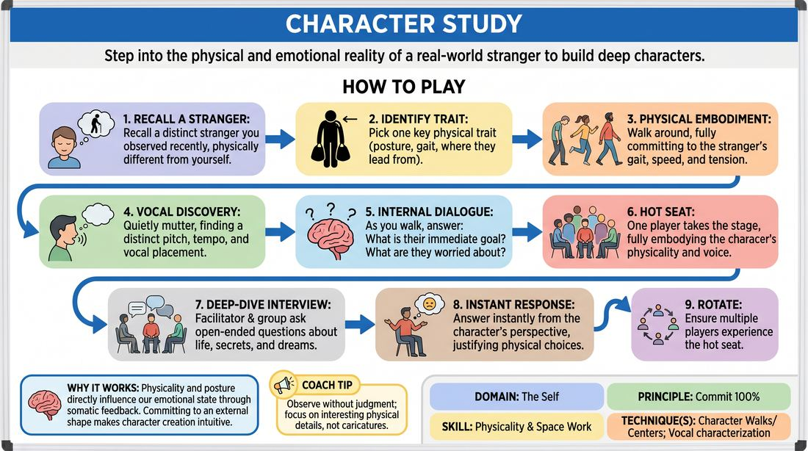

# 🎲 Drill A — isolation — Embodied Portrait

{ .infographic }

> Step into the physical and emotional reality of a real-world stranger to build deep characters.

`Players 2–99` · `~30 min` · `Complexity 2/5` · `Energy low` · `Contact none` · `Props: none`

⬅️ [Back to the Week 05 run-sheet](../week-05.md)

## Why this activity, here

Week 5 moves from mime of objects to the body as information. The room has already established a Where through space work; this block asks who is standing in it. It feeds the Who–What scenes later in the session, and gives players a character source that isn't a funny voice they already own.

## What students actually learn

- They stop building character from an idea and start building it from a posture — the body decides first, the personality follows.
- They discover their observation is already full of material; they don't have to invent a stranger, they have hundreds stored.
- They can hold a physical choice while speaking under pressure, which is where most beginners drop it.
- They feel the difference between inhabiting someone and mocking them, in their own body.

## Setup

Clear floor for walking, enough that twenty people can pass without brushing. Chairs stacked at the side, ready to pull into a horseshoe at the halfway point. One chair set out facing the group. No props. Say early on that this is observation, not impression: we are borrowing how a body carries itself, never an accent, disability or ethnicity used as a punchline. Give the opt-out now — anyone can pass on the hot seat with no explanation and stay in the questioning group.

## How to run it — 30 minutes

| Min | What you do |
|---:|---|
| 3 | Eyes closed, standing. Talk them into recalling one specific stranger from the last week. Then narrow to a single physical fact: posture, leading body part, or where the weight sits. |
| 4 | Walking. Everyone moves the room in that body. Call for gait, speed and tension level. Keep them off character comedy — no faces, no bits. Just the walk. |
| 3 | Add private muttering in the character's voice while walking. Let the sound follow the posture. Volume low enough that nobody performs to anybody else. |
| 2 | Still walking. Call the two questions aloud — immediate goal, present worry — and let them answer silently. Then slow the walk to a stop. |
| 15 | Horseshoe. Run hot seats back to back, two minutes each, volunteers only. Group asks open questions; the player answers instantly in body and voice. Reset the room between each. |
| 3 | Everyone shakes the body out standing. Run the debrief questions on your feet, then move straight into the next block. |

## Side-coaching script

| When | Say |
|---|---|
| First minute of walking | *"One change only. Let the rest of you be ordinary."* |
| When walks start looking cartoonish | *"Take it down half. Real people are subtle."* |
| Before adding the voice | *"Let the throat follow the spine."* |
| Muttering phase, if it's silent | *"Out loud, low. Nobody's listening but you."* |
| Hot seat, when a player hesitates | *"First answer. Don't check it."* |
| Hot seat, when the body slackens | *"Back into the posture. Answer from there."* |
| Hot seat, when answers get grand or tragic | *"Smaller. What did they have for breakfast?"* |
| End of each interview | *"Drop it. Shake out. Next."* |

!!! success "What good looks like"
    During the walk, twenty different bodies in the room and no two alike — some slow, some braced, some leading with the chin. Muttering that sounds like people, not like voices. In the hot seat, answers arrive within a second, mostly mundane, and the posture survives the talking. The watching group asks questions they're actually curious about. Nobody laughs at the character; some laughs of recognition are fine.

## When it goes wrong

| You see | What's causing it | The fix |
|---|---|---|
| Half the room doing the same hunched, shuffling old person. | They reached for a stock character instead of an actual memory. Usually means step one was rushed. | Stop the walk. Ask three people to name the specific place they saw their stranger — bus stop, queue, gym. Send them back in with the location in mind. |
| Hot-seat answers of "um, I don't know" and a smile out to the group. | The player has left the character to check whether the answer is good. | Cut in with "first answer" and feed a concrete question: what's in their fridge, who did they last phone. Concrete questions rescue hesitant players. |
| Body goes neutral the moment they start speaking. | Speaking takes all their attention; physicality is not yet automatic. | Pause the interview. Have them stand, resume the walk for ten seconds, then sit and continue. Repeat once if needed. |
| A character built on an accent or a disability, played for laughs. | The instruction landed as impression rather than observation. | Stop it in the moment, plainly and without shaming. Say we take the posture, not the voice type, and ask them to pick a different physical fact. |

## Scaling

| Class size | What changes |
|---|---|
| **10–13** | One horseshoe. Six hot seats at two minutes each with brief resets — most of the room gets a turn. Keep the walking phases as written. |
| **14–17** | One horseshoe. Seven hot seats at just under two minutes; announce the cut yourself so it stays brisk. Tell the group that not everyone sits this session and they'll get characters back next block. |
| **18–20** | Split into two horseshoes of ten after the walk, each with a corner of the room. Run five hot seats per circle at ninety seconds, self-timed by a nominated timekeeper. You float between the two. |

## Variations

**Paired interview** — Instead of the front chair, put people in pairs and have them interview each other in character for two minutes each way, simultaneously.  
*Easier — removes the audience, so shy players commit harder. Costs you the shared observation.*

**Two-hander hot seat** — Sit two characters in the chairs together and ask questions of both, letting them respond to each other's answers.  
*Harder — the player must hold their physicality while listening and reacting to another invented person.*

**Where they are** — Before each interview, the group names a location. The player enters, establishes it with space work for twenty seconds, then sits and takes questions.  
*Different emphasis — ties the character body directly to the session cue about showing the Where.*

## Debrief

1. **What did your body tell you about the person that you hadn't decided in advance?**
   > *A good answer sounds like:* Something specific and surprising to them: "Once I dropped the shoulder I got impatient," or "walking that slow made me feel watched." Move on when two or three people report the body arriving first.

2. **What happened to the character when you started talking?**
   > *A good answer sounds like:* Honest reporting: it faded, or it held because the posture kept feeding the voice. You want them to notice the drop, not to have avoided it.

3. **Where's the line between observing someone and taking the mickey out of them?**
   > *A good answer sounds like:* They locate it in intent and detail — inhabiting versus commenting from outside. A short, serious exchange is enough; don't turn it into a seminar.

!!! warning "Safety & inclusion"
    No contact in this activity. Say so at the start so nobody braces for it. Hot seat is volunteers only and passing needs no reason; a player who never sits still learns by asking questions. Name the boundary explicitly before the walk: we borrow posture and carriage, never a person's ethnicity, accent, disability or body size as material for laughs — and step in immediately if it drifts, briefly and without a lecture. Anyone with pain, dizziness or a mobility limit adapts the walk to a seated or slower version; a shift in weight and gaze does the same work as a full gait. Shaking out between hot seats is not optional filler — it keeps people from carrying a borrowed tension home.

## Why it works

Physicality and space work fail when players decide who they are and then instruct the body to illustrate it. This inverts the order. A remembered stranger supplies a physical fact the player did not invent, so there is nothing to justify or defend; the walk makes it habitual before language arrives; the muttering lets voice emerge from the held posture rather than from a comedy shelf. By the hot seat, the character is a bodily state, and instant answers come out of that state instead of out of authorship. That is the session cue applied to a person rather than a room — the body is the information, and telling becomes unnecessary.

[Open the full activity card »](../../../../games/D1_P1_S3_T1_G661__character-study.md){target=_blank rel=noopener}
