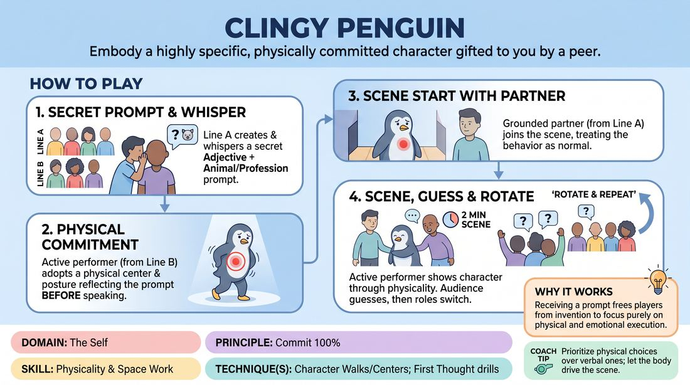

# 🎲 Drill B — under load — The Gifted Persona

{ .infographic }

> Embody a highly specific, physically committed character gifted to you by a peer.

`Players 4–99` · `~30 min` · `Complexity 2/5` · `Energy medium` · `Contact none` · `Props: none`

⬅️ [Back to the Week 05 run-sheet](../week-05.md)

## Why this activity, here

Earlier in the week they built a location alone, in silence, with no one watching back. This block adds two pressures at once: a body someone else chose for them, and a partner who needs the room to be real. It feeds the closing block, where they hold place and character while a scene actually moves.

## What students actually learn

- They stop deciding what a character is with their head and let a posture make the decision for them.
- They discover that a partner who treats their odd behaviour as normal makes them braver than any note from a teacher.
- They feel the difference between describing a place and standing in one — and how much of the character comes from the space, not the adjective.

## Setup

Clear a playing area roughly four metres by three. Two chairs to one side, available but not used unless a scene wants them. No props. Slips of paper are unnecessary — prompts are whispered. Have the two lines stand along the long edges of the space so watchers become the audience without moving. Know your cut signal and say it aloud before you start: a single clap.

## How to run it — 30 minutes

| Min | What you do |
|---:|---|
| 3 | Frame it. Show, don't tell — one body, one place. Set the lines. Give the prompt rules aloud: emotional adjective plus animal or profession, no real people, no disabilities, no accents. |
| 3 | A invents silently, then whispers to the B opposite. Watch for negotiation and shut it down. B hears it once. Give A a spare ten seconds if the room stalls. |
| 4 | Demo one scene yourself in the grounded role with a willing B. Cut it at sixty seconds. Point at what worked physically, take two guesses, reveal. Keep the note to one sentence. |
| 8 | Round one. Ninety-second scenes, back to back. Two guesses and a reveal between each. Side-coach into the running scene rather than stopping it. |
| 2 | Swap roles across the lines. B invents a new prompt and whispers to their A. No discussion of the previous round yet. |
| 8 | Round two, same shape. Push for the physical centre to arrive before the first line. Cut earlier if a scene is coasting. |
| 2 | Last two pairs, fast. Sixty seconds each, no guessing, straight reveal. Keep the pace up so nobody is precious about their turn. |

## Side-coaching script

| When | Say |
|---|---|
| The performer walks in and starts talking immediately | *"Centre first. Words later."* |
| The physicality is only in the face and hands | *"Put it in the hips. Let the walk carry it."* |
| The grounded partner is reacting to how strange the other one is | *"This is normal. This is Tuesday."* |
| The prompt is being hinted at verbally | *"Don't name it. Show it."* |
| The scene has no location | *"Touch something in the room. Tell me where we are with your hands."* |
| The performer is drifting, holding the shape but doing nothing | *"What do you want from them? Ask for it."* |
| Energy drops or the physicality softens mid-scene | *"It's fading. Take it back up by half."* |
| A clear beat lands | *"That's the beat. Out."* |

!!! success "What good looks like"
    The performer's weight has moved somewhere odd before they speak — forward on the toes, low in the pelvis, high in the shoulders — and it stays there for the whole ninety seconds. The grounded partner is doing something practical in a place you can see, and treats the other person's behaviour as unremarkable. Watchers guess the animal or job in one or two tries, and get the adjective from the tempo rather than the words. Scenes end because something happened, not because the timer ran out.

## When it goes wrong

| You see | What's causing it | The fix |
|---|---|---|
| The performer stands still and does the character entirely with a funny voice. | Voice is faster and safer to reach than body. They have skipped the posture step. | Stop the scene. Have them re-enter and cross the space twice in the character's walk before saying anything. Then restart. |
| Watchers shout guesses during the scene, and the performer starts playing to them. | You framed it as a guessing game rather than a scene with a reveal at the end. | Reset the rule out loud: guesses come after the clap, two only. Ask watchers to sit on their hands. |
| The grounded partner keeps asking 'Why are you doing that?' | Their instinct is to be the audience's proxy. It kills the character's confidence within twenty seconds. | Side-coach 'This is normal' mid-scene. If it persists, give them a task — washing up, folding laundry — so they have something to do besides comment. |
| Prompts arriving as jokes: 'sarcastic accountant' every time. | People reach for the safe adjective. Sarcasm requires no body at all. | Ban sarcastic, awkward and confused. Ask for adjectives with a temperature: grieving, ravenous, smug, terrified, adoring. |

## Scaling

| Class size | What changes |
|---|---|
| **10–13** | One pair of lines, five or six pairs. Whole group watches every scene. Ninety-second scenes, both rounds, everyone performs once and grounds once. Timings as written. |
| **14–17** | After your demo, split into two pods in opposite corners, each with its own facing lines. Nominate a timekeeper per pod who claps at ninety seconds. You circulate and side-coach. Drop the final two-minute fast round; give each pod thirty extra seconds per round instead. |
| **18–20** | Three pods of six or seven, same self-run structure. Shorten scenes to seventy-five seconds. Accept that you will only see about a third of the scenes — set the rules hard at the top and spend your time on the pod that is coasting. Skip the guessing between scenes; reveal only. |

## Variations

**Prompt on a slip** — Instead of whispering, hand the performer a written prompt they read alone, thirty seconds before entering.  
*Easier — removes the whisper anxiety and gives thinking time before the body has to commit.*

**Two gifts** — Both players receive a secret prompt from the person opposite. Neither knows the other's. No grounded partner.  
*Harder — nobody is holding the room steady, so they must build the location and the relationship while carrying an unfamiliar body.*

**Location gift** — A whispers a place instead of a character. B enters and shows only the location — floor, temperature, air, objects — while the partner plays a neutral person.  
*Shifts emphasis from character physicality to pure space work, useful if the group is defaulting to funny walks.*

## Debrief

1. **When you were the character — at what point did you know what you were doing?**
   > *A good answer sounds like:* Something like 'after I'd been walking for a bit' or 'when I leaned on the counter'. They locate the discovery in an action, not in a decision made before they entered.

2. **Grounded partners: what did you do that made your scene partner braver?**
   > *A good answer sounds like:* Concrete behaviour — 'I kept doing the dishes', 'I asked them for help with something', 'I didn't look at them like they were mad'. Not 'I supported them'.

3. **Where were the scenes that worked, and how did you know?**
   > *A good answer sounds like:* They name a specific room and cite physical evidence — someone ducked under a low beam, wiped a surface, shouted over noise. If they can only name the character and not the place, run the location variation next week.

!!! warning "Safety & inclusion"
    No contact is required. If a scene wants a handshake or a hand on a shoulder, the offering player asks first, in character or out, and either answer is fine. Say this before round one. Animal prompts tempt people to the floor: make crawling optional out loud, and say that any character can be played standing, seated, or from a chair. Physicality means where the weight sits, not how far you can bend. Rule out prompts that require impersonating disability, accents, ethnicity or a named real person — say it once, clearly, at the top, and cut it in the moment if it appears. Watchers guess the prompt, never the performer's ability.

## Why it works

The principle is that place and character live in the body before they live in the dialogue, and the fastest route there is to remove the option of thinking. Because the prompt comes from someone else, the performer cannot pre-plan a clever version; they have seconds and no material except posture, weight and tempo. The grounded partner's obligation to treat the behaviour as normal removes the social punishment that usually makes adults shrink their physicality within ten seconds. What is left is a body making choices in real time, with a witness who validates them — which is the condition under which physical commitment becomes repeatable rather than a one-off dare.

[Open the full activity card »](../../../../games/D1_P1_S3_T1_G670__clingy-penguin.md){target=_blank rel=noopener}
