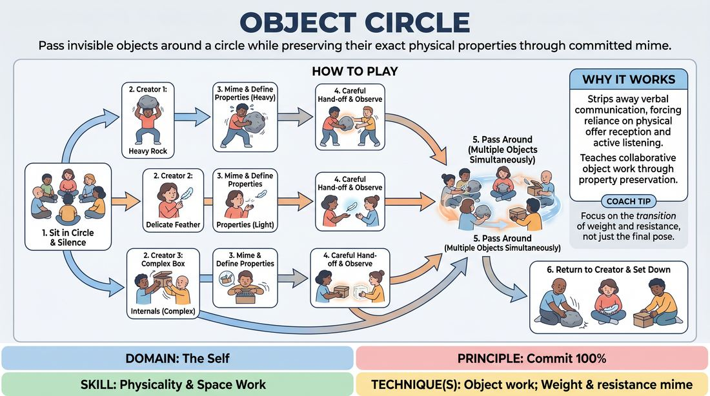

# 🎯 Scene Lab — Mimed Object Relay

{ .infographic }

> Pass invisible objects around a circle while preserving their exact physical properties through committed mime.

`Players 5–99` · `~30 min` · `Complexity 2/5` · `Energy low` · `Contact none` · `Props: none`

⬅️ [Back to the Week 05 run-sheet](../week-05.md)

## Why this activity, here

Week 5 has already put bodies in space — solo object work and room-building. This is the first time an imagined object has to survive contact with another person. It feeds straight into two-person scene work later, where a shared where only exists if both players agree on it without discussing it.

## What students actually learn

- That an imaginary object stays real only if you keep watching someone else's hands, not your own.
- That precision beats invention — a cup handled the same size twice reads better than a clever new object.
- That agreement can be made silently, in a fraction of a second, and it feels like being understood.

## Setup

Chairs in a single circle, no gaps, no table. Everyone seated at roughly the same height — swap out any low sofa or high stool. Clear bags and coats behind the chairs so nothing on the floor competes with the invisible objects. No props of any kind in the room's centre. You need nothing but the circle and a clock.

## How to run it — 30 minutes

| Min | What you do |
|---:|---|
| 4 | Explain the shape and demonstrate one pass yourself with a neighbour: make something heavy, use it, hand it over, watch them take it. Point out that you both held it at the same width. |
| 5 | Run a single object round the whole circle. One creator only. Everyone else watches the object travel. Stop it if the size changes and rewind two players. |
| 6 | Full round with three creators evenly spaced. Objects travel left simultaneously until each returns home. Do not stop for errors — note them and let the round finish. |
| 7 | Second full round. Tell creators to make objects with awkward properties: very light, very hot, very slippery, awkwardly long. Same rules, same direction. |
| 5 | Third round, four creators, and add one rule: before passing, each receiver must do one thing with the object nobody has done yet. Still silent. |
| 3 | Everyone sets their hands in their lap. Run the debrief questions seated in the circle. |

## Side-coaching script

| When | Say |
|---|---|
| First object leaves the creator's hands | *"Both hands present. Take it, don't grab it."* |
| Someone's object shrinks or grows mid-circle | *"Same size as you were given."* |
| Players are watching their own hands | *"Eyes on the hand-off, not on your lap."* |
| The passing speeds up and gets sloppy | *"Slower. Let it land before you let go."* |
| Someone mimes an explanatory gesture or mouths a word | *"No labels. Show me the weight."* |
| Two objects arrive at one person at once | *"Put one down. Deal with them in order."* |
| Mid third round, when people start inventing | *"One new use. Keep the object the same."* |
| An object returns to its creator | *"Take it back. Set it down. Hands empty."* |

!!! success "What good looks like"
    The room is quiet and slightly tense. Hands meet in the air at the same width every time. You can guess what an object is from three chairs away without being told. When a heavy object arrives, the receiver's shoulders drop before their hands move. People lean in during other players' hand-offs. Nobody is performing for a laugh; they are concentrating.

## When it goes wrong

| You see | What's causing it | The fix |
|---|---|---|
| Objects morph — a mug becomes a plate becomes a book within four passes. | Receivers are inventing instead of observing. They looked away during the hand-off. | Stop the round. Send one object round again alone, at half speed, and have everyone watch each pass in silence. Restart. |
| Someone mimes a big showy action, gets a laugh, and the object's properties vanish. | The circle has drifted into performing for the room rather than solving a physical problem. | Say: "Nobody is watching you, they're watching the object." Add the rule that any pass drawing a laugh is repeated seriously. |
| Passes are limp — hands vaguely near each other, no weight, no eye contact. | Under-commitment, usually early nerves rather than resistance. | Make the next round's objects extreme: something that weighs twenty kilos, something red-hot. Extremes force the body to commit before the mind negotiates. |
| Long stalls while someone works out what to do with the object. | They think they must be interesting with it. | Call "one action, then pass". Remind them holding it correctly is the whole job; interesting is optional. |

## Scaling

| Class size | What changes |
|---|---|
| **10–13** | One circle. Three creators in rounds two and three, four in the final round. Objects travel fast, so you get a full lap in about ninety seconds — run an extra round in the third slot if time allows. |
| **14–17** | One circle. Four creators throughout. The lap takes longer, so trim the final round to three creators to be sure objects get home before you call time. |
| **18–20** | Split into two circles of nine or ten, in opposite corners. Three creators each. Run the same rounds in parallel and side-coach by walking between them. For the third round, have circles swap and watch each other for ninety seconds each, then run their own. |

## Variations

**One at a time** — Only one object in play. It goes round the full circle while everyone else watches, then a new creator starts a new one.  
*Easier. Removes the alertness demand and lets nervous players see every pass modelled before their turn.*

**Change direction on the clap** — Clap once at random intervals. Every object reverses direction immediately, back to the player who just passed it.  
*Harder. Forces continuous attention and stops players mentally rehearsing their turn in advance.*

**Transform on receipt** — Each receiver accepts the object exactly as given, uses it once, then visibly changes one property — heavier, longer, wetter — before passing.  
*Different emphasis. Shifts from preservation to offer-and-build, and previews how scene partners alter each other's reality.*

**Name it after** — Run a silent round, then go round the circle and each player says aloud what they thought they were holding.  
*Different emphasis. Makes the gap between intention and reception visible without stopping the physical work.*

## Debrief

1. **When did you know exactly what you'd been handed?**
   > *A good answer sounds like:* They point at a specific physical detail — the width of the hands, how slowly it was lowered, a wince. Not "I just guessed" and not a general comment about being good at mime.

2. **What did you do when you weren't sure what it was?**
   > *A good answer sounds like:* Honest: "I copied the size and hoped." Then the useful bit — that copying the size was enough, and the object survived. If someone says they invented a new object, ask what happened to it two passes later.

3. **Where were your eyes during a hand-off?**
   > *A good answer sounds like:* Recognition that they were watching their own hands early on and the other person's later, and that the passes got cleaner when they stopped monitoring themselves.

4. **What does this ask of you in a scene?**
   > *A good answer sounds like:* Something about keeping the where consistent once a partner establishes it — the door stays where they put it — rather than about miming skill.

!!! warning "Safety & inclusion"
    Hand-offs are hand-to-hand and near-contact. Say at the start that hands need not touch — passing with a two-centimetre gap works identically — and that anyone can pass with a gap all session without explaining. Anyone with wrist, shoulder or hand pain should keep objects small and light; say so before round one. Players who use a wheelchair or a stick sit in the circle as normal; check the circle is wide enough for turning. If someone would rather not handle imagined heat or anything they find unpleasant, they set it down and pass an empty hand — accepted without comment. Anyone can sit a round out in their chair and rejoin.

## Why it works

Physicality and space work fail in scenes because the imagined environment is private — one player's kitchen is another's field. This exercise makes the environment public and immediately testable. When you hand an object over, the receiver's hands either match yours or they don't, and everyone watching sees which. That feedback arrives in under a second, with no discussion, so players stop describing objects and start defining them with the body. Silence is the load-bearing rule: strip out language and the only channel left is the one the cue asks for. Multiple objects in motion adds a second demand — you must attend to someone else's physical offer while managing your own — which is exactly the attention split a two-hander requires.

[Open the full activity card »](../../../../games/D1_P1_S3_T2_G784__object-circle.md){target=_blank rel=noopener}
