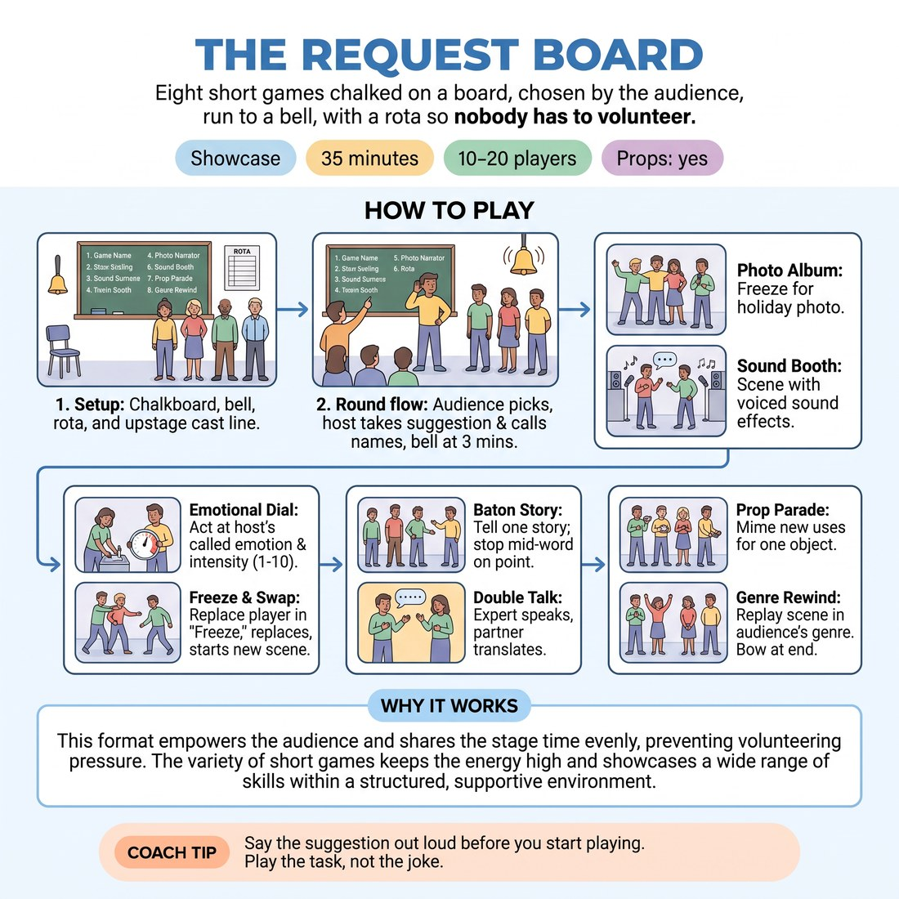

# 🏟️ Showcase round — The Request Board

{ .infographic }

> Eight short games chalked on a board, chosen by the audience, run to a bell, with a rota so nobody has to volunteer.

`Players 10–20` · `~25 min` · `Complexity 2/5` · `Energy high` · `Contact incidental` · `Props: required`

⬅️ [Back to the Week 05 run-sheet](../week-05.md)

## Why this activity, here

Week 5 has spent the session on where, who and what through the body. The earlier blocks were closed-door: mime handovers, object work, room-mapping with no audience. This block puts that work in front of watching eyes for the first time, with a bell and a rota doing the deciding so nobody has to volunteer. It feeds Week 6, where scenes get longer and players carry a location for several minutes without a host to reset them.

## What students actually learn

- That being watched does not remove the skill they had ten minutes ago — the room stays where they built it.
- That a fixed rota is a relief, not a sentence: the decision to go on stage is already made, so the nerves have nothing to argue with.
- That an audience reads posture, weight and distance faster than it reads dialogue.
- That a bell ending a scene is neutral. Nothing was failed.

## Setup

Chalk or write the eight game names on a board, flipchart or large sheet where seated people can read them from across the room. Write the rota on a second sheet: round numbers down the side, names beside each. Fill it before class so no one negotiates during play. Put a chair downstage left for the host — you — and a bell, timer or phone alarm within reach. Clear a playing area roughly four metres wide. Chairs for the audience face it in an arc. Cast stands in a line along the back wall of the playing area. Have one household object ready for Prop Parade: a mug, a hairbrush, a length of rope.

## How to run it — 25 minutes

| Min | What you do |
|---:|---|
| 3 | Show the board. Read the eight names aloud with one sentence each. Point at the rota and say the bell rings at two minutes, not three, because the block is short. Cast to the upstage line. |
| 4 | Round one. Pick an audience member to choose from the board. Take a suggestion, repeat it loudly, call the rota names. Two minutes of play, bell, applause, players sit. |
| 4 | Round two. Same shape. Choose a different audience member. If they pick a game already played, ask them for their second choice and cross the played game off the board. |
| 4 | Round three. Before calling the rota, remind the room of the cue: show me where you are, don't tell me. Then run it exactly as before. |
| 4 | Round four. Run it clean. Do not add notes between rounds — the applause is the note. Keep your suggestion-taking to one word or one phrase, never a discussion. |
| 3 | Round five. Shorter bell at ninety seconds. Take the last pick from someone who has not chosen yet. |
| 3 | Bring the whole cast on. Whole-cast bow. Thank the room by name where you can. Ask the two debrief questions standing, then release. |

## Side-coaching script

| When | Say |
|---|---|
| As players walk on and hesitate at the edge | *"Walk in and touch something."* |
| When a scene starts describing the location aloud | *"Show me where you are. Don't tell me."* |
| Photo Album, on the clap, when poses look loose | *"Freeze harder. Hold the shape."* |
| Emotional Dial, when the number is high but the body isn't | *"Put the number in your shoulders."* |
| Freeze and Swap, when nobody calls freeze | *"Freeze on the next interesting shape."* |
| Baton Story, when a teller stalls and apologises | *"Bow. Applause. Carry on."* |
| Prop Parade, when someone names the object | *"No words. Just the hands."* |
| Ten seconds before any bell | *"Finish the thought."* |

!!! success "What good looks like"
    The board gets crossed off. Names get called and people walk on without a pause for negotiation. Scenes have furniture in them — a door opened in the same place twice, a mug set down and picked up from the same spot. The bell lands mid-sentence at least once and nobody minds. Applause is loud and automatic. You, the host, talk less each round.

## When it goes wrong

| You see | What's causing it | The fix |
|---|---|---|
| Players standing in a flat line at the front of the space, arms at their sides, talking. | Being watched has reset them to conversation mode. The room they built earlier in the session has vanished. | Side-coach "walk in and touch something" the second they arrive. If it persists, stop the round, have them re-enter through an imagined door, and restart. |
| The same two or three confident people keep ending up in scenes. | You have drifted off the rota, or the rota was written loosely and you are filling gaps with whoever is nearest. | Read names off the sheet, out loud, every round. Never say "and whoever wants to jump in". If someone is missed by round five, give them the last spot outright. |
| Double Talk stalls — the expert produces two syllables and stops, the translator waits. | The player is trying to make the invented language mean something rather than just making sound. | Call "more sound, more hands". Tell the translator to translate a long speech from a short one. If it still dies, ring the bell early and move on without comment. |
| Applause is thin and the audience is watching politely rather than choosing keenly. | You are hosting from the middle of the space and behaving like a teacher, so the room stays in class mode. | Sit in the host chair at the side. Say game names loudly, repeat suggestions loudly, start the applause yourself every single time. |

## Scaling

| Class size | What changes |
|---|---|
| **10–13** | One board, one rota, five rounds. Everyone plays once; three or four people play twice. Non-players sit in the audience arc and choose games. Bell at two minutes, ninety seconds for the last round. |
| **14–17** | One board, one rota, five rounds, but favour the wide-cast games: Photo Album, Baton Story, Prop Parade. Two rounds should hold five or six players. Everyone plays once. Bell at two minutes throughout. |
| **18–20** | Split into two houses in opposite halves of the room, each with four games on its own board and its own rota. Appoint a confident participant as second host and brief them during setup. Each house runs three rounds of two minutes with its own audience, then both houses combine for the closing bow. You float between the two and ring both bells. |

## Variations

**Rehearsed board** — Cut the board to four games and play each one twice, so every player sees the game run before their turn comes.  
*Easier — the second run of a game removes almost all the nerves, and the physicality improves visibly.*

**Silent picks** — The audience member points at the board without speaking, and the suggestion is a mimed object rather than a spoken word.  
*Harder — the cast has to read a gesture rather than a word, and the whole round starts in the body.*

**Location board** — Replace two games with the same game run in two named locations, chosen by the audience. Judge each round on whether the audience could draw the room afterwards.  
*Different emphasis — pushes the block off performance and squarely onto space work.*

## Debrief

1. **Whose scene could you draw the floor plan of?**
   > *A good answer sounds like:* Someone names a specific scene and a specific object placement — "the fridge was over there both times she went to it". If answers are vague, ask them to point at where a door was.

2. **What did the rota do to your nerves?**
   > *A good answer sounds like:* Someone says they stopped deciding and just went, or that waiting for their name was worse than playing. Anything that separates the fear of volunteering from the fear of playing. Move on once two people have said it out loud.

3. **What happened when the bell cut you off?**
   > *A good answer sounds like:* Shrugs and laughter. Someone says it stopped them trying to finish cleverly. If anyone says they felt they had failed, name it plainly: the bell is a clock, not a verdict.

!!! warning "Safety & inclusion"
    Freeze and Swap needs one explicit rule stated before it runs: you take the shape near the player, you never move them into it. No hands on anybody. Say this aloud, once, before the first Freeze and Swap round, and repeat it if you see anyone reach out. Offer a standing opt-out at setup: anyone who does not want their name on the rota can take the sound and bell job or sit as a permanent audience member, and they say so to you privately, not to the room. Some poses in Photo Album will be low or twisted — say "stay in a shape you can hold comfortably for ten seconds" and mean it. Nobody is required to be funny; being watched is the whole exercise.

## Why it works

D1.S3 says the body establishes the where before the mouth does. Two things in this block force that. First, the bell: with two minutes and no exit ramp, describing the location out loud costs time players can feel draining, so they start placing objects instead. Second, the audience: watchers give unfiltered attention to weight, distance and posture, and players discover within one round that a clearly opened door reads across the room while a spoken "we're in a kitchen" evaporates. The rota removes the third variable. When nobody has to volunteer, the nerves have no decision to attach to, and the physical work survives the transition to being watched — which is exactly what the block is testing.

[Open the full activity card »](../../library/showcase-formats/SF__the-request-board.md){target=_blank rel=noopener}
