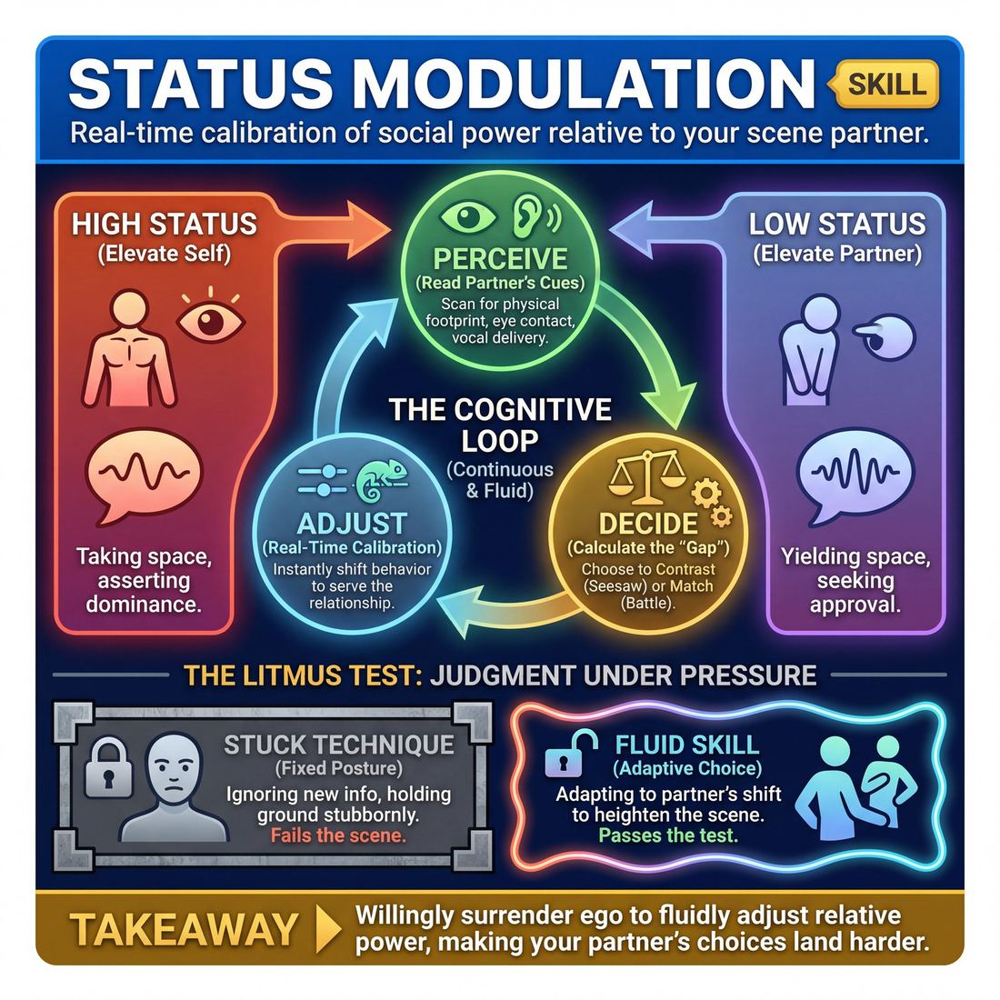

# Week 06 — Status — The Seesaw

> *Status is a distance between two people that either of you can change, and playing it is a choice rather than a personality.*

| Course | Week | Domain | Focus | Stage | Length | Class |
|---|---|---|---|---|---|---|
| Foundations — The Brave Beginner | 6/8 | D2 | `D2.S2` — Status Modulation | Novice → Advanced Beginner | 180 min | 10–20 |

!!! note "Builds on"
    Week 5 made the space concrete; this week makes the relationship inside that space concrete too.

## 🎬 The arc of this session

They arrive six weeks in with a settled pecking order — the loud ones lead, the quiet ones support, and nobody has questioned it since week one. Today status becomes an instruction you call out rather than a personality they have to defend, so the quiet ones get to be high and the loud ones get to be low without it meaning anything about them. They leave able to shift the gap on command mid-scene, and having voted on which show they are making.

!!! tip "Watch for"
    The person who plays low status by making themselves the joke. That is not low status, it is self-punishment, and the room will laugh at it once and feel bad after. Redirect them to low status with dignity — a servant who is good at their job, a nervous person who still wants something.

## ⏱️ Session flow (180 minutes)

| Time | Block | Activity |
|---|---|---|
| **0:00–0:05** | 🧊 Ice-breaker | *Doorstep Report* |
| **0:05–0:10** | 😄 Laughter Blast | *Let Go of the Balloon* |
| **0:10–0:25** | 🔥 Warm-up cluster | *Tall Chair, Small Chair*, *Six Paces Apart*, *One Notch* |
| **0:25–0:45** | 🧠 Theory | — |
| **0:45–1:15** | 🎲 Drill A — isolation | *The Contact Compass* |
| **1:15–1:25** | ☕ Break | — |
| **1:25–1:55** | 🎲 Drill B — under load | *The Boundary Architect* |
| **1:55–2:25** | 🎯 Scene Lab | *Boundary Ballet* |
| **2:25–2:50** | 🏟️ Showcase round | *Two Chairs, One Night* |
| **2:50–3:00** | 💭 Reflection & homework | — |

## 🎒 Before you start

- Set the room: chairs stacked at one end, clear floor for two full playing areas. You need at least two chairs of visibly different heights for the warm-up, or one chair and one stool.
- Print or write the four status calls on a board where everyone can see them from the floor: UP ONE, DOWN ONE, SWAP, HOLD. You will call these all day; the room should stop needing you to explain them by the break.
- Review last week's homework on space object work — take two examples in the ice-breaker only, not a full round. Week 5's discipline is now the floor you build on, not the topic.
- Decide your consent script for The Contact Compass before anyone walks in. Contact in that drill is optional. Say so at the top, offer the no-contact version by name, and make opting out a hand-raise rather than a conversation.
- Note the names of the two people you suspect find low status humiliating, and the one who finds high status thrilling. Plan to reach each of them during the break, not in front of the group.
- Have your showcase vote ready: a slip of paper each, or a simple hands-down-eyes-closed count. Do not let the vote become a debate with a loudest-voice winner — that would be the week's lesson lost on the last block.

## 1. 🧊 Ice-breaker (5 min)

*Stand in a circle. One sentence each: what was the first thing you saw when you stepped out of your front door this morning. Two of you also give me one thing you noticed doing your space-object homework.*

**Why here:** Gets voices in the room fast and lets you take two quick homework examples without opening a twenty-minute discussion.

### Doorstep Report

> Everyone reports the mood they walked in with, in a few words and one gesture, then names one ordinary thing they're looking forward to.

`Players 10–20` · `~5 min` · `Complexity 1/5` · `Energy medium` · `Contact none` · `Props: none`

**How to play**

1. Stand everyone in one circle. Tell them there are two laps, both true, no jokes required. Lap one is the mood they arrived in. Lap two is something ordinary they're looking forward to.
2. Send them to the person beside them first. Thirty seconds each on what they were doing twenty minutes before they got here. Call the swap out loud.
3. With an odd number, make one three and shorten each turn to twenty seconds.
4. Bring them back to the circle. Run lap one: one gesture and up to four words for the mood they walked in with. Clap a steady pace if it drags.
5. Run lap two in the same order, reversed direction. Each person names one ordinary thing they're looking forward to after class. Six words maximum. Bed counts. Toast counts.
6. Close by naming two moods you heard back to the room. Do not comment on them. Move straight into the next piece.

📄 **[Full teaching notes »](week-06/beginner_w06__b1_1.md)**

**Side-coach:** *“Detail, not story — one image and pass it on.”*

## 2. 😄 Laughter Blast (5 min)

*On your feet, shake out. We are going to be loud and undignified for five minutes so that nothing later today feels like a big deal.*

**Why here:** Six weeks in, the room is comfortable but slightly polite; this breaks physical composure before you ask them to play power.

### Let Go of the Balloon

> The whole room inflates, then flies around the space on a long raspberry and crumples to the floor.

`Players 10–20` · `~5 min` · `Complexity 1/5` · `Energy high` · `Contact none` · `Props: none`

**How to play**

1. Clear the floor. Ask everyone to spread out with an arm's length in all directions. Tell them eyes stay open the whole time and nobody touches anybody.
2. Demonstrate at full size. Take three big breaths in, puff your cheeks, pinch your lips, release a long wet raspberry, stagger round the room, crumple.
3. Round one, together. Count three breaths in. On your call of "let go", everyone releases the raspberry, wobbles wherever the air takes them, then drops to a squat or the floor.
4. Round two, squeaky. Same inflate, but the escaping air is a thin high whine. Tell them to go higher than is dignified. Go highest yourself.
5. Round three, slow puncture. One tiny 'pfft' every two seconds, sinking lower each time, until everyone is a puddle. Stretch it across a full twenty seconds.
6. Round four, one giant balloon. Everyone inhales on your five-second count, holds, then releases one enormous shared raspberry and collapses. Run it twice.
7. Bring everyone up. Shake out hands and feet. Three loud exhales together to settle the breathing.
8. Ask one question. Take shouted answers. Move straight into the next block without discussion.

📄 **[Full teaching notes »](week-06/beginner_w06__b2_1.md)**

**Side-coach:** *“Let the sound leave you — do not manage it.”*

## 3. 🔥 Warm-up cluster (15 min)

*Three short warm-ups, all about the same thing, and I am not going to tell you what it is until the fourth one. Tall Chair, Small Chair first — two chairs, front of the room.*

**Why here:** Three quick physical entries into status — furniture, distance, then one-notch adjustment — so the concept lands in the body before the theory names it.

### Tall Chair, Small Chair

> Pairs pump their bodies bigger and smaller against each other on a caller's count, waking the legs and spine while the status gap swings.

`Players 10–20` · `~5 min` · `Complexity 2/5` · `Energy high` · `Contact none` · `Props: none`

**How to play**

1. Pair people by standing height — nearest neighbour, no swapping. Odd number: make one trio and tell the third to mirror whichever partner is lower.
2. Tell pairs to face each other, arm's length apart, feet under hips. No touching at any point. Eyes stay on the partner throughout.
3. Call TALL and LOW. A rises onto the balls of the feet, reaching up. B sinks into a squat. Hold three seconds.
4. Call SWAP. Positions reverse. Run five or six exchanges, quickening each time. Expect legs to work.
5. Switch to numbers. Call one to five: one is floor-low, five is fully stretched. Both partners take that height at the same moment, silently, no discussion.
6. Drop the caller. Pairs move continuously between high and low on their own, never holding the same height as each other for more than a beat.
7. Call FREEZE. Both hold. Tell them to look at the physical gap between them and name it silently as big or small. Shake out legs and finish.

📄 **[Full teaching notes »](week-06/beginner_w06__b3_1.md)**

### Six Paces Apart

> Two lines face each other and change the physical distance between them, so status becomes a gap you can step into rather than a personality you put on.

`Players 10–20` · `~5 min` · `Complexity 2/5` · `Energy medium` · `Contact none` · `Props: none`

**How to play**

1. Split the room into two lines facing each other, roughly six paces apart. Pair each person with the body opposite them. Nobody moves yet.
2. State the rules aloud: no touching, no talking, eyes up. Anyone who wants out steps to the side and watches — that choice is free at any moment.
3. Run silent eye contact. Line A holds a steady gaze. Line B looks away and back as often as they like. Swap the roles halfway through.
4. Clap a slow, even pulse. On each clap, Line A takes one pace forward or back. Line B answers with a pace of their own. Eyes stay up.
5. Drop the clap. Both lines move freely. Tell Line A to seek two paces of distance, Line B to seek five. Silent, no contact, no winning.
6. Call freeze. Everyone holds the distance they ended on and keeps eye contact. Then ask one question, take fast answers around the room, and move on.

📄 **[Full teaching notes »](week-06/beginner_w06__b3_2.md)**

### One Notch

> A silent standing circle where people shift status a single notch at a time using only head, gaze and breath.

`Players 10–20` · `~5 min` · `Complexity 2/5` · `Energy low` · `Contact none` · `Props: none`

**How to play**

1. Stand everyone in one circle, feet planted, arms loose, mouth closed. Tell them nobody speaks and nobody steps for the whole five minutes. Lead three slow breaths together.
2. Define neutral out loud: level gaze, still chin, quiet hands, weight even on both feet. Count them into five seconds of complete stillness, then let them settle back.
3. Call 'up one notch' and 'down one notch' roughly every ten seconds. Rule: changes come from the neck up only — chin height, gaze, blink rate, breath speed.
4. Tell each person to silently choose one person across the circle. Nobody indicates who they picked. No pointing, no nodding, no eye contact deals.
5. Call 'one notch below them' and hold thirty seconds. Then call 'one notch above them' and hold thirty seconds. Keep the room silent throughout.
6. Call 'back to neutral'. Take one shared breath. Ask for a show of hands: who found below easier than above. Note the split and move straight on.

📄 **[Full teaching notes »](week-06/beginner_w06__b3_3.md)**

**Side-coach:** *“Change your height and your stillness before you change your words.”*

## 4. 🧠 Theory — Status Modulation (20 min)

{ .infographic }

- **The big idea:** Status is the distance between two people, and either person can move it. It is not a trait one of them owns.
- **Where you are on the path:** They can already play a clear high or a clear low if you name it. What they cannot yet do is change it on purpose mid-scene, and they still assume the status they play is a statement about themselves. Advanced Beginner here means: shifts on your call, without apology, and can say afterwards which direction they moved.
- **The one cue to coach:** *“Play the gap, not the person.”*

**The three beats**

1. **Say it.** Say: status is a gap. Two people, one gap, and either of you can widen it or close it. Nothing about it says who you are — a duchess can drop to the bottom of the room in one line, a cleaner can take the top of the room in one line. Then give the cue: play the gap, not the person. If you are thinking 'I am the high one', you are stuck. If you are thinking 'right now I am half a metre above them', you can move.
2. **Show it.** Take one willing volunteer. Give them one line: 'You wanted to see me?' Have them say it three times to you, unchanged in words. First with the gap wide and them low. Then level. Then them high above you. Sixty seconds. Then say the only thing that changed was the gap, and ask the room what they saw change — eyes, pace, stillness — not what they think the volunteer is like.
3. **Try it.** Pairs, standing, facing each other. One sentence each about the weather, alternating. On your call of UP ONE or DOWN ONE, the person who just spoke shifts one notch on their next line. Four calls, five minutes, both partners get to move. No scene, no story, just the gap moving. Then one sentence back to the room: which direction was easier for you.

!!! warning "The misunderstanding that always comes up"
    They hear high status as loud, dominant and rude, and low status as pathetic and losing. Correct it early: the highest-status person in most rooms is the calmest and says the least, and low status can be warm, competent and completely likeable. Add the second half — low status is not losing the scene. The scene has no winner.

!!! abstract "📖 Go deeper"
    Read the full write-up: [Status Modulation](../../../theory/02_the-partner/02_S2__status-modulation.md)

## 5. 🎲 Drill A — isolation (30 min)

*This drill has an optional contact version and a no-contact version. Both work. If you would rather not be touched today, hand up now and I will pair you with the no-contact form — no reason needed, and you can switch at any point. At 10-13, run five or six pairs at once and I coach the whole floor. At 14-17, split into two groups and alternate: one group works, one group watches for three minutes, then swap. At 18-20, run three groups of six and rotate every three minutes so nobody watches twice in a row.*

**Why here:** Isolates status from story, dialogue and cleverness — nothing to do but hold and move a gap with a body.

### The Contact Compass

> Navigate physical contact in real-time scenes through explicit, creative boundary negotiation.

`Players 2–99` · `~30 min` · `Complexity 2/5` · `Energy medium` · `Contact none` · `Props: none`

**How to play**

1. Pair everyone. Name one Initiator and one Responder. Give the pair a plain relationship prompt: two old friends meeting at a station platform.
2. Tell the Initiator to drive the scene with words. Before any contact, they must stop and ask — out loud, or by starting the move slowly and freezing just short of touch with eye contact.
3. Tell the Responder they have exactly three replies: "Yes, and…", "Let's try this instead…", or "No, thank you." A T-sign with the hands counts as the third.
4. On "Yes, and…", the Responder accepts, lets the touch land, then adds something — a line, a lean, a move. The scene keeps going.
5. On "Let's try this instead…", the Responder names a different physical action. The Initiator takes it immediately and does it. No negotiating twice.
6. On "No, thank you", the Initiator pulls back at once, offers no apology and no explanation, and plays a non-physical choice instead. The scene continues without comment.
7. Call "Switch!" every few minutes. Partners swap roles so everyone initiates and everyone responds.
8. Set the contact zone before you start: hands, forearms, shoulders, upper back only. Anyone may declare a no-contact lane and play every proposal to a freeze, never landing.

📄 **[Full teaching notes »](week-06/beginner_w06__b5_1.md)**

**Side-coach:** *“Play the gap, not the person — where are you relative to them right now?”*

## ☕ Break — 10 minutes

Water, notes, informal talk. Non-negotiable at three hours — do not let it collapse into a working discussion.

## 6. 🎲 Drill B — under load (30 min)

*Same skill, more load. You now want something from each other, and I will still be calling UP ONE, DOWN ONE and SWAP over the top of it. At 10-13, two playing areas running in parallel. At 14-17, three areas with a nominated caller in each who echoes my call. At 18-20, three areas, two-minute rounds, and I run a fourth rotation so everyone plays at least twice.*

**Why here:** Adds pressure: now the status gap has to survive a task, an objective and another person pushing back.

### The Boundary Architect

> Explicitly negotiate physical and emotional boundaries in real-time to build trust and navigate consent.

`Players 2–99` · `~30 min` · `Complexity 2/5` · `Energy low` · `Contact none` · `Props: none`

**How to play**

1. Pair everyone up. Ask the room for one ordinary close-quarters scenario and a relationship — clearing a shared cupboard, fixing a bike, sharing an umbrella. Everyone plays the same one this round.
2. Name Player A the Architect and Player B the Collaborator. Give each a small private objective: finish before dark, avoid mentioning the money. Low stakes, enough to keep the scene moving.
3. Tell Architects: before any touch, any move into personal space, or any sensitive subject, stop and ask out loud. No exceptions, no surprises.
4. Teach the Collaborator four answers and only four: "Yes, and", "Yes, but", "No, but", "No." Tell them to answer from their real comfort, not their character's.
5. Tell Architects that a No or a condition is accepted instantly. No pleading, no explaining, no sulking. Take the answer and keep the scene going from there.
6. Give the whole room the word Cut. Anyone uses it — player, partner, you — the moment a boundary is skipped or anyone feels off. Everything stops; you check in.
7. Run ninety seconds. Call "Switch": B becomes Architect, A becomes Collaborator, same scene, same rules, another ninety seconds.
8. Offer a no-contact lane from the start. Some pairs negotiate only space, objects and topics, never touch. It is a full version of the exercise, not a lesser one.

📄 **[Full teaching notes »](week-06/beginner_w06__b7_1.md)**

**Side-coach:** *“Take the call immediately — do not finish your sentence first.”*

## 7. 🎯 Scene Lab (30 min)

*Two-handers now, real scenes, and the only note is that the gap must move at least once and I may be the one who moves it. Everyone else watches from the sides and stays quiet.*

**Why here:** First time the shift lives inside an actual scene with a relationship, where a badly handled swap can curdle — so it is coached, not performed.

### Boundary Ballet

> Navigate physical proximity and negotiate contact through silent, honest, real-time physical cues.

`Players 2–99` · `~30 min` · `Complexity 2/5` · `Energy low` · `Contact none` · `Props: none`

**How to play**

1. Pair the room. Name one Responder, one Initiator. Give each pair a clear lane of about three metres, all facing the same way so nobody backs into anybody.
2. Tell Responders to pick a simple standing or sitting activity — reading, waiting for a bus — and fix themselves in one spot. No wandering.
3. Tell Initiators to stand at the far end and choose privately: who this person is to them, and one silent objective that needs them closer.
4. On your call, Initiators approach slowly. Responders read their own real comfort, moment to moment, and show it only in the body: posture, shoulders, gaze, angle.
5. Tell Initiators to keep watching and adjust — speed, angle, distance. If the signal is unclear, stop and ask aloud: 'Is this distance okay?' Responder answers honestly.
6. Allow contact only by naming it first — 'May I tap your shoulder?' — and only on a spoken yes. No spoken yes, no touch. Silence is a no.
7. Give everyone the word 'Cut'. Either player says it, everything stops instantly, no explanation owed. Say you will honour it without comment.
8. Run two to three minutes. Stop them. Give thirty seconds of plain peer debrief — what each noticed — then swap roles and run again.

📄 **[Full teaching notes »](week-06/beginner_w06__b8_1.md)**

**Side-coach:** *“When they go up, let it land on you — do not fight the gap, ride it.”*

## 8. 🏟️ Showcase round (25 min)

*Last week you had a taste of Option B. Today we run Option A as it would actually be performed, front to back, and then you vote. Two chairs, two people — everyone gets on at least once.*

**Why here:** Runs Option A properly against last week's taste of Option B, then closes the format question so the cohort knows what it is rehearsing towards.

### Two Chairs, One Night

> Every pair gets two chairs, a named introduction and one honest scene in front of a real audience.

`Players 10–20` · `~25 min` · `Complexity 2/5` · `Energy medium` · `Contact negotiated` · `Props: required`

**How to play**

1. Keep the pairs you set in week one. Same partner every week. With an odd number, make one trio and give them a third chair in the same slot.
2. Run the consent step before anything else. Each pair says aloud what contact is fine — handshake, hand on shoulder, none — and agrees either can say 'switch' to drop contact instantly.
3. Tell each pair to agree a relationship and a location. Nothing else. No plot, no lines, no first move. They write both on a card and hand it to the host.
4. Set two chairs centre stage, audience on three sides or front. Fix the running order now and post it where everyone can see it.
5. Have the host read the card, name both performers, then take one suggestion from the room — a single word or a small everyday object.
6. Start the scene. The pair use the suggestion inside the relationship they already own. Run two to three minutes. Cut with a bell or a light.
7. Let both performers bow, however the ending landed. Nobody has to finish cleverly. Applaud the bow, not the joke.
8. Bring every pair back for one company bow. Bring the house lights up. Thank the room by name.

📄 **[Full teaching notes »](week-06/beginner_w06__b9_1.md)**

**Side-coach:** *“Play it as if there were an audience — hold the top of the scene one beat longer.”*

## 9. 💭 Reflection & homework (10 min)

**Deepen your improv**
1. Which direction was harder for you today, up or down, and what did the hard one feel like in your body?
2. Think of a moment where the swap worked cleanly. What did your partner do that let you move?

**Beyond the stage**
3. Name one relationship outside this room where you always play the same end of the gap. What would one notch in the other direction cost you?

➡️ **[This week's homework](../homework/HW-BEGW06.md)**

??? note "🎓 Facilitator notes"

    **Timing risks**
    - Theory runs long because someone wants to argue about whether status is real. Give it ninety seconds, say 'we will find out on the floor', and move.
    - The Contact Compass consent step adds two or three minutes the first time. Take it out of the drill, not out of the break.
    - The showcase vote can eat ten minutes if you let it be a discussion. Two minutes of argument maximum, then a silent count.

    **Failure modes this week**
    - Low status played as clowning or self-mockery. The room laughs, the player feels worse afterwards. Redirect to low status with competence and dignity.
    - High status played as shouting. Give them the note that the highest person in the room is usually the stillest, and make them do the next round sitting down.
    - Genuine bullying dressed as a scene — one player repeatedly crushing another with no swap. Stop it, call SWAP, and afterwards name it as a scene problem rather than a character flaw.
    - The cohort's existing pecking order reasserting itself the moment you stop calling. Keep calling. If it persists, deliberately cast against type for the showcase.

    **What good looks like by the end:** By the end, people shift on your call inside two seconds without asking why, the quiet third of the room has played high in front of everyone, and nobody has to explain that they were only pretending. The showcase vote is settled and both options got a fair hearing.

    **Carry into next week:** Note who is still defending their status as identity — 'I just can't be the bossy one'. That is next week's private conversation, not a public note. Also carry the showcase result: from next week the format is decided and rehearsal has a target.
