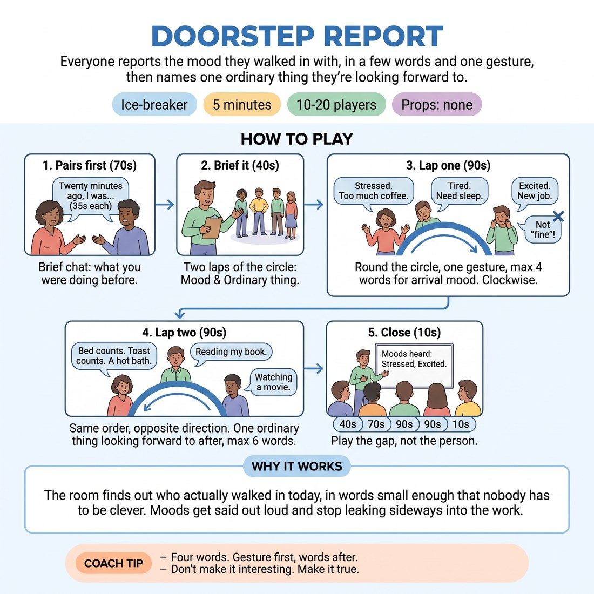

# 🧊 Ice-breaker — Doorstep Report

{ .infographic }

> Everyone reports the mood they walked in with, in a few words and one gesture, then names one ordinary thing they're looking forward to.

`Players 10–20` · `~5 min` · `Complexity 1/5` · `Energy medium` · `Contact none` · `Props: none`

⬅️ [Back to the Week 06 run-sheet](../week-06.md)

## Why this activity, here

Week 6 opens the status material. Before anyone plays high or low on purpose, they need a room where real differences are already on the table and nobody has been ranked for them. This ice-breaker puts twenty different arrival states in the air in five minutes, spoken plainly. It feeds the status work that follows: the class will spend the session reading gaps between people, and here they hear the first gaps without any performance attached.

## What students actually learn

- They notice that the room arrived in a dozen different states, and that none of those states got treated as better than another.
- They speak in front of the circle before they are asked to invent anything, so the first turn of the session costs almost nothing.
- They practise the shape they will use all session: a short offer, a physical component, then silence.
- They stop reading their own mood as something to hide or apologise for.

## Setup

Circle of chairs or standing circle, big enough that everyone can see every face. Nothing else needed. Know how you'll signal a swap — a clap or a single word. Have your own two answers ready so you can model in three seconds if someone freezes at the top. Doors shut before you start.

## How to run it — 5 minutes

| Min | What you do |
|---:|---|
| 1 | Brief it standing in the circle. Two laps, both true, jokes not required. Lap one is your arrival mood, four words plus a gesture. Lap two is one ordinary thing coming later. Take no questions. |
| 1 | Pairs. Turn to the person beside you. Twenty-five seconds each on what you were doing twenty minutes before you got here. Call the swap. Odd number, one three at twenty seconds each. |
| 1 | Lap one round the circle. One gesture, up to four words, the mood you walked in with. Keep it moving — clap a pulse if the pace sags. Do not respond to individual answers. |
| 1 | Lap two, same order, opposite direction. One ordinary thing you're looking forward to after class, six words maximum. Keep the same pace. Anyone stuck says 'pass' and you come back at the end. |
| 1 | Name two moods you heard back to the room, flatly, without interpreting them. Say the cue once: play the gap, not the person. Move directly into the next block without a discussion. |

## Side-coaching script

| When | Say |
|---|---|
| As pairs start and people begin explaining themselves | *"Just the facts. Where were you, what were you doing."* |
| Twenty-five seconds into the pair | *"Swap. Other person now."* |
| First two or three people in lap one | *"Gesture first, then the words."* |
| When answers start growing into sentences | *"Four words. Trim it."* |
| When the pace drops between speakers | *"Straight on. No gap."* |
| When someone apologises for their mood | *"No apology needed. Next."* |
| Mid lap two, if answers get elaborate | *"Ordinary is fine. Toast counts."* |
| Closing the circle | *"Notice how different that room was. Play the gap, not the person."* |

!!! success "What good looks like"
    The circle moves at a steady clip and nobody waits more than a second between speakers. Answers are short and plainly untrue-free — 'tired', 'wired', 'ran here'. Gestures are small and unforced. At least three moods contradict each other and nobody adjusts theirs to match the person before. Lap two draws a couple of quiet laughs at how mundane the answers are, without anyone reaching for a joke. You finish inside five minutes with the room slightly more alert than when they walked in.

## When it goes wrong

| You see | What's causing it | The fix |
|---|---|---|
| Each person's answer is longer than the last, and the circle runs past ninety seconds. | Nobody enforced the word limit at the top, so the second speaker set a longer benchmark than the first. | Cut in on the third speaker with 'four words'. Count the next two aloud on your fingers. The limit reinstates itself within three people. |
| Everyone reports the same mood — 'fine', 'good', 'fine'. | The group is being polite, and 'fine' is the safest thing to say in front of eleven strangers. | Say 'fine is banned from here on' and move on immediately. Do not ask them to be more honest — just remove the escape word. |
| People start making their mood funny — arriving 'devastated by the bus timetable'. | The group thinks an ice-breaker is an audition, and the first joker set the tone. | Say 'true only, no jokes needed' once, without disapproval, and keep the circle moving. Do not stop to explain why. |
| Someone freezes and the circle stalls on them. | They are being asked to be first to name something private with no model to copy. | Say 'pass' for them and go on. Return at the very end. Most people find the answer once the pressure has passed to someone else. |

## Scaling

| Class size | What changes |
|---|---|
| **10–13** | One circle. Run it exactly as written. You will have spare seconds in each lap — spend them on a slightly slower pace rather than adding content. |
| **14–17** | One circle, but cut the pair stage to twenty seconds each way and clap a pulse through both laps. Drop the word limit to three words in lap one if the circle is slow. |
| **18–20** | Split into two circles of nine or ten, standing apart. Run both laps simultaneously; you brief once for both and call the swap for both. Give each circle a nominated starter so neither waits for you. Close by naming one mood you heard from each circle. |

## Variations

**Weather only** — Replace the mood report with a weather word — 'overcast', 'blustery', 'clear'. Lap two stays the same.  
*Easier. Metaphor gives cover to anyone who does not want to disclose their actual state, and it still produces a room full of differences.*

**Mood, then match** — After lap one, each person repeats the gesture of the person opposite them in the circle before giving their own lap-two answer.  
*Harder. Adds a physical observation task and forces people to have actually watched, not just waited for their turn.*

**Gesture only** — Run lap one with no words at all — just the gesture. The room says nothing back. Lap two runs with words as normal.  
*Different emphasis. Puts the weight on physical reading, which is the channel status work runs through for the rest of the session.*

## Debrief

1. **Name one mood from the circle that was nothing like yours.**
   > *A good answer sounds like:* They name a specific person's word and their own without comparing them — 'Sam said wired, I said flat.' If they start explaining why theirs is worse or better, cut in and say that's the ranking we're dropping today.

2. **What did you notice about the gestures?**
   > *A good answer sounds like:* Something concrete about size or level — hands high versus hands in pockets, shoulders up versus dropped. That observation is the raw material for the whole session. One or two answers is enough; move on.

!!! warning "Safety & inclusion"
    No contact in this activity. Nobody touches anyone. 'Pass' is available on either lap without explanation and you take it at face value — do not circle back and ask twice. If someone arrived in a genuinely difficult state, they can name it in one word and you move on without following up in front of the group; catch them in the break if it seems warranted. Standing is optional throughout; run it seated if anyone needs to sit, and have the whole circle seated rather than one person alone. For a hearing-impaired participant, keep the circle tight and make sure speakers face inward. Do not use the mood answers later in the session as material.

## Why it works

Status modulation depends on reading the distance between two people, not on judging either one. That reading is hard to teach when the room is still flattening itself into politeness. This exercise generates a spread of genuine differences — alert next to knackered, rushed next to calm — and then refuses to comment on any of them. The gestures make the differences visible rather than only verbal, which is the channel the rest of the session works in. By the time you name the cue, the class has already experienced a room full of gaps that nobody was ranked for, so 'play the gap, not the person' describes something they have just done rather than an instruction they have to take on trust.

[Open the full activity card »](../../library/icebreakers/IB__doorstep-report.md){target=_blank rel=noopener}
