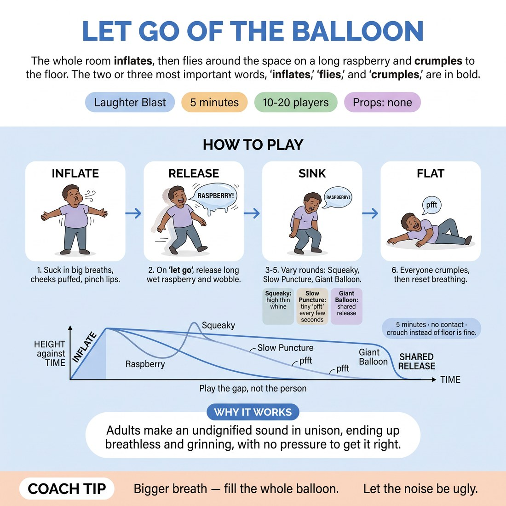

# 😄 Laughter Blast — Let Go of the Balloon

{ .infographic }

> The whole room inflates, then flies around the space on a long raspberry and crumples to the floor.

`Players 10–20` · `~5 min` · `Complexity 1/5` · `Energy high` · `Contact none` · `Props: none`

⬅️ [Back to the Week 06 run-sheet](../week-06.md)

## Why this activity, here

Week six opens the status material. This is the first thing bodies do in the room. It puts the whole group through a full-size-to-flat drop before anyone is asked to think about high and low, so the physical vocabulary of status change arrives before the concept does. It feeds directly into the seesaw work, where players trade positions on a scale — they will already know what full and empty feel like from the inside.

## What students actually learn

- That your body can go from maximum size to a heap on the floor in four seconds, and nothing bad happens.
- That the interesting part is the change, not either endpoint — an inflated balloon is dull, a deflating one is not.
- That making an undignified noise in front of nineteen adults costs nothing once everyone does it at once.

## Setup

Clear floor space, arm's length per person in all directions. Push chairs and bags to the walls. No props. Check the floor for anything slippery. If the floor is hard or cold, say so up front so people choose their own landing.

## How to run it — 5 minutes

| Min | What you do |
|---:|---|
| 1 | Demonstrate full size yourself — three breaths, pinched lips, long raspberry, stagger, crumple. Then run round one all together on your count. Land where you land. |
| 1 | Round two, squeaky. Thin high whine instead of the raspberry. Push them higher than feels dignified, and be the highest in the room yourself. |
| 1 | Round three, slow puncture. Tiny 'pfft' every couple of seconds, sinking a little each time. Take the full twenty seconds getting to the floor. Repeat once. |
| 1 | Round four, one giant balloon. Inhale together on a five-second count, hold two, one enormous shared raspberry, everyone collapses. Run it twice. |
| 1 | Everyone up. Shake hands and feet. Three loud exhales together. Ask the debrief question, take shouted answers, move on. |

## Side-coaching script

| When | Say |
|---|---|
| During the inflate on round one | *"Bigger. Take up more room than you need."* |
| As the air releases | *"Let it steer you. You don't choose."* |
| Round two, if the whine is polite | *"Higher. Less dignity."* |
| Round three, mid-puncture | *"Slower. You've got ages left."* |
| Round three, near the floor | *"Play the gap, not the person."* |
| Round four, on the hold | *"Hold it. Hold it."* |
| After each collapse | *"Stay down. Feel how far you came."* |
| On the shake-out | *"Loud exhale. All three."* |

!!! success "What good looks like"
    Noise you can hear from the corridor. Bodies at genuinely different heights across the room, not a tidy row of squats. People arriving on the floor at slightly different moments and laughing at that. On the slow puncture, a room that is quiet between pffts and then breaks. Nobody watching from the edge.

## When it goes wrong

| You see | What's causing it | The fix |
|---|---|---|
| Polite little raspberries and everyone landing neatly on their feet. | You demonstrated at half size. The room matches the ceiling you set. | Stop, redo your own demo at absolute maximum — cheeks, stagger, floor. Then run the round again immediately without comment. |
| Two or three people standing still, arms folded, watching. | They are waiting to see whether this is safe to do badly. | Don't single them out. Run round two, which is sillier and therefore easier to join, and they usually fold in by round three. |
| Someone goes pale or sits down early. | Repeated deep breaths and breath-holding cause light-headedness in some people. | Tell the room to breathe normally between rounds. Have the person sit out one round. Do not make it a moment. |
| The slow puncture collapses in five seconds. | Nobody trusts the silence, so they rush to the ending. | Call the pffts yourself on a beat — "pfft… pfft… pfft" — until they hold the pace, then stop calling. |

## Scaling

| Class size | What changes |
|---|---|
| **10–13** | Run as written. Everyone moves in the full space at once. Round four's giant balloon reads best here because you can hear individual voices in the shared raspberry. |
| **14–17** | Run as written but shrink the staggering radius — tell them the wobble is on the spot, three steps maximum. Otherwise they collide during the release. |
| **18–20** | Split into two halves. One half runs the round while the other half stands at the wall and watches, then swap. Cut round three to one pass so the swap fits inside five minutes. |

## Variations

**Balloon on the spot** — Feet stay planted. All the deflation happens in the torso and the noise — no travelling, no floor landing, sink to a crouch at most.  
*Easier. Use it with stiff knees, a hard floor, or a group that is not ready to be on the ground in week six.*

**Two balloons, different sizes** — Pair people up. One is a party balloon, one is a weather balloon. Both release together and must finish at the same moment.  
*Harder. Adds negotiation of pace between two players while both are making a ridiculous noise.*

**Named the deflation** — Before releasing, each person picks a word — "sorry", "absolutely", "fine" — and the escaping air is that word, stretched and falling in pitch as they sink.  
*Shifts emphasis from breath to voice. Bridges directly into status in speech rather than status in the body.*

## Debrief

1. **What was more fun to do — being fully inflated, or the moment it started going?**
   > *A good answer sounds like:* Shouted agreement that the release was the fun part, ideally with someone saying the full balloon was just standing there doing nothing.

2. **What changed when I told you to go higher than was dignified?**
   > *A good answer sounds like:* Someone says it got easier, or funnier, or that they stopped checking who was looking. Don't chase depth — take two answers and move.

!!! warning "Safety & inclusion"
    No contact in this activity. Say so before you start, and keep an arm's length gap between bodies. Repeated deep breathing makes some people light-headed: tell the room to breathe normally between rounds and to sit out any round they want, no explanation needed. Offer the crouch as a full alternative to the floor for anyone with knees, hips, backs or a pregnancy. Anyone who prefers to stay standing and just make the noise is fully taking part. Warn that the floor may be cold or hard so people choose their own landing. Watch for glasses coming off during the collapse.

## Why it works

Status modulation is a change in size, height and pressure over time. Most beginners can play high or low as a fixed pose but cannot travel between them, because the travel feels like losing. The balloon removes the choice: physics deflates you, so there is no moment of deciding to be lower and no shame attached to arriving there. Running the same drop at four different speeds — snap, whine, slow puncture, mass release — teaches the group that the interest lives in the rate of change rather than the endpoint, which is exactly what the cue "play the gap, not the person" is pointing at. By the time they sit down for the seesaw work they have felt the gap in their own ribs.

[Open the full activity card »](../../library/laughter/LB__let-go-of-the-balloon.md){target=_blank rel=noopener}
