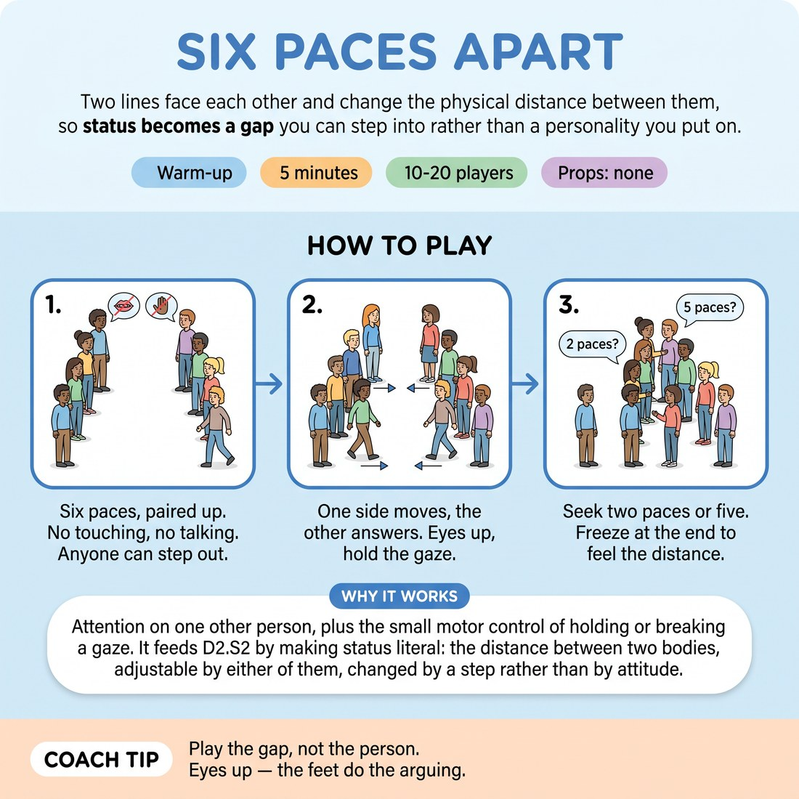

# 🔥 Warm-up cluster — Six Paces Apart

{ .infographic }

> Two lines face each other and change the physical distance between them, so status becomes a gap you can step into rather than a personality you put on.

`Players 10–20` · `~5 min` · `Complexity 2/5` · `Energy medium` · `Contact none` · `Props: none`

⬅️ [Back to the Week 06 run-sheet](../week-06.md)

## Why this activity, here

Opens Week 6. The class arrives with scene skills from weeks one to five and no working idea of status beyond 'confident' and 'shy'. This puts status in the floor before anyone speaks it, so the later scene blocks have something physical to point at.

## What students actually learn

- Distance is a status move. Stepping in and stepping back changes the read of a pair before a word is said.
- Holding a gaze and breaking a gaze are both choices, and both can play high.
- Their own default — most people find out they always concede ground, or always take it, and had not noticed.

## Setup

Clear a strip of floor wide enough for two lines with about six paces between them. Chairs and bags pushed to the walls. No props. Know your slow clap tempo before you start — roughly one clap every three seconds. If you have odd numbers, join the short line yourself.

## How to run it — 5 minutes

| Min | What you do |
|---:|---|
| 1 | Form two lines facing each other, six paces apart, everyone paired with the person opposite. Say the rules: no touching, no talking, eyes up, opt out to the side whenever you like. |
| 1 | Silent eye contact. Line A holds the gaze; Line B looks away and back at will. Call the swap at thirty seconds. Say nothing else. |
| 1 | Start a slow clap. Line A steps one pace in or out on each clap; Line B answers on the same clap. Eyes stay up. Keep the pulse even. |
| 1 | Stop clapping. Both lines move freely. Line A seeks two paces of distance, Line B seeks five. Still silent, still no contact. Tell them nobody wins this. |
| 1 | Freeze. Hold the distance, hold the eye contact for fifteen seconds. Then ask: who moved more, you or them? Take five or six one-line answers and hand straight over. |

## Side-coaching script

| When | Say |
|---|---|
| As the lines form | *"Eyes up. No words the whole way through."* |
| Start of the silent gaze | *"Line A, steady. Line B, look away whenever you want."* |
| First few claps | *"One pace only. Answer the step you were given."* |
| Mid-clap round, if steps get big | *"Smaller. The small step reads louder."* |
| Free movement begins | *"Line A wants two paces. Line B wants five. Keep hunting."* |
| If people start grinning and rushing | *"Slow it down. Let the gap do the work."* |
| On the freeze | *"Hold it. Notice where you ended up."* |
| Just before the question | *"Play the gap, not the person."* |

!!! success "What good looks like"
    Two quiet lines, small adjustments, a lot of held eye contact. In the free round you see clumps: some pairs pinned near each other, some drifting across the room, one or two locked in a stalemate at four paces. Nobody is performing a character. The room goes noticeably quieter than the warm-up chatter before it.

## When it goes wrong

| You see | What's causing it | The fix |
|---|---|---|
| Laughing, mugging, big theatrical lunges | Silence and sustained eye contact are uncomfortable, and clowning discharges it. | Cut the volume of your voice, not the activity. Say 'smaller' and 'slow it down'. If it persists, restart the clap round and make the pace strictly one step. |
| Pairs stop moving entirely in the free round | Both have hit a distance that satisfies neither, and they read stillness as failure so they freeze. | Call out 'keep hunting — you have not got what you wanted yet'. Remind Line A their number is two. |
| Several people drop eye contact and stare at the floor | Genuine discomfort, not disengagement. | Say 'eyes to the forehead if the eyes are too much' — it reads the same from six paces. Remind them the side of the room is available. |
| The block runs long and eats the next activity | You explained rather than side-coached. | Say the rules once, in the first minute, while the lines are forming. Do not demonstrate. Everything after that is three-word calls. |

## Scaling

| Class size | What changes |
|---|---|
| **10–13** | One pair of lines, everyone in. If numbers are odd, stand in yourself rather than making someone watch. Keep the timings exactly as written. |
| **14–17** | One pair of lines still works if the room is long enough. If the strip is cramped, split into two facing pairs of lines at either end of the room and run both simultaneously — clap loud enough for both. |
| **18–20** | Two separate pairs of lines, back to back down the room, five or six per line. Clap for both at once. Shorten the free round to forty-five seconds and cut the freeze to ten, so you keep to five minutes. |

## Variations

**Numbers called** — Instead of 'seek two' and 'seek five', call a number every fifteen seconds that both lines must reach together.  
*Easier — removes the conflict and makes it a shared task, useful for a nervous group.*

**Silent negotiation** — In the free round, tell them the pair must agree on a final distance without words, and hold it for ten seconds.  
*Harder — they must read and be read at the same time, and a concession becomes visible to both.*

**One mover** — Line A may move; Line B is rooted and may only turn, lean or shift weight.  
*Different emphasis — status from stillness rather than travel, and it feeds directly into seated scene work.*

## Debrief

1. **Who moved more, you or the person opposite?**
   > *A good answer sounds like:* Fast, specific, slightly surprised: 'They moved, I just stood there' or 'I backed off every time'. You want the recognition of a default, not analysis of it. Cut it off after five or six answers.

2. **What changed when the clap stopped?**
   > *A good answer sounds like:* Someone naming that it got harder or more real — that with a pulse they were following an instruction, and without it they had to want something. Move on as soon as one person says it.

!!! warning "Safety & inclusion"
    No contact at any point — say it aloud before you begin, and again if anyone drifts within a pace. Sustained eye contact is genuinely hard for some adults; offer the forehead as a target and mean it. Standing to the side is a normal choice, not a withdrawal, and watchers stay watchers with no pressure to join later. Anyone who cannot pace comfortably can play the whole thing seated or with weight shifts and leans, and should be paired with someone told to match their scale.

## Why it works

Status modulation stalls when people treat status as a trait they have to act. Removing speech and character removes that option: the only variable left is the distance between two bodies, which both people can see and change. Because every step by one line forces an answer from the other, the gap itself becomes the unit of play — which is what the cue names. Students leave the block with a physical referent for high and low they can reach for in a scene, rather than a voice they have to put on.

[Open the full activity card »](../../library/warmups/WU__six-paces-apart.md){target=_blank rel=noopener}
