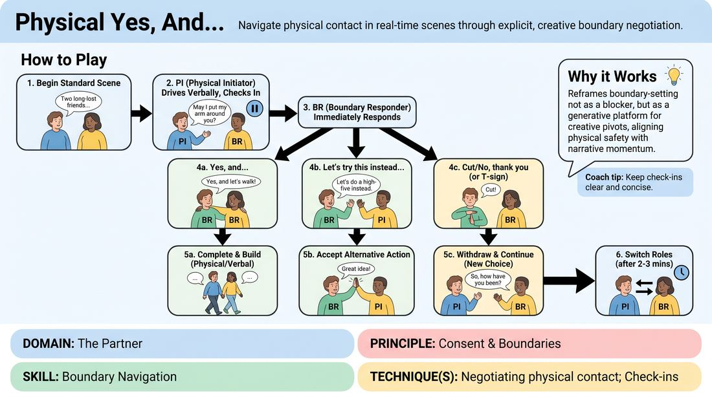

# 🎲 Drill A — isolation — The Contact Compass

{ .infographic }

> Navigate physical contact in real-time scenes through explicit, creative boundary negotiation.

`Players 2–99` · `~30 min` · `Complexity 2/5` · `Energy medium` · `Contact none` · `Props: none`

⬅️ [Back to the Week 06 run-sheet](../week-06.md)

## Why this activity, here

Week 6 is status. The seesaw work that follows asks players to shift up and down against a partner, and touch is the bluntest status move in the room — who may cross into whose space, and who grants it. Before you let people play that, you make the permission explicit and audible. This drill comes first in the session so the consent grammar is installed while the room is still cold, and every later status scene can lean on it without stopping to negotiate.

## What students actually learn

- That asking for contact out loud does not kill a scene — the pause becomes the beat.
- That a refusal is information to play with, not a rejection of them.
- That status lives in the gap between two people, not in either person's personality.
- That they can offer an alternative instead of just accepting or shutting down.

## Setup

Clear floor. Pairs standing, roughly two metres apart from other pairs, facing each other. No chairs needed. Before anything else, state the contact zone — hands, forearms, shoulders, upper back — and the no-contact lane: anyone may play the whole drill to a freeze without landing the touch, and no one asks why. Have a few relationship prompts ready on paper or in your head: old friends on a platform, colleagues after bad news, neighbours returning a lost cat, siblings at a locked front door. Keep bags and coats off the playing floor.

## How to run it — 30 minutes

| Min | What you do |
|---:|---|
| 4 | State the contact zone and the no-contact lane. Take a volunteer and demonstrate all three responses yourself — yes-and, instead, no-thank-you. Show the freeze-before-contact version too. No discussion. |
| 3 | Dry run, no scene. In pairs, A proposes a touch, B picks one of the three replies. Repeat fast, ten or twelve times each. Just the grammar, out loud. |
| 5 | Round one. Give the platform prompt. A initiates, B responds. Play the scene properly. Side-coach for freezes and for clean withdrawals. Watch for apologies. |
| 5 | Call "Switch!" Same pair, same prompt or a new one, roles reversed. B initiates. Tell responders to use each of the three replies at least once. |
| 4 | Reshuffle partners. New prompt with a status difference built in — boss and new hire, doctor and patient. A initiates. Add the cue: play the gap, not the person. |
| 5 | Switch roles inside the new pair. Same status prompt. Ask them to notice whether the higher-status role finds asking harder, and to keep asking anyway. |
| 4 | Bring the room in. Run the debrief questions standing. Keep it short and move on. |

## Side-coaching script

| When | Say |
|---|---|
| First proposals of round one | *"Freeze before contact. Let the gap sit."* |
| Responders hedging or mumbling | *"Three words. Yes-and, instead, or no."* |
| After a refusal | *"No apology. Next choice, now."* |
| Pairs saying yes every time | *"Someone use "instead". Offer a different move."* |
| Negotiation swallowing the scene | *"Ask, answer, play on. Don't discuss it."* |
| Status round begins | *"Play the gap, not the person."* |
| Energy dropping mid-round | *"Keep the story going through the ask."* |
| Thirty seconds before role swap | *"Last proposal. Then switch."* |

!!! success "What good looks like"
    Proposals are short and land inside the story — "can I take your arm?" not "shall we do a touch now?". Freezes hold for a beat and the pause reads as tension rather than a break. Refusals come out flat and friendly, and the Initiator is already talking again two seconds later. Nobody apologises. At least one pair discovers that a "no, thank you" made the scene more interesting than a yes would have. The room is quieter than usual and that is fine — this is a drill, not a showcase.

## When it goes wrong

| You see | What's causing it | The fix |
|---|---|---|
| The Responder says "no, thank you" and then immediately explains, or the Initiator says "sorry, sorry". | People treat a boundary as a social wound needing repair. | Stop the pair. Have them replay the same beat three times in a row: propose, refuse, continue. No words in between. Then let the scene run. |
| Every single proposal gets a yes. | Politeness, plus a belief that saying no blocks the scene. | Mandate it. Tell responders they must use all three replies before the switch. Say the quota out loud, mid-round, so nobody feels singled out. |
| Pairs stop playing the relationship and start negotiating for thirty seconds at a time. | The mechanic is more interesting to them than the scene. | Call "ask, answer, play on". Cap proposals at one sentence. If it persists, tell them the scene must contain at least three lines of ordinary dialogue between proposals. |
| One person avoids initiating anything physical at all. | Genuine discomfort, or fear of getting it wrong in front of you. | Do not name them. Remind the whole room that a freeze-only proposal counts fully, and that the drill is the ask, not the landing. Move on. |

## Scaling

| Class size | What changes |
|---|---|
| **10–13** | Five or six pairs, one odd person joins a pair as a silent observer who reports one moment at the switch. Run the timings exactly as written. You can walk every pair twice per round. |
| **14–17** | Seven or eight pairs. Split the floor into two zones and give each zone a different prompt so pairs don't copy each other. Shorten the dry run to two minutes and give the extra minute to round one. Walk one zone per round. |
| **18–20** | Nine or ten pairs, or use trios with a rotating observer so three people share a slot. With trios, the observer calls the switch inside their own trio at the halfway point. Keep the demo to three minutes and start round one earlier — you will not reach every pair, so side-coach loudly to the whole room rather than pair by pair. |

## Variations

**Table only** — Pairs sit facing each other. Contact zone shrinks to hands and forearms. Everything else stays.  
*Easier. Removes full-body proximity for anxious groups and keeps the focus purely on the grammar of asking.*

**Silent ask** — Initiators may not speak the proposal. They must start the movement, freeze, and hold eye contact until the Responder answers aloud.  
*Harder. Forces the freeze to carry the request, which is where the status gap actually shows.*

**Refusal engine** — Responders must refuse or redirect the first two proposals of every scene. Only the third may get a yes.  
*Different emphasis. Trains the Initiator's recovery rather than the Responder's boundary — pivoting cleanly becomes the skill.*

## Debrief

1. **What happened in your body when someone said no?**
   > *A good answer sounds like:* Something honest and specific — a flinch, heat in the face, an urge to explain — followed by noticing it passed in a second or two. Not "it was fine".

2. **Did a refusal ever make the scene better?**
   > *A good answer sounds like:* A concrete example: the no revealed something about the relationship, or the pivot produced a stronger line than the touch would have. Move on once one pair names it.

3. **In the boss-and-hire round, who found asking harder?**
   > *A good answer sounds like:* Someone notices that the high-status role felt entitled to skip the ask, or that asking dropped their status and that was interesting rather than a loss. That is the gap doing the work.

!!! warning "Safety & inclusion"
    Contact zone is stated before the first demo and never widened: hands, forearms, shoulders, upper back. No face, neck, waist, hips or legs. Anyone may declare a no-contact lane at any point — they play every proposal to the freeze and never land it, and it counts as full participation. Nobody explains their choice and you do not ask. The T-sign stops contact instantly, from either player, with no scene consequence. Watch for the pair where one person is clearly the one always initiating and quietly rebalance at the reshuffle. Players with mobility aids, injuries or long sleeves-only preferences set their own zone within the pair before the round starts; give ten seconds for that conversation and mean it. If someone opts out of the drill entirely, they observe and feed back one moment at the switch.

## Why it works

Status modulation depends on players reading the distance between two people rather than deciding who is the strong one. Touch is the fastest way to make that distance visible — the right to enter someone's space is a status transaction whether or not anyone names it. By forcing the ask into the open, the drill turns an invisible power move into an audible one, and players hear themselves negotiating a gap. The freeze does the mechanical work: it holds the moment still long enough for both players to feel where they stand. Because refusal is pre-authorised and cost-free, nobody has to defend their status by saying yes, which is exactly the confusion the cue "play the gap, not the person" is there to break.

[Open the full activity card »](../../../../games/D2_P1_S6_T3_G253__physical-yes-and.md){target=_blank rel=noopener}
