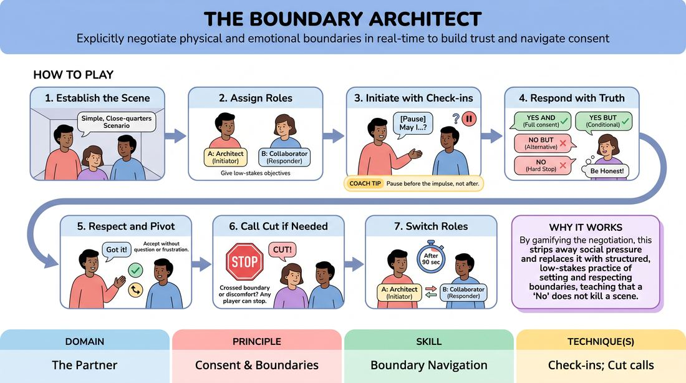

# 🎲 Drill B — under load — The Boundary Architect

{ .infographic }

> Explicitly negotiate physical and emotional boundaries in real-time to build trust and navigate consent.

`Players 2–99` · `~30 min` · `Complexity 2/5` · `Energy low` · `Contact none` · `Props: none`

⬅️ [Back to the Week 06 run-sheet](../week-06.md)

## Why this activity, here

Drill A gave them status as a dial they could turn on purpose. This is the same dial under load: every check-in is a status offer, every answer moves the gap, and the answer is not theirs to control. It feeds the week's final scene work, where status has to shift mid-scene without anyone announcing it, and it sets the physical ground rules for the rest of the course.

## What students actually learn

- Asking permission does not lose you status — it hands the other person a live choice, and the scene gets sharper when they take it.
- A No from a partner is information about the gap, not a rejection of the offer or the person.
- They can feel the difference between their own comfort and their character's, and speak the first one out loud mid-scene.

## Setup

Chairs pushed to the walls. Enough floor for pairs to stand two metres apart without overlapping. Write the four answers up where everyone can see them: Yes and / Yes but / No but / No. Write the word CUT under them. No props needed. Have a plan for an odd number — you play, or one person observes and rotates in next round.

## How to run it — 30 minutes

| Min | What you do |
|---:|---|
| 4 | Frame it standing. Read the four answers aloud. Say the word Cut and say who can use it: everyone. State the no-contact lane and tell people they can take it silently by simply never proposing touch. |
| 3 | Demo with one volunteer, thirty seconds. Ask for something small — "can I move past you?" Have them refuse. Show yourself taking the No cleanly and continuing. Point out where the status shifted. |
| 5 | Round one. Whole room in pairs, same scenario. Ninety seconds, call Switch, ninety more. Thirty seconds to shake out. Side-coach for check-ins only; ignore everything else. |
| 5 | New partners, new scenario from the floor. Same shape. This time tell Collaborators to use at least one answer that is not "Yes, and". Ninety, Switch, ninety. |
| 5 | Load on. Assign each pair a status gap of two — Architect high, Collaborator low. Same rules. The gap must survive the negotiation. Ninety, Switch, ninety. |
| 4 | Last round, ninety seconds each way, no reset chat. On any No, the gap flips: the refuser takes the higher position and holds it until the next check-in. |
| 4 | Circle up. Run the debrief questions. Close by naming the cue and hand straight to the next block. |

## Side-coaching script

| When | Say |
|---|---|
| First thirty seconds of round one, when people start miming touch without speaking | *"Ask first. Out loud."* |
| When Collaborators are answering with a single word | *"Answer, then add the world back in."* |
| When an Architect pauses awkwardly after a refusal | *"Take the No and keep building."* |
| Mid round one, when everything is going smoothly and nobody has refused anything | *"Someone say no. Now."* |
| Round three, once the status gap is assigned | *"Play the gap, not the person."* |
| When a refusal deflates the scene | *"The No is the offer. Use it."* |
| Ten seconds before Switch | *"Finish the thought. Switch coming."* |
| If a pair speeds up and check-ins start getting skipped | *"Slow the hands. The mouth goes first."* |

!!! success "What good looks like"
    You hear a steady rhythm of short questions and short answers, and the scene keeps moving through them rather than stopping for them. Refusals land without apology and without anyone breaking character to reassure. In the status rounds, you can see the gap in the bodies — one person taking more room than the other — while the negotiation stays polite and specific. Nobody is being funny about it.

## When it goes wrong

| You see | What's causing it | The fix |
|---|---|---|
| Pairs asking permission for absolutely everything, including handing over an imaginary box, and the scene grinding to a halt. | They have heard "check in" as a rule to obey rather than a tool, so they over-apply it to prove compliance. | Call "Ask for the big things only" and name the three triggers again: touch, personal space, sensitive subject. Everything else, just do it. |
| Every answer is "Yes, and". No refusals anywhere in the room. | Adults new to improv believe blocking is forbidden and are conflating a boundary with a block. | Stop the room for fifteen seconds. Say a boundary is not a block — it changes the offer, it does not delete the scene. Then require one non-yes per round. |
| Someone makes contact without asking, and their partner laughs it off. | Social politeness overriding the exercise; the person touched does not want to make a fuss. | You call Cut yourself. Reset both players calmly, no blame, restate the rule to the whole room, restart. Doing this once early makes Cut usable for everyone. |
| Check-ins delivered in a silly voice, or refusals played for laughs. | Discomfort with the seriousness of the material, discharged as comedy. | Say "Straight voice on the question." Give the pair a duller scenario — sorting recycling — so there is nothing to milk. |

## Scaling

| Class size | What changes |
|---|---|
| **10–13** | All pairs run simultaneously, four rounds as written. With an odd number, take the spare into the round as your partner and hand them to a new pair each switch so they play every round. |
| **14–17** | Split the floor into two zones so pairs are not shouting over each other. Same four rounds. You side-coach one zone at a time, thirty seconds each, and call Switch for both zones together. |
| **18–20** | Two zones, and cut round two entirely — add its five minutes across rounds three and four so each becomes seven and six. Fewer rounds, longer play, less time lost to re-pairing. Call Switch loudly with a hand raised so the far zone sees it. |

## Variations

**Objects and topics only** — Ban physical proposals altogether. Architects may only ask about entering space, moving someone's belongings, or raising a subject.  
*Easier — removes the touch question entirely, which is where most of the self-consciousness sits, while keeping the negotiation intact.*

**All four, in order** — The Collaborator must use all four answers inside their ninety seconds, in the order they are written up, and the scene must still make sense at the end.  
*Harder — forces refusals into scenes that do not want them, so the Architect has to keep rebuilding.*

**Silent gap** — Run it with the status gap assigned but no verbal status play. The Architect asks in a neutral voice; only posture, eyeline and distance carry the gap.  
*Different emphasis — pushes status into the body so it stops depending on tone of voice.*

## Debrief

1. **When your partner said no, what happened to the scene?**
   > *A good answer sounds like:* Someone says it went somewhere they had not planned, and that this was more interesting than the thing they wanted. Not "it was fine" — you want a specific moment named.

2. **Did asking make you feel lower status?**
   > *A good answer sounds like:* Split answers. Some felt smaller asking; others noticed that the person asking sets the agenda while the person answering only reacts. If nobody spots the second half, say it yourself.

3. **Was there a moment you said yes when you meant no?**
   > *A good answer sounds like:* An honest hand goes up and someone names politeness or not wanting to derail the scene. Accept it, thank them, do not analyse it. The admission is the point.

4. **Where did the gap move without anyone deciding to move it?**
   > *A good answer sounds like:* Someone describes a refusal or a condition that tipped the balance mid-beat, and can say who was higher before and after. Move on once one person can do this cleanly.

!!! warning "Safety & inclusion"
    Contact is opt-in every single time, in the moment, by name. Nobody agrees to touch at the start of the round on behalf of their later self. Announce the no-contact lane before pairing and check nobody is pressured out of it — if a pair is mismatched, re-pair them without comment. Cut belongs to everyone and needs no justification; if it is used, stop, ask the person if they want to continue or sit out, and accept either answer in one word. Keep scenarios domestic and dull; steer the room away from anything romantic, medical or family-conflict. Watch for participants with mobility aids, hearing needs or personal-space differences and let those pairs set their own working distance. Anyone may sit out and observe with no explanation; give them a job — count the refusals they see — so sitting out is not exile.

## Why it works

Status modulation fails when students treat status as a personality they have chosen and then defend. This drill removes the choice: the Collaborator's honest answer is outside the Architect's control, so the gap changes without either player deciding it should. The Architect has to register the new gap and keep playing, which is the actual skill. Adding an assigned gap in round three separates the social act of asking from the theatrical fact of relative status, and students discover the two are independent — you can ask permission from a position of high status, and you can refuse from a low one. That separation is what the cue points at. The consent structure is not a wrapper around the exercise; it is the mechanism that generates unplanned status shifts fast enough to drill.

[Open the full activity card »](../../../../games/D2_P1_S6_T1_G454__the-boundary-architect.md){target=_blank rel=noopener}
