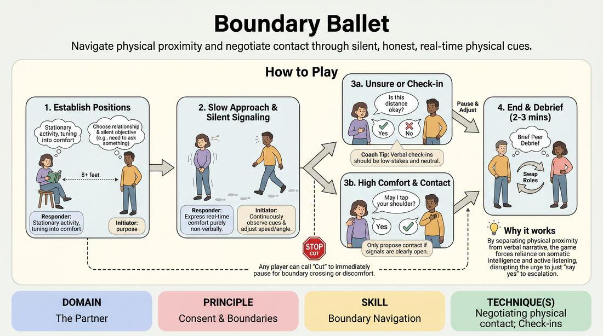

# 🎯 Scene Lab — Boundary Ballet

{ .infographic }

> Navigate physical proximity and negotiate contact through silent, honest, real-time physical cues.

`Players 2–99` · `~30 min` · `Complexity 2/5` · `Energy low` · `Contact none` · `Props: none`

⬅️ [Back to the Week 06 run-sheet](../week-06.md)

## Why this activity, here

Week 6 has spent the morning on status as an adjustable dial — voice, eye contact, height, the give-way. This block moves it into the body's most honest register: distance. Where a raised chin can be faked, a shoulder that tightens at four feet usually cannot. It feeds the closing scene work, where students carry proximity as a live status tool rather than a blocking accident.

## What students actually learn

- They stop treating personal space as fixed and start reading it as a negotiation happening every second.
- They discover their own tells — the exact distance where their body changes — and can name it afterwards.
- They learn that asking for consent out loud does not break a scene; it usually sharpens it.
- They feel status as a gap between two people rather than a quality one person owns.

## Setup

Clear the floor. You need roughly three metres of straight approach per pair, so shift chairs to the walls. Mark lanes loosely with tape or chairs if the room is tight. No props needed; a chair per Responder helps. Before pairing, offer the no-contact option: anyone who wants contact off the table entirely says so to their partner at the start, and that is final for the whole block. Have that sentence ready so it lands as ordinary, not as an exception being made.

## How to run it — 30 minutes

| Min | What you do |
|---:|---|
| 4 | Frame it. Explain the shape in three sentences. Give 'Cut' and demonstrate honouring it. Offer the no-contact opt-out plainly. Pair people up and send them to lanes. |
| 4 | Demo once with a willing volunteer. You initiate, they respond. Narrate two things you see — a shift of gaze, a turned hip — then stop before contact. Take no questions beyond one. |
| 6 | Round one. Initiators approach. Call time at two and a half minutes, thirty seconds of peer debrief, then swap roles and run the second half. Walk the room quietly. |
| 5 | Regroup standing. Ask two people what distance their body changed at. Repair pairs into new partners. Add the frame: proximity is a status move, not just a comfort question. |
| 6 | Round two, new pairs. Tell Initiators to hold a deliberate status — high or low — and see whether the Responder's body reads it. Swap at three minutes. |
| 5 | Bring the room into a circle for debrief. Take three or four contributions, no more. Land the cue before releasing them. |

## Side-coaching script

| When | Say |
|---|---|
| As the first approach begins | *"Slower than feels dramatic."* |
| When Initiators are looking at the floor | *"Watch the shoulders, not the face."* |
| When a Responder is performing discomfort they don't feel | *"Report, don't act. What's actually true?"* |
| When an Initiator drives straight through a clear signal | *"That was a no. Give the metre back."* |
| Mid-round, when pairs stall at three metres | *"Change your angle, not your speed."* |
| When someone hovers near contact without asking | *"Say it out loud or don't do it."* |
| Round two, to set status | *"Play the gap, not the person."* |
| Fifteen seconds before time | *"Finish where you are. Don't resolve it."* |

!!! success "What good looks like"
    Quiet room. Slow movement. You see Initiators genuinely changing course mid-approach — angling away, stopping short — because they read something. Responders look ordinary, not theatrical; the information is in small things. Verbal check-ins happen without embarrassment and the scene keeps its shape afterwards. Most pairs never make contact at all, and that is fine. In the peer debrief you hear specifics: 'you sped up at the end', 'I turned my book away'.

## When it goes wrong

| You see | What's causing it | The fix |
|---|---|---|
| Pairs collapse into giggling at about two metres and never get closer. | The silence and slowness feel exposing, and laughter is the release valve. | Give the Responder a genuine task with an object — a phone, a book. Occupied hands lower the self-consciousness. Say aloud that laughing is normal and to keep going through it. |
| Responders performing exaggerated flinching or cartoon recoil. | They think the exercise wants drama, so they invent signals rather than reporting. | Stop the room. Say: the exercise is a measurement, not a scene. Rerun thirty seconds with the instruction to change nothing unless something actually changes. |
| Initiators walk to a polite distance, stop, and nothing further happens. | No objective. They chose a relationship but not a reason to close the gap. | Side-coach a concrete want: you need the pen in their hand, you think you know them, you have bad news. Something that costs them if they stay far away. |
| One pair rushing to contact within the first thirty seconds. | They are treating consent as a box to tick rather than a reading. | Cut them. Reset at full distance. Ban contact for that pair for the rest of the block and tell them the interest is in the approach. |

## Scaling

| Class size | What changes |
|---|---|
| **10–13** | Five or six pairs, all running at once, everyone participating. Two full rounds as written. You can walk every lane in a round, so side-coach individually rather than to the room. |
| **14–17** | Seven or eight pairs at once. Shorten each half-round to two minutes so the swap and peer debrief still fit. Side-coach to the whole room from one spot rather than pair by pair; you will not reach everyone. |
| **18–20** | Split into two waves. Wave A runs in lanes while Wave B watches from the wall with one job each: name the exact moment the Responder's body changed. Two minutes per role, then waves swap. Watchers report one observation each into the debrief; this replaces the second full round. |

## Variations

**Distance only** — Remove contact from the exercise entirely. The Initiator's objective is simply to get as close as the Responder allows and hold there.  
*Easier. Takes out the negotiation that makes nervous groups tense and leaves the reading skill intact.*

**Two initiators** — Two Initiators approach one Responder from different angles with different relationships. Responder tracks comfort with both.  
*Harder. Splits attention and makes proximity a three-way status negotiation rather than a line.*

**Named status** — Before each approach, the Initiator whispers a status number, one to ten, to you. Responder guesses it afterwards from the approach alone.  
*Different emphasis. Shifts the exercise from comfort-reading to status legibility — how distance and pace broadcast rank.*

## Debrief

1. **Where exactly did your body change?**
   > *A good answer sounds like:* A specific distance and a specific tell: 'about a metre and a half, I started holding the book higher.' Not 'I felt a bit weird.' If you get vagueness, ask what they did with their hands.

2. **What did the check-in do to the scene?**
   > *A good answer sounds like:* Someone says it made things easier, or that the honest answer was more interesting than the guess. Someone may say it felt awkward — take that too, then ask whether the awkwardness cost anything.

3. **Who had status in your pair?**
   > *A good answer sounds like:* An answer that keeps moving: the Responder held it while stationary, the Initiator took it by closing, it flipped when the check-in happened. If they name one fixed winner, push once more.

4. **Where does this show up in a scene?**
   > *A good answer sounds like:* Concrete staging: standing too close as a threat, backing off as a concession, the whole relationship readable before a word. Move on once one person says something you could actually direct.

!!! warning "Safety & inclusion"
    Contact is opt-in twice: once at the start of the block, once verbally in the moment. Anyone can declare no-contact for the whole session and it is honoured without discussion — say this yourself so nobody has to ask. 'Cut' stops everything instantly, from either player, with no reason required; model honouring it in the demo. Do not pair people up yourself if you can avoid it, and let anyone swap partners without explanation. Mobility differences: the Responder is stationary by design, so a seated Responder is fully within the exercise; an Initiator who cannot cover three metres can start at whatever distance works and the lane shortens to match. Watch for the pair where one person is markedly larger or the dynamic reads uncomfortably; step in early and reset the distance rather than waiting for a 'Cut'.

## Why it works

Status modulation usually gets taught as a set of behaviours a person adopts — chin up, eye contact held, space taken. That framing makes status a property of the individual, which is why students play it as a costume and drop it the moment the scene gets busy. Proximity breaks that habit because distance only exists between two people. You cannot be four feet away by yourself. Every adjustment the Initiator makes is caused by something the Responder did, and the Responder's signals are caused by the approach. Neither player can own the exchange. Because the Responder is reporting real comfort rather than acting a choice, the feedback is unfaked and arrives faster than the students can think, which is what forces the reading to become physical rather than analytical. That is the cue in practice: play the gap, not the person.

[Open the full activity card »](../../../../games/D2_P1_S6_T3_G468__boundary-ballet.md){target=_blank rel=noopener}
