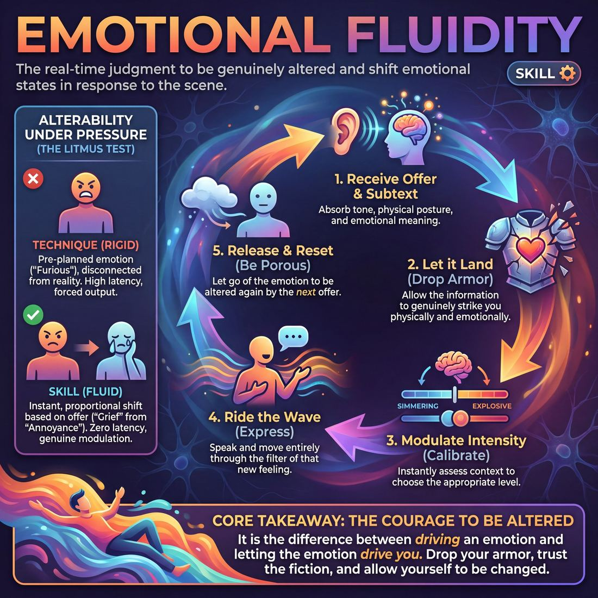

# Week 07 — Emotion & the Voice

> *Feeling arrives in the breath and the voice before it reaches the vocabulary, and it can be turned on deliberately.*

| Course | Week | Domain | Focus | Stage | Length | Class |
|---|---|---|---|---|---|---|
| Foundations — The Brave Beginner | 7/8 | D1 | `D1.S2` — Emotional Fluidity | Novice → Advanced Beginner | 180 min | 10–20 |

!!! note "Builds on"
    Week 6 gave them a dial for the relationship; this week gives them a dial for the inside of the character.

## 🎬 The arc of this session

They arrive split — half buzzing that the show is real, half quietly dreading it. The first two thirds pull attention off the show and onto something concrete they can control: how breath and voice carry feeling, and how to switch it on cue. They leave having run the format end to end in front of strangers, with one specific thing each to change next week.

!!! tip "Watch for"
    The two moods in the room will not mix on their own. Watch for the excited half getting louder and the dreading half going quiet and compliant — the quiet ones will nod at every note and change nothing. Pull names from the quiet half first in every drill.

## ⏱️ Session flow (180 minutes)

| Time | Block | Activity |
|---|---|---|
| **0:00–0:05** | 🧊 Ice-breaker | *Small Print* |
| **0:05–0:10** | 😄 Laughter Blast | *Kettle Boil* |
| **0:10–0:25** | 🔥 Warm-up cluster | *Shake Out the Weather*, *Sigh Trade*, *Breath Tell* |
| **0:25–0:45** | 🧠 Theory | — |
| **0:45–1:15** | 🎲 Drill A — isolation | *Somatic Impulse Dial* |
| **1:15–1:25** | ☕ Break | — |
| **1:25–1:55** | 🎲 Drill B — under load | *The Emotional Compass* |
| **1:55–2:25** | 🎯 Scene Lab | *Incremental Character Dial* |
| **2:25–2:50** | 🏟️ Showcase round | *The Request Board* |
| **2:50–3:00** | 💭 Reflection & homework | — |

## 🎒 Before you start

- Chairs for the invited audience set at the back before anyone arrives — six to eight is plenty. Do not let performers rearrange them later.
- Printed running order of the voted format, two copies: one for you, one taped to the wall by the stage-left entrance.
- Water within reach of the playing space. This session is loud and vocal fatigue is real.
- Review last week's homework note: everyone was to bring one observed relationship dial. Ask for two examples only, in the ice-breaker, then move on.
- A stopwatch or phone timer visible to you for the dress run. The running order holding to time is the point of Block 9.
- Decide now who calls the top of the show and who gives the audience the one-line welcome. Do not decide this at 8pm.

## 1. 🧊 Ice-breaker (5 min)

*Circle up, standing. Quick one, nothing to prepare.*

**Why here:** Gets voices out fast and lets you take the room's temperature about the show without a group discussion about the show.

### Small Print

> Three fast go-rounds of tiny true facts about the last few days, answered before anyone has time to polish it.

`Players 10–20` · `~5 min` · `Complexity 1/5` · `Energy medium` · `Contact none` · `Props: none`

**How to play**

1. Stand everyone in one circle. Say the rule: you call a category, each person answers in five words or fewer, and the next voice starts within two seconds.
2. Demonstrate once yourself with a real answer. Keep it short and unremarkable — you are modelling speed and honesty, not content.
3. Call round one: the last thing you ate. Move clockwise. Cut any answer that runs long with a friendly "next".
4. Call round two: something you forgot this week. Start with the person left of whoever ended round one, and travel anticlockwise.
5. Call round three: one small thing you're looking forward to. Start somewhere new in the circle. Hold the same speed.
6. Allow "pass" at any point, no explanation. Move straight on to the next person.
7. Close by asking who remembers an answer someone else gave. Take three or four, then stop and move on.

📄 **[Full teaching notes »](week-07/beginner_w07__b1_1.md)**

**Side-coach:** *“Shorter — say less, commit more.”*

## 2. 😄 Laughter Blast (5 min)

*Stay standing. This one is about the breath, and you'll see why later.*

**Why here:** It is a breath exercise disguised as a game, which sets up the theory block without announcing it.

### Kettle Boil

> The whole room becomes a kettle at the same time — low hum, rattling lid, full whistle, then the steam comes out as laughing.

`Players 10–20` · `~5 min` · `Complexity 1/5` · `Energy high` · `Contact none` · `Props: none`

**How to play**

1. Stand everyone in one circle, arms' length apart. Tell them they are all kettles. Say it plainly and move on — no apology, no preamble.
2. Demonstrate the whole shape yourself at full volume: crouch, hum low, rise slowly, rattle, whistle. Commit fully. Your volume sets the ceiling for theirs.
3. Round one, all together. Crouch, hum a low 'mmmm', rise over ten seconds, let the hum thin into a breathy 'wheeeee' at the top. Shake out.
4. Round two, add the lid. Same climb, but from halfway up everyone rattles — knees bouncing, shoulders juddering, hands flapping. Let the hum wobble with the shake.
5. Round three, slow boil. Twenty seconds climbing from the floor, rattling hard, then hold the whistle until breath runs out. Each person finishes at their own moment.
6. Boil over. Straight from the whistle into puffed 'ha-ha-ha-ha', hands paddling steam upward. Hold it thirty seconds. Stay the loudest person in the room throughout.
7. Cut it clean. Ask one question, take two quick answers, move to the next block.

📄 **[Full teaching notes »](week-07/beginner_w07__b2_1.md)**

**Side-coach:** *“Let the pressure build before you release it.”*

## 3. 🔥 Warm-up cluster (15 min)

*Three of these, back to back. Shake first, then we get quieter.*

**Why here:** Three warm-ups that move from whole body, to breath, to breath carrying information — the exact staircase the theory block will name.

### Shake Out the Weather

> A counted eight-shake of the limbs that a called emotion floods through, so the feeling lands in the breath and body before anyone speaks.

`Players 10–20` · `~5 min` · `Complexity 2/5` · `Energy high` · `Contact none` · `Props: none`

**How to play**

1. Stand everyone in a loose circle, arm's length apart, knees soft. Tell them to keep the knees unlocked all the way through.
2. Teach the shape: shake the right hand for eight counts, left hand eight, right foot eight, left foot eight. Then four each, two each, one each.
3. Run it once neutral. You call the count, they call it back. Finish on one still breath together. Fix spacing and stiff knees now, not later.
4. Call DELIGHT. Everyone takes one loud in-breath in that emotion before moving, then runs the whole countdown with it in arms, feet and counting voice.
5. Call GRIEF the same way. Breath first. The shake gets heavier and slower, but the count stays on time.
6. Call FURY. Breath first. Sharp and fast, still landing on the beat.
7. Take one emotion from the room. Breath first, full countdown, everyone counting aloud in that emotion.
8. Run the last round silent — breath and shake only, no counting out loud. Land on stillness and hold ten seconds of quiet standing.

📄 **[Full teaching notes »](week-07/beginner_w07__b3_1.md)**

### Sigh Trade

> Pairs pass feelings back and forth on the out-breath alone, so emotion lands in the body before anyone reaches for words.

`Players 10–20` · `~5 min` · `Complexity 2/5` · `Energy medium` · `Contact none` · `Props: none`

**How to play**

1. Pair everyone off. Odd number, make one three — the third breathes in turn with each partner.
2. Demo with one volunteer. Sigh a feeling out. They breathe in, sigh the same feeling back. No words. No pulled faces for laughs.
3. Round one: pairs trade matching sighs, about one every three seconds. Tired goes out, tired comes back. Eye contact if it's comfortable, floor if not.
4. Round two: return the sigh with a different feeling. Impatient out, delighted back. No discussion between partners — they breathe the change and keep going.
5. Round three: lay one word on top of the out-breath. Any word — 'right', 'oh', a name. The breath carries the feeling; the word rides along.
6. Stop them. Hands down, one ordinary breath together. Ask two pairs what they caught that they never meant to send. Move straight on.

📄 **[Full teaching notes »](week-07/beginner_w07__b3_2.md)**

### Breath Tell

> A silent circle switches emotion in the breath alone while one person in the middle tries to read it.

`Players 10–20` · `~5 min` · `Complexity 2/5` · `Energy low` · `Contact none` · `Props: none`

**How to play**

1. Stand the group in a circle, arms' length apart. Tell them this is silent. Nobody speaks, nobody touches, nobody leaves their spot.
2. Set the one rule: when you call an emotion, only the breath may change. No sound, no gesture, no face. Let it land in the ribs and stay.
3. Pick a reader. Put them in the centre, eyes closed, palms over their ears, humming quietly so they cannot hear your call.
4. Say one emotion aloud to the circle. Give them ten seconds to breathe it and hold it.
5. Click your fingers. The reader drops their hands, opens their eyes, turns slowly, and names what they read. Take the guess, right or wrong, and move on.
6. Run three more rounds with a new emotion and a new reader each time. Draw from dread, relief, boredom, quiet fury, delight, suspicion.
7. Close it: everyone drops the emotion and takes three ordinary breaths together. Keep the circle silent until you release them into the next block.

📄 **[Full teaching notes »](week-07/beginner_w07__b3_3.md)**

**Side-coach:** *“Sigh Trade: don't perform the sigh, just pass it. Breath Tell: your partner reads the breath, not your face.”*

## 4. 🧠 Theory — Emotional Fluidity (20 min)

{ .infographic }

- **The big idea:** Emotion is physical before it is verbal. It changes breath, then voice, then word choice — in that order. You can start at the breath end and the rest follows, which means emotion is something you can choose rather than wait for.
- **Where you are on the path:** Advanced beginner looks like this: they can switch emotion when you call it from outside, and each of them has one character voice that is genuinely not their own. Not five voices. One, reliable, repeatable.
- **The one cue to coach:** *“Let it change your breath before it changes your words.”*

**The three beats**

1. **Say it.** Say: feeling shows up in the breath first. Grief is a short in-breath and a long collapse out. Rage is high and shallow and held. Delight is a catch at the top. You do not need to feel the thing to make the breath — make the breath and the feeling arrives to meet it. Then say the cue: let it change your breath before it changes your words.
2. **Show it.** Stand at the front. Say the line "I'll be there at six" flat. Then say the same line four times, changing only your breath first each time — shallow and fast, held and tight, long and sinking, caught and light. Do not act. Let them hear that the words never changed. Sixty seconds, no commentary until the end, then name what shifted.
3. **Try it.** Everyone stands, finds their own space. Give them the line "there's nothing left in the fridge". Call a breath pattern — fast and shallow, held, sinking, caught — they take the breath first, then say the line. Four rounds, thirty seconds each. Last round: they choose their own breath and everyone says it at once. Do not ask them to name the emotion.

!!! warning "The misunderstanding that always comes up"
    They think emotion means volume, so everything becomes shouting. Say plainly: quiet grief and quiet fury are still emotion. If they get louder every round, call it in the room — "three of you are just turning the dial up, not changing it."

!!! abstract "📖 Go deeper"
    Read the full write-up: [Emotional Fluidity](../../../theory/01_the-self/01_S2__emotional-fluidity.md)

## 5. 🎲 Drill A — isolation (30 min)

*No scenes yet. Just you and a dial someone else is turning.*

**Why here:** Isolates the switch with no scene, no partner pressure and no need to be interesting — pure mechanics of turning emotion on from outside.

### Somatic Impulse Dial

> Access, scale, and rapidly transition between deep emotional states using precise physical and vocal triggers.

`Players 2–99` · `~30 min` · `Complexity 2/5` · `Energy medium` · `Contact none` · `Props: none`

**How to play**

1. Show the four body blueprints yourself: Joy — open chest, light breath, soft face. Sadness — slumped shoulders, heavy breath, lowered gaze. Anger — forward lean, tight core, sharp breath. Fear — pulled back, shallow chest, wide eyes.
2. Have everyone stand in neutral: weight even, arms loose, jaw unclenched. Eyes closed or softly fixed on the floor. Hold the stillness until the room settles.
3. Call one emotion and one intensity from one to ten. Say it once, clearly. "Sadness, four." Give no further description.
4. Tell them to take the blueprint immediately — posture, muscle tension and breath rate all scaled to the number you named.
5. Let them hold it a few seconds. Then call "Shift!" and name a different emotion and number. They move straight into it, no pause, no return to neutral.
6. Once the new state is set, clap once and call "Express!" They release the first sound or single word the body offers. No sentences, no jokes, no editing.
7. Call "Reset!" Everyone drops to neutral, shakes the tension out and lets the breath level off before you call the next state.
8. Run the cycle again with new pairings. Vary the numbers widely — a two, then a nine, then a four — so scaling is trained as much as switching.

📄 **[Full teaching notes »](week-07/beginner_w07__b5_1.md)**

**Side-coach:** *“You changed your face. Change your breath and let the face catch up.”*

## ☕ Break — 10 minutes

Water, notes, informal talk. Non-negotiable at three hours — do not let it collapse into a working discussion.

## 6. 🎲 Drill B — under load (30 min)

*Same dial, now with someone else in the room and something to talk about.*

**Why here:** Puts the same switch under scene pressure, so the emotion has to survive having to also make sense.

### The Emotional Compass

> Navigate physical space while seamlessly shifting between fully committed, unfiltered emotional states.

`Players 2–99` · `~30 min` · `Complexity 2/5` · `Energy medium` · `Contact none` · `Props: none`

**How to play**

1. Clear the floor. Send everyone to the perimeter in a wide circle. Name the four walls north, south, east and west out loud, and point at each one.
2. Pick one person to stand in the middle as the Traveller. Everyone else stays on the edge and watches in silence.
3. Call a single emotion. The Traveller lets it change the breath first, then the whole body — posture, face, and one wordless sound.
4. Call a direction and a new emotion together: 'East — pride.' The Traveller takes three to five deliberate steps that way while the state changes.
5. Insist the change is continuous. The old emotion bleeds into the new one across the walk, and the new one arrives complete on the last footfall.
6. Run three to five shifts per Traveller, picking emotions that contrast sharply with each other rather than sitting next door.
7. Close every turn with 'Centre — stillness.' The Traveller walks back, releases the tension deliberately, and takes three slow breaths before the next person steps in.
8. Bar words, jokes and dialogue. Sound stays wordless. Anyone may pass, shorten the walk, or swap an emotion they would rather not touch.

📄 **[Full teaching notes »](week-07/beginner_w07__b7_1.md)**

**Side-coach:** *“The emotion switched but the scene stopped. Keep doing the thing you were doing.”*

## 7. 🎯 Scene Lab (30 min)

*One voice each. Not five. One you could find again next Saturday.*

**Why here:** Builds the one distinct character voice by increments rather than asking for a character out of nowhere, and it is the last unpressured work before the dress.

### Incremental Character Dial

> Pass a character trait around the circle, escalating the intensity with every single step.

`Players 5–99` · `~30 min` · `Complexity 2/5` · `Energy high` · `Contact none` · `Props: none`

**How to play**

1. Stand the group in one circle, shoulders open, everyone able to see every face. Remove chairs and bags from the ring.
2. Explain the dial: 1 is a flicker nobody would notice across a room; 10 is total commitment in body, breath and voice.
3. Ask the first player to turn to their neighbour with one short line, one clear gesture and one emotion, played at 1 or 2.
4. Tell the receiver to copy the line, posture and emotion exactly, then add one notch, and pass it to the next person.
5. Keep the chain moving one way round the circle. Every player mirrors the person before them and raises the intensity by a single step.
6. When someone reaches 10, let them finish with a full release. The next player starts a brand new line, gesture and emotion at 1.
7. Once the circle can hold a clean chain, launch a second character two or three players behind the first, travelling the same direction.
8. Coach the order every round: breath shifts first, then body, then voice. Never let a player skip straight to shouting.

📄 **[Full teaching notes »](week-07/beginner_w07__b8_1.md)**

**Side-coach:** *“That's an accent, not a character. What does the breath do?”*

## 8. 🏟️ Showcase round (25 min)

*Running order is on the wall. We go top to bottom, no stopping, and I'll give notes at the end.*

**Why here:** The dress run with an audience in the room — the point is that the running order holds end to end, not that it is good.

### The Request Board

> Eight short games chalked on a board, chosen by the audience, run to a bell, with a rota so nobody has to volunteer.

`Players 10–20` · `~25 min` · `Complexity 2/5` · `Energy high` · `Contact incidental` · `Props: required`

**How to play**

1. Chalk eight game names on a board the audience can read. Place a bell, a host chair, and a rota sheet listing who plays each round. Cast waits in a line upstage.
2. Run each round the same way: an audience member picks a game off the board, the host takes one suggestion, repeats it loudly, and calls the rota names.
3. Ring the bell at three minutes. Everyone applauds, the players sit, the next names are called. No round runs past the bell.
4. Photo Album: four players freeze into a pose on your clap; a narrator names the holiday photo. Sound Booth: two play a scene while two at the edge voice every sound.
5. Emotional Dial: a pair does a household chore. Call an emotion and a number from one to ten. They play it at that strength until you call the next.
6. Freeze and Swap: a pair moves through a scene. Anyone calls freeze, takes one player's exact shape, and starts a new scene from that position.
7. Baton Story: five stand in a line telling one story. Point at a teller; they stop mid-word and the next continues. Fumbles get a bow, applause, and play continues.
8. Double Talk: one plays an expert speaking invented language on the audience's topic; a partner translates. Prop Parade: the cast queues and mimes new uses for one object, never naming it.
9. Genre Rewind: a pair plays ninety seconds, then replays the same scene in a genre the audience names. Close with the whole cast on stage, a bow, and your thanks.

📄 **[Full teaching notes »](week-07/beginner_w07__b9_1.md)**

**Side-coach:** *“Do not stop and restart. Whatever happens, carry on to the next slot.”*

## 9. 💭 Reflection & homework (10 min)

**Deepen your improv**
1. Which came first for you tonight — the breath or the feeling? Name one moment where you made the breath and the feeling turned up afterwards.
2. Your character voice: what does it do that your own voice doesn't? Be specific — pitch, pace, where it sits, what it does with the ends of sentences.

**Beyond the stage**
3. Think of a conversation this week where you had to sound calmer than you felt. What did you actually change to do that, and did it change how you felt?

➡️ **[This week's homework](../homework/HW-BEGW07.md)**

??? note "🎓 Facilitator notes"

    **Timing risks**
    - Drill B runs long because pairs want to finish their scenes. Cut them mid-scene from round three onwards and say you are doing it.
    - The dress run is 25 minutes total — that is roughly 15 for the run and 10 for notes. If the run overruns, the notes get cut, not extended. Say this to the group before you start.
    - Scene Lab will eat the break if you let it. Send them out on time even mid-exercise.

    **Failure modes this week**
    - Everything becomes shouting. Name it once, early, in the theory block, and once more in Drill A. After that stop naming it and just side-coach quieter.
    - The dreading half hides in the back of the dress run. Assign their slots before the audience arrives so there is no negotiation in front of strangers.
    - Notes turn into a group critique of individuals. Give every note to the whole room — "three of us dropped the ends of lines" — even when you mean one person.
    - The character voice collapses back into their own voice within thirty seconds. Expect this. It is the normal advanced-beginner failure. Ask for thirty seconds held, not a whole scene.

    **What good looks like by the end:** The running order held from top to bottom without a restart. Every performer switched emotion at least once on an external call without stalling the scene. Each person can say out loud one specific thing they will do differently next week — a behaviour, not a feeling.

    **Carry into next week:** Note who found a voice that held and who lost it. Next week the dial goes onto status and physicality; the ones whose voice collapsed need the physical route in first. Also carry forward the running order and the two or three timing wobbles in it — fix those before you add anything new.
