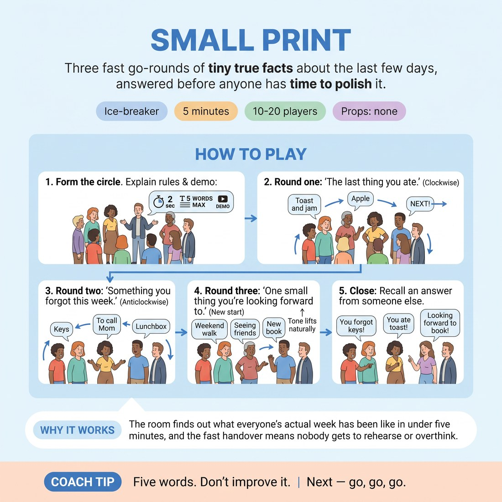

# 🧊 Ice-breaker — Small Print

{ .infographic }

> Three fast go-rounds of tiny true facts about the last few days, answered before anyone has time to polish it.

`Players 10–20` · `~5 min` · `Complexity 1/5` · `Energy medium` · `Contact none` · `Props: none`

⬅️ [Back to the Week 07 run-sheet](../week-07.md)

## Why this activity, here

First thing in the room on Week 7, before any voice or emotion work. It gets everyone speaking once, out loud, about something true and small. The tiny feelings attached to real facts — mild regret, mild pleasure — are the raw material the rest of the session amplifies. It feeds directly into the breath-and-tone exercises that follow, because students have already felt an answer land in their body before they analysed it.

## What students actually learn

- That an unpolished answer is more interesting to listen to than a considered one.
- That a small true fact already carries feeling — they don't have to add any.
- That the two-second gap removes the option of editing, and nothing bad happens.
- That they can be heard by the whole group inside five words.

## Setup

Standing circle, no chairs, no props. Clear enough floor for everyone to see every face. Know the three categories without reading them. Have a watch or phone visible to you so each round stays at a minute.

## How to run it — 5 minutes

| Min | What you do |
|---:|---|
| 1 | Form the circle. State the three rules: five words maximum, two seconds to start, "pass" is always available. Demo one answer yourself, fast and ordinary. |
| 1 | Round one — the last thing you ate. Clockwise. Keep it moving; cut long answers with "next". Do not comment on answers. |
| 1 | Round two — something you forgot this week. Start left of whoever finished, travel anticlockwise. Same pace. Let small laughs happen but don't stop for them. |
| 1 | Round three — one small thing you're looking forward to. Start somewhere new. Same speed. Watch for faces changing before words arrive. |
| 1 | Ask who remembers an answer from someone else. Take three or four. Name the thing they noticed — the feeling arrived before the sentence. Move on. |

## Side-coaching script

| When | Say |
|---|---|
| Before round one starts | *"Five words. Two seconds. Boring is fine."* |
| First long or explained answer | *"Next."* |
| Pace sags in the middle of a round | *"Don't wait for me. Go."* |
| Someone visibly rehearses while waiting | *"Say the first one."* |
| Round two, when answers start getting apologetic | *"No sorry. Just the fact."* |
| Round three, as tone naturally lifts | *"Notice your breath change."* |
| Anyone freezes | *"Pass is fine. Next."* |

!!! success "What good looks like"
    The circle sounds like a rally, not a series of speeches. Answers overlap slightly at the edges. Nobody explains. There are small unforced laughs at ordinary things — cold toast, a missed dentist appointment. By round three you can hear voices sitting differently in the body without anyone being told to do that. The whole thing ends on time and the room is warmer than when it started.

## When it goes wrong

| You see | What's causing it | The fix |
|---|---|---|
| Answers stretching into two or three sentences with backstory. | Nobody believes the five-word limit until it's enforced once. | Cut the second long answer immediately with "next". Don't apologise. The rest of the circle self-corrects within three people. |
| Long pauses as each person thinks, and the round overruns the minute. | People are hunting for an interesting answer instead of a true one. | Call "say the first one" and start clapping a slow pulse for four or five people. Drop the clap once it's moving. |
| The circle starts riffing and joking on each other's answers. | The group treats it as a comedy warm-up rather than a fact round. | Say "no comment, just the next fact" and keep the direction moving. Save the responses for the close. |
| One or two people going almost inaudibly. | Standing circle is too wide, or nerves in an early-weeks group. | Tighten the circle by a step before round two. Do not single anyone out or ask them to repeat. |

## Scaling

| Class size | What changes |
|---|---|
| **10–13** | One circle. Run all three rounds as written, a minute each. You'll have spare seconds — use them to let the close run a little longer and take five recalled answers. |
| **14–17** | One circle. Drop your demo to a single spoken example, no framing. Enforce the five-word limit from the first answer or round three will get squeezed. Take three recalled answers only. |
| **18–20** | Split into two circles of nine or ten, facing away from each other so they don't compete on volume. Run the same three categories simultaneously, one minute each; you call the category and the change of round for both. For the close, bring the circles together and take two remembered answers from each. |

## Variations

**Two words** — Cap answers at two words instead of five for all three rounds.  
*Easier — removes any possibility of composing a sentence, so the slowest speakers stop stalling.*

**No repeats** — Add a rule that no answer may duplicate one already given in that round. If it does, the person says "again" and gives another within two seconds.  
*Harder — forces listening across the whole circle rather than pre-loading your own answer.*

**Say it twice** — Each person gives their answer, then immediately repeats the same words with whatever feeling the fact actually carries for them.  
*Different emphasis — shifts from speed to tone, and sets up the breath work later in the session directly.*

## Debrief

1. **Whose answer stayed with you?**
   > *A good answer sounds like:* Someone names a specific, small, unremarkable detail — "the cold chips" — rather than the cleverest answer given. That tells you the group heard content, not performance.

2. **Did any of the three rounds feel different in your body?**
   > *A good answer sounds like:* Someone says round three sat higher, or round two made them tense, or they noticed their breath change before they spoke. Anything locating a feeling physically is enough. Move on.

3. **What happened to the answers you didn't have time to improve?**
   > *A good answer sounds like:* "They were fine." Or "they were better." Someone admitting they had a second, better answer ready and it wasn't actually better is the one you want.

!!! warning "Safety & inclusion"
    No contact of any kind. "Pass" is available on every turn without explanation and you take it at the same speed as an answer — no follow-up, no coaxing. The categories are deliberately low-stakes, but "something you forgot this week" can pull up something private; if an answer lands heavily, take it plainly and keep the round moving rather than pausing on it. Anyone who can't stand for five minutes takes a chair in the circle at the same spacing. If someone arrives late, fold them in at the start of the next round rather than mid-round.

## Why it works

Emotional fluidity is blocked by editing. Given time, people select an answer that presents well, and the presented answer arrives with no feeling attached because the feeling was filtered out during selection. The two-second gap removes the selection stage. What comes out is the first true thing, and the first true thing still has its original emotional charge on it — you hear it in the breath before the words. That is the session cue running live, with no instruction and no acting required. The three categories are sequenced to move through neutral, mildly uncomfortable and mildly pleasant, so the group experiences their own tone shifting across five minutes without being asked to produce an emotion.

[Open the full activity card »](../../library/icebreakers/IB__small-print.md){target=_blank rel=noopener}
