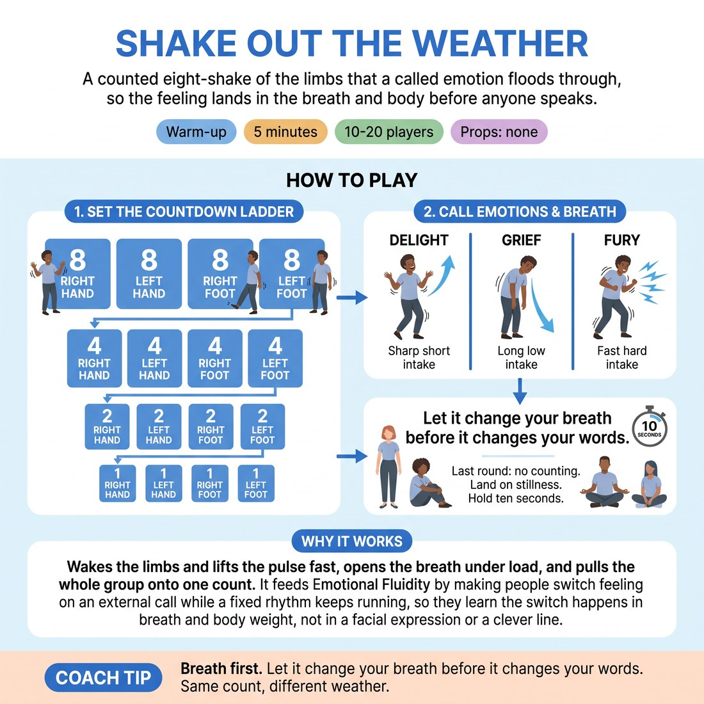

# 🔥 Warm-up cluster — Shake Out the Weather

{ .infographic }

> A counted eight-shake of the limbs that a called emotion floods through, so the feeling lands in the breath and body before anyone speaks.

`Players 10–20` · `~5 min` · `Complexity 2/5` · `Energy high` · `Contact none` · `Props: none`

⬅️ [Back to the Week 07 run-sheet](../week-07.md)

## Why this activity, here

It opens Week 7. Weeks 1-6 built listening and offers with the voice mostly neutral. This is the first thing the room does with emotion in the body, before any scene, so the rest of the session has somewhere to start from. It feeds directly into the vocal and status work later in the block, where they need to arrive at a feeling without discussing it first.

## What students actually learn

- They notice that a feeling arrives in the breath a beat before it reaches the words.
- They stop needing a reason to feel something — the emotion is a starting position, not a conclusion.
- Grief and fury become physical settings they can enter in one second, rather than things to act.
- They hear their own counting voice change without deciding to change it.

## Setup

Clear floor, everyone standing, arm's length in all directions. No chairs, no props, no music. Check for anyone who cannot stand or shake limbs comfortably before you start and offer the seated version openly, not privately.

## How to run it — 5 minutes

| Min | What you do |
|---:|---|
| 1 | Circle up. Teach the shape — eight, four, two, one on each limb in turn. Count it out loud with them, no emotion yet. Fix spacing and locked knees. |
| 1 | Call DELIGHT. One loud in-breath in that emotion first, then the full countdown with it in the arms, feet and counting voice. Then straight into GRIEF, same order — breath, then count, heavier and slower, still on the beat. |
| 1 | Call FURY. Breath first, then the countdown. Sharp, fast, on the beat. Do not let the speed break the count. |
| 1 | Ask the room for one emotion. Take the first one offered. Breath first, full countdown, everyone counting aloud in it. |
| 1 | Final round, silent. Breath and shake only. Land on stillness and hold ten seconds of quiet standing, then move straight on without comment. |

## Side-coaching script

| When | Say |
|---|---|
| During the neutral round | *"Soft knees. Let the arm be loose."* |
| Just after you call the first emotion | *"Breath first. Let it change your breath before it changes your words."* |
| When bodies change but the counting voice stays flat | *"Put it in the numbers."* |
| During GRIEF, if it speeds up | *"Heavier, not faster. Stay on the count."* |
| During FURY, if the count collapses | *"Sharp, but on the beat."* |
| When people watch each other for the right answer | *"Your own version. Don't check."* |
| Entering the silent round | *"Nothing but breath now."* |
| On the final stillness | *"Stand. Let it leave on its own."* |

!!! success "What good looks like"
    The counting voice changes with each emotion without anyone being told twice. Grief sounds different in the numbers than fury does. Nobody is performing to the circle — heads stay forward, eyes soft. The final silent round has real weight and the ten seconds of stillness holds without giggling. People are slightly warmer and breathing deeper than when they walked in.

## When it goes wrong

| You see | What's causing it | The fix |
|---|---|---|
| Everyone shakes energetically but every emotion sounds identical in the counting. | They are treating it as a physical warm-up with a label attached, not letting the breath lead. | Stop. Do one in-breath only, no shaking, in grief and then in fury. Ask them to hear the difference. Restart. |
| Laughter and mugging, especially on grief. | Discomfort with feeling something in front of others with no scene to hide behind. | Name it lightly — laughing is fine, keep counting. Then run the silent round early. Removing the voice usually settles it. |
| The count drifts and everyone finishes at a different time. | You dropped your own volume once the emotions started. | Count louder than the room for the first two limbs of each round, then let them carry it. |
| Small, apologetic shaking near the edge of the circle. | Not enough floor space, so people are protecting their neighbours. | Stop and widen the circle by a full step before continuing. Space is the whole permission here. |

## Scaling

| Class size | What changes |
|---|---|
| **10–13** | One circle. Run all five emotion rounds as written. You have room to add a sixth called from the floor if the timing runs light. |
| **14–17** | One circle, pushed to the walls. Cut one called emotion if spacing takes longer than thirty seconds to sort — keep grief, fury and the silent round. |
| **18–20** | Two concentric circles, inner facing out, outer facing in, both counting together. You stand in the gap. Drop the room-called emotion and run delight, grief, fury, silent. |

## Variations

**Count only** — Drop the limb shaking. Everyone stands still and counts down eight-four-two-one in the called emotion, breath first.  
*Easier — good for tired rooms, tight spaces or anyone who cannot shake comfortably. Isolates the vocal change.*

**Handover** — After the neutral round, each person in turn calls the next emotion and leads the count for their own round.  
*Harder — they must generate the feeling and hold the group's timing at once.*

**Mixed weather** — Call two emotions per round — one for the arms, one for the feet. Breath in the first, then split.  
*Different emphasis — pulls attention to the body holding two states, which sets up mixed-status scene work later.*

## Debrief

1. **Which one arrived fastest in your body?**
   > *A good answer sounds like:* They name a specific one and a specific place — fury in the jaw, grief in the shoulders. Not a general comment about how it felt to do the exercise.

2. **What happened to your counting voice when you weren't managing it?**
   > *A good answer sounds like:* Someone reports the numbers going quiet, or breaking, or getting clipped, and is surprised by it. Move on as soon as one person says this out loud.

!!! warning "Safety & inclusion"
    No contact. Say so before you start. Offer the seated version openly at the top — shake hands and arms only, or count only, no shaking. Anyone can drop to smaller movement at any point without asking. Grief can land harder than expected on some days; tell the room they can drop out of a round and rejoin on the next one, and mean it. Watch for anyone standing very still with a fixed face during grief and check in afterwards, quietly.

## Why it works

Emotional fluidity fails when people try to decide on a feeling and then illustrate it. The exercise reverses the order. The forced in-breath sets a physical state before any word or gesture is available, so the emotion arrives as a condition of the body rather than a choice. The counting gives a fixed, meaningless task — the numbers cannot carry content, so any change heard in them comes from the state, not from acting. The descending count (eight, four, two, one) shortens the runway each time, removing the space to plan. Cycling delight, grief and fury inside four minutes proves the switch is fast and does not require justification, which is the whole claim of D1.S2.

[Open the full activity card »](../../library/warmups/WU__shake-out-the-weather.md){target=_blank rel=noopener}
