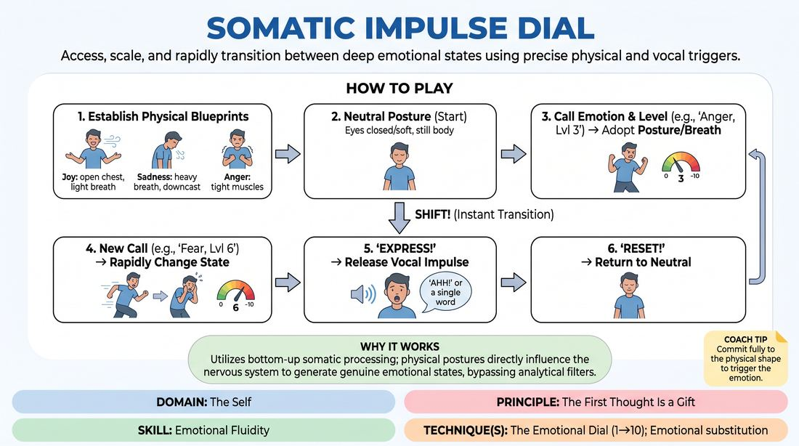

# 🎲 Drill A — isolation — Somatic Impulse Dial

{ .infographic }

> Access, scale, and rapidly transition between deep emotional states using precise physical and vocal triggers.

`Players 2–99` · `~30 min` · `Complexity 2/5` · `Energy medium` · `Contact none` · `Props: none`

⬅️ [Back to the Week 07 run-sheet](../week-07.md)

## Why this activity, here

Week 7 opens the voice-and-emotion strand. Weeks 1-6 built listening, offer and physical commitment; students can commit to a body but still narrate feeling from the neck up. This drill is the isolation stage: emotion installed through posture and breath, with no scene, no partner and no story to hide behind. It feeds directly into the paired and scene work later in the session, where the same triggers have to survive dialogue.

## What students actually learn

- That an emotional state can be entered from the outside in, so they stop waiting to feel something before playing it.
- That intensity is a dial they control, not an on/off switch — a level three is as playable as a level nine.
- That the breath changes first, and the voice follows it without needing to be planned.
- That switching states quickly is a physical skill, not a talent, and it improves within twenty minutes.

## Setup

Clear floor space so everyone can stand with arms out and not touch. No chairs, no props. Have water available. Know your four blueprints well enough to demonstrate each in three seconds without reading. Have a rough list of emotion-plus-number calls jotted down so you never hesitate mid-drill.

## How to run it — 30 minutes

| Min | What you do |
|---:|---|
| 4 | Demonstrate all four blueprints. Have the room copy each one for ten seconds. Name the breath change in each. State the safety frame: no contact, step out any time, sound not volume. |
| 4 | Everyone to neutral. Call single states at low intensity only — levels two to four — with a full reset between each. Six or seven calls. No vocal yet. Let them find the body. |
| 5 | Same, but climb the dial. Call the same emotion at three, then at seven, then at nine. Ask them to notice what the breath does as the number rises. Reset between each. |
| 5 | Introduce "Shift!" Two states back to back with no neutral between. Four or five pairings. Watch for people stopping to think — call the shifts faster if they do. |
| 5 | Add "Express!" Clap, and they release one sound or word from the state. Run six full cycles: state, shift, express, reset. Insist on sound over word if words get clever. |
| 4 | Free run. Call fast, mixed intensities, sometimes two shifts before the express. Do not explain between rounds. Finish on a low-level joy so the room lands soft. |
| 3 | Full reset. Shake out, roll the shoulders, three slow breaths. Take two debrief questions standing. Move on. |

## Side-coaching script

| When | Say |
|---|---|
| First blueprint calls, when bodies are half-committed | *"Let it change your breath before it changes your words."* |
| Students adopt a posture but breathe normally | *"Breath first. The shoulders are lying to me."* |
| Low-intensity calls treated the same as high ones | *"Level three. Not a whisper of nine — a real three."* |
| On the shift, when people reset through neutral first | *"Straight across. No stopping at zero."* |
| Just before the clap | *"Set. Hold it. Don't decide the sound."* |
| Express produces performed or comic noises | *"Sound, not a joke. Whatever's already in the throat."* |
| Someone freezes and produces nothing | *"Silence is fine. Keep the body. Next one's yours."* |
| On every reset | *"Neutral. Shake it off. Breath back to level."* |

!!! success "What good looks like"
    Bodies change before faces do. You hear the room's breathing change audibly on each call. Level threes look genuinely different from level eights — not just louder. On "Shift!" the change is one movement, not a wobble through neutral. The expressed sounds are small, ugly, unplanned and various: grunts, sighs, a cracked "no", a laugh that isn't a performance. People come back to neutral cleanly and are ready in two seconds.

## When it goes wrong

| You see | What's causing it | The fix |
|---|---|---|
| Everyone acting with their face while the torso stays neutral. | Default habit of showing emotion rather than housing it. Screen-acting instinct. | Call a round with eyes closed and hands behind the back. Nothing to do with the face. Ask them to change only breath and spine. |
| Every intensity comes out as a seven or eight — no low-level states. | Low intensity feels like doing nothing, so people over-supply to prove they are participating. | Run a stretch of levels one to three only, for two minutes, with no express. Point out that a level two is visible to you from across the room. |
| Laughter and mugging on "Express!", especially on Anger and Fear. | Discomfort at making an unguarded sound in front of others. Comedy as the escape hatch. | Ban words for two rounds. Sound only. Turn the room to face outward so nobody is watched. Say plainly that this drill is not asking for funny. |
| Someone visibly rattled after a high-intensity Sadness or Anger call. | The physical trigger has landed on something real. The body does not distinguish rehearsal from event. | Cut to a full reset. Have them sit, feet flat, breathe out longer than in. Offer them the observer seat with no explanation required, and check in at the break. |

## Scaling

| Class size | What changes |
|---|---|
| **10–13** | One circle facing outward. Everyone plays every round. You have time for eight express cycles in the fifth block instead of six — add two more shift pairings rather than lengthening holds. |
| **14–17** | Two concentric arcs, both facing out, so nobody stands behind anyone. Keep six express cycles. Walk the gap between arcs during the shift block so you can see breath on both. |
| **18–20** | Split into halves. Half plays, half stands at the wall and watches one named person each. Swap after the shift block. Cut the free run to three minutes and add a minute to the swap so both halves get an express round. |

## Variations

**Blueprint Only** — Drop "Express!" entirely. Run states, shifts and resets in silence for the full block. Add one blueprint of their own choosing at the end.  
*Easier. Removes the exposure of making a sound and lets a nervous group build the physical vocabulary first. Use it with a group that laughed through week one.*

**Blind Dial** — Call only a number, no emotion. They choose the state and commit at that intensity. On "Express!", the sound must let a watching partner guess which one they picked.  
*Harder. Forces them to hold a specific choice under time pressure rather than following your instruction, and tests whether the body is legible to others.*

**Sentence Under the Dial** — Give the whole room one neutral line — "I left it on the table." Every express is that same line, coloured by the current state and level.  
*Shifts emphasis from state onto vocal delivery. Shows that meaning sits in the breath and not the words, which is the bridge to the session's later scene work.*

## Debrief

1. **Which of the four was the slowest to arrive in your body?**
   > *A good answer sounds like:* Something specific and physical — "Joy took ages, I had to force my chest open first" — rather than a general statement about being bad at emotions. You are listening for them locating it in a body part, not a feeling.

2. **What happened to your breath before the sound came out?**
   > *A good answer sounds like:* They can describe an actual change: it got shallower, it caught, they were holding it. If they say they didn't notice, ask the room and let someone else answer, then move on.

3. **Was a level three harder or easier than a level nine, and why?**
   > *A good answer sounds like:* Recognition that low intensity requires more precision because there is less to hide behind, and that nine is often easier because it lets you flood the body. Move on once two people have said this in their own words.

!!! warning "Safety & inclusion"
    No contact in this drill at any point. Say so at the start. State clearly that anyone can drop to neutral and step to the wall at any moment without explaining, and that doing so is not a failure. High-intensity Sadness, Anger and Fear can pull up real material — keep the holds short, always reset fully, and never run two heavy states back to back at level eight or above. Everything works seated or with a walking aid: the blueprints are spine, breath and gaze, so describe them that way as well as in standing terms. Cap volume at conversational — this is not a shouting drill. End the block on something light so nobody leaves carrying it into the break.

## Why it works

Emotional Fluidity fails when students treat feeling as something to generate internally and then display. This drill inverts the order. Posture and breath rate are voluntary and instant; the affective state follows them within seconds because the nervous system reads its own body position as evidence. By naming an intensity number you make the state adjustable rather than binary, which is what fluidity actually requires — the ability to sit at four and move to seven without a scene change. Removing neutral from the shift trains the transition itself, which is the thing scenes demand and which most improvisers never practise in isolation. The single-sound express keeps the voice downstream of the body, so nothing gets written in the head first.

[Open the full activity card »](../../../../games/D1_P4_S2_T1_G136__somatic-impulse-dial.md){target=_blank rel=noopener}
